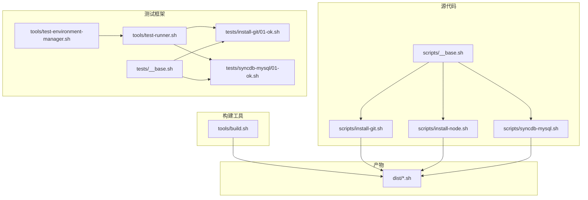
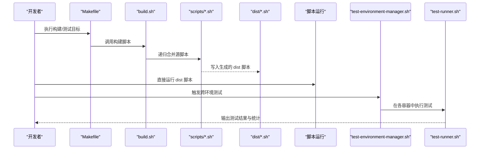
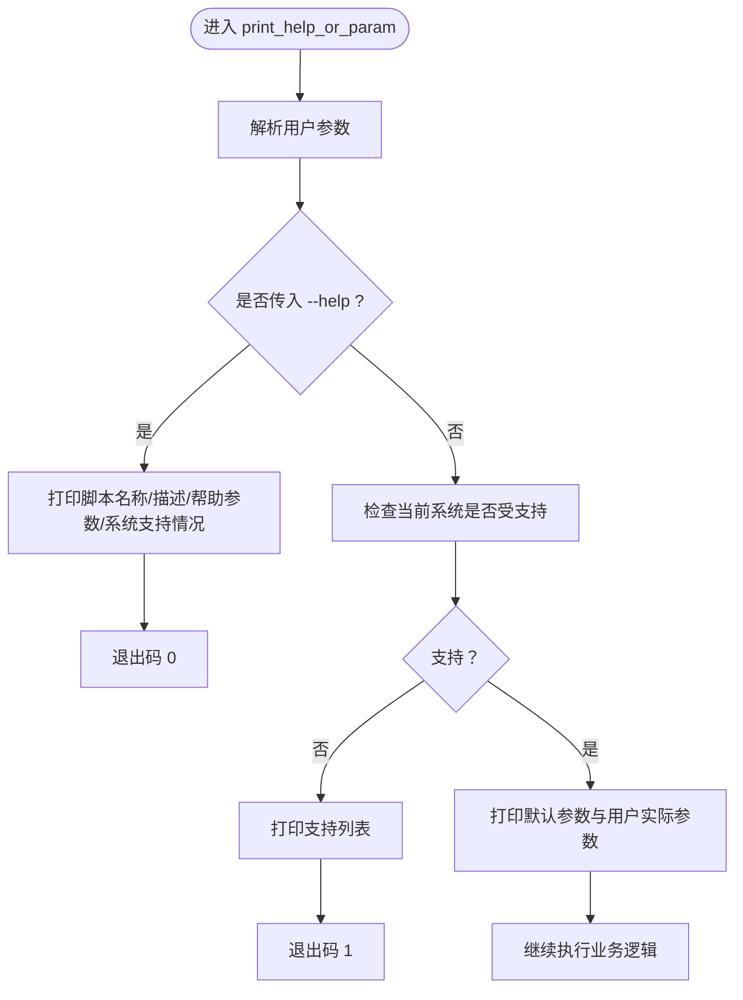
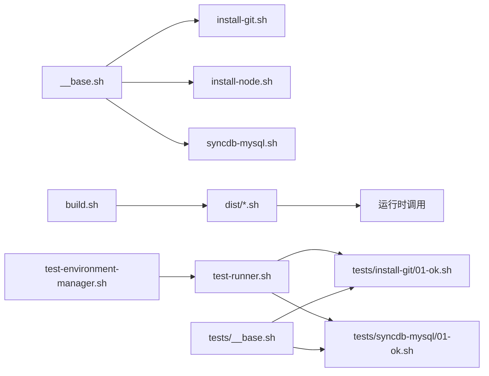

# API 参考

<cite>
**本文引用的文件**
- [README.md](file://README.md)
- [scripts/__base.sh](file://scripts/__base.sh)
- [scripts/install-git.sh](file://scripts/install-git.sh)
- [scripts/install-node.sh](file://scripts/install-node.sh)
- [scripts/syncdb-mysql.sh](file://scripts/syncdb-mysql.sh)
- [tools/build.sh](file://tools/build.sh)
- [tools/test-environment-manager.sh](file://tools/test-environment-manager.sh)
- [tools/test-runner.sh](file://tools/test-runner.sh)
- [tests/__base.sh](file://tests/__base.sh)
- [tests/install-git/01-ok.sh](file://tests/install-git/01-ok.sh)
- [tests/syncdb-mysql/01-ok.sh](file://tests/syncdb-mysql/01-ok.sh)
- [Makefile](file://Makefile)
- [docs/README.zh-CN.md](file://docs/README.zh-CN.md)
</cite>

## 目录
1. [简介](#简介)
2. [项目结构](#项目结构)
3. [核心组件](#核心组件)
4. [架构总览](#架构总览)
5. [详细组件分析](#详细组件分析)
6. [依赖分析](#依赖分析)
7. [性能考虑](#性能考虑)
8. [故障排除指南](#故障排除指南)
9. [结论](#结论)
10. [附录](#附录)

## 简介
本文件为 HZ 9 Env Scripts 的完整 API 参考，覆盖以下方面：
- 公共接口与函数清单（参数定义、返回值、行为说明）
- 命令行参数参考（全局参数与脚本特定参数）
- 函数调用关系与接口规范
- 使用示例与代码片段路径
- 参数验证规则与错误处理机制
- 版本兼容性与变更历史
- 调试与故障排除指南
- 性能考虑与使用限制

## 项目结构
项目采用“源脚本 + 构建工具 + 测试框架 + Docker 环境”的组织方式：
- scripts/：源脚本目录，包含通用基础模块与各功能脚本
- dist/：构建产物目录，存放可直接使用的生产脚本
- tools/：构建与测试工具
- tests/：跨平台测试套件
- docker/：测试容器化环境
- docs/：文档与使用说明

图表来源
- [scripts/__base.sh](file://scripts/__base.sh)
- [scripts/install-git.sh](file://scripts/install-git.sh)
- [scripts/install-node.sh](file://scripts/install-node.sh)
- [scripts/syncdb-mysql.sh](file://scripts/syncdb-mysql.sh)
- [tools/build.sh](file://tools/build.sh)
- [tools/test-environment-manager.sh](file://tools/test-environment-manager.sh)
- [tools/test-runner.sh](file://tools/test-runner.sh)
- [tests/__base.sh](file://tests/__base.sh)
- [tests/install-git/01-ok.sh](file://tests/install-git/01-ok.sh)
- [tests/syncdb-mysql/01-ok.sh](file://tests/syncdb-mysql/01-ok.sh)

章节来源
- [docs/README.zh-CN.md](file://docs/README.zh-CN.md)
- [Makefile](file://Makefile)

## 核心组件
本节梳理公共接口与函数族，涵盖参数解析、系统检测、控制台输出、包管理器适配、网络镜像设置等。

- 参数解析与帮助输出
  - parse_param_string(param_string, result_var_name)
  - parse_param_2fields(param_string, name_var, value_var)
  - parse_param_4fields(param_string, name_var, alias_var, msg_var, default_var)
  - print_default_param(), print_help_param(), print_default_with_user_param()
  - has_param(key), get_param(key)
  - print_help_or_param(...)
  - parse_user_param(...), parse_user_param_for_short_params(...), print_user_param()
  - has_user_param(key), get_user_param(key)

- 系统检测与支持判定
  - os_parse_info(), os_parse_info_with_after()
  - is_support_current_os(), print_system_info(), print_system_extra_info()

- 控制台输出与日志
  - console_time_s(), console_script_name(), console_script_desc()
  - console_support_os_list(), console_check_system()
  - console_module_title(title), console_key_value(key, value), console_empty_line()
  - console_content(), console_sulines(msg)
  - console_content_starting(text), console_content_complete(), console_content_error(msg)
  - console_script_end(text), console_redirect_output()
  - console_info_line(msg), console_success_line(msg), console_warning_line(msg), console_error_line(msg), console_debug_line(msg)

- 包管理器与镜像
  - apt_install_base_packages()
  - apt_setup_ubuntu_mirrors_set_china_mirrors(), apt_setup_debian_mirrors_set_china_mirrors()
  - dnf_setup_mirrors(network), dnf_update(), dnf_install(local, name, version)
  - apt_get_update(), apt_get_install(local, name, version)

- 路径格式转换
  - get_outline_package(packageName)
  - to_windows_path_format(original_path)
  - to_git_bash_path_format(original_path)

- Docker 与数据库同步辅助
  - pull_docker_image(image), docker_compose_up(...), docker_compose_down(...)

章节来源
- [scripts/__base.sh](file://scripts/__base.sh)

## 架构总览
下图展示“构建 → 运行 → 测试”的整体流程，以及各组件间的依赖关系。

图表来源
- [tools/build.sh](file://tools/build.sh)
- [Makefile](file://Makefile)
- [tools/test-environment-manager.sh](file://tools/test-environment-manager.sh)
- [tools/test-runner.sh](file://tools/test-runner.sh)

## 详细组件分析

### 参数解析与帮助系统
- 功能概述
  - 统一解析 --key=value 与 --key 形式的参数，支持别名与默认值
  - 自动生成帮助与参数表，按模块打印用户参数与默认值
- 关键函数
  - parse_user_param(...)：解析用户传入的参数列表
  - get_param(key)：优先取用户显式传入值，其次取别名，最后取默认值
  - print_help_or_param(...)：根据 --help 判断输出帮助或参数摘要
- 行为与边界
  - 未识别参数会触发退出
  - 默认参数包含 --help 与 --debug
  - 支持短参数解析（在测试框架中使用）

图表来源
- [scripts/__base.sh](file://scripts/__base.sh)

章节来源
- [scripts/__base.sh](file://scripts/__base.sh)

### 系统检测与支持判定
- 功能概述
  - 解析操作系统名称、版本、架构，判断是否在支持列表中
  - 自动选择 apt/dnf 安装策略
- 关键函数
  - os_parse_info(), os_parse_info_with_after()
  - is_support_current_os(), print_system_info()
- 行为与边界
  - 不支持的系统会提示并退出
  - 支持列表在各脚本中独立声明

章节来源
- [scripts/__base.sh](file://scripts/__base.sh)

### 控制台输出与日志
- 功能概述
  - 提供彩色输出、时间戳、模块标题、键值对、重定向开关等
  - 支持调试模式下的详细输出与耗时统计
- 关键函数
  - console_content_starting/complete/error
  - console_redirect_output(), console_time_s()
  - console_info_line/success/warning/error/debug_line

章节来源
- [scripts/__base.sh](file://scripts/__base.sh)

### 包管理器与镜像设置
- 功能概述
  - 针对 Ubuntu/Debian 使用 apt，针对 Fedora/RedHat 使用 dnf
  - 支持华为云镜像源替换，加速国内下载
- 关键函数
  - apt_install_base_packages()
  - apt_setup_ubuntu_mirrors_set_china_mirrors(), apt_setup_debian_mirrors_set_china_mirrors()
  - dnf_setup_mirrors(network), dnf_update(), dnf_install(...)
  - apt_get_update(), apt_get_install(...)

章节来源
- [scripts/__base.sh](file://scripts/__base.sh)

### Git 安装脚本 API
- 脚本定位
  - [scripts/install-git.sh](file://scripts/install-git.sh)
- 全局参数
  - --help, -h：打印帮助
  - --debug：启用调试输出
  - --network：网络环境（如 in-china）
  - --git-version：指定 Git 版本（默认最新可用）
- 支持系统
  - Ubuntu 20.04/22.04/24.04
  - Debian 11.9/12.2
  - Fedora 41
  - Red Hat Enterprise Linux 8.10/9.6
- 行为说明
  - 若已存在 git，直接输出版本
  - 否则根据包管理器选择安装路径，并应用镜像设置
- 错误处理
  - 不支持系统直接退出
  - 安装失败时输出错误并退出

章节来源
- [scripts/install-git.sh](file://scripts/install-git.sh)

### Node.js 安装脚本 API
- 脚本定位
  - [scripts/install-node.sh](file://scripts/install-node.sh)
- 全局参数
  - --help, -h, --debug
  - --network：网络环境（如 in-china）
- 脚本特定参数
  - --nvm-version：NVM 版本，默认 v0.40.3
  - --node-version：Node.js 版本，默认 v18.20.3
  - --skip-pm2：跳过 PM2 安装
  - --pm2-version：PM2 版本，默认 5.4.2
- 行为说明
  - 检查 curl/git 是否存在
  - 安装/更新 NVM，设置镜像源
  - 安装/切换 Node.js 并设置默认别名
  - 可选安装 PM2 及其插件
- 错误处理
  - 缺失前置依赖时退出
  - NVM 安装失败时回退到默认仓库重试

章节来源
- [scripts/install-node.sh](file://scripts/install-node.sh)

### MySQL 数据库同步脚本 API
- 脚本定位
  - [scripts/syncdb-mysql.sh](file://scripts/syncdb-mysql.sh)
- 全局参数
  - --help, -h, --debug
  - --network：网络环境（如 in-china）
- 脚本特定参数
  - --db-version：数据库版本，默认 8.0
  - --docker-image-quick-check：本地快速检测镜像
  - --from-hostname/--from-port/--from-username/--from-password/--from-database：源端配置
  - --to-hostname/--to-port/--to-username/--to-password/--to-database：目标端配置
  - --temp：临时目录，默认 /tmp/hz-9/env-prepare/sync-db-mysql
- 行为说明
  - 检查 Docker 是否安装
  - 拉取对应版本镜像
  - 在容器内执行 mysqldump/mysql 导入导出
- 错误处理
  - Docker 未安装时退出
  - 失败时输出错误并退出

章节来源
- [scripts/syncdb-mysql.sh](file://scripts/syncdb-mysql.sh)

### 构建工具 API
- 工具定位
  - [tools/build.sh](file://tools/build.sh)
- 功能
  - 递归合并 scripts/ 下的脚本，生成 dist/ 下的独立可执行脚本
  - 处理 source 指令与 shebang 注释
- 使用
  - make build-scripts 或直接执行 ./tools/build.sh

章节来源
- [tools/build.sh](file://tools/build.sh)
- [Makefile](file://Makefile)

### 测试框架 API
- 环境管理器
  - [tools/test-environment-manager.sh](file://tools/test-environment-manager.sh)
  - 支持 all/all-env/all-script/single 四种模式
  - 支持 NETWORK、DEBUG、OUTPUT、DOCKER_IMAGE_QUICK_CHECK 等参数透传
- 测试运行器
  - [tools/test-runner.sh](file://tools/test-runner.sh)
  - 统计测试耗时、输出状态（通过/跳过/失败）
- 测试基座
  - [tests/__base.sh](file://tests/__base.sh)
  - 提供断言、环境清理、检查点、汇总报告等能力

章节来源
- [tools/test-environment-manager.sh](file://tools/test-environment-manager.sh)
- [tools/test-runner.sh](file://tools/test-runner.sh)
- [tests/__base.sh](file://tests/__base.sh)

## 依赖分析
- 模块耦合
  - 各功能脚本均依赖 scripts/__base.sh 提供的参数解析、系统检测、输出与包管理器适配
  - 测试框架依赖脚本的 --help 输出与参数约定
- 外部依赖
  - Docker（用于数据库同步）
  - APT/DNF 包管理器（用于安装基础依赖与软件包）
  - 网络镜像（华为云镜像源）

图表来源
- [scripts/__base.sh](file://scripts/__base.sh)
- [scripts/install-git.sh](file://scripts/install-git.sh)
- [scripts/install-node.sh](file://scripts/install-node.sh)
- [scripts/syncdb-mysql.sh](file://scripts/syncdb-mysql.sh)
- [tools/build.sh](file://tools/build.sh)
- [tools/test-environment-manager.sh](file://tools/test-environment-manager.sh)
- [tools/test-runner.sh](file://tools/test-runner.sh)
- [tests/__base.sh](file://tests/__base.sh)
- [tests/install-git/01-ok.sh](file://tests/install-git/01-ok.sh)
- [tests/syncdb-mysql/01-ok.sh](file://tests/syncdb-mysql/01-ok.sh)

## 性能考虑
- 构建阶段
  - build.sh 递归合并脚本，避免重复加载，减少运行时启动开销
- 运行阶段
  - --debug 关闭时重定向输出至 /dev/null，降低 I/O
  - 镜像源替换显著提升国内下载速度
- 测试阶段
  - Docker 镜像拉取与缓存策略影响测试效率
  - Makefile 提供多环境并行测试入口

## 故障排除指南
- 常见问题
  - “不支持当前操作系统”：确认 SUPPORT_OS_LIST 与实际系统匹配
  - “缺少前置依赖”：确保 curl、git 等工具已安装
  - “网络超时/下载失败”：使用 --network=in-china 切换镜像源
  - “Docker 未安装”：在数据库同步场景中必须先安装 Docker
- 调试建议
  - 使用 --debug 查看详细输出与耗时
  - 在测试框架中启用 DEBUG 以观察被测脚本行为
  - 查看 logs/ 下的日志文件定位失败原因

章节来源
- [scripts/__base.sh](file://scripts/__base.sh)
- [tools/test-environment-manager.sh](file://tools/test-environment-manager.sh)
- [tools/test-runner.sh](file://tools/test-runner.sh)
- [tests/__base.sh](file://tests/__base.sh)

## 结论
HZ 9 Env Scripts 通过统一的基础模块与清晰的参数体系，提供了稳定、可移植且易于扩展的开发环境安装与同步能力。借助构建与测试工具链，可在多发行版环境下保证一致性与可靠性。

## 附录

### 命令行参数参考（全局）
- --help, -h：打印帮助信息
- --debug：启用调试输出
- --network：网络环境（如 in-china）
- --output：输出路径或文件（测试框架）
- --docker-image-quick-check：数据库同步镜像快速检测（测试框架）
- --internal-ip：内部 IP（测试框架）
- --env：测试环境（测试框架）
- --mode：测试模式（all/all-env/all-script/single）（测试框架）
- --file：测试文件路径（测试框架）
- --script：测试脚本前缀（测试框架）
- --scope：测试范围（install/syncdb）（测试框架）

章节来源
- [tools/test-environment-manager.sh](file://tools/test-environment-manager.sh)
- [tools/test-runner.sh](file://tools/test-runner.sh)
- [tests/__base.sh](file://tests/__base.sh)

### 使用示例与代码片段路径
- 直接使用 dist 脚本
  - [docs/README.zh-CN.md](file://docs/README.zh-CN.md)
- 构建脚本
  - [tools/build.sh](file://tools/build.sh)
- 测试运行
  - [Makefile](file://Makefile)
  - [tools/test-environment-manager.sh](file://tools/test-environment-manager.sh)
  - [tools/test-runner.sh](file://tools/test-runner.sh)
- 基础模块调用
  - [scripts/__base.sh](file://scripts/__base.sh)

### 版本兼容性与变更历史
- 支持系统
  - Ubuntu 20.04/22.04/24.04
  - Debian 11.9/12.2
  - Fedora 41
  - Red Hat Enterprise Linux 8.10/9.6
- 网络配置
  - 所有脚本支持 --network=in-china，使用华为云镜像源
- 变更与维护
  - 通过 Makefile 与测试框架保障多环境一致性
  - 新增脚本需在 scripts/ 与 tests/ 同步开发并构建验证

章节来源
- [docs/README.zh-CN.md](file://docs/README.zh-CN.md)
- [Makefile](file://Makefile)