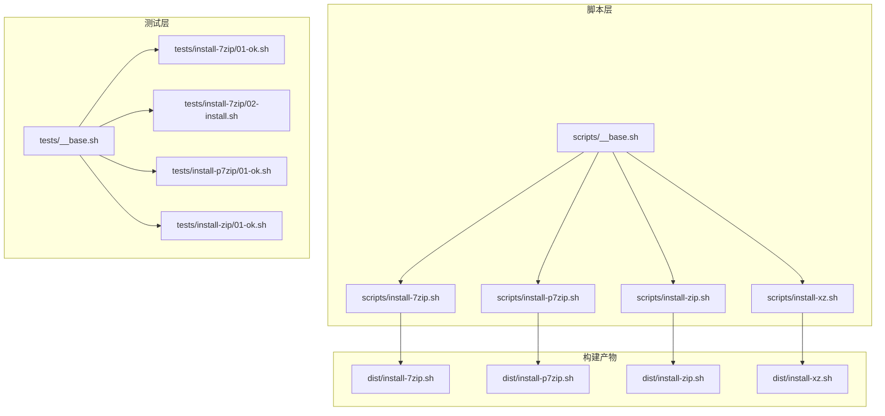
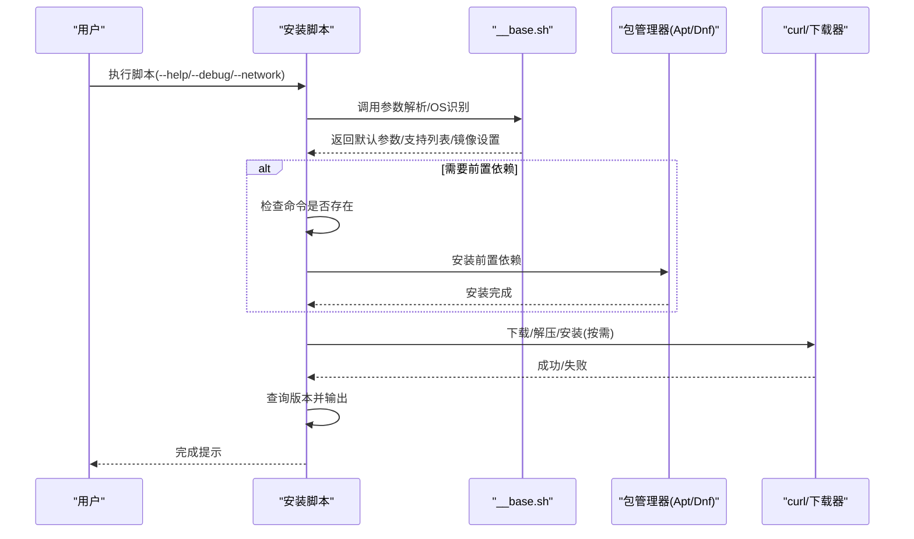
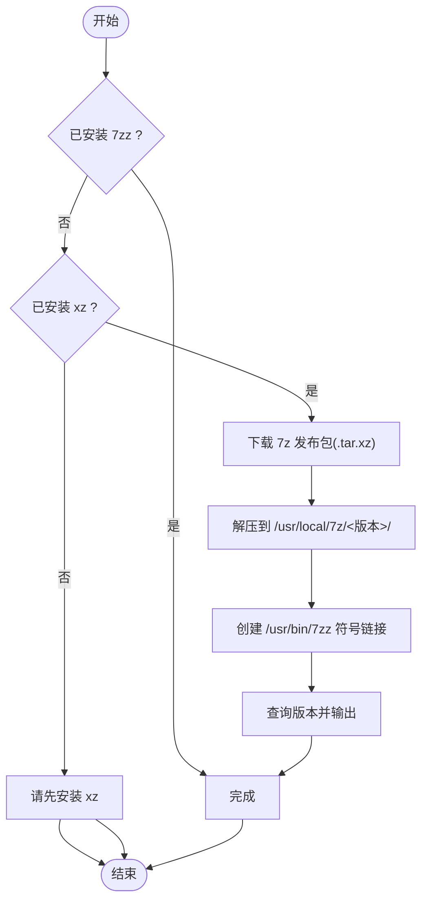
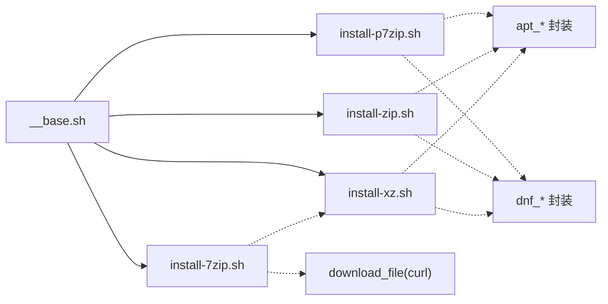

# 压缩工具安装

<cite>
**本文引用的文件**
- [scripts/install-7zip.sh](file://scripts/install-7zip.sh)
- [scripts/install-p7zip.sh](file://scripts/install-p7zip.sh)
- [scripts/install-zip.sh](file://scripts/install-zip.sh)
- [scripts/install-xz.sh](file://scripts/install-xz.sh)
- [scripts/__base.sh](file://scripts/__base.sh)
- [tests/install-7zip/01-ok.sh](file://tests/install-7zip/01-ok.sh)
- [tests/install-7zip/02-install.sh](file://tests/install-7zip/02-install.sh)
- [tests/install-p7zip/01-ok.sh](file://tests/install-p7zip/01-ok.sh)
- [tests/install-zip/01-ok.sh](file://tests/install-zip/01-ok.sh)
- [tests/__base.sh](file://tests/__base.sh)
- [dist/install-7zip.sh](file://dist/install-7zip.sh)
- [dist/install-p7zip.sh](file://dist/install-p7zip.sh)
- [dist/install-zip.sh](file://dist/install-zip.sh)
- [dist/install-xz.sh](file://dist/install-xz.sh)
</cite>

## 目录
1. [简介](#简介)
2. [项目结构](#项目结构)
3. [核心组件](#核心组件)
4. [架构总览](#架构总览)
5. [详细组件分析](#详细组件分析)
6. [依赖关系分析](#依赖关系分析)
7. [性能与选择建议](#性能与选择建议)
8. [故障排查指南](#故障排查指南)
9. [结论](#结论)
10. [附录](#附录)

## 简介
本文件系统化梳理并解读压缩工具安装模块的设计与实现，覆盖以下目标：
- 解释 7zip、p7zip、zip/unzip、xz 四类压缩工具的安装脚本实现与差异
- 明确各工具支持的操作系统版本、安装路径与配置项
- 提供可操作的安装示例与使用场景说明
- 总结各工具特性与性能对比，给出组合选择建议
- 给出常见问题的排查方法与最佳实践

## 项目结构
该模块采用“统一基座 + 各工具独立脚本”的组织方式：
- 统一基座：scripts/__base.sh 提供参数解析、操作系统识别、安装器封装、下载器、日志输出等通用能力
- 工具脚本：scripts/install-*.sh 分别实现 7zip、p7zip、zip/unzip、xz 的安装逻辑
- 构建产物：dist/install-*.sh 为由工具链生成的完整脚本（内嵌了 __base.sh 的实现）
- 测试：tests/install-*/ 下的用例验证脚本可用性、帮助信息、版本检测与前置依赖安装

图示来源
- [scripts/__base.sh](file://scripts/__base.sh)
- [scripts/install-7zip.sh](file://scripts/install-7zip.sh)
- [scripts/install-p7zip.sh](file://scripts/install-p7zip.sh)
- [scripts/install-zip.sh](file://scripts/install-zip.sh)
- [scripts/install-xz.sh](file://scripts/install-xz.sh)
- [dist/install-7zip.sh](file://dist/install-7zip.sh)
- [dist/install-p7zip.sh](file://dist/install-p7zip.sh)
- [dist/install-zip.sh](file://dist/install-zip.sh)
- [dist/install-xz.sh](file://dist/install-xz.sh)
- [tests/__base.sh](file://tests/__base.sh)
- [tests/install-7zip/01-ok.sh](file://tests/install-7zip/01-ok.sh)
- [tests/install-7zip/02-install.sh](file://tests/install-7zip/02-install.sh)
- [tests/install-p7zip/01-ok.sh](file://tests/install-p7zip/01-ok.sh)
- [tests/install-zip/01-ok.sh](file://tests/install-zip/01-ok.sh)

章节来源
- [scripts/__base.sh](file://scripts/__base.sh)
- [scripts/install-7zip.sh](file://scripts/install-7zip.sh)
- [scripts/install-p7zip.sh](file://scripts/install-p7zip.sh)
- [scripts/install-zip.sh](file://scripts/install-zip.sh)
- [scripts/install-xz.sh](file://scripts/install-xz.sh)
- [dist/install-7zip.sh](file://dist/install-7zip.sh)
- [dist/install-p7zip.sh](file://dist/install-p7zip.sh)
- [dist/install-zip.sh](file://dist/install-zip.sh)
- [dist/install-xz.sh](file://dist/install-xz.sh)
- [tests/__base.sh](file://tests/__base.sh)
- [tests/install-7zip/01-ok.sh](file://tests/install-7zip/01-ok.sh)
- [tests/install-7zip/02-install.sh](file://tests/install-7zip/02-install.sh)
- [tests/install-p7zip/01-ok.sh](file://tests/install-p7zip/01-ok.sh)
- [tests/install-zip/01-ok.sh](file://tests/install-zip/01-ok.sh)

## 核心组件
- 参数与帮助系统
  - 支持 --help/-h 输出帮助；--debug 控制调试输出；--network 指定网络环境（如 in-china）
  - 默认参数与用户传参合并展示，便于审计
- 操作系统识别与支持校验
  - 自动识别 OS 名称、版本、架构，校验是否在 SUPPORT_OS_LIST 中
  - 对 APT/DNF 包管理器进行分支处理，确保安装路径正确
- 安装器封装
  - apt_* 与 dnf_* 封装：镜像切换（国内）、更新索引、安装指定版本或最新版本
  - download_file：基于 curl 的下载器，前置校验 curl 是否存在
- 日志与输出
  - 统一日志颜色与格式，支持耗时统计、错误提示、键值对输出

章节来源
- [scripts/__base.sh](file://scripts/__base.sh)
- [scripts/install-7zip.sh](file://scripts/install-7zip.sh)
- [scripts/install-p7zip.sh](file://scripts/install-p7zip.sh)
- [scripts/install-zip.sh](file://scripts/install-zip.sh)
- [scripts/install-xz.sh](file://scripts/install-xz.sh)

## 架构总览
四类工具的安装流程遵循统一的“参数解析 → 支持性检查 → 前置依赖检查 → 安装 → 版本确认 → 结束输出”的模式。

图示来源
- [scripts/__base.sh](file://scripts/__base.sh)
- [scripts/install-7zip.sh](file://scripts/install-7zip.sh)
- [scripts/install-p7zip.sh](file://scripts/install-p7zip.sh)
- [scripts/install-zip.sh](file://scripts/install-zip.sh)
- [scripts/install-xz.sh](file://scripts/install-xz.sh)

## 详细组件分析

### 7zip 安装模块
- 支持系统
  - Ubuntu 20.04/22.04/24.04 AMD64
  - Debian 11.9/12.2 AMD64
  - Fedora 41 AMD64
  - RedHat 8.10/9.6 AMD64
- 关键行为
  - 若已存在 7zz 命令则直接退出
  - 若未安装 xz，则要求先安装 xz（因发布包为 .tar.xz）
  - 从指定 URL 下载对应版本的 7z 平台包，解压到 /usr/local/7z/<版本>/，创建 /usr/bin/7zz 符号链接
  - 最终打印版本信息并结束
- 配置项
  - --7zip-version：默认 24.09
  - --network：默认 default，支持 in-china 切换镜像
  - --debug：默认 false
- 典型使用场景
  - 需要命令行 7-Zip 功能与较新版本时
  - 需要稳定且跨平台的 7z 命令时

图示来源
- [scripts/install-7zip.sh](file://scripts/install-7zip.sh)
- [scripts/__base.sh](file://scripts/__base.sh)

章节来源
- [scripts/install-7zip.sh](file://scripts/install-7zip.sh)
- [tests/install-7zip/01-ok.sh](file://tests/install-7zip/01-ok.sh)
- [tests/install-7zip/02-install.sh](file://tests/install-7zip/02-install.sh)

### p7zip 安装模块
- 支持系统
  - Ubuntu 20.04/22.04/24.04 AMD64
  - Debian 11.9/12.2 AMD64
  - Fedora 41 AMD64
  - RedHat 8.10/9.6 AMD64
- 关键行为
  - 若已存在 7z 或 7za 命令则直接退出
  - APT 分支：apt_setup_mirrors → apt_get_update → apt_get_install(p7zip-full)
  - DNF 分支：dnf_setup_mirrors → dnf_update → dnf_install(p7zip)
  - 安装完成后打印版本信息
- 配置项
  - --p7zip-version：默认 default（安装最新）
  - --network：默认 default，支持 in-china
  - --debug：默认 false
- 典型使用场景
  - 需要标准 p7zip 命令集（7z、7za）时
  - 在 APT/DNF 生态中通过包管理器安装更易维护

章节来源
- [scripts/install-p7zip.sh](file://scripts/install-p7zip.sh)
- [tests/install-p7zip/01-ok.sh](file://tests/install-p7zip/01-ok.sh)

### zip/unzip 安装模块
- 支持系统
  - Ubuntu 20.04/22.04/24.04 AMD64
  - Debian 11.9/12.2 AMD64
  - Fedora 41 AMD64
  - RedHat 8.10/9.6 AMD64
- 关键行为
  - 分别检测 zip 与 unzip 是否已安装，未安装则分别安装
  - APT 分支：apt_setup_mirrors → apt_get_update → 分别 apt_get_install(zip、unzip)
  - DNF 分支：dnf_setup_mirrors → dnf_update → 分别 dnf_install(zip、unzip)
  - 安装完成后打印版本信息
- 配置项
  - --zip-version：默认 default
  - --unzip-version：默认 default
  - --network：默认 default，支持 in-china
  - --debug：默认 false
- 典型使用场景
  - 需要标准 ZIP 归档与解压能力时
  - 与传统工具链兼容的项目

章节来源
- [scripts/install-zip.sh](file://scripts/install-zip.sh)
- [tests/install-zip/01-ok.sh](file://tests/install-zip/01-ok.sh)

### xz 安装模块
- 支持系统
  - Ubuntu 20.04/22.04/24.04 AMD64
  - Debian 11.9/12.2 AMD64
  - Fedora 41 AMD64
  - RedHat 8.10/9.6 AMD64
- 关键行为
  - 若已安装 xz 命令则直接退出
  - APT 分支：apt_setup_mirrors → apt_get_update → apt_get_install(xz-utils)
  - DNF 分支：dnf_setup_mirrors → dnf_update → dnf_install(xz)
  - 安装完成后打印版本信息
- 配置项
  - --xz-version：默认 default
  - --network：默认 default，支持 in-china
  - --debug：默认 false
- 典型使用场景
  - 作为 7zip 发布包的前置依赖
  - 需要 .xz 压缩格式支持时

章节来源
- [scripts/install-xz.sh](file://scripts/install-xz.sh)

## 依赖关系分析
- 统一依赖
  - 所有脚本均依赖 __base.sh 的参数解析、OS 识别、安装器封装与下载器
- 工具间依赖
  - 7zip 安装前必须保证 xz 可用（发布包为 .tar.xz）
  - p7zip 与 zip/unzip 无强依赖，但可与 7zip/xz 组合使用
- 包管理器依赖
  - APT 分支：apt_setup_mirrors → apt_get_update → apt_get_install
  - DNF 分支：dnf_setup_mirrors → dnf_update → dnf_install
- 下载器依赖
  - download_file 前置校验 curl 存在，否则报错退出

图示来源
- [scripts/__base.sh](file://scripts/__base.sh)
- [scripts/install-7zip.sh](file://scripts/install-7zip.sh)
- [scripts/install-p7zip.sh](file://scripts/install-p7zip.sh)
- [scripts/install-zip.sh](file://scripts/install-zip.sh)
- [scripts/install-xz.sh](file://scripts/install-xz.sh)

章节来源
- [scripts/__base.sh](file://scripts/__base.sh)
- [scripts/install-7zip.sh](file://scripts/install-7zip.sh)
- [scripts/install-p7zip.sh](file://scripts/install-p7zip.sh)
- [scripts/install-zip.sh](file://scripts/install-zip.sh)
- [scripts/install-xz.sh](file://scripts/install-xz.sh)

## 性能与选择建议
- 工具特性概览
  - 7zip（7zz）
    - 优点：功能全面、命令行强大、支持多种格式；版本可指定
    - 适用：需要灵活命令行与较新版本的场景
  - p7zip（7z/7za）
    - 优点：标准 p7zip 命令集；通过包管理器安装，易于维护
    - 适用：与 p7zip 生态兼容的项目
  - zip/unzip
    - 优点：最广泛兼容的标准工具；体积小、生态成熟
    - 适用：传统项目与跨平台兼容优先场景
  - xz
    - 优点：高压缩比；作为 .xz 包解压依赖
    - 适用：需要 .xz 格式或更高压缩比的场景
- 选择建议
  - 仅需 ZIP 格式：优先 zip/unzip
  - 需要 7-Zip 生态：优先 7zip（7zz）或 p7zip（7z/7za）
  - 需要 .xz 格式或更高压缩比：xz 必备
  - 多格式混合：7zip + xz + zip/unzip 组合
- 性能对比参考
  - 压缩比：xz > 7zip ≈ p7zip > zip（取决于数据类型与参数）
  - 解压速度：zip > xz > 7zip（大致顺序，受数据类型影响）
  - 安装复杂度：zip/unzip 最低；xz 为前置依赖；7zip/p7zip 中等

[本节为通用指导，无需特定文件引用]

## 故障排查指南
- 常见问题与定位
  - “请先安装 xz”：7zip 发布包为 .tar.xz，需先安装 xz
  - “Unsupported operating system”：当前系统不在 SUPPORT_OS_LIST 中
  - “Curl is not installed”：download_file 依赖 curl，需先安装
  - “--network=in-china 无法访问”：镜像源不可达或网络策略限制
- 排查步骤
  - 使用 --help 查看支持列表与默认参数
  - 使用 --debug 获取详细执行日志
  - 检查包管理器镜像是否切换成功
  - 手动验证 curl、xz、zip、unzip、7z/7zz 命令可用性
- 测试用例参考
  - 7zip：01-ok（基础功能）、02-install（实际安装与版本确认）
  - p7zip：01-ok（基础功能）
  - zip：01-ok（基础功能）

章节来源
- [tests/install-7zip/01-ok.sh](file://tests/install-7zip/01-ok.sh)
- [tests/install-7zip/02-install.sh](file://tests/install-7zip/02-install.sh)
- [tests/install-p7zip/01-ok.sh](file://tests/install-p7zip/01-ok.sh)
- [tests/install-zip/01-ok.sh](file://tests/install-zip/01-ok.sh)
- [tests/__base.sh](file://tests/__base.sh)

## 结论
- 该模块以统一基座抽象出跨发行版的安装一致性，四类工具脚本遵循一致的参数与流程规范
- 7zip 适合需要命令行 7-Zip 与较新版本的场景；p7zip 适合标准 p7zip 生态；zip/unzip 适合兼容优先；xz 适合 .xz 与高压缩比场景
- 实践建议：根据项目格式需求与团队习惯选择单一或组合工具，并结合 --network 与版本参数进行可控部署

[本节为总结，无需特定文件引用]

## 附录

### 安装示例与使用场景
- 示例一：安装 7zip（指定版本）
  - 步骤：先确保 xz 可用；执行脚本并传入 --7zip-version 指定版本；校验 7zz 版本
  - 适用：需要固定版本的 CI/CD 或生产环境
- 示例二：安装 p7zip（APT）
  - 步骤：设置 --network=default 或 in-china；执行脚本；校验 7z/7za
  - 适用：Debian/Ubuntu 环境下通过包管理器安装
- 示例三：安装 zip/unzip（分别指定版本）
  - 步骤：设置 --zip-version 与 --unzip-version；执行脚本；校验 zip/unzip
  - 适用：需要严格控制两个工具版本的场景
- 示例四：安装 xz（前置依赖）
  - 步骤：执行脚本；校验 xz --version
  - 适用：作为 7zip 发布包解压依赖

章节来源
- [scripts/install-7zip.sh](file://scripts/install-7zip.sh)
- [scripts/install-p7zip.sh](file://scripts/install-p7zip.sh)
- [scripts/install-zip.sh](file://scripts/install-zip.sh)
- [scripts/install-xz.sh](file://scripts/install-xz.sh)