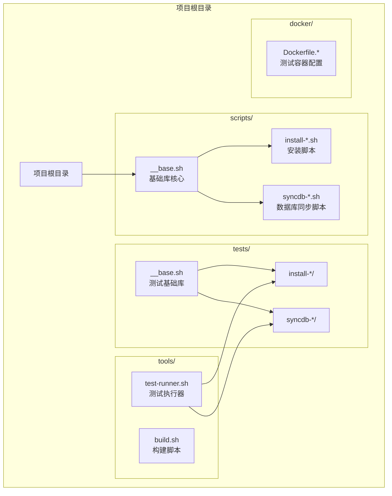
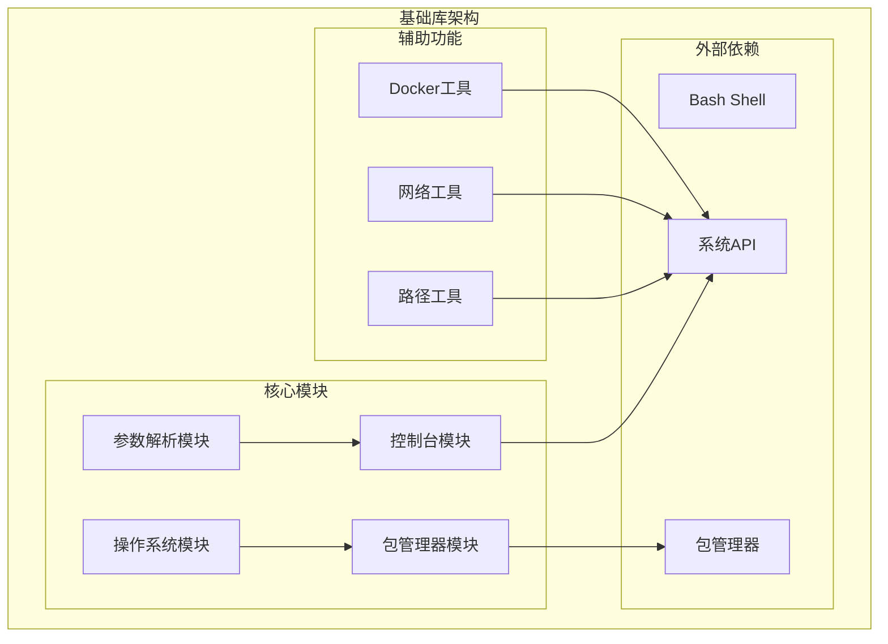
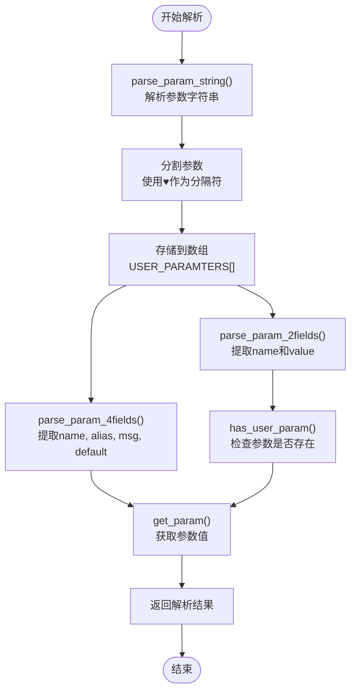
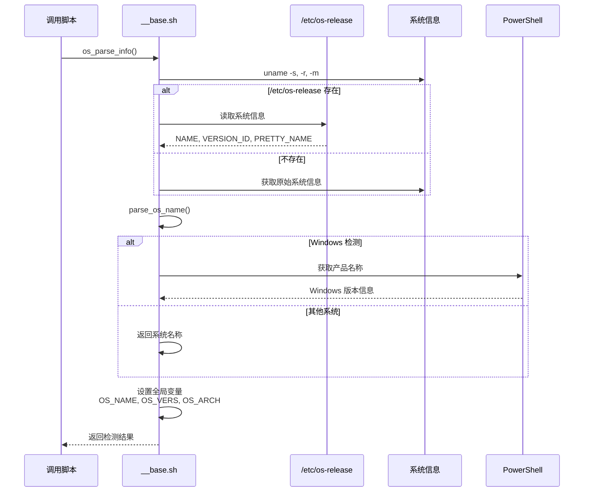
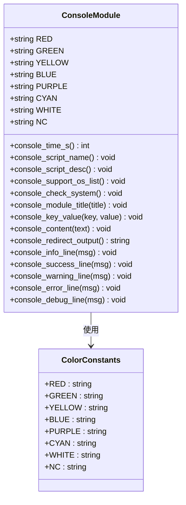
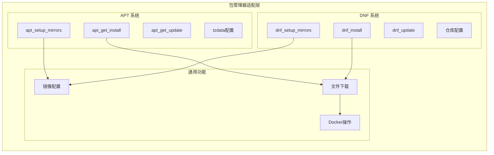
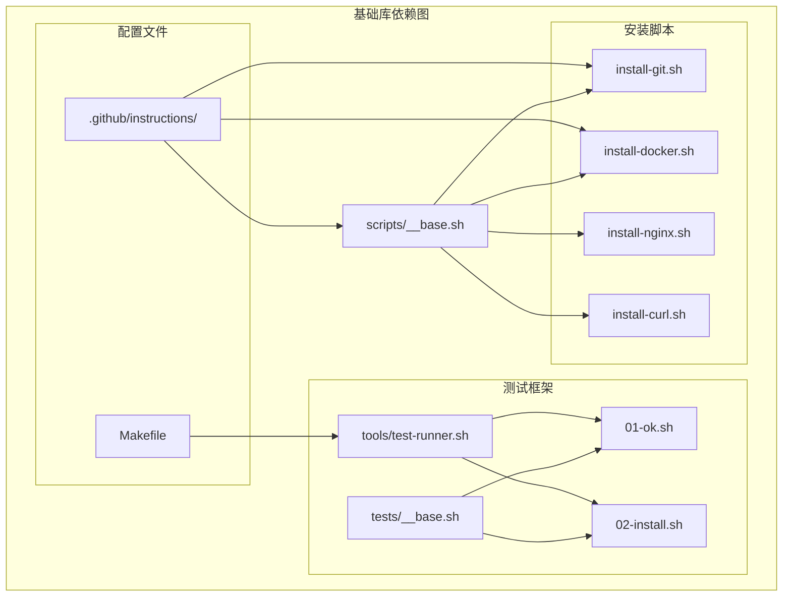

# 基础库模块

<cite>
**本文档引用的文件**
- [scripts/__base.sh](file://scripts/__base.sh)
- [scripts/install-git.sh](file://scripts/install-git.sh)
- [scripts/install-docker.sh](file://scripts/install-docker.sh)
- [tests/__base.sh](file://tests/__base.sh)
- [tests/install-git/01-ok.sh](file://tests/install-git/01-ok.sh)
- [tests/install-git/02-install.sh](file://tests/install-git/02-install.sh)
- [tools/test-runner.sh](file://tools/test-runner.sh)
- [Makefile](file://Makefile)
- [.github/instructions/scripts-base.instructions.md](file://.github/instructions/scripts-base.instructions.md)
- [.github/instructions/scripts-install.instructions.md](file://.github/instructions/scripts-install.instructions.md)
- [.github/instructions/docker-file.instructions.md](file://.github/instructions/docker-file.instructions.md)
</cite>

## 目录
1. [简介](#简介)
2. [项目结构](#项目结构)
3. [核心组件](#核心组件)
4. [架构概览](#架构概览)
5. [详细组件分析](#详细组件分析)
6. [依赖分析](#依赖分析)
7. [性能考虑](#性能考虑)
8. [故障排除指南](#故障排除指南)
9. [结论](#结论)
10. [附录](#附录)

## 简介

HZ 9 环境脚本项目的基础库模块是一个高度模块化的 Shell 脚本基础设施，为整个项目提供了统一的开发框架和工具集。该基础库作为所有安装脚本的核心依赖，通过提供标准化的操作系统检测、参数解析、日志输出、包管理器适配等功能，确保了跨平台兼容性和代码复用性。

该项目的核心价值在于其模块化设计，将复杂的功能分解为独立的模块，每个模块负责特定领域的功能，同时通过清晰的接口进行交互。这种设计不仅提高了代码的可维护性，还为新功能的扩展提供了便利的框架。

## 项目结构

项目采用分层组织结构，基础库位于 scripts 目录的根级别，为所有安装脚本提供通用功能支持：



**图表来源**
- [scripts/__base.sh:1-1252](file://scripts/__base.sh#L1-L1252)
- [tests/__base.sh:1-464](file://tests/__base.sh#L1-L464)

**章节来源**
- [scripts/__base.sh:1-1252](file://scripts/__base.sh#L1-L1252)
- [Makefile:1-563](file://Makefile#L1-L563)

## 核心组件

基础库模块由多个相互协作的功能模块组成，每个模块都有明确的职责分工：

### 参数解析模块
提供统一的命令行参数处理机制，支持多种参数格式和别名映射：
- `parse_param_string()`: 解析参数字符串为数组
- `parse_param_2fields()`: 处理双字段参数(name, value)
- `parse_param_4fields()`: 处理四字段参数(name, alias, msg, default)

### 操作系统检测模块
实现跨平台的系统识别和版本检测：
- `os_parse_info()`: 解析操作系统信息
- `is_window_system()`: 检测 Windows 系统
- `is_linux_system()`: 检测 Linux 系统
- `is_macos_system()`: 检测 macOS 系统

### 控制台输出模块
提供丰富的日志输出功能和格式化工具：
- `console_content_starting()`: 开始操作提示
- `console_content_complete()`: 完成操作提示
- `console_content_error()`: 错误信息输出
- `console_key_value()`: 键值对格式化输出

### 包管理器适配模块
支持多种包管理系统的镜像配置和软件安装：
- `apt_setup_mirrors()`: APT 包管理器镜像配置
- `dnf_setup_mirrors()`: DNF 包管理器镜像配置
- `apt_get_install()`: APT 软件安装
- `dnf_install()`: DNF 软件安装

**章节来源**
- [scripts/__base.sh:4-49](file://scripts/__base.sh#L4-L49)
- [scripts/__base.sh:80-263](file://scripts/__base.sh#L80-L263)
- [scripts/__base.sh:265-476](file://scripts/__base.sh#L265-L476)
- [scripts/__base.sh:744-1237](file://scripts/__base.sh#L744-L1237)

## 架构概览

基础库采用了模块化架构设计，通过命名空间隔离和清晰的接口定义实现了高内聚低耦合的系统结构：



**图表来源**
- [scripts/__base.sh:1-1252](file://scripts/__base.sh#L1-L1252)

该架构的主要特点包括：
- **模块化设计**: 每个功能域独立封装，便于维护和测试
- **接口标准化**: 统一的函数命名约定和参数规范
- **跨平台兼容**: 通过条件判断支持多种操作系统
- **可扩展性**: 新功能可通过添加新模块的方式集成

## 详细组件分析

### 参数解析系统

参数解析系统是基础库的核心组件之一，它提供了一套完整的命令行参数处理机制：



**图表来源**
- [scripts/__base.sh:482-706](file://scripts/__base.sh#L482-L706)

该系统的关键特性：
- **兼容性**: 支持不同 Bash 版本的参数解析差异
- **灵活性**: 支持长参数(--param)、短参数(-p)和组合参数
- **类型安全**: 通过严格的参数验证防止错误输入
- **易用性**: 提供简洁的 API 接口

**章节来源**
- [scripts/__base.sh:478-742](file://scripts/__base.sh#L478-L742)

### 操作系统检测机制

操作系统检测模块实现了复杂的跨平台识别逻辑：



**图表来源**
- [scripts/__base.sh:96-238](file://scripts/__base.sh#L96-L238)

检测流程的关键步骤：
1. **信息收集**: 从 `/etc/os-release` 或系统命令获取基础信息
2. **名称解析**: 将原始系统名称转换为标准格式
3. **版本识别**: 提取精确的版本号和架构信息
4. **支持性检查**: 验证当前系统是否在支持列表中

**章节来源**
- [scripts/__base.sh:80-263](file://scripts/__base.sh#L80-L263)

### 日志输出系统

日志输出系统提供了丰富的格式化输出功能：



**图表来源**
- [scripts/__base.sh:265-476](file://scripts/__base.sh#L265-L476)

系统特色功能：
- **颜色编码**: 支持多种颜色的文本输出
- **时间追踪**: 自动记录操作开始和结束时间
- **条件输出**: 根据调试模式动态调整输出内容
- **格式化工具**: 提供键值对、多行文本等格式化功能

**章节来源**
- [scripts/__base.sh:265-476](file://scripts/__base.sh#L265-L476)

### 包管理器适配层

包管理器适配层实现了对多种包管理系统的统一支持：



**图表来源**
- [scripts/__base.sh:744-1237](file://scripts/__base.sh#L744-L1237)

适配策略：
- **镜像源配置**: 根据地理位置选择最优镜像源
- **软件包管理**: 统一的安装和更新流程
- **依赖处理**: 自动处理软件包依赖关系
- **错误恢复**: 提供完善的错误处理和恢复机制

**章节来源**
- [scripts/__base.sh:744-1237](file://scripts/__base.sh#L744-L1237)

## 依赖分析

基础库模块之间的依赖关系体现了清晰的层次结构：



**图表来源**
- [scripts/__base.sh:1-1252](file://scripts/__base.sh#L1-L1252)
- [tests/__base.sh:1-464](file://tests/__base.sh#L1-L464)
- [Makefile:1-563](file://Makefile#L1-L563)

依赖关系特点：
- **单向依赖**: 所有脚本只依赖基础库，无反向依赖
- **松耦合**: 通过标准化接口进行通信
- **可替换性**: 模块间可以独立升级和修改
- **可测试性**: 清晰的依赖边界便于单元测试

**章节来源**
- [scripts/__base.sh:1-1252](file://scripts/__base.sh#L1-L1252)
- [tests/__base.sh:1-464](file://tests/__base.sh#L1-L464)

## 性能考虑

基础库在设计时充分考虑了性能优化：

### 输出重定向优化
通过 `console_redirect_output()` 函数实现智能输出控制，减少不必要的日志输出：

```bash
# 调试模式下显示详细输出
if [ "$(get_param '--debug')" == 'false' ]; then
    echo "&> /dev/null"
else
    echo ""
fi
```

### 缓存机制
- **Docker 镜像缓存**: 通过 `--docker-image-quick-check` 参数避免重复拉取
- **包管理器缓存**: 利用系统自带的包管理器缓存机制
- **临时文件管理**: 自动清理测试过程中的临时文件

### 并发处理
测试框架支持并行执行多个测试用例，提高整体执行效率。

## 故障排除指南

### 常见问题及解决方案

**操作系统检测失败**
- 检查 `/etc/os-release` 文件是否存在
- 验证系统权限是否足够
- 确认 PowerShell 在 Windows 系统上的可用性

**包管理器配置错误**
- 检查网络连接状态
- 验证镜像源配置的正确性
- 确认 sudo 权限配置

**参数解析异常**
- 检查参数格式是否符合规范
- 验证参数分隔符的使用
- 确认特殊字符的转义处理

**章节来源**
- [scripts/__base.sh:381-431](file://scripts/__base.sh#L381-L431)
- [tests/__base.sh:139-201](file://tests/__base.sh#L139-L201)

## 结论

HZ 9 环境脚本项目的基础库模块展现了优秀的软件工程实践。通过模块化设计、标准化接口和完善的错误处理机制，该基础库为整个项目提供了稳定可靠的技术支撑。

其核心优势包括：
- **高度模块化**: 功能清晰分离，便于维护和扩展
- **跨平台兼容**: 支持多种操作系统和包管理器
- **用户友好**: 提供丰富的日志输出和错误信息
- **可测试性**: 完善的测试框架和工具链

未来的发展方向建议包括：
- 增加更多的包管理器支持
- 扩展网络配置选项
- 改进性能监控和报告功能

## 附录

### API 参考

#### 参数解析函数
- `parse_user_param()`: 解析用户提供的参数
- `has_user_param()`: 检查参数是否存在
- `get_user_param()`: 获取参数值
- `get_param()`: 获取最终参数值

#### 操作系统函数
- `os_parse_info()`: 解析系统信息
- `print_system_info()`: 打印系统信息
- `is_support_current_os()`: 检查系统支持性

#### 日志输出函数
- `console_content_starting()`: 开始操作提示
- `console_content_complete()`: 完成操作提示
- `console_content_error()`: 错误信息输出
- `console_key_value()`: 键值对输出

#### 包管理器函数
- `apt_setup_mirrors()`: APT 镜像配置
- `dnf_setup_mirrors()`: DNF 镜像配置
- `apt_get_install()`: APT 软件安装
- `dnf_install()`: DNF 软件安装

### 使用示例

#### 基础脚本模板
```bash
#!/bin/bash
_m_='♥'

# 设置脚本元数据
SHELL_NAME="脚本名称"
SHELL_DESC="脚本描述"

# 定义支持的操作系统
SUPPORT_OS_LIST=(
    "Ubuntu 20.04 AMD64"
    "Ubuntu 22.04 AMD64"
    "Debian 11.9 AMD64"
    "Debian 12.2 AMD64"
    "Fedora 41 AMD64"
    "RedHat 8.10 AMD64"
    "RedHat 9.6 AMD64"
)

# 定义参数
PARAMTERS=(
    "--help${_m_}-h${_m_}打印帮助信息.${_m_}false"
    "--debug${_m_}${_m_}启用调试模式.${_m_}false"
    "--network${_m_}${_m_}指定网络环境(例如'in-china').${_m_}default"
)

# 引入基础库
source ./__base.sh

# 处理参数和显示帮助
print_help_or_param "$@"

# 获取参数值
network=$(get_param '--network')

# 执行业务逻辑
# ...
```

#### 测试脚本模板
```bash
#!/bin/bash

# 导入测试工具
source "$(dirname "$0")/../__base.sh"
source "$(dirname "$0")/../__install.sh"

# 设置测试常量
SCRIPT_PATH="$(dirname "$0")/../../dist/install-*.sh"

# 初始化测试环境
unit_test_initing "$@" "--name=脚本名称"

# 执行测试检查点
checkpoint_check_script_file_exists "$SCRIPT_PATH"
checkpoint_check_script_is_executable "$SCRIPT_PATH"
checkpoint_check_script_help_output "$SCRIPT_PATH"
checkpoint_check_current_os_is_supported

# 显示测试结果
unit_test_console_summary
exit $?
```

### 扩展指南

#### 添加新的包管理器支持
1. 在包管理器模块中添加新的函数
2. 更新支持的操作系统列表
3. 添加相应的测试用例
4. 更新文档和示例代码

#### 自定义日志格式
1. 修改颜色常量定义
2. 扩展格式化函数
3. 更新输出样式
4. 测试兼容性

#### 配置自定义参数
1. 在 PARAMTERS 数组中添加新参数
2. 实现参数解析逻辑
3. 添加默认值处理
4. 更新帮助信息

**章节来源**
- [scripts/install-git.sh:1-85](file://scripts/install-git.sh#L1-L85)
- [scripts/install-docker.sh:1-217](file://scripts/install-docker.sh#L1-L217)
- [tests/install-git/01-ok.sh:1-25](file://tests/install-git/01-ok.sh#L1-L25)
- [tests/install-git/02-install.sh:1-35](file://tests/install-git/02-install.sh#L1-L35)