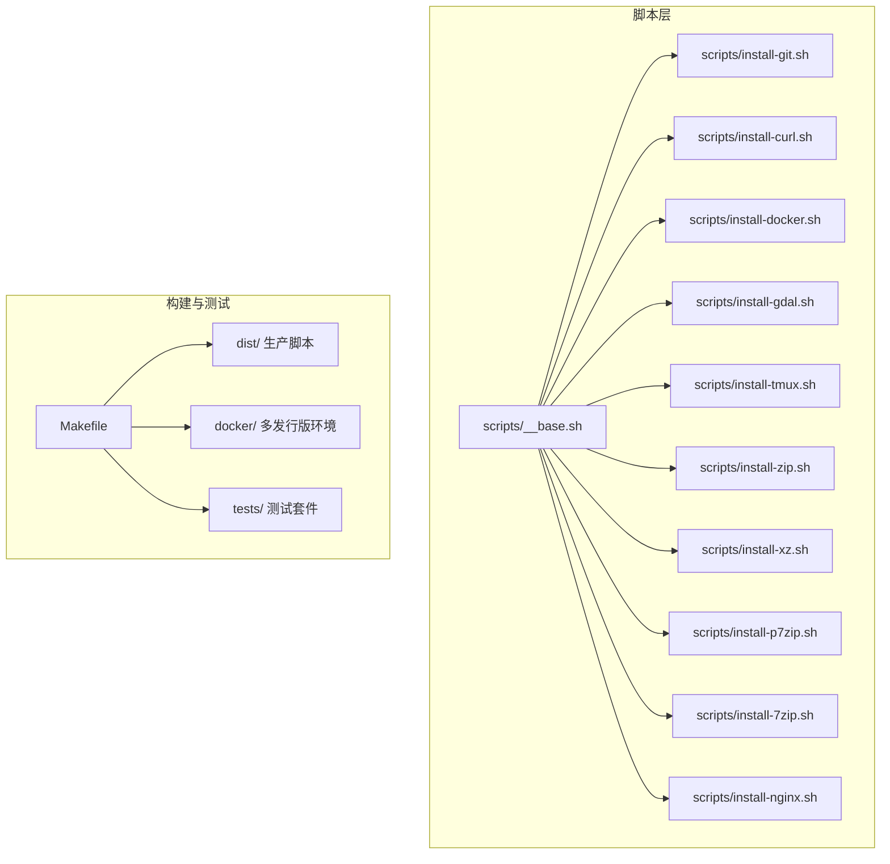
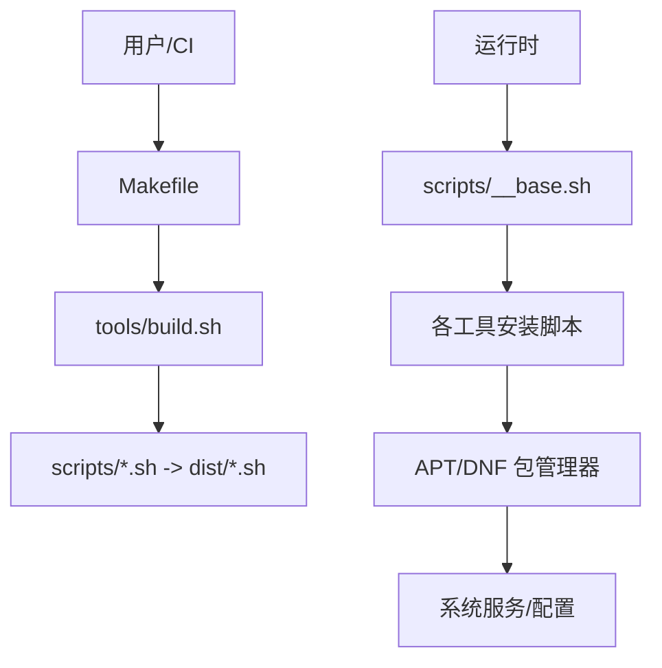
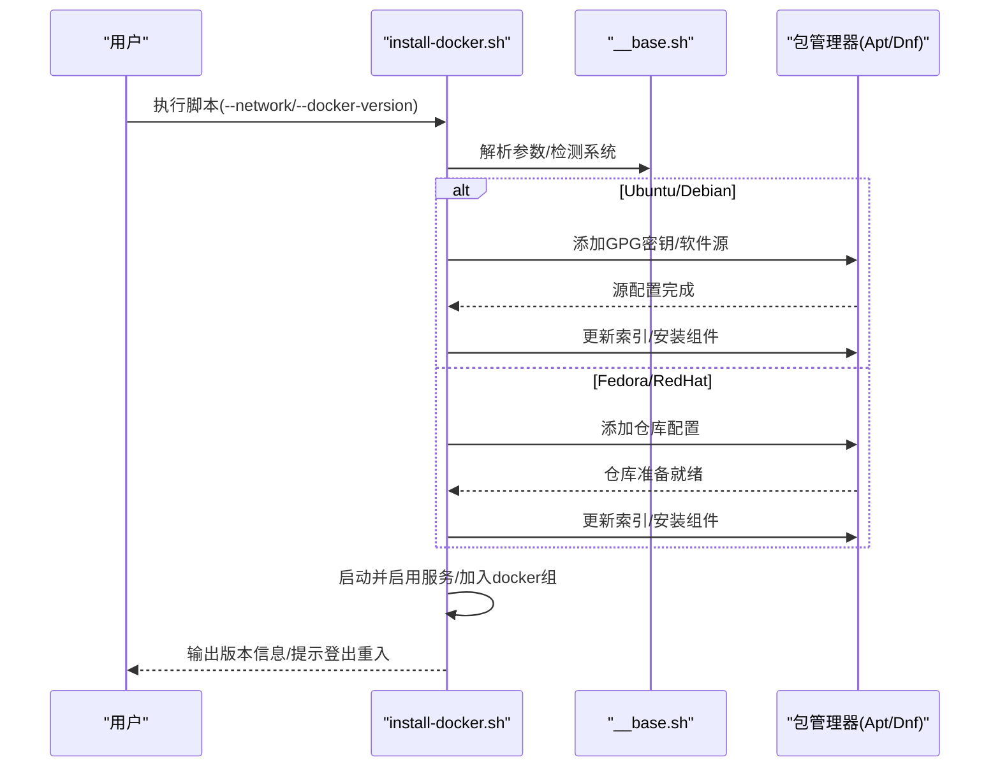
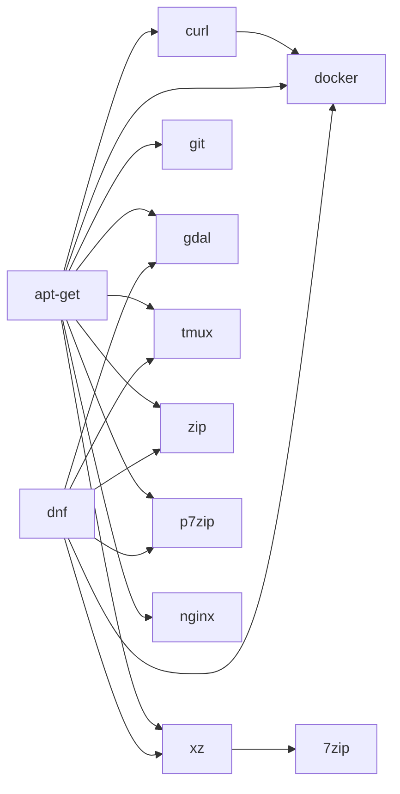

# 安装脚本系统

<cite>
**本文引用的文件**
- [README.md](file://README.md)
- [docs/README.md](file://docs/README.md)
- [Makefile](file://Makefile)
- [package.json](file://package.json)
- [scripts/__base.sh](file://scripts/__base.sh)
- [scripts/install-git.sh](file://scripts/install-git.sh)
- [scripts/install-curl.sh](file://scripts/install-curl.sh)
- [scripts/install-docker.sh](file://scripts/install-docker.sh)
- [scripts/install-gdal.sh](file://scripts/install-gdal.sh)
- [scripts/install-tmux.sh](file://scripts/install-tmux.sh)
- [scripts/install-7zip.sh](file://scripts/install-7zip.sh)
- [scripts/install-p7zip.sh](file://scripts/install-p7zip.sh)
- [scripts/install-zip.sh](file://scripts/install-zip.sh)
- [scripts/install-xz.sh](file://scripts/install-xz.sh)
- [scripts/install-nginx.sh](file://scripts/install-nginx.sh)
</cite>

## 目录
1. [简介](#简介)
2. [项目结构](#项目结构)
3. [核心组件](#核心组件)
4. [架构总览](#架构总览)
5. [详细组件分析](#详细组件分析)
6. [依赖关系分析](#依赖关系分析)
7. [性能考虑](#性能考虑)
8. [故障排除指南](#故障排除指南)
9. [结论](#结论)
10. [附录](#附录)

## 简介
HZ 9 Env Scripts 是一套面向多 Linux 发行版与架构的生产级安装脚本集合，覆盖系统工具（Git、Curl、Nginx）、开发工具（Docker、GDAL、tmux）以及压缩工具（7zip、p7zip、zip、xz）。脚本统一基于 Bash 实现，内置参数解析、操作系统识别、镜像源切换、日志输出与调试模式等通用能力，支持通过网络参数选择国内镜像以提升下载速度与稳定性。

## 项目结构
仓库采用“源脚本 + 构建产物 + 测试 + 文档 + Docker 环境”的组织方式：
- scripts：源脚本目录，每个工具一个独立安装脚本，共享 __base.sh 基础模块
- dist：构建后的可直接下载使用的生产脚本
- tests：为每个脚本提供正向与安装场景的测试用例
- docker：用于在多发行版容器中进行端到端测试
- docs：项目文档与使用说明
- tools：构建与测试辅助工具
- Makefile：集中化测试与构建命令入口

图表来源
- [Makefile:1-563](file://Makefile#L1-L563)
- [scripts/__base.sh:1-1252](file://scripts/__base.sh#L1-L1252)
- [scripts/install-git.sh:1-85](file://scripts/install-git.sh#L1-L85)
- [scripts/install-curl.sh:1-84](file://scripts/install-curl.sh#L1-L84)
- [scripts/install-docker.sh:1-217](file://scripts/install-docker.sh#L1-L217)
- [scripts/install-gdal.sh:1-88](file://scripts/install-gdal.sh#L1-L88)
- [scripts/install-tmux.sh:1-84](file://scripts/install-tmux.sh#L1-L84)
- [scripts/install-zip.sh:1-115](file://scripts/install-zip.sh#L1-L115)
- [scripts/install-xz.sh:1-91](file://scripts/install-xz.sh#L1-L91)
- [scripts/install-p7zip.sh:1-90](file://scripts/install-p7zip.sh#L1-L90)
- [scripts/install-7zip.sh:1-96](file://scripts/install-7zip.sh#L1-L96)
- [scripts/install-nginx.sh:1-198](file://scripts/install-nginx.sh#L1-L198)

章节来源
- [docs/README.md:1-128](file://docs/README.md#L1-L128)
- [Makefile:1-563](file://Makefile#L1-L563)

## 核心组件
- 基础模块（__base.sh）
  - 参数解析：支持长/短参数、默认值、别名与帮助打印
  - 操作系统识别：自动检测 OS 名称、版本、架构与是否受支持
  - 包管理器适配：按 Ubuntu/Debian 使用 APT，Fedora/RedHat 使用 DNF
  - 日志与调试：彩色输出、耗时统计、调试开关、静默模式
  - 网络镜像：针对不同发行版设置国内镜像源（如华为云）
  - 下载与安装：封装通用安装流程（更新源、安装包、清理缓存）

- 脚本模板
  - 统一声明 SHELL_NAME、SHELL_DESC、SUPPORT_OS_LIST、PARAMTERS
  - 入口调用 print_help_or_param 解析参数与系统检查
  - 条件安装：先判断是否已安装；否则按包管理器分支执行安装
  - 版本查询：安装后打印实际版本信息

章节来源
- [scripts/__base.sh:1-1252](file://scripts/__base.sh#L1-L1252)
- [scripts/install-git.sh:1-85](file://scripts/install-git.sh#L1-L85)
- [scripts/install-curl.sh:1-84](file://scripts/install-curl.sh#L1-L84)
- [scripts/install-docker.sh:1-217](file://scripts/install-docker.sh#L1-L217)
- [scripts/install-gdal.sh:1-88](file://scripts/install-gdal.sh#L1-L88)
- [scripts/install-tmux.sh:1-84](file://scripts/install-tmux.sh#L1-L84)
- [scripts/install-zip.sh:1-115](file://scripts/install-zip.sh#L1-L115)
- [scripts/install-xz.sh:1-91](file://scripts/install-xz.sh#L1-L91)
- [scripts/install-p7zip.sh:1-90](file://scripts/install-p7zip.sh#L1-L90)
- [scripts/install-7zip.sh:1-96](file://scripts/install-7zip.sh#L1-L96)
- [scripts/install-nginx.sh:1-198](file://scripts/install-nginx.sh#L1-L198)

## 架构总览
整体架构由“基础模块 + 工具脚本 + 构建/测试体系”组成，工具脚本遵循统一模板，确保一致性与可维护性。

图表来源
- [Makefile:49-62](file://Makefile#L49-L62)
- [scripts/__base.sh:1-1252](file://scripts/__base.sh#L1-L1252)
- [scripts/install-docker.sh:45-125](file://scripts/install-docker.sh#L45-L125)
- [scripts/install-nginx.sh:45-61](file://scripts/install-nginx.sh#L45-L61)

## 详细组件分析

### Git 安装脚本
- 功能：通过 APT 或 DNF 安装 Git，支持指定版本与网络镜像
- 关键点：
  - 支持 Ubuntu/Debian（APT）与 Fedora/RedHat（DNF）
  - 自动设置镜像源（默认或中国网络）
  - 已安装则跳过，未安装则执行安装并打印版本
- 参数
  - --network：网络环境（默认/中国）
  - --git-version：Git 版本（默认最新）
- 依赖
  - APT 分支依赖 curl、ca-certificates
  - DNF 分支依赖 ca-certificates

章节来源
- [scripts/install-git.sh:1-85](file://scripts/install-git.sh#L1-L85)

### Curl 安装脚本
- 功能：安装 curl 命令行工具
- 关键点：
  - 统一 APT/DNF 分支，支持镜像与版本控制
  - 已安装则提示，未安装则安装并打印版本
- 参数
  - --network：网络环境
  - --curl-version：curl 版本（默认最新）

章节来源
- [scripts/install-curl.sh:1-84](file://scripts/install-curl.sh#L1-L84)

### Docker 安装脚本
- 功能：安装 Docker CE 及相关插件，配置服务与用户组
- 关键点：
  - APT 分支：添加 GPG 密钥与软件源，安装 docker-ce、cli、containerd.io、buildx、compose 插件
  - DNF 分支：添加仓库配置，安装同上组件
  - 启动并启用服务，将当前用户加入 docker 组
  - 中国网络使用华为云镜像源
- 参数
  - --network：网络环境
  - --docker-version：Docker 版本（默认最新）
- 依赖
  - APT 分支需 curl、ca-certificates
  - DNF 分支需 ca-certificates

图表来源
- [scripts/install-docker.sh:45-190](file://scripts/install-docker.sh#L45-L190)
- [scripts/__base.sh:744-805](file://scripts/__base.sh#L744-L805)

章节来源
- [scripts/install-docker.sh:1-217](file://scripts/install-docker.sh#L1-L217)

### GDAL 安装脚本
- 功能：安装 GDAL 命令行工具
- 关键点：
  - Ubuntu/Debian 使用 APT 安装 gdal-bin
  - Fedora/RedHat 使用 DNF 安装 gdal
  - 设置时区数据（tzdata），打印版本
- 参数
  - --network：网络环境
  - --gdal-version：GDAL 版本（默认最新）

章节来源
- [scripts/install-gdal.sh:1-88](file://scripts/install-gdal.sh#L1-L88)

### tmux 安装脚本
- 功能：安装终端复用器 tmux
- 关键点：
  - Ubuntu/Debian 与 Fedora 使用 APT/DNF 安装
  - 打印版本
- 参数
  - --network：网络环境
  - --tmux-version：tmux 版本（默认最新）

章节来源
- [scripts/install-tmux.sh:1-84](file://scripts/install-tmux.sh#L1-L84)

### 压缩工具：7-Zip
- 功能：从官方发布页下载并安装 7-Zip，创建符号链接
- 关键点：
  - 依赖 xz（先检查）
  - 下载 tar.xz 包，解压至 /usr/local/7z/<版本>，创建 /usr/bin/7zz 符号链接
  - 打印版本
- 参数
  - --network：网络环境
  - --7zip-version：7-Zip 版本（默认 24.09）

章节来源
- [scripts/install-7zip.sh:1-96](file://scripts/install-7zip.sh#L1-L96)

### 压缩工具：p7zip
- 功能：安装 p7zip 命令行归档工具
- 关键点：
  - Ubuntu/Debian 安装 p7zip-full，Fedora/RedHat 安装 p7zip
  - 检测 7z 或 7za 命令是否存在
- 参数
  - --network：网络环境
  - --p7zip-version：p7zip 版本（默认最新）

章节来源
- [scripts/install-p7zip.sh:1-90](file://scripts/install-p7zip.sh#L1-L90)

### 压缩工具：zip 与 unzip
- 功能：安装压缩与解压工具
- 关键点：
  - 分别检测 zip/unzip 是否已安装，未安装则分别安装
  - 支持分别指定 zip 与 unzip 的版本
- 参数
  - --network：网络环境
  - --zip-version：zip 版本（默认最新）
  - --unzip-version：unzip 版本（默认最新）

章节来源
- [scripts/install-zip.sh:1-115](file://scripts/install-zip.sh#L1-L115)

### 压缩工具：xz
- 功能：安装 XZ 压缩工具
- 关键点：
  - Ubuntu/Debian 安装 xz-utils，Fedora/RedHat 安装 xz
  - 打印版本，失败则退出
- 参数
  - --network：网络环境
  - --xz-version：xz 版本（默认最新）

章节来源
- [scripts/install-xz.sh:1-91](file://scripts/install-xz.sh#L1-L91)

### Nginx 安装脚本
- 功能：安装并配置 Nginx，创建示例站点，启动服务
- 关键点：
  - Ubuntu/Debian 使用 APT，Fedora/RedHat 使用 DNF
  - 启动并启用服务，创建示例页面，测试配置
  - 打印版本与本地访问地址
- 参数
  - --network：网络环境
  - --nginx-version：Nginx 版本（默认最新）
- 依赖
  - 需要 systemd 管理服务

章节来源
- [scripts/install-nginx.sh:1-198](file://scripts/install-nginx.sh#L1-L198)

## 依赖关系分析
- 脚本间无直接依赖，但存在隐式依赖链：
  - Docker 安装前通常需要 curl、ca-certificates（APT 分支）
  - 7-Zip 安装前需要 xz（外部工具）
  - Nginx 安装后可作为 Web 服务器使用
- 包管理器依赖：
  - Ubuntu/Debian：apt-get（含镜像源设置、更新、安装）
  - Fedora/RedHat：dnf（含镜像源设置、更新、安装）

图表来源
- [scripts/install-docker.sh:48-58](file://scripts/install-docker.sh#L48-L58)
- [scripts/install-7zip.sh:44-49](file://scripts/install-7zip.sh#L44-L49)
- [scripts/install-git.sh:44-54](file://scripts/install-git.sh#L44-L54)
- [scripts/install-curl.sh:44-54](file://scripts/install-curl.sh#L44-L54)
- [scripts/install-gdal.sh:44-56](file://scripts/install-gdal.sh#L44-L56)
- [scripts/install-tmux.sh:44-56](file://scripts/install-tmux.sh#L44-L56)
- [scripts/install-zip.sh:58-96](file://scripts/install-zip.sh#L58-L96)
- [scripts/install-xz.sh:44-56](file://scripts/install-xz.sh#L44-L56)
- [scripts/install-p7zip.sh:44-66](file://scripts/install-p7zip.sh#L44-L66)
- [scripts/install-nginx.sh:45-61](file://scripts/install-nginx.sh#L45-L61)

## 性能考虑
- 网络优化
  - 使用 --network=in-china 切换华为云镜像源，显著提升下载速度
  - APT 分支支持完全替换 sources.list 为 USTC/Huawei 云镜像
- 并行与最小化操作
  - 尽量避免重复更新源与安装相同基础包
  - 已安装则跳过，减少不必要 IO
- 缓存与临时文件
  - 7-Zip 安装会下载并解压到 /tmp，完成后清理临时包
- 服务启动
  - 仅在安装后启动一次服务并启用开机自启，避免频繁重启

## 故障排除指南
- 系统不受支持
  - 现象：提示当前系统不受支持
  - 排查：确认 OS 名称、版本、架构是否在 SUPPORT_OS_LIST 中
- 依赖缺失
  - Docker（APT 分支）：缺少 curl、ca-certificates
  - 7-Zip：缺少 xz
  - 排查：按提示先安装对应依赖
- 镜像源问题
  - 现象：安装超时或失败
  - 排查：尝试 --network=in-china；检查网络连通性
- 权限不足
  - 现象：安装或写入失败
  - 排查：使用 sudo 运行；确认 /usr/local/7z 目录权限
- 服务无法启动
  - Nginx：检查 systemd 状态与配置文件语法
  - Docker：检查服务状态与用户组加入情况

章节来源
- [scripts/__base.sh:319-330](file://scripts/__base.sh#L319-L330)
- [scripts/install-docker.sh:48-58](file://scripts/install-docker.sh#L48-L58)
- [scripts/install-7zip.sh:44-49](file://scripts/install-7zip.sh#L44-L49)
- [scripts/install-nginx.sh:87-90](file://scripts/install-nginx.sh#L87-L90)

## 结论
该安装脚本系统以统一模板与基础模块为核心，覆盖常用系统工具、开发工具与压缩工具，具备良好的跨发行版兼容性与可扩展性。通过参数化与镜像源优化，能够快速、稳定地完成环境搭建；配合测试与构建体系，便于持续集成与质量保障。

## 附录

### 使用示例与参数说明
- 直接下载运行（推荐）
  - 示例：安装 Git
    - curl -o- https://raw.githubusercontent.com/hz-9/env-scripts/master/dist/install-git.sh | bash
    - wget -qO- https://raw.githubusercontent.com/hz-9/env-scripts/master/dist/install-git.sh | bash
- 本地使用
  - ./dist/install-git.sh --help
  - ./dist/install-git.sh --network=in-china
- 常用参数
  - --help/-h：打印帮助
  - --debug：开启调试输出
  - --network：网络环境（默认/中国）
  - --<tool>-version：指定工具版本（默认最新）

章节来源
- [docs/README.md:20-46](file://docs/README.md#L20-L46)
- [scripts/install-git.sh:7-14](file://scripts/install-git.sh#L7-L14)
- [scripts/install-curl.sh:7-14](file://scripts/install-curl.sh#L7-L14)
- [scripts/install-docker.sh:7-14](file://scripts/install-docker.sh#L7-L14)
- [scripts/install-gdal.sh:7-14](file://scripts/install-gdal.sh#L7-L14)
- [scripts/install-tmux.sh:7-14](file://scripts/install-tmux.sh#L7-L14)
- [scripts/install-7zip.sh:7-14](file://scripts/install-7zip.sh#L7-L14)
- [scripts/install-p7zip.sh:7-14](file://scripts/install-p7zip.sh#L7-L14)
- [scripts/install-zip.sh:7-15](file://scripts/install-zip.sh#L7-L15)
- [scripts/install-xz.sh:7-14](file://scripts/install-xz.sh#L7-L14)
- [scripts/install-nginx.sh:7-14](file://scripts/install-nginx.sh#L7-L14)

### 构建与测试
- 构建脚本
  - make build-scripts 或 ./tools/build.sh
- 测试
  - make test-all 或 make test-all NETWORK=in-china
  - make test-single ENV=ubuntu22-04 SCRIPT=git
  - make interactive 启动交互式测试环境

章节来源
- [docs/README.md:56-88](file://docs/README.md#L56-L88)
- [Makefile:86-297](file://Makefile#L86-L297)