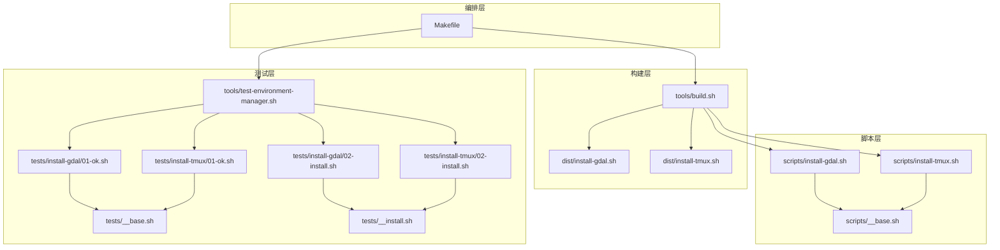
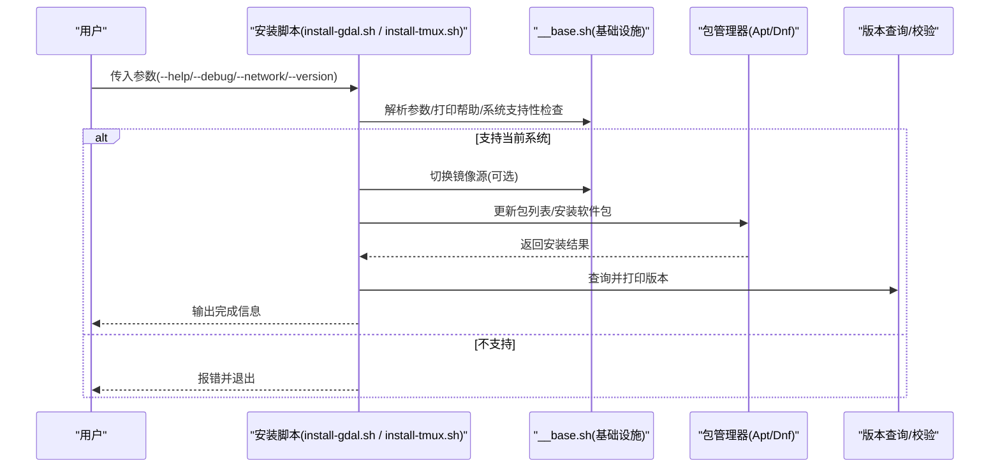
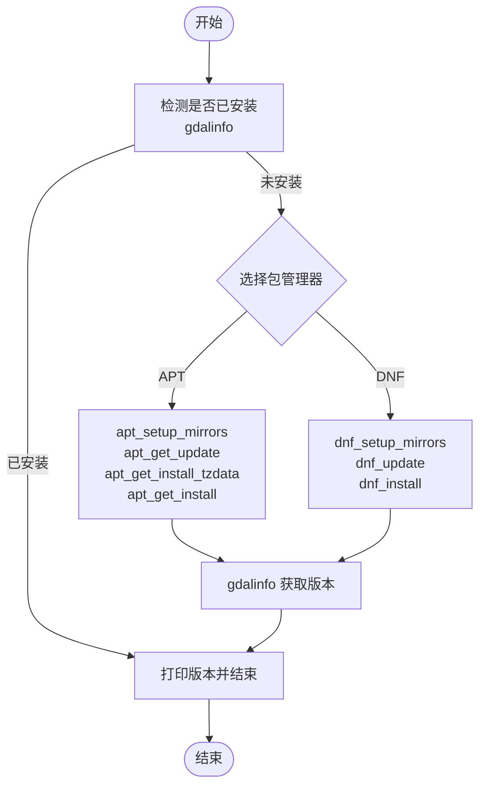
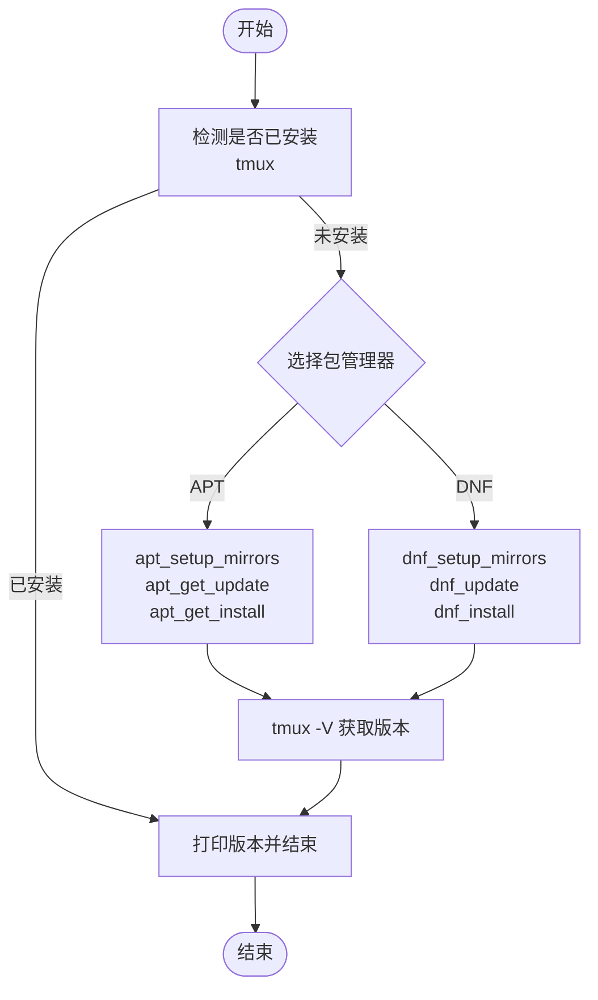
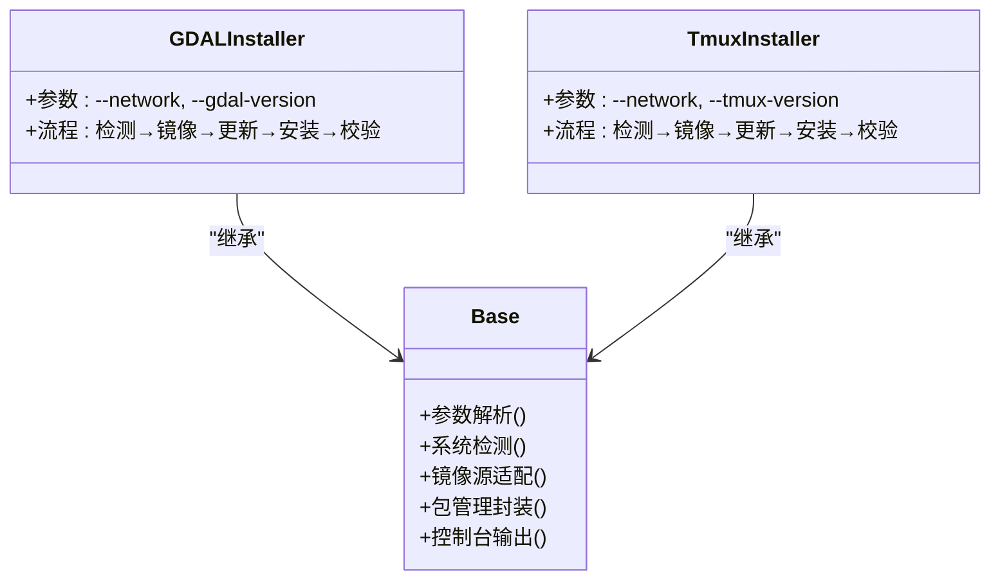
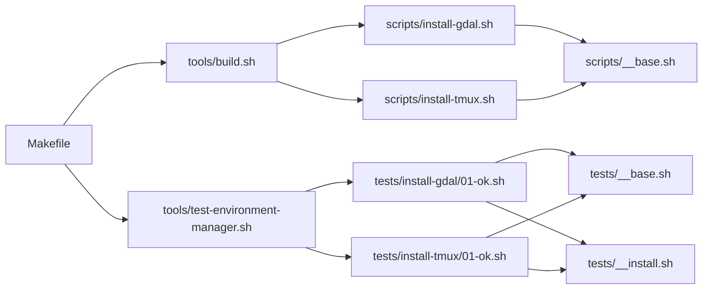

# 开发工具安装

<cite>
**本文档引用的文件**
- [install-gdal.sh](file://scripts/install-gdal.sh)
- [install-tmux.sh](file://scripts/install-tmux.sh)
- [__base.sh](file://scripts/__base.sh)
- [01-ok.sh](file://tests/install-gdal/01-ok.sh)
- [02-install.sh](file://tests/install-gdal/02-install.sh)
- [01-ok.sh](file://tests/install-tmux/01-ok.sh)
- [02-install.sh](file://tests/install-tmux/02-install.sh)
- [Makefile](file://Makefile)
- [build.sh](file://tools/build.sh)
- [test-environment-manager.sh](file://tools/test-environment-manager.sh)
- [__install.sh](file://tests/__install.sh)
- [__base.sh](file://tests/__base.sh)
- [install-gdal.sh](file://dist/install-gdal.sh)
- [install-tmux.sh](file://dist/install-tmux.sh)
</cite>

## 目录
1. [简介](#简介)
2. [项目结构](#项目结构)
3. [核心组件](#核心组件)
4. [架构总览](#架构总览)
5. [详细组件分析](#详细组件分析)
6. [依赖关系分析](#依赖关系分析)
7. [性能考量](#性能考量)
8. [故障排除指南](#故障排除指南)
9. [结论](#结论)
10. [附录](#附录)

## 简介
本文件系统化梳理开发工具安装模块，重点解析 GDAL 与 tmux 的安装脚本实现，涵盖安装流程、编译依赖、配置选项、使用场景、版本兼容性与网络环境适配。同时提供测试验证方法、常见问题排查与性能优化建议，帮助在不同操作系统环境下稳定部署开发工具。

## 项目结构
该模块采用“脚本分层 + 统一基座 + 构建合并 + 多环境测试”的组织方式：
- 脚本层：各工具独立安装脚本位于 scripts/ 目录，统一继承 __base.sh 提供的参数解析、系统检测、安装器封装等能力。
- 基础层：__base.sh 定义了参数解析、系统信息识别、控制台输出、APT/DNF 包管理封装、镜像源切换等功能。
- 构建层：tools/build.sh 将 scripts/ 下脚本与其依赖合并到 dist/，便于分发与执行。
- 测试层：tests/ 下按工具划分目录，包含基础功能测试与安装后验证测试；通过 Makefile 与 test-environment-manager.sh 在多容器环境中批量验证。

图表来源
- [install-gdal.sh](file://scripts/install-gdal.sh)
- [install-tmux.sh](file://scripts/install-tmux.sh)
- [__base.sh](file://scripts/__base.sh)
- [build.sh](file://tools/build.sh)
- [install-gdal.sh](file://dist/install-gdal.sh)
- [install-tmux.sh](file://dist/install-tmux.sh)
- [01-ok.sh](file://tests/install-gdal/01-ok.sh)
- [02-install.sh](file://tests/install-gdal/02-install.sh)
- [01-ok.sh](file://tests/install-tmux/01-ok.sh)
- [02-install.sh](file://tests/install-tmux/02-install.sh)
- [test-environment-manager.sh](file://tools/test-environment-manager.sh)
- [Makefile](file://Makefile)

章节来源
- [Makefile](file://Makefile)
- [build.sh](file://tools/build.sh)

## 核心组件
- 参数解析与帮助系统：支持长参数与短参数、默认值、帮助输出与系统支持性检查。
- 系统检测与安装器选择：自动识别 Ubuntu/Debian/Fedora/RedHat/AlibabaCloudLinux 并选择 APT 或 DNF。
- 镜像源适配：针对中国网络环境提供华为云镜像替换策略，确保包列表与安装稳定。
- 安装流程封装：统一的 apt_get_install/dnf_install 流程，支持指定版本与可用版本校验。
- 控制台输出：带时间统计的进度提示、彩色输出、调试模式开关。
- 测试框架：统一的断言、环境清理、多容器测试编排与汇总报告。

章节来源
- [__base.sh](file://scripts/__base.sh)
- [__base.sh](file://scripts/__base.sh)
- [__base.sh](file://scripts/__base.sh)
- [__base.sh](file://scripts/__base.sh)

## 架构总览
GDAL 与 tmux 安装脚本共享同一套基础设施，遵循“参数解析 → 系统检测 → 网络适配 → 包管理 → 版本选择 → 校验输出”的通用流程。

图表来源
- [install-gdal.sh](file://scripts/install-gdal.sh)
- [install-tmux.sh](file://scripts/install-tmux.sh)
- [__base.sh](file://scripts/__base.sh)

## 详细组件分析

### GDAL 安装组件分析
- 支持系统：Ubuntu 20.04/22.04/24.04、Debian 11.9/12.2（注释中包含 Fedora/RedHat 计划项）。
- 关键参数：
  - --help/-h：显示帮助。
  - --debug：启用调试输出。
  - --network：网络环境（如 in-china）。
  - --gdal-version：指定 GDAL 版本，默认为可用最新。
- 安装流程要点：
  - 若已存在 gdalinfo 命令则跳过安装。
  - APT 路径：apt_setup_mirrors → apt_get_update → apt_get_install_tzdata → apt_get_install。
  - DNF 路径：dnf_setup_mirrors → dnf_update → dnf_install（当前未启用）。
  - 安装完成后调用 gdalinfo 获取版本并打印。
- 版本兼容性：
  - 通过 apt-cache madison 查询可用版本，若指定版本不可用则列出支持列表并退出。

图表来源
- [install-gdal.sh](file://scripts/install-gdal.sh)
- [__base.sh](file://scripts/__base.sh)

章节来源
- [install-gdal.sh](file://scripts/install-gdal.sh)
- [__base.sh](file://scripts/__base.sh)

### tmux 安装组件分析
- 支持系统：Ubuntu 20.04/22.04/24.04、Debian 11.9/12.2、Fedora 41（注释中包含 RedHat 计划项）。
- 关键参数：
  - --help/-h：显示帮助。
  - --debug：启用调试输出。
  - --network：网络环境（如 in-china）。
  - --tmux-version：指定 tmux 版本，默认为可用最新。
- 安装流程要点：
  - 若已存在 tmux 命令则跳过安装。
  - APT 路径：apt_setup_mirrors → apt_get_update → apt_get_install。
  - DNF 路径：dnf_setup_mirrors → dnf_update → dnf_install。
  - 安装完成后调用 tmux -V 获取版本并打印。

图表来源
- [install-tmux.sh](file://scripts/install-tmux.sh)
- [__base.sh](file://scripts/__base.sh)

章节来源
- [install-tmux.sh](file://scripts/install-tmux.sh)
- [__base.sh](file://scripts/__base.sh)

### 基础设施组件分析
- 参数解析：
  - 支持 --name=value、--name、-n 等多种形式。
  - 默认参数与帮助输出统一格式化展示。
- 系统检测：
  - 从 /etc/os-release 或 uname 读取系统名、版本、架构。
  - 自动判断 Ubuntu/Debian 使用 APT，Fedora/RedHat/AlibabaCloudLinux 使用 DNF。
- 镜像源适配：
  - APT：根据 Ubuntu/Debian 版本生成完整 sources.list 并禁用 sources.list.d 中的其他源。
  - DNF：Fedora 使用华为云镜像；RedHat 通过 EPEL 仓库适配。
- 包管理封装：
  - apt_get_install：支持指定版本或默认最新版本，失败时列出可用版本。
  - dnf_install：支持指定版本或默认最新版本。
- 控制台输出：
  - 彩色日志、时间统计、调试模式、错误堆栈简化输出。
- 构建与分发：
  - build.sh 合并脚本与依赖，生成 dist/ 下可直接运行的单文件脚本。

图表来源
- [__base.sh](file://scripts/__base.sh)
- [install-gdal.sh](file://scripts/install-gdal.sh)
- [install-tmux.sh](file://scripts/install-tmux.sh)

章节来源
- [__base.sh](file://scripts/__base.sh)
- [build.sh](file://tools/build.sh)

## 依赖关系分析
- 脚本依赖：
  - install-gdal.sh 与 install-tmux.sh 均依赖 __base.sh 提供的统一能力。
  - dist/ 下的合并脚本保留了原脚本的依赖导入注释，便于追溯。
- 测试依赖：
  - 测试脚本依赖 tests/__base.sh 与 tests/__install.sh 提供断言与执行封装。
  - test-environment-manager.sh 通过 docker-compose 在多镜像环境中运行测试。
- 构建依赖：
  - Makefile 提供一键构建与测试命令，串联 build.sh 与 test-environment-manager.sh。

图表来源
- [install-gdal.sh](file://scripts/install-gdal.sh)
- [install-tmux.sh](file://scripts/install-tmux.sh)
- [__base.sh](file://scripts/__base.sh)
- [build.sh](file://tools/build.sh)
- [01-ok.sh](file://tests/install-gdal/01-ok.sh)
- [01-ok.sh](file://tests/install-tmux/01-ok.sh)
- [__install.sh](file://tests/__install.sh)
- [test-environment-manager.sh](file://tools/test-environment-manager.sh)
- [Makefile](file://Makefile)

章节来源
- [Makefile](file://Makefile)
- [build.sh](file://tools/build.sh)
- [test-environment-manager.sh](file://tools/test-environment-manager.sh)

## 性能考量
- 网络与镜像：
  - 在中国网络环境下使用华为云镜像可显著提升包列表同步与下载速度，减少超时重试。
  - APT 模式下完全替换 sources.list 并禁用 sources.list.d，避免混合源导致的解析冲突。
- 缓存与重复安装：
  - DNF 环境可通过 keepcache 配置保留缓存，减少重复拉取镜像与包的时间。
  - 测试前清理 docker-clean 禁用策略，避免缓存失效导致的额外开销。
- 并行与批处理：
  - Makefile 提供 install-test-all 等批量测试目标，结合 docker-compose 并行执行，缩短整体验证周期。
- 调试与可观测性：
  - --debug 模式输出详细步骤与耗时，便于定位慢点与异常路径。

[本节为通用指导，无需特定文件引用]

## 故障排除指南
- 系统不受支持：
  - 现象：脚本直接退出并提示不支持当前操作系统。
  - 排查：确认 SUPPORT_OS_LIST 是否包含当前系统（名称/版本/架构），必要时扩展支持范围。
- 网络超时或镜像不可达：
  - 现象：apt/dnf 更新或安装阶段卡住或失败。
  - 排查：使用 --network=in-china 切换华为云镜像；检查本地 DNS 与代理设置。
- 指定版本不存在：
  - 现象：apt_get_install 报告指定版本不可用并列出支持版本。
  - 排查：更换 --gdal-version/--tmux-version 为可用版本号，或留空使用默认最新。
- 权限不足：
  - 现象：sudo 提示权限被拒绝。
  - 排查：确保以具备 sudo 权限的用户执行；检查 sudoers 配置。
- 命令未找到：
  - 现象：安装后仍无法执行 gdalinfo/tmux。
  - 排查：手动刷新 PATH 或重启终端；确认安装路径已加入 PATH。
- 测试失败：
  - 现象：测试断言失败或环境跳过。
  - 排查：查看 logs/ 下日志文件；使用 OUTPUT 指定输出目录以便复盘；确认容器镜像与网络配置。

章节来源
- [__base.sh](file://scripts/__base.sh)
- [__install.sh](file://tests/__install.sh)
- [Makefile](file://Makefile)

## 结论
本模块通过统一的基础设施与标准化的安装流程，实现了 GDAL 与 tmux 在多发行版与多架构下的稳定安装。配合构建与测试体系，能够在不同网络环境下快速验证安装效果。建议在生产环境中优先使用华为云镜像与 keepcache 策略，在测试环境中利用 Makefile 的批量目标加速回归。

[本节为总结性内容，无需特定文件引用]

## 附录

### 安装示例与最佳实践
- 基础安装（默认网络，最新版本）
  - GDAL：bash dist/install-gdal.sh
  - tmux：bash dist/install-tmux.sh
- 指定网络与版本
  - GDAL：bash dist/install-gdal.sh --network=in-china --gdal-version=3.6.4
  - tmux：bash dist/install-tmux.sh --network=in-china --tmux-version=3.3a
- 调试模式
  - 添加 --debug 查看详细步骤与耗时

### 测试执行示例
- 构建脚本与镜像
  - make build
- 全量安装测试（多环境）
  - make install-test-all NETWORK=in-china DEBUG=true
- 单工具全环境测试
  - make install-test-all-env SCRIPT=gdal NETWORK=in-china
- 单环境全工具测试
  - make install-test-all-script ENV=ubuntu22-04 NETWORK=in-china
- 单文件测试
  - make install-test-file ENV=ubuntu22-04 FILE=tests/install-gdal/02-install.sh

章节来源
- [Makefile](file://Makefile)
- [test-environment-manager.sh](file://tools/test-environment-manager.sh)
- [02-install.sh](file://tests/install-gdal/02-install.sh)
- [02-install.sh](file://tests/install-tmux/02-install.sh)