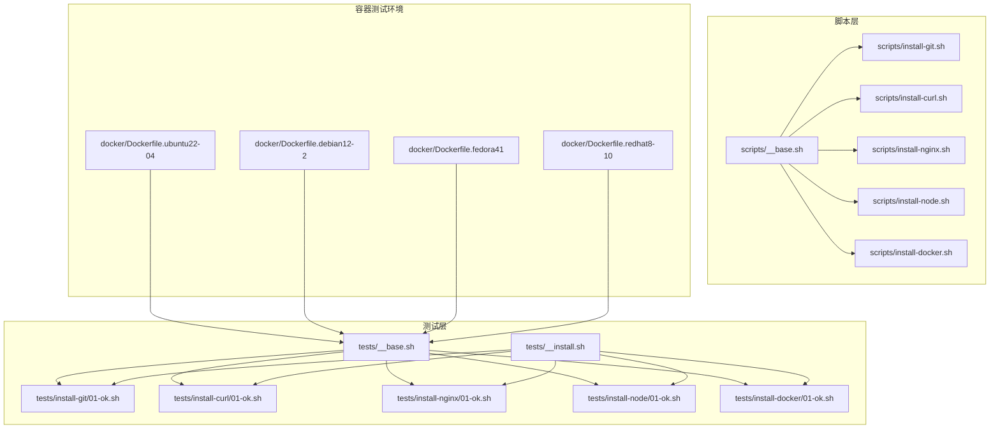
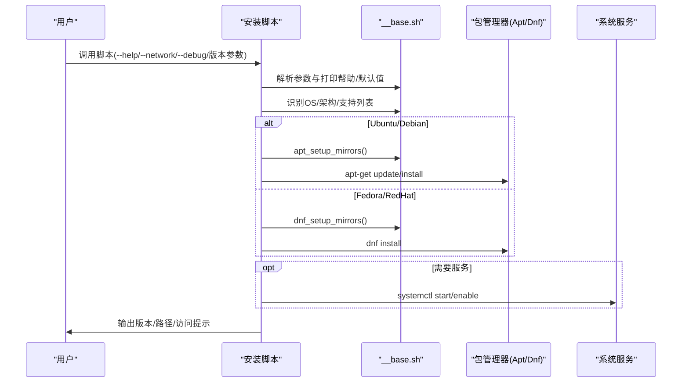
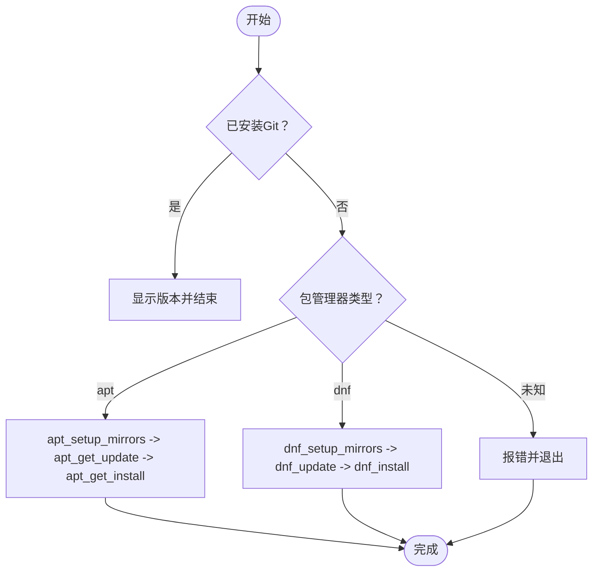
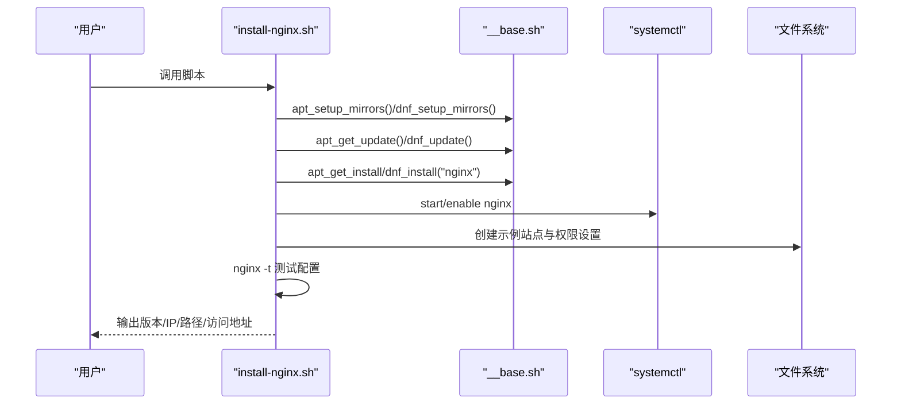
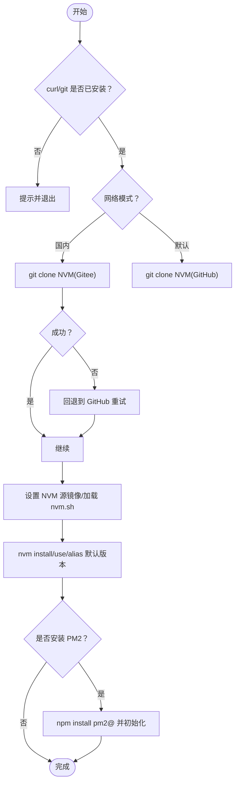
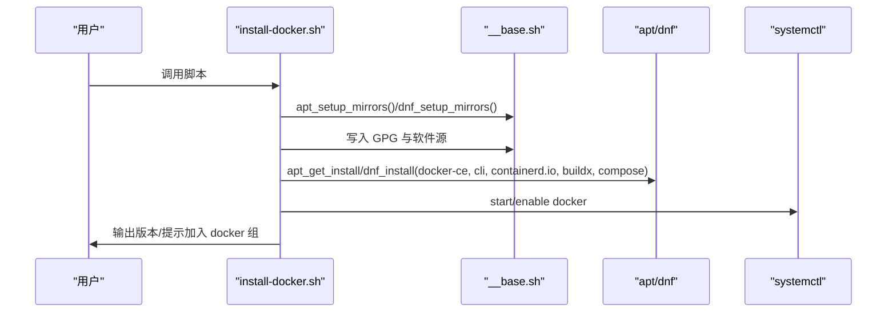
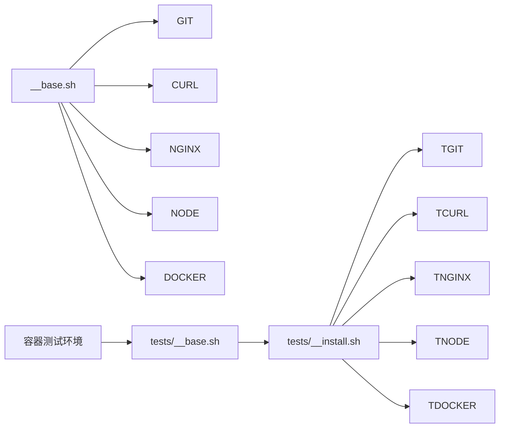

# 系统工具安装

<cite>
**本文引用的文件**
- [scripts/install-git.sh](file://scripts/install-git.sh)
- [scripts/install-curl.sh](file://scripts/install-curl.sh)
- [scripts/install-nginx.sh](file://scripts/install-nginx.sh)
- [scripts/install-node.sh](file://scripts/install-node.sh)
- [scripts/install-docker.sh](file://scripts/install-docker.sh)
- [scripts/__base.sh](file://scripts/__base.sh)
- [tests/install-git/01-ok.sh](file://tests/install-git/01-ok.sh)
- [tests/install-curl/01-ok.sh](file://tests/install-curl/01-ok.sh)
- [tests/install-nginx/01-ok.sh](file://tests/install-nginx/01-ok.sh)
- [tests/install-node/01-ok.sh](file://tests/install-node/01-ok.sh)
- [tests/install-docker/01-ok.sh](file://tests/install-docker/01-ok.sh)
- [tests/__base.sh](file://tests/__base.sh)
- [tests/__install.sh](file://tests/__install.sh)
- [docker/Dockerfile.ubuntu22-04](file://docker/Dockerfile.ubuntu22-04)
- [docker/Dockerfile.debian12-2](file://docker/Dockerfile.debian12-2)
- [docker/Dockerfile.fedora41](file://docker/Dockerfile.fedora41)
- [docker/Dockerfile.redhat8-10](file://docker/Dockerfile.redhat8-10)
</cite>

## 目录
1. [简介](#简介)
2. [项目结构](#项目结构)
3. [核心组件](#核心组件)
4. [架构总览](#架构总览)
5. [详细组件分析](#详细组件分析)
6. [依赖分析](#依赖分析)
7. [性能考虑](#性能考虑)
8. [故障排除指南](#故障排除指南)
9. [结论](#结论)
10. [附录](#附录)

## 简介
本文件面向系统工具安装模块，围绕 Git、Curl、Nginx、Node.js 与 Docker 的安装脚本进行深入解析。内容涵盖安装流程、依赖关系、版本兼容性、配置选项、使用示例、错误处理与故障排除、性能优化与最佳实践，以及针对不同 Linux 发行版（Ubuntu、Debian、Fedora、RedHat）的安装策略选择。

## 项目结构
该仓库采用“按功能分层”的组织方式：
- scripts：各工具安装脚本与通用基础库
- tests：单元测试与安装测试套件
- docker：多发行版容器化测试环境
- dist：构建产物目录（测试时指向 dist 下脚本）

图表来源
- [scripts/__base.sh:1-1252](file://scripts/__base.sh#L1-L1252)
- [scripts/install-git.sh:1-85](file://scripts/install-git.sh#L1-L85)
- [scripts/install-curl.sh:1-84](file://scripts/install-curl.sh#L1-L84)
- [scripts/install-nginx.sh:1-198](file://scripts/install-nginx.sh#L1-L198)
- [scripts/install-node.sh:1-202](file://scripts/install-node.sh#L1-L202)
- [scripts/install-docker.sh:1-217](file://scripts/install-docker.sh#L1-L217)
- [tests/__base.sh:1-464](file://tests/__base.sh#L1-L464)
- [tests/__install.sh:1-66](file://tests/__install.sh#L1-L66)
- [docker/Dockerfile.ubuntu22-04:1-33](file://docker/Dockerfile.ubuntu22-04#L1-L33)
- [docker/Dockerfile.debian12-2:1-34](file://docker/Dockerfile.debian12-2#L1-L34)
- [docker/Dockerfile.fedora41:1-30](file://docker/Dockerfile.fedora41#L1-L30)
- [docker/Dockerfile.redhat8-10:1-31](file://docker/Dockerfile.redhat8-10#L1-L31)

章节来源
- [scripts/__base.sh:1-1252](file://scripts/__base.sh#L1-L1252)
- [scripts/install-git.sh:1-85](file://scripts/install-git.sh#L1-L85)
- [scripts/install-curl.sh:1-84](file://scripts/install-curl.sh#L1-L84)
- [scripts/install-nginx.sh:1-198](file://scripts/install-nginx.sh#L1-L198)
- [scripts/install-node.sh:1-202](file://scripts/install-node.sh#L1-L202)
- [scripts/install-docker.sh:1-217](file://scripts/install-docker.sh#L1-L217)
- [tests/__base.sh:1-464](file://tests/__base.sh#L1-L464)
- [tests/__install.sh:1-66](file://tests/__install.sh#L1-L66)
- [docker/Dockerfile.ubuntu22-04:1-33](file://docker/Dockerfile.ubuntu22-04#L1-L33)
- [docker/Dockerfile.debian12-2:1-34](file://docker/Dockerfile.debian12-2#L1-L34)
- [docker/Dockerfile.fedora41:1-30](file://docker/Dockerfile.fedora41#L1-L30)
- [docker/Dockerfile.redhat8-10:1-31](file://docker/Dockerfile.redhat8-10#L1-L31)

## 核心组件
- 通用基础库（参数解析、操作系统识别、安装器封装、日志输出等）
- 各工具安装脚本（Git、Curl、Nginx、Node.js、Docker）
- 测试框架（基础测试与安装测试）
- 容器化测试环境（多发行版）

章节来源
- [scripts/__base.sh:1-1252](file://scripts/__base.sh#L1-L1252)
- [tests/__base.sh:1-464](file://tests/__base.sh#L1-L464)
- [tests/__install.sh:1-66](file://tests/__install.sh#L1-L66)

## 架构总览
安装脚本通过统一的基础库完成以下工作：
- 解析参数与帮助信息
- 识别当前操作系统与架构
- 选择合适的包管理器策略（apt 或 dnf）
- 针对国内网络环境切换镜像源
- 执行安装、服务启动与基本配置
- 输出版本信息与关键路径

图表来源
- [scripts/__base.sh:827-1166](file://scripts/__base.sh#L827-L1166)
- [scripts/install-git.sh:44-77](file://scripts/install-git.sh#L44-L77)
- [scripts/install-curl.sh:44-76](file://scripts/install-curl.sh#L44-L76)
- [scripts/install-nginx.sh:45-90](file://scripts/install-nginx.sh#L45-L90)
- [scripts/install-node.sh:70-185](file://scripts/install-node.sh#L70-L185)
- [scripts/install-docker.sh:45-191](file://scripts/install-docker.sh#L45-L191)

## 详细组件分析

### Git 安装模块
- 支持版本：Ubuntu 20.04/22.04/24.04、Debian 11.9/12.2、Fedora 41、RedHat 8.10/9.6
- 关键特性
  - 参数：--network（国内镜像）、--git-version（指定版本或默认最新）
  - 自动判断已安装：若已存在则跳过安装
  - 国内网络自动切换镜像源
  - 统一 apt/dnf 安装流程
- 版本兼容性
  - 使用 apt-cache madison 查询可用版本；未找到版本时报错并列出支持版本
- 配置选项
  - --git-version 可选具体版本号
  - --network=in-china 切换镜像
- 使用示例
  - 基本安装：./dist/install-git.sh
  - 指定版本：./dist/install-git.sh --git-version=1:2.34.5-0ubuntu1
  - 国内网络：./dist/install-git.sh --network=in-china
- 错误处理
  - 不支持的 OS：直接退出
  - 指定版本不存在：列出可用版本并退出
- 性能与最佳实践
  - 国内网络优先使用镜像源
  - 复用已安装版本可避免重复下载

图表来源
- [scripts/install-git.sh:41-77](file://scripts/install-git.sh#L41-L77)
- [scripts/__base.sh:828-908](file://scripts/__base.sh#L828-L908)
- [scripts/__base.sh:1077-1166](file://scripts/__base.sh#L1077-L1166)

章节来源
- [scripts/install-git.sh:1-85](file://scripts/install-git.sh#L1-L85)
- [scripts/__base.sh:827-1166](file://scripts/__base.sh#L827-L1166)

### Curl 安装模块
- 支持版本：同 Git
- 关键特性
  - 参数：--network、--curl-version
  - 已安装检测与镜像源切换
  - 统一安装流程
- 使用示例
  - ./dist/install-curl.sh --network=in-china --curl-version=7.88.1-1ubuntu2.16
- 错误处理
  - 不支持 OS 直接退出
  - 指定版本不存在列出支持版本

章节来源
- [scripts/install-curl.sh:1-84](file://scripts/install-curl.sh#L1-L84)
- [scripts/__base.sh:827-1166](file://scripts/__base.sh#L827-L1166)

### Nginx 安装模块
- 支持版本：同上
- 关键特性
  - 参数：--network、--nginx-version、--skip-firewall（注释掉的防火墙配置）
  - 安装后自动设置时区（tzdata），启动并启用服务
  - 创建示例站点页面（/var/www/html/index.html），设置权限
  - 配置测试与版本信息展示
  - 输出本地访问地址与关键路径
- 使用示例
  - ./dist/install-nginx.sh --network=in-china
  - ./dist/install-nginx.sh --nginx-version=1.24.0-0ubuntu1
- 错误处理
  - 不支持 OS 直接退出
  - 配置测试失败给出提示
- 最佳实践
  - 安装后执行 nginx -t 检查配置
  - 访问 http://<本机IP> 查看示例页

图表来源
- [scripts/install-nginx.sh:45-197](file://scripts/install-nginx.sh#L45-L197)
- [scripts/__base.sh:827-1166](file://scripts/__base.sh#L827-L1166)

章节来源
- [scripts/install-nginx.sh:1-198](file://scripts/install-nginx.sh#L1-L198)
- [scripts/__base.sh:827-1166](file://scripts/__base.sh#L827-L1166)

### Node.js 安装模块
- 支持版本：Ubuntu/Debian/Fedora/RedHat
- 关键特性
  - 依赖：必须先安装 curl 与 git
  - 支持 NVM（国内使用 Gitee 镜像克隆）
  - 设置 NVM 源镜像（国内使用 npmmirror、iojs 镜像）
  - 安装指定 Node.js 版本并设为默认
  - 可选安装 PM2 与 pm2-logrotate，设置最大日志大小
  - 输出版本信息与使用提示
- 参数
  - --network、--nvm-version、--node-version、--pm2-version、--skip-pm2
- 使用示例
  - ./dist/install-node.sh --network=in-china --node-version=v18.20.3
  - ./dist/install-node.sh --skip-pm2=true
- 错误处理
  - 未安装 curl/git 直接退出
  - NVM 克隆失败回退到默认仓库重试
- 最佳实践
  - 安装后 source ~/.bashrc 或 ~/.zshrc 以生效 NVM
  - 国内网络建议开启 NPM 镜像

图表来源
- [scripts/install-node.sh:49-185](file://scripts/install-node.sh#L49-L185)
- [scripts/__base.sh:1168-1236](file://scripts/__base.sh#L1168-L1236)

章节来源
- [scripts/install-node.sh:1-202](file://scripts/install-node.sh#L1-L202)
- [scripts/__base.sh:1168-1236](file://scripts/__base.sh#L1168-L1236)

### Docker 安装模块
- 支持版本：Ubuntu 20.04/22.04/24.04、Debian 11.9/12.2、Fedora 41、RedHat 8.10/9.6
- 关键特性
  - 依赖：Ubuntu/Debian 需要 ca-certificates；Fedora/RedHat 需要 rpm 包含 ca-certificates
  - 国内镜像源：Huawei Cloud；默认官方源
  - GPG 密钥与软件源写入（apt/dnf）
  - 安装 docker-ce、docker-ce-cli、containerd.io、buildx、compose 插件
  - 启动并启用服务，加入 docker 组
  - 输出版本信息
- 参数
  - --network、--docker-version、--compose-version
- 使用示例
  - ./dist/install-docker.sh --network=in-china
  - ./dist/install-docker.sh --docker-version=5:27.4.0-1~ubuntu.24.04~ppa.1
- 错误处理
  - 不支持 OS 直接退出
  - 依赖缺失提示先安装
- 最佳实践
  - 登出重登使 docker 组变更生效
  - 使用 docker compose version 验证 Compose 插件

图表来源
- [scripts/install-docker.sh:45-191](file://scripts/install-docker.sh#L45-L191)
- [scripts/__base.sh:827-1166](file://scripts/__base.sh#L827-L1166)

章节来源
- [scripts/install-docker.sh:1-217](file://scripts/install-docker.sh#L1-L217)
- [scripts/__base.sh:827-1166](file://scripts/__base.sh#L827-L1166)

## 依赖分析
- 跨脚本依赖
  - 所有工具安装脚本均依赖 __base.sh 提供的参数解析、OS 识别、包管理器封装、镜像源切换、日志输出等能力
- 发行版策略
  - Ubuntu/Debian：apt 路径（apt_setup_mirrors、apt_get_install 等）
  - Fedora/RedHat：dnf 路径（dnf_setup_mirrors、dnf_install 等）
- 测试依赖
  - tests/__base.sh 提供断言、测试环境初始化、汇总报告
  - tests/__install.sh 提供安装脚本运行与结果断言

图表来源
- [scripts/__base.sh:1-1252](file://scripts/__base.sh#L1-L1252)
- [tests/__base.sh:1-464](file://tests/__base.sh#L1-L464)
- [tests/__install.sh:1-66](file://tests/__install.sh#L1-L66)
- [docker/Dockerfile.ubuntu22-04:1-33](file://docker/Dockerfile.ubuntu22-04#L1-L33)
- [docker/Dockerfile.debian12-2:1-34](file://docker/Dockerfile.debian12-2#L1-L34)
- [docker/Dockerfile.fedora41:1-30](file://docker/Dockerfile.fedora41#L1-L30)
- [docker/Dockerfile.redhat8-10:1-31](file://docker/Dockerfile.redhat8-10#L1-L31)

章节来源
- [scripts/__base.sh:1-1252](file://scripts/__base.sh#L1-L1252)
- [tests/__base.sh:1-464](file://tests/__base.sh#L1-L464)
- [tests/__install.sh:1-66](file://tests/__install.sh#L1-L66)

## 性能考虑
- 镜像源优化
  - 国内网络使用华为云镜像（apt/dnf），显著提升下载速度
- 缓存与更新
  - apt 使用 update；dnf 使用 makecache，减少后续查询开销
- 版本锁定
  - 通过 --<tool>-version 指定版本，便于复现与一致性
- 日志输出控制
  - --debug=false 时重定向输出至 /dev/null，降低 I/O 开销
- Docker 缓存保留
  - 在 Fedora/RedHat 环境下设置 keepcache=1，避免频繁清理缓存影响性能

章节来源
- [scripts/__base.sh:827-1236](file://scripts/__base.sh#L827-L1236)

## 故障排除指南
- 常见问题
  - 不支持的操作系统：确认 SUPPORT_OS_LIST 中是否存在当前版本组合
  - 依赖缺失：如 Docker 安装前需确保 ca-certificates 已安装
  - 指定版本不存在：使用 apt-cache madison 或 dnf list 可见版本列表
  - 权限不足：需要 sudo 权限执行安装与服务管理
  - 网络超时：切换 --network=in-china 或检查代理
- 排查步骤
  - 使用 --help 查看参数与默认值
  - 使用 --debug 获取详细输出
  - 分步验证：apt/dnf 更新、镜像源写入、安装命令
  - 对于 Docker：检查 GPG 密钥与软件源文件是否存在
- 单元测试辅助
  - tests/install-*/01-ok.sh 验证脚本语法、帮助输出与支持性
  - tests/__install.sh 提供安装执行与结果断言

章节来源
- [scripts/install-docker.sh:45-191](file://scripts/install-docker.sh#L45-L191)
- [scripts/__base.sh:827-1166](file://scripts/__base.sh#L827-L1166)
- [tests/install-git/01-ok.sh:1-25](file://tests/install-git/01-ok.sh#L1-L25)
- [tests/install-curl/01-ok.sh:1-25](file://tests/install-curl/01-ok.sh#L1-L25)
- [tests/install-nginx/01-ok.sh:1-25](file://tests/install-nginx/01-ok.sh#L1-L25)
- [tests/install-node/01-ok.sh:1-25](file://tests/install-node/01-ok.sh#L1-L25)
- [tests/install-docker/01-ok.sh:1-25](file://tests/install-docker/01-ok.sh#L1-L25)
- [tests/__install.sh:1-66](file://tests/__install.sh#L1-L66)

## 结论
本模块通过统一的基础库抽象了参数解析、OS 识别与包管理器操作，实现了对 Git、Curl、Nginx、Node.js、Docker 的一致化安装体验。结合镜像源切换、版本锁定与服务管理，既保证了跨发行版的兼容性，也兼顾了国内用户的网络效率。配合完善的测试体系与容器化环境，能够稳定地支撑开发与部署场景。

## 附录

### 参数与配置选项速查
- 通用参数
  - --help/-h：打印帮助
  - --debug：打印调试输出
  - --network：in-china 使用国内镜像
- 工具特定参数
  - Git：--git-version
  - Curl：--curl-version
  - Nginx：--nginx-version
  - Node.js：--nvm-version、--node-version、--pm2-version、--skip-pm2
  - Docker：--docker-version、--compose-version

章节来源
- [scripts/install-git.sh:7-14](file://scripts/install-git.sh#L7-L14)
- [scripts/install-curl.sh:7-14](file://scripts/install-curl.sh#L7-L14)
- [scripts/install-nginx.sh:7-14](file://scripts/install-nginx.sh#L7-L14)
- [scripts/install-node.sh:7-17](file://scripts/install-node.sh#L7-L17)
- [scripts/install-docker.sh:7-14](file://scripts/install-docker.sh#L7-L14)

### 使用示例（路径参考）
- Git：./dist/install-git.sh --network=in-china --git-version=...
- Curl：./dist/install-curl.sh --network=in-china --curl-version=...
- Nginx：./dist/install-nginx.sh --network=in-china --nginx-version=...
- Node.js：./dist/install-node.sh --network=in-china --node-version=v18.20.3 --skip-pm2=false
- Docker：./dist/install-docker.sh --network=in-china --docker-version=...

章节来源
- [scripts/install-git.sh:34-35](file://scripts/install-git.sh#L34-L35)
- [scripts/install-curl.sh:34-35](file://scripts/install-curl.sh#L34-L35)
- [scripts/install-nginx.sh:34-36](file://scripts/install-nginx.sh#L34-L36)
- [scripts/install-node.sh:37-41](file://scripts/install-node.sh#L37-L41)
- [scripts/install-docker.sh:34-36](file://scripts/install-docker.sh#L34-L36)

### 面向不同发行版的安装策略
- Ubuntu/Debian
  - 使用 apt：apt_setup_mirrors、apt_get_update、apt_get_install
  - 国内镜像：替换 sources.list 并禁用 sources.list.d 下其他源
- Fedora/RedHat
  - 使用 dnf：dnf_setup_mirrors、dnf_update、dnf_install
  - 国内镜像：写入 epel.repo 与 Fedora 主仓库镜像
- Alpine/其他
  - 当前脚本未覆盖，如需支持可扩展 dnf_* 与 apt_* 函数族

章节来源
- [scripts/__base.sh:827-1166](file://scripts/__base.sh#L827-L1166)