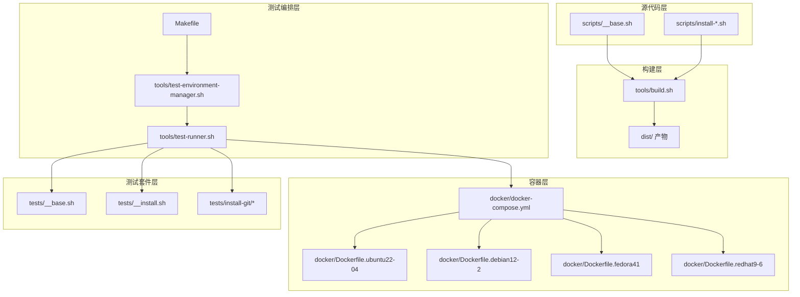
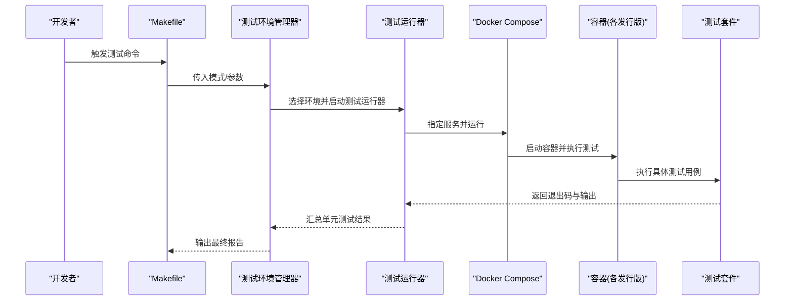
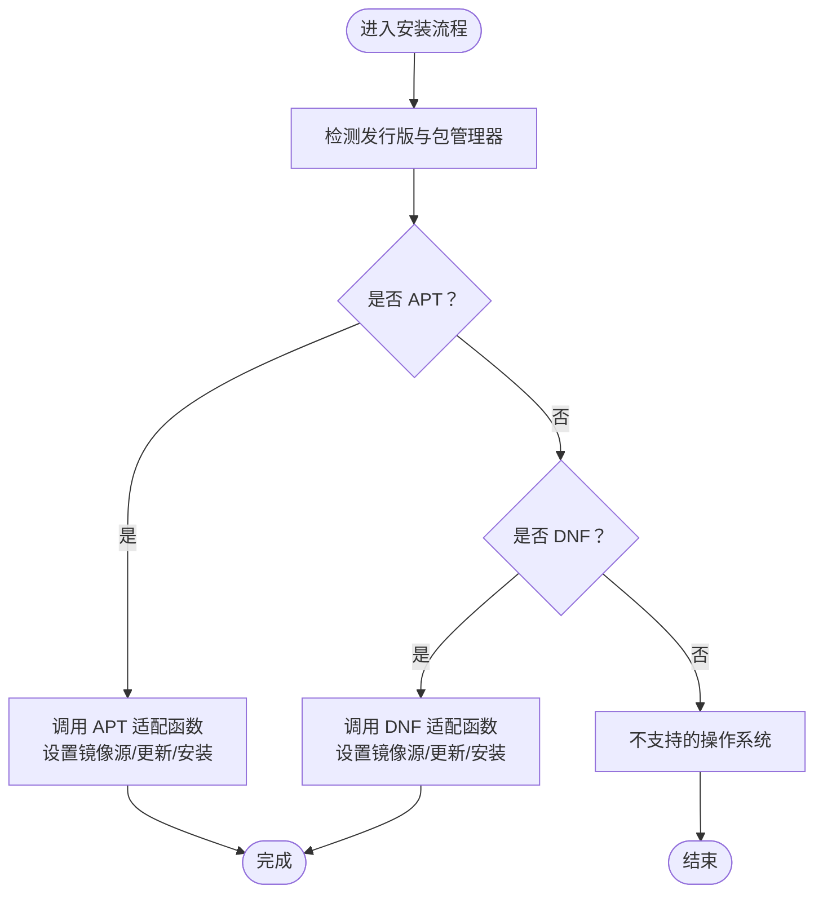
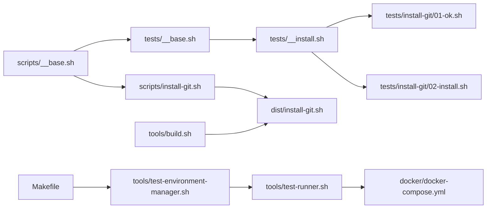

# Linux 发行版支持

<cite>
**本文引用的文件**
- [README.md](file://README.md)
- [docs/README.zh-CN.md](file://docs/README.zh-CN.md)
- [Makefile](file://Makefile)
- [docker/docker-compose.yml](file://docker/docker-compose.yml)
- [scripts/__base.sh](file://scripts/__base.sh)
- [scripts/install-git.sh](file://scripts/install-git.sh)
- [tools/build.sh](file://tools/build.sh)
- [tools/test-environment-manager.sh](file://tools/test-environment-manager.sh)
- [tools/test-runner.sh](file://tools/test-runner.sh)
- [docker/Dockerfile.ubuntu22-04](file://docker/Dockerfile.ubuntu22-04)
- [tests/__base.sh](file://tests/__base.sh)
- [tests/__install.sh](file://tests/__install.sh)
- [tests/__syncdb.sh](file://tests/__syncdb.sh)
- [tests/install-git/01-ok.sh](file://tests/install-git/01-ok.sh)
- [tests/install-git/02-install.sh](file://tests/install-git/02-install.sh)
</cite>

## 目录
1. [简介](#简介)
2. [项目结构](#项目结构)
3. [核心组件](#核心组件)
4. [架构总览](#架构总览)
5. [详细组件分析](#详细组件分析)
6. [依赖关系分析](#依赖关系分析)
7. [性能考虑](#性能考虑)
8. [故障排查指南](#故障排查指南)
9. [结论](#结论)
10. [附录](#附录)

## 简介
本指南面向为新的 Linux 发行版添加支持的开发者，基于仓库现有的脚本体系、Docker 化测试环境与自动化构建/测试流水线，提供从 Dockerfile 编写规范、包管理器差异适配、镜像源与网络优化，到容器化测试环境配置与验证流程的完整实践路径。读者无需深入掌握每个文件的具体内容，即可按步骤完成新发行版支持的集成与验证。

## 项目结构
仓库采用“源脚本 → 构建 → Docker 测试 → 自动化测试”的分层组织方式：
- scripts/：源脚本与通用基础模块（含操作系统识别、参数解析、包管理器适配等）
- dist/：构建产物（由 tools/build.sh 生成）
- docker/：各发行版的 Dockerfile 与 docker-compose 编排
- tests/：按功能分类的测试套件（install-*/syncdb-*），配合 tests/__*.sh 工具函数
- tools/：构建与测试编排工具（build.sh、test-environment-manager.sh、test-runner.sh）
- docs/：项目文档与测试指南
- Makefile：统一入口，封装构建、镜像构建、测试与清理等常用命令

**图示来源**
- [Makefile:1-563](file://Makefile#L1-L563)
- [tools/build.sh:1-91](file://tools/build.sh#L1-L91)
- [tools/test-environment-manager.sh:1-334](file://tools/test-environment-manager.sh#L1-L334)
- [tools/test-runner.sh:1-156](file://tools/test-runner.sh#L1-L156)
- [docker/docker-compose.yml:1-297](file://docker/docker-compose.yml#L1-L297)
- [docker/Dockerfile.ubuntu22-04:1-33](file://docker/Dockerfile.ubuntu22-04#L1-L33)
- [scripts/__base.sh:1-1252](file://scripts/__base.sh#L1-L1252)
- [scripts/install-git.sh:1-85](file://scripts/install-git.sh#L1-L85)
- [tests/__base.sh:1-464](file://tests/__base.sh#L1-L464)
- [tests/__install.sh:1-66](file://tests/__install.sh#L1-L66)
- [tests/install-git/01-ok.sh:1-25](file://tests/install-git/01-ok.sh#L1-L25)
- [tests/install-git/02-install.sh:1-35](file://tests/install-git/02-install.sh#L1-L35)

**章节来源**
- [docs/README.zh-CN.md:1-128](file://docs/README.zh-CN.md#L1-L128)
- [Makefile:1-563](file://Makefile#L1-L563)

## 核心组件
- 操作系统识别与包管理器适配（scripts/__base.sh）：负责解析发行版信息、判断包管理器类型（apt/dnf）、设置镜像源与网络参数。
- 安装脚本模板（scripts/install-*.sh）：以 Git 安装为例，展示如何在脚本中调用包管理器适配函数与网络参数。
- 构建工具（tools/build.sh）：将 scripts/ 下的源脚本合并为 dist/ 的最终可执行脚本。
- 测试编排（tools/test-environment-manager.sh、tools/test-runner.sh）：统一调度 docker-compose 执行测试，并汇总结果。
- Docker 编排（docker/docker-compose.yml）：定义各发行版容器服务、挂载卷与环境变量。
- 测试工具集（tests/__*.sh）：提供断言、环境清理、镜像拉取快速检查等通用能力。

**章节来源**
- [scripts/__base.sh:80-263](file://scripts/__base.sh#L80-L263)
- [scripts/install-git.sh:1-85](file://scripts/install-git.sh#L1-L85)
- [tools/build.sh:1-91](file://tools/build.sh#L1-L91)
- [tools/test-environment-manager.sh:1-334](file://tools/test-environment-manager.sh#L1-L334)
- [tools/test-runner.sh:1-156](file://tools/test-runner.sh#L1-L156)
- [docker/docker-compose.yml:1-297](file://docker/docker-compose.yml#L1-L297)
- [tests/__base.sh:1-464](file://tests/__base.sh#L1-L464)
- [tests/__install.sh:1-66](file://tests/__install.sh#L1-L66)

## 架构总览
下图展示了从源脚本到容器化测试再到结果汇总的整体流程：

**图示来源**
- [Makefile:84-297](file://Makefile#L84-L297)
- [tools/test-environment-manager.sh:49-159](file://tools/test-environment-manager.sh#L49-L159)
- [tools/test-runner.sh:8-147](file://tools/test-runner.sh#L8-L147)
- [docker/docker-compose.yml:1-297](file://docker/docker-compose.yml#L1-L297)

## 详细组件分析

### 1) Dockerfile 编写规范与配置选项
- 基础镜像与非交互安装
  - Ubuntu/Debian：设置 DEBIAN_FRONTEND=noninteractive，确保 apt 安装不阻塞。
  - Fedora/RHEL：使用 dnf/yum，注意缓存策略与 keepcache 配置（见 tests/__base.sh 中的清理与缓存保留逻辑）。
- 用户与权限
  - 创建 testuser 并赋予 sudo NOPASSWD 权限，便于在容器内执行安装任务。
- 工作目录与挂载
  - WORKDIR 设为 /app，COPY 项目文件；通过 volumes 将宿主机的 dist、scripts、tests、tools 挂载到容器，便于热更新与调试。
- 可执行权限
  - 构建阶段对 dist/*.sh、tests/**/*.sh、tools/test-runner.sh 设置 +x，避免运行时权限问题。
- 默认命令
  - CMD 指向测试运行器，便于一键执行测试或交互式调试。

**章节来源**
- [docker/Dockerfile.ubuntu22-04:1-33](file://docker/Dockerfile.ubuntu22-04#L1-L33)
- [docker/docker-compose.yml:1-297](file://docker/docker-compose.yml#L1-L297)
- [tests/__base.sh:140-201](file://tests/__base.sh#L140-L201)

### 2) 包管理器差异与适配方法
- 发行版识别
  - 通过 /etc/os-release 读取 NAME/VERSION_ID，映射为 Debian/Fedora/RedHat/AlibabaCloudLinux 等内部名称。
- 包管理器判定
  - Ubuntu/Debian 使用 APT；Fedora/RedHat/AlibabaCloudLinux 使用 DNF。
- 镜像源与网络
  - 支持 --network=in-china 参数，自动切换华为云镜像源（APT/DNF），并移除默认源配置以确保一致性。
- 缓存与显示优化
  - Docker 场景下禁用 apt 的 docker-clean 或设置 dnf keepcache，减少重复下载，提升测试效率。

**图示来源**
- [scripts/__base.sh:95-263](file://scripts/__base.sh#L95-L263)
- [tests/__base.sh:140-201](file://tests/__base.sh#L140-L201)

**章节来源**
- [scripts/__base.sh:95-263](file://scripts/__base.sh#L95-L263)
- [tests/__base.sh:140-201](file://tests/__base.sh#L140-L201)

### 3) Docker 容器化测试环境配置与管理
- 服务编排
  - 每个发行版一个 service，指定 platform、dockerfile、volumes、environment、command。
  - 提供带 Docker CE 和 Compose 的 *_docker 服务，用于数据库同步类脚本的端到端测试。
- 交互式环境
  - interactive 服务提供 /bin/bash，便于手动调试与问题定位。
- 清理与日志
  - Makefile 提供 clean、logs、results 等辅助命令，便于维护。

**章节来源**
- [docker/docker-compose.yml:1-297](file://docker/docker-compose.yml#L1-L297)
- [Makefile:534-563](file://Makefile#L534-L563)

### 4) 新发行版支持添加流程
- 步骤一：创建 Dockerfile
  - 参考现有 Dockerfile，设置非交互安装、testuser、工作目录、挂载与可执行权限。
  - 若为 RHEL/CentOS/AlmaLinux 等，注意 dnf 缓存配置。
- 步骤二：在 docker-compose.yml 中新增服务条目
  - 指向新建的 Dockerfile，设置 volumes、environment、command。
- 步骤三：在 Makefile 中补充可用环境列表
  - 在帮助与环境枚举处添加新环境名，确保 make test-* 命令可用。
- 步骤四：编写安装脚本（如需）
  - 复用 scripts/__base.sh 的参数解析与网络适配，参考 scripts/install-git.sh 的模式。
- 步骤五：编写测试用例
  - 在 tests/install-*/ 下新增 01-ok.sh 与 02-install.sh，复用 tests/__base.sh 与 tests/__install.sh 的断言与通用逻辑。
- 步骤六：构建与测试
  - 执行 make build-scripts 生成 dist/ 脚本；执行 make build-images 构建镜像；使用 make test-all 或指定环境测试。

**章节来源**
- [docker/docker-compose.yml:1-297](file://docker/docker-compose.yml#L1-L297)
- [Makefile:42-47](file://Makefile#L42-L47)
- [scripts/install-git.sh:1-85](file://scripts/install-git.sh#L1-L85)
- [tests/install-git/01-ok.sh:1-25](file://tests/install-git/01-ok.sh#L1-L25)
- [tests/install-git/02-install.sh:1-35](file://tests/install-git/02-install.sh#L1-L35)

### 5) 验证新发行版支持是否正常工作
- 单元测试验证
  - 01-ok.sh：校验脚本存在、可执行、语法正确、帮助输出、当前系统支持性。
  - 02-install.sh：实际运行安装脚本，检查命令可用与版本信息。
- 环境管理器汇总
  - test-environment-manager.sh 会遍历 OS_ENVIRONMENTS，记录总用例数、通过数、失败数与耗时。
- 结果查看
  - 使用 make results 查看日志汇总；必要时使用 make interactive 进入交互式容器逐项排查。

**章节来源**
- [tests/install-git/01-ok.sh:1-25](file://tests/install-git/01-ok.sh#L1-L25)
- [tests/install-git/02-install.sh:1-35](file://tests/install-git/02-install.sh#L1-L35)
- [tools/test-environment-manager.sh:184-220](file://tools/test-environment-manager.sh#L184-L220)
- [Makefile:555-563](file://Makefile#L555-L563)

### 6) 镜像源配置与网络优化
- APT 镜像源
  - 在 scripts/__base.sh 中根据 Ubuntu/Debian 版本替换 /etc/apt/sources.list 为华为云镜像，确保仅使用镜像源且覆盖安全更新通道。
- DNF 镜像源
  - 在 tests/__base.sh 中提供 Fedora/RHEL 的缓存保留策略，避免频繁下载。
- 网络参数
  - 所有安装脚本支持 --network=in-china，自动切换镜像源；测试框架支持 NETWORK=in-china 环境变量批量启用。

**章节来源**
- [scripts/__base.sh:744-800](file://scripts/__base.sh#L744-L800)
- [tests/__base.sh:140-201](file://tests/__base.sh#L140-L201)
- [docs/README.zh-CN.md:109-116](file://docs/README.zh-CN.md#L109-L116)
- [Makefile:34-38](file://Makefile#L34-L38)

### 7) 测试环境搭建与维护流程
- 搭建
  - make build-scripts：生成 dist/ 脚本
  - make build-images：构建各发行版镜像
  - make test-all 或指定环境测试：运行测试套件
- 维护
  - make clean：清理镜像与容器
  - make logs/results：查看日志与汇总
  - make interactive：交互式容器调试

**章节来源**
- [Makefile:48-83](file://Makefile#L48-L83)
- [Makefile:534-563](file://Makefile#L534-L563)

## 依赖关系分析
- 构建链路
  - scripts/* → tools/build.sh → dist/*
- 测试链路
  - Makefile → tools/test-environment-manager.sh → tools/test-runner.sh → docker/docker-compose.yml → 各发行版容器 → tests/*
- 基础模块
  - scripts/__base.sh 被 scripts/install-*.sh 与 tests/* 引用，提供统一的参数解析、系统识别、包管理器适配与网络配置。

**图示来源**
- [scripts/__base.sh:1-1252](file://scripts/__base.sh#L1-L1252)
- [scripts/install-git.sh:1-85](file://scripts/install-git.sh#L1-L85)
- [tests/__base.sh:1-464](file://tests/__base.sh#L1-L464)
- [tests/__install.sh:1-66](file://tests/__install.sh#L1-L66)
- [tests/install-git/01-ok.sh:1-25](file://tests/install-git/01-ok.sh#L1-L25)
- [tests/install-git/02-install.sh:1-35](file://tests/install-git/02-install.sh#L1-L35)
- [tools/build.sh:1-91](file://tools/build.sh#L1-L91)
- [Makefile:1-563](file://Makefile#L1-L563)
- [tools/test-environment-manager.sh:1-334](file://tools/test-environment-manager.sh#L1-L334)
- [tools/test-runner.sh:1-156](file://tools/test-runner.sh#L1-L156)
- [docker/docker-compose.yml:1-297](file://docker/docker-compose.yml#L1-L297)

**章节来源**
- [scripts/__base.sh:1-1252](file://scripts/__base.sh#L1-L1252)
- [tools/build.sh:1-91](file://tools/build.sh#L1-L91)
- [tools/test-environment-manager.sh:1-334](file://tools/test-environment-manager.sh#L1-L334)
- [tools/test-runner.sh:1-156](file://tools/test-runner.sh#L1-L156)
- [docker/docker-compose.yml:1-297](file://docker/docker-compose.yml#L1-L297)

## 性能考虑
- 缓存与镜像源
  - APT：禁用 docker-clean 或保留缓存，减少重复下载。
  - DNF：设置 keepcache 与 keep_cache，避免频繁拉取。
- 网络优化
  - 使用华为云镜像源，缩短下载时间；批量测试时可结合 NETWORK=in-china。
- 容器层优化
  - 通过 volumes 挂载 apt/dnf 缓存目录，提升后续构建/测试速度。
  - 使用 --platform linux/amd64 固定架构，避免跨平台兼容性问题。

**章节来源**
- [tests/__base.sh:140-201](file://tests/__base.sh#L140-L201)
- [scripts/__base.sh:744-800](file://scripts/__base.sh#L744-L800)
- [docker/docker-compose.yml:1-297](file://docker/docker-compose.yml#L1-L297)

## 故障排查指南
- 系统不支持
  - 检查 SUPPORT_OS_LIST 是否包含目标发行版；若未包含，需要在脚本中添加。
- 包管理器错误
  - 确认 USE_APT_GET_INSTALL/USE_DNF_INSTALL 判定逻辑是否正确；检查 /etc/os-release 解析。
- 镜像源问题
  - 确认 --network 参数传递是否正确；检查 /etc/apt/sources.list 或 DNF 配置是否被覆盖。
- 测试失败
  - 使用 make interactive 进入容器，手动执行测试脚本定位问题；查看 logs 目录中的日志文件。
- Docker 拉取失败
  - tests/__syncdb.sh 提供镜像快速检查逻辑，优先使用本地匹配镜像，否则回退到 Docker Hub 拉取。

**章节来源**
- [scripts/__base.sh:95-263](file://scripts/__base.sh#L95-L263)
- [tests/__base.sh:140-201](file://tests/__base.sh#L140-L201)
- [tests/__syncdb.sh:1-47](file://tests/__syncdb.sh#L1-L47)
- [Makefile:555-563](file://Makefile#L555-L563)

## 结论
通过本指南，开发者可以基于现有脚本体系与容器化测试框架，快速为新的 Linux 发行版添加支持。遵循 Dockerfile 编写规范、统一包管理器适配与镜像源配置、利用测试工具集进行端到端验证，能够显著降低集成成本并保证质量。建议在新增发行版后，先完善测试用例，再进行大规模回归测试，确保长期可维护性。

## 附录
- 快速清单
  - 新增 Dockerfile 与 docker-compose.yml 条目
  - 在 Makefile 补充可用环境
  - 编写安装脚本与测试用例
  - 构建脚本与镜像，执行测试
  - 查看结果与日志，修复问题