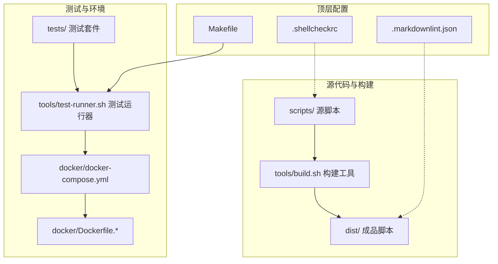
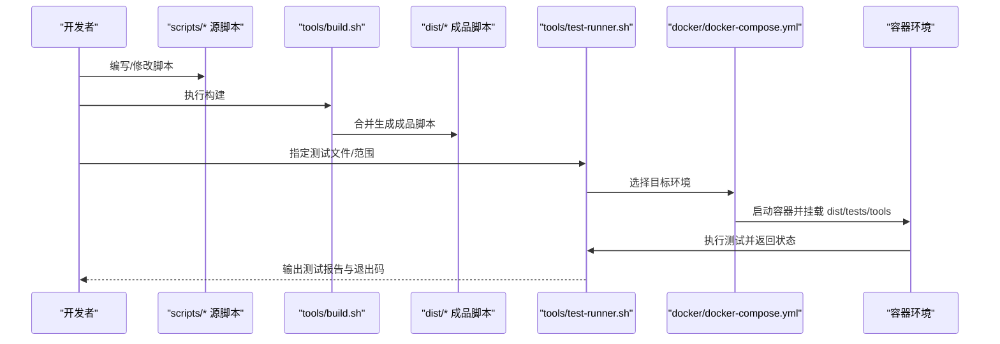
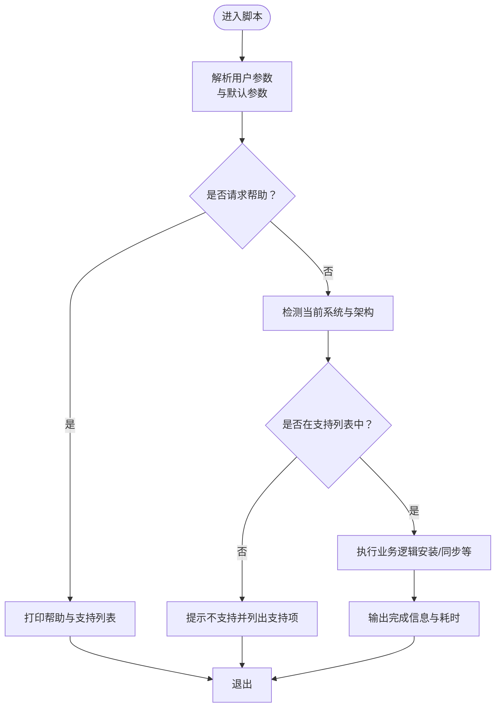
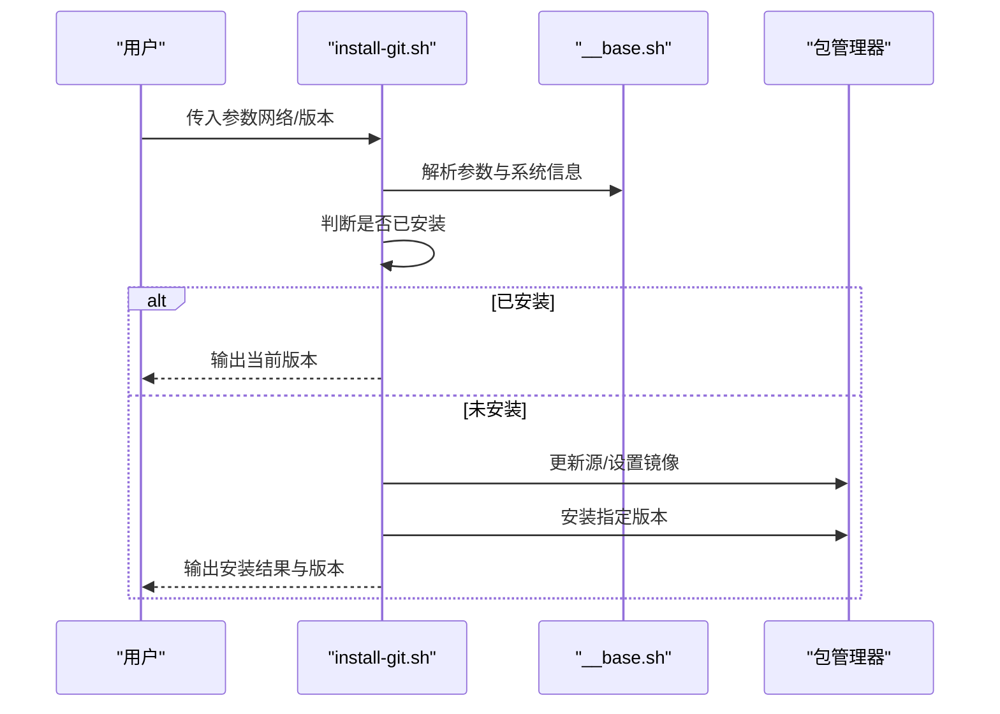
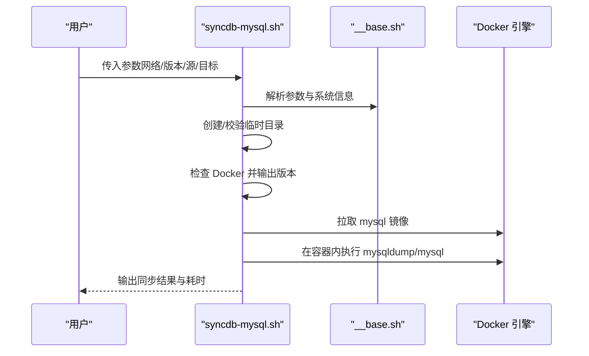
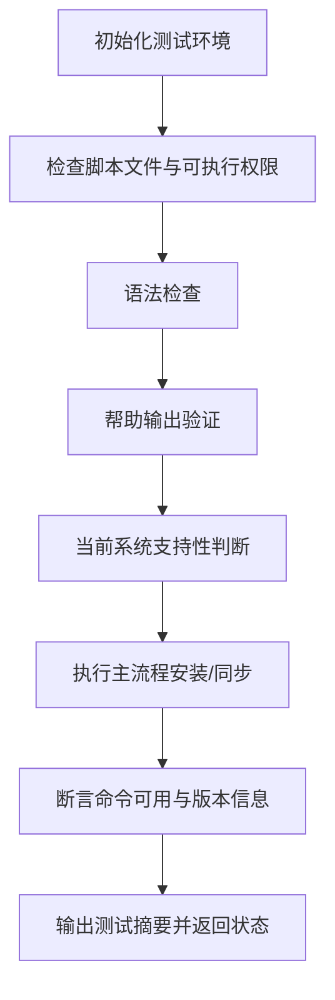
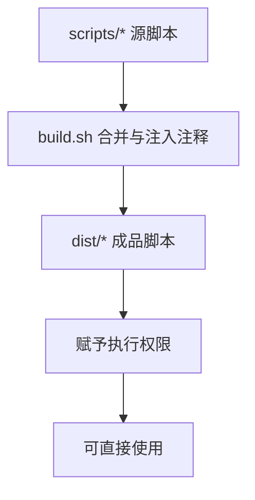
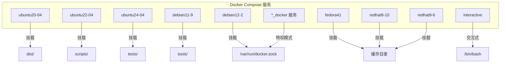
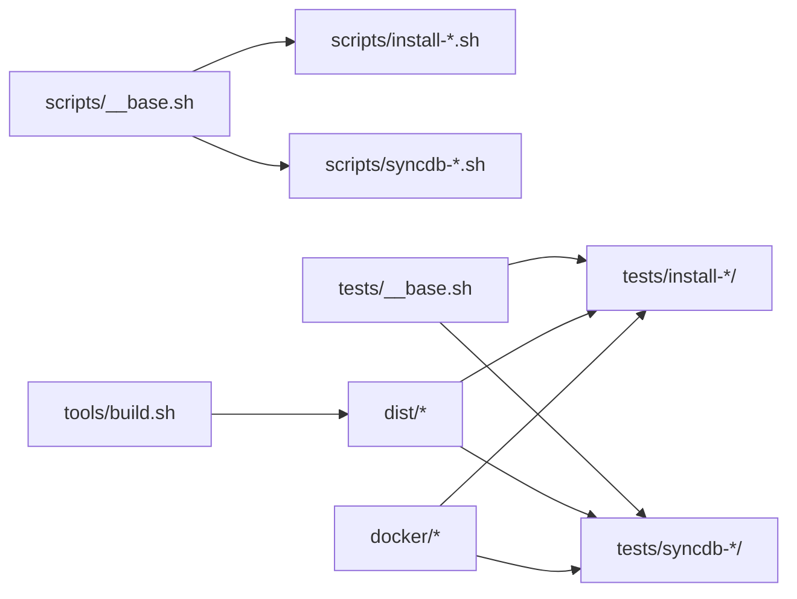

# 开发指南

<cite>
**本文引用的文件**   
- [README.md](file://README.md)
- [docs/README.md](file://docs/README.md)
- [scripts/__base.sh](file://scripts/__base.sh)
- [scripts/install-git.sh](file://scripts/install-git.sh)
- [scripts/syncdb-mysql.sh](file://scripts/syncdb-mysql.sh)
- [tests/__base.sh](file://tests/__base.sh)
- [tests/install-git/01-ok.sh](file://tests/install-git/01-ok.sh)
- [tests/install-git/02-install.sh](file://tests/install-git/02-install.sh)
- [tools/build.sh](file://tools/build.sh)
- [tools/test-runner.sh](file://tools/test-runner.sh)
- [Makefile](file://Makefile)
- [docker/docker-compose.yml](file://docker/docker-compose.yml)
- [docker/Dockerfile.ubuntu22-04](file://docker/Dockerfile.ubuntu22-04)
- [.shellcheckrc](file://.shellcheckrc)
- [.markdownlint.json](file://.markdownlint.json)
</cite>

## 目录
1. [简介](#简介)
2. [项目结构](#项目结构)
3. [核心组件](#核心组件)
4. [架构总览](#架构总览)
5. [详细组件分析](#详细组件分析)
6. [依赖关系分析](#依赖关系分析)
7. [性能与安全考量](#性能与安全考量)
8. [故障排查指南](#故障排查指南)
9. [结论](#结论)
10. [附录](#附录)

## 简介
HZ 9 Env Scripts 是一套跨 Linux 发行版的可直接使用的开发环境安装与同步脚本集合。项目通过统一的脚本模板与测试框架，确保在多发行版与多架构环境下的一致性与可靠性。开发者可直接下载 dist/ 中的成品脚本运行，也可基于 scripts/ 进行二次开发与扩展。

- 项目目标：提供生产就绪的安装脚本，覆盖 Ubuntu、Debian、Fedora、Red Hat 等主流发行版。
- 使用方式：推荐直接从 dist/ 下载执行；亦可在本地克隆后使用 tools/build.sh 构建或通过 Makefile 批量测试。

**章节来源**
- [README.md:1-6](file://README.md#L1-L6)
- [docs/README.md:1-128](file://docs/README.md#L1-L128)

## 项目结构
项目采用“源脚本 + 构建工具 + 测试套件 + Docker 环境”的分层组织方式：

- dist/：最终可直接使用的成品脚本目录
- scripts/：源脚本与通用基础模块（如参数解析、系统检测、日志输出等）
- tests/：按功能划分的测试套件，包含安装类与数据库同步类脚本的测试
- docker/：各发行版的 Dockerfile 与 docker-compose.yml，用于容器化测试
- tools/：构建与测试运行工具
- docs/：项目文档与使用说明
- 根目录配置：Makefile、ShellCheck 与 Markdown Lint 规则

**图示来源**
- [Makefile:1-563](file://Makefile#L1-L563)
- [tools/build.sh:1-91](file://tools/build.sh#L1-L91)
- [tools/test-runner.sh:1-156](file://tools/test-runner.sh#L1-L156)
- [docker/docker-compose.yml:1-297](file://docker/docker-compose.yml#L1-L297)
- [.shellcheckrc:1-2](file://.shellcheckrc#L1-L2)
- [.markdownlint.json:1-11](file://.markdownlint.json#L1-L11)

**章节来源**
- [docs/README.md:9-18](file://docs/README.md#L9-L18)
- [Makefile:10-47](file://Makefile#L10-L47)

## 核心组件
- 脚本基础模块（scripts/__base.sh）：提供参数解析、系统识别、日志输出、包管理器适配、镜像切换等功能，是所有脚本的公共依赖。
- 安装类脚本（scripts/install-*.sh）：以统一模板实现软件安装，支持网络参数与版本参数。
- 数据库同步类脚本（scripts/syncdb-*.sh）：封装 Docker 镜像拉取与数据迁移流程。
- 测试基础模块（tests/__base.sh）：提供断言、环境清理、测试初始化、检查点等能力。
- 构建工具（tools/build.sh）：将 scripts/ 中的脚本合并到 dist/，自动处理 source 导入与权限设置。
- 测试运行器（tools/test-runner.sh）：在容器环境中执行测试文件，汇总结果并返回状态码。
- Makefile：提供一键构建与多环境测试命令，便于 CI/CD 集成。

**章节来源**
- [scripts/__base.sh:1-1252](file://scripts/__base.sh#L1-L1252)
- [scripts/install-git.sh:1-85](file://scripts/install-git.sh#L1-L85)
- [scripts/syncdb-mysql.sh:1-138](file://scripts/syncdb-mysql.sh#L1-L138)
- [tests/__base.sh:1-464](file://tests/__base.sh#L1-L464)
- [tools/build.sh:1-91](file://tools/build.sh#L1-L91)
- [tools/test-runner.sh:1-156](file://tools/test-runner.sh#L1-L156)
- [Makefile:1-563](file://Makefile#L1-L563)

## 架构总览
下图展示了从源脚本到成品脚本、再到容器化测试的整体流程。

**图示来源**
- [tools/build.sh:1-91](file://tools/build.sh#L1-L91)
- [tools/test-runner.sh:1-156](file://tools/test-runner.sh#L1-L156)
- [docker/docker-compose.yml:1-297](file://docker/docker-compose.yml#L1-L297)

## 详细组件分析

### 脚本模板与参数定义规范
- 统一头部与常量
  - 使用统一的分隔符标记进行参数序列化，避免不同 Bash 版本差异导致的解析问题。
  - 提供 SHELL_NAME、SHELL_DESC、SUPPORT_OS_LIST 等标准化字段，便于帮助信息与支持列表展示。
- 参数解析
  - 支持长参数与短参数组合，兼容带值与无值参数。
  - 默认参数与帮助信息自动生成，便于用户快速了解脚本能力。
- 系统识别与包管理器适配
  - 自动识别 Ubuntu/Debian/Fedora/Red Hat 等发行版与架构，选择 apt 或 dnf 安装路径。
  - 提供镜像切换函数，支持国内网络环境优化。
- 日志与输出
  - 提供彩色控制台输出、时间统计、错误与成功提示，便于调试与审计。

**图示来源**
- [scripts/__base.sh:606-742](file://scripts/__base.sh#L606-L742)
- [scripts/__base.sh:80-263](file://scripts/__base.sh#L80-L263)

**章节来源**
- [scripts/__base.sh:1-1252](file://scripts/__base.sh#L1-L1252)
- [scripts/install-git.sh:4-28](file://scripts/install-git.sh#L4-L28)

### 安装类脚本开发范式（以 install-git 为例）
- 脚本职责：检测已安装状态、根据包管理器安装指定版本、输出版本信息。
- 关键步骤：
  - 初始化：设置名称、描述、参数与支持列表。
  - 参数解析：获取网络与版本参数。
  - 条件分支：根据 USE_APT_GET_INSTALL 或 USE_DNF_INSTALL 选择安装路径。
  - 结果验证：输出实际安装版本，确保可用性。

**图示来源**
- [scripts/install-git.sh:1-85](file://scripts/install-git.sh#L1-L85)
- [scripts/__base.sh:744-800](file://scripts/__base.sh#L744-L800)

**章节来源**
- [scripts/install-git.sh:1-85](file://scripts/install-git.sh#L1-L85)

### 数据库同步类脚本开发范式（以 syncdb-mysql 为例）
- 脚本职责：在容器内执行 mysqldump/mysql 命令，实现远程与本地数据库之间的备份与恢复。
- 关键步骤：
  - 初始化与参数解析：临时目录、网络、版本、源/目标连接信息。
  - 环境检查：确认 Docker 可用并输出版本信息。
  - 镜像拉取：按版本拉取 mysql 镜像。
  - 数据同步：在容器内执行导出与导入命令。
  - 结果输出：记录耗时与完成状态。

**图示来源**
- [scripts/syncdb-mysql.sh:1-138](file://scripts/syncdb-mysql.sh#L1-L138)
- [scripts/__base.sh:1-1252](file://scripts/__base.sh#L1-L1252)

**章节来源**
- [scripts/syncdb-mysql.sh:1-138](file://scripts/syncdb-mysql.sh#L1-L138)

### 测试框架与测试用例编写
- 测试基础模块（tests/__base.sh）
  - 断言：文件存在、目录存在、进程运行、字符串包含等。
  - 环境准备：清理缓存、创建临时目录、捕获退出码、输出摘要。
  - 检查点：统一的“开始/完成/跳过/失败”输出格式，便于阅读与自动化统计。
- 单元测试样例
  - 01-ok.sh：验证脚本文件存在、可执行、语法正确、帮助输出正常、当前系统支持情况。
  - 02-install.sh：执行安装流程，重新加载 PATH，断言命令可用与版本正确。

**图示来源**
- [tests/__base.sh:1-464](file://tests/__base.sh#L1-L464)
- [tests/install-git/01-ok.sh:1-25](file://tests/install-git/01-ok.sh#L1-L25)
- [tests/install-git/02-install.sh:1-35](file://tests/install-git/02-install.sh#L1-L35)

**章节来源**
- [tests/__base.sh:1-464](file://tests/__base.sh#L1-L464)
- [tests/install-git/01-ok.sh:1-25](file://tests/install-git/01-ok.sh#L1-L25)
- [tests/install-git/02-install.sh:1-35](file://tests/install-git/02-install.sh#L1-L35)

### 构建与发布流程
- 构建工具（tools/build.sh）
  - 递归解析 source 指令，合并脚本内容，去除重复头部，注入导入注释。
  - 生成 dist/ 下的成品脚本并赋予执行权限。
- Makefile
  - 提供 build、build-scripts、build-images、install-test-*、syncdb-test-* 等常用命令。
  - 支持 NETWORK、DEBUG、OUTPUT 等通用参数传递至测试运行器。

**图示来源**
- [tools/build.sh:1-91](file://tools/build.sh#L1-L91)
- [Makefile:48-83](file://Makefile#L48-L83)

**章节来源**
- [tools/build.sh:1-91](file://tools/build.sh#L1-L91)
- [Makefile:48-83](file://Makefile#L48-L83)

### Docker 测试环境配置
- docker-compose.yml
  - 定义 Ubuntu 20.04/22.04/24.04、Debian 11.9/12.2、Fedora 41、Red Hat 8.10/9.6 等多环境服务。
  - 挂载 dist、scripts、tests、tools，共享 Docker Socket，便于容器内测试。
  - 提供带 Docker CE/Compose 的 *_docker 服务，满足数据库同步类脚本的依赖。
- Dockerfile（示例：ubuntu22-04）
  - 设置非交互安装、创建测试用户、复制项目文件、赋予脚本执行权限、切换用户、设置默认命令。

**图示来源**
- [docker/docker-compose.yml:1-297](file://docker/docker-compose.yml#L1-L297)
- [docker/Dockerfile.ubuntu22-04:1-33](file://docker/Dockerfile.ubuntu22-04#L1-L33)

**章节来源**
- [docker/docker-compose.yml:1-297](file://docker/docker-compose.yml#L1-L297)
- [docker/Dockerfile.ubuntu22-04:1-33](file://docker/Dockerfile.ubuntu22-04#L1-L33)

## 依赖关系分析
- 脚本间依赖
  - 所有脚本均通过 source 引入 scripts/__base.sh，依赖其参数解析、系统识别与日志输出能力。
- 构建阶段依赖
  - tools/build.sh 依赖 scripts/ 下的脚本结构与 source 注释规范。
- 测试阶段依赖
  - tests/* 依赖 tests/__base.sh 与对应的功能测试辅助（如 __install.sh）。
- 运行时依赖
  - 数据库同步类脚本依赖 Docker 与相应镜像；安装类脚本依赖包管理器与镜像源。

**图示来源**
- [scripts/__base.sh:1-1252](file://scripts/__base.sh#L1-L1252)
- [tools/build.sh:1-91](file://tools/build.sh#L1-L91)
- [tests/__base.sh:1-464](file://tests/__base.sh#L1-L464)
- [docker/docker-compose.yml:1-297](file://docker/docker-compose.yml#L1-L297)

**章节来源**
- [scripts/__base.sh:1-1252](file://scripts/__base.sh#L1-L1252)
- [tools/build.sh:1-91](file://tools/build.sh#L1-L91)
- [tests/__base.sh:1-464](file://tests/__base.sh#L1-L464)
- [docker/docker-compose.yml:1-297](file://docker/docker-compose.yml#L1-L297)

## 性能与安全考量
- 性能
  - 镜像源优化：在安装类脚本中优先使用华为云镜像，缩短下载时间。
  - 包管理器缓存：在测试环境清理 apt/dnf 缓存策略，避免镜像体积膨胀影响后续测试。
  - 时间统计：统一的日志输出包含耗时统计，便于定位慢环节。
- 安全
  - 最小权限原则：Dockerfile 中创建非 root 用户执行测试，降低风险。
  - 外部依赖校验：数据库同步类脚本通过 Docker 隔离外部依赖，减少主机污染。
  - ShellLint：启用 .shellcheckrc 忽略特定规则，保证脚本风格一致与可维护性。
- 可靠性
  - 统一的参数解析与帮助输出，减少误用。
  - 测试用例覆盖“文件存在/可执行/语法/帮助/支持性/功能验证”，确保回归质量。

**章节来源**
- [scripts/__base.sh:744-800](file://scripts/__base.sh#L744-L800)
- [tests/__base.sh:139-201](file://tests/__base.sh#L139-L201)
- [.shellcheckrc:1-2](file://.shellcheckrc#L1-L2)
- [.markdownlint.json:1-11](file://.markdownlint.json#L1-L11)

## 故障排查指南
- 常见问题
  - 当前系统不受支持：检查 SUPPORT_OS_LIST 与系统识别逻辑，确认发行版/版本/架构匹配。
  - 包管理器不可用：确认 USE_APT_GET_INSTALL 或 USE_DNF_INSTALL 分支被正确触发。
  - 镜像源访问失败：尝试切换 --network=in-china 参数或手动替换镜像源。
  - Docker 未安装：数据库同步类脚本会提前检查并报错，需先安装 Docker CE 与 Compose。
- 调试技巧
  - 使用 --debug 参数查看详细输出。
  - 通过 tools/test-runner.sh 的 --file 选项直接运行单个测试文件，结合实时输出定位问题。
  - 在 docker-compose.yml 中使用 interactive 服务进入交互式环境复现问题。
- 错误码语义
  - 测试运行器返回 0 表示通过，1 表示失败，2 表示跳过（如当前系统不支持）。

**章节来源**
- [scripts/__base.sh:319-331](file://scripts/__base.sh#L319-L331)
- [tools/test-runner.sh:53-64](file://tools/test-runner.sh#L53-L64)
- [docker/docker-compose.yml:281-297](file://docker/docker-compose.yml#L281-L297)

## 结论
本指南围绕 HZ 9 Env Scripts 的开发流程、脚本模板、测试体系、Docker 环境与最佳实践进行了系统化梳理。遵循统一的参数定义与日志输出规范，配合容器化测试与构建工具，可高效地为新的 Linux 发行版添加支持，并持续提升脚本的稳定性与可维护性。

## 附录

### 新脚本开发流程（模板与规范）
- 步骤
  - 在 scripts/ 下创建脚本，设置 SHELL_NAME、SHELL_DESC、PARAMTERS、SUPPORT_OS_LIST。
  - 使用 scripts/__base.sh 提供的参数解析与系统识别能力。
  - 在 tests/ 下新增对应测试目录与测试文件（01-ok.sh 与 02-*.sh），遵循 tests/__base.sh 的断言与检查点。
  - 执行 make build-scripts 构建成品脚本，再使用 Makefile 的测试命令进行验证。
- 参数定义要点
  - 使用统一分隔符标记序列化参数，避免 Bash 版本差异。
  - 为每个参数提供默认值与简要说明，便于 --help 展示。
- 测试用例编写要点
  - 先进行“文件/可执行/语法/帮助/支持性”等前置检查。
  - 再执行主流程并断言结果（命令可用、版本正确、产物存在等）。

**章节来源**
- [scripts/__base.sh:606-742](file://scripts/__base.sh#L606-L742)
- [tests/__base.sh:1-464](file://tests/__base.sh#L1-L464)
- [Makefile:84-532](file://Makefile#L84-L532)

### 为新 Linux 发行版添加支持
- Dockerfile 编写
  - 参考现有 Dockerfile，设置非交互安装、创建测试用户、复制项目文件、赋予执行权限。
  - 如需 Docker CE/Compose，使用 *_docker 的 Dockerfile 作为模板。
- docker-compose.yml 配置
  - 在 services 段新增服务，设置平台、构建上下文与 Dockerfile、挂载 dist/scripts/tests/tools。
  - 如需缓存目录，参考已有服务的 volumes 映射。
- 测试环境配置
  - 使用 Makefile 的 install-test-all-env 或 syncdb-test-all-env 命令进行全量测试。
  - 若需要中国网络优化，追加 NETWORK=in-china 参数。

**章节来源**
- [docker/Dockerfile.ubuntu22-04:1-33](file://docker/Dockerfile.ubuntu22-04#L1-L33)
- [docker/docker-compose.yml:1-297](file://docker/docker-compose.yml#L1-L297)
- [Makefile:121-162](file://Makefile#L121-L162)

### 贡献流程与代码审查标准
- 流程
  - Fork 仓库 -> 创建特性分支 -> 编写脚本与测试 -> 构建并通过测试 -> 提交 PR。
- 代码审查要点
  - 参数定义清晰、默认值合理、帮助信息完整。
  - 测试覆盖全面，包含“基础检查 + 功能验证”两类用例。
  - Dockerfile 符合最小权限原则，compose 服务命名规范。
  - 文档与变更保持一致，必要时更新 docs/README.md。

**章节来源**
- [docs/README.md:117-127](file://docs/README.md#L117-L127)
- [Makefile:84-532](file://Makefile#L84-L532)

### 开发环境搭建与调试技巧
- 开发环境
  - 使用 Makefile 的 interactive 或 shell 目标启动交互式容器，便于本地调试。
  - 通过 make build-images 构建镜像，make build-scripts 生成 dist 脚本。
- 调试技巧
  - 使用 --debug 查看详细输出；使用 --output 指定输出路径以便收集日志。
  - 对于数据库同步类脚本，可通过 --docker-image-quick-check 减少重复拉取时间。
  - 使用 tools/test-runner.sh 的 --file 选项直接运行单个测试文件，快速定位问题。

**章节来源**
- [Makefile:29-41](file://Makefile#L29-L41)
- [Makefile:536-563](file://Makefile#L536-L563)
- [tools/test-runner.sh:66-84](file://tools/test-runner.sh#L66-L84)

### 扩展现有功能与添加新特性
- 扩展安装类脚本
  - 在 PARAMTERS 中新增参数，在 SUPPORT_OS_LIST 中声明支持的发行版/版本/架构。
  - 在脚本主体中根据 USE_APT_GET_INSTALL 或 USE_DNF_INSTALL 分支实现安装逻辑。
- 扩展数据库同步类脚本
  - 在 PARAMTERS 中新增连接参数与行为开关，确保 Docker 镜像拉取与数据迁移流程稳定。
- 新增测试用例
  - 在 tests/ 下新增对应目录与 01-ok.sh 与 02-*.sh，复用 tests/__base.sh 的断言与检查点。

**章节来源**
- [scripts/install-git.sh:7-28](file://scripts/install-git.sh#L7-L28)
- [scripts/syncdb-mysql.sh:7-42](file://scripts/syncdb-mysql.sh#L7-L42)
- [tests/install-git/01-ok.sh:1-25](file://tests/install-git/01-ok.sh#L1-L25)
- [tests/install-git/02-install.sh:1-35](file://tests/install-git/02-install.sh#L1-L35)

### 文档编写与测试完善的建议
- 文档
  - 使用 .markdownlint.json 保持文档风格一致，避免过度标题层级与不允许的 HTML 元素。
  - 在 docs/README.md 中补充新增脚本的使用说明与参数说明。
- 测试
  - 为每个新脚本至少提供 01-ok.sh 与 02-*.sh 两套测试，覆盖基础与功能验证。
  - 在 Makefile 中新增对应的测试命令与日志输出，便于 CI/CD 集成。

**章节来源**
- [.markdownlint.json:1-11](file://.markdownlint.json#L1-L11)
- [docs/README.md:104-108](file://docs/README.md#L104-L108)
- [Makefile:84-532](file://Makefile#L84-L532)