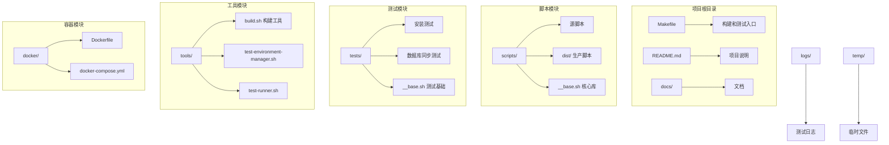
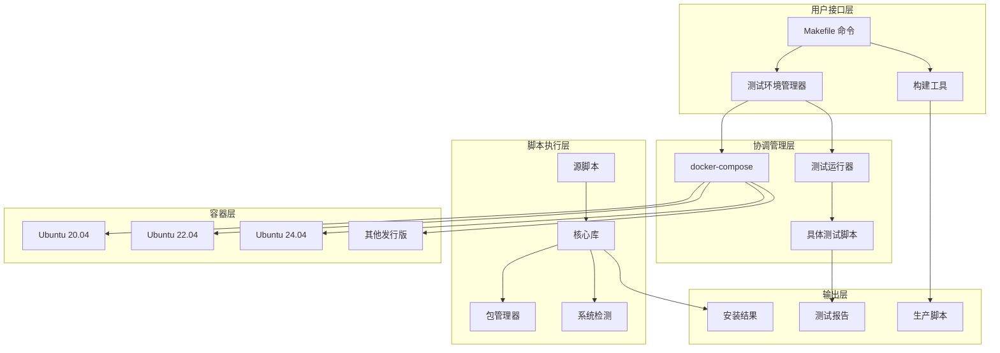
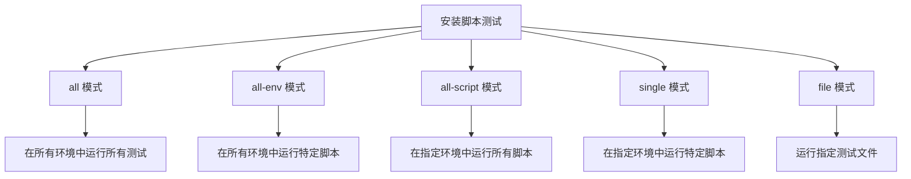
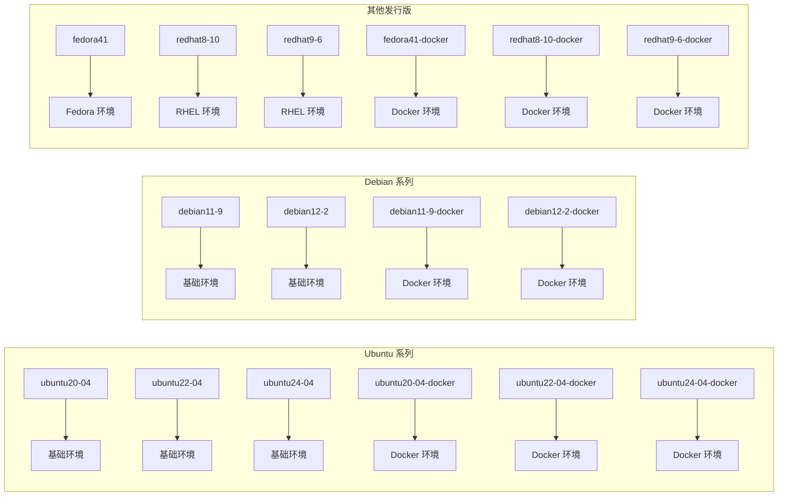
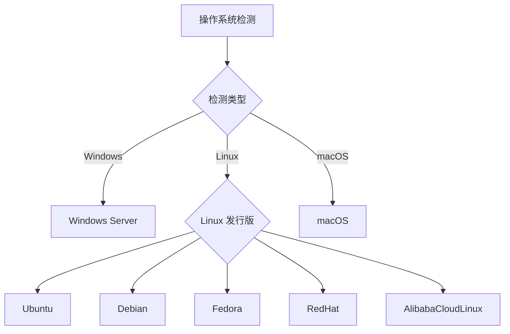
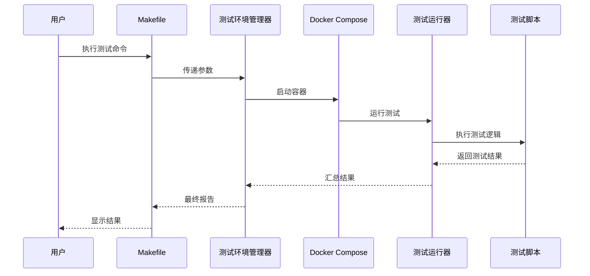
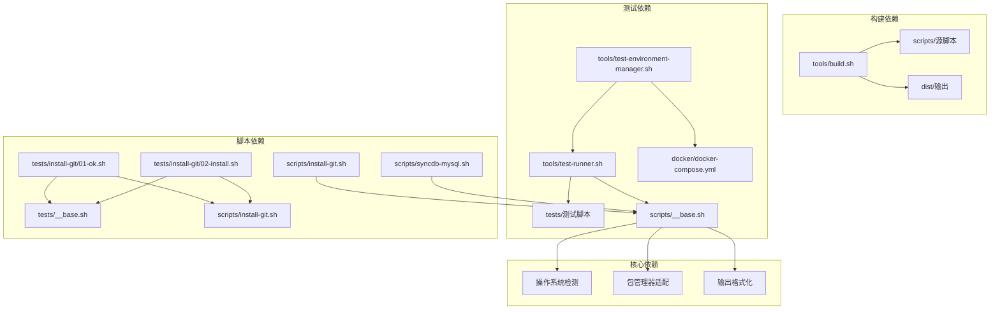

# 开发环境搭建

<cite>
**本文档引用的文件**
- [Makefile](file://Makefile)
- [README.md](file://README.md)
- [scripts/__base.sh](file://scripts/__base.sh)
- [tools/build.sh](file://tools/build.sh)
- [tools/test-environment-manager.sh](file://tools/test-environment-manager.sh)
- [tools/test-runner.sh](file://tools/test-runner.sh)
- [docker/docker-compose.yml](file://docker/docker-compose.yml)
- [scripts/install-git.sh](file://scripts/install-git.sh)
- [scripts/syncdb-mysql.sh](file://scripts/syncdb-mysql.sh)
- [tests/install-git/01-ok.sh](file://tests/install-git/01-ok.sh)
- [tests/install-git/02-install.sh](file://tests/install-git/02-install.sh)
- [tests/__base.sh](file://tests/__base.sh)
- [docs/README.zh-CN.md](file://docs/README.zh-CN.md)
</cite>

## 目录
1. [简介](#简介)
2. [项目结构](#项目结构)
3. [核心组件](#核心组件)
4. [架构概览](#架构概览)
5. [详细组件分析](#详细组件分析)
6. [依赖关系分析](#依赖关系分析)
7. [性能考虑](#性能考虑)
8. [故障排除指南](#故障排除指南)
9. [结论](#结论)
10. [附录](#附录)

## 简介

HZ 9 Env Scripts 是一个用于在不同操作系统上快速搭建开发环境的自动化脚本集合。该项目提供了完整的开发环境配置、测试验证和部署工具，支持多种Linux发行版和网络环境。

该系统的核心目标是：
- 提供跨平台的开发环境安装脚本
- 建立自动化的测试和验证机制
- 支持多种网络环境配置
- 实现高效的开发工作流

## 项目结构

项目采用模块化设计，主要包含以下核心目录：



**图表来源**
- [Makefile:1-563](file://Makefile#L1-L563)
- [docker/docker-compose.yml:1-297](file://docker/docker-compose.yml#L1-L297)

**章节来源**
- [Makefile:1-563](file://Makefile#L1-L563)
- [docs/README.zh-CN.md:1-128](file://docs/README.zh-CN.md#L1-L128)

## 核心组件

### 构建系统

构建系统负责将源脚本合并为生产就绪的单文件脚本，支持依赖解析和资源管理。

**章节来源**
- [tools/build.sh:1-91](file://tools/build.sh#L1-L91)

### 测试环境管理器

测试环境管理器协调跨多个Linux发行版的测试执行，支持灵活的测试模式和参数传递。

**章节来源**
- [tools/test-environment-manager.sh:1-334](file://tools/test-environment-manager.sh#L1-L334)

### 测试运行器

测试运行器负责执行具体的测试文件，提供详细的测试报告和状态跟踪。

**章节来源**
- [tools/test-runner.sh:1-156](file://tools/test-runner.sh#L1-L156)

### 核心脚本库

核心脚本库提供统一的操作系统检测、包管理器适配和输出格式化功能。

**章节来源**
- [scripts/__base.sh:1-1252](file://scripts/__base.sh#L1-L1252)

## 架构概览

系统采用分层架构设计，各组件职责明确，相互协作完成开发环境的搭建和验证。



**图表来源**
- [Makefile:84-563](file://Makefile#L84-L563)
- [docker/docker-compose.yml:1-297](file://docker/docker-compose.yml#L1-L297)

## 详细组件分析

### Makefile 开发命令详解

Makefile 提供了完整的开发工作流管理，包含构建、测试、清理等核心功能。

#### 构建相关命令

- **build-scripts**: 将源脚本合并到 dist 目录
- **build-images**: 构建所有测试用 Docker 镜像
- **build**: 同时执行脚本构建和镜像构建

#### 安装脚本测试命令

系统提供了九种不同的测试模式：



**图表来源**
- [Makefile:84-532](file://Makefile#L84-L532)

#### 数据库同步脚本测试命令

与安装脚本类似，数据库同步脚本也有九种测试模式，额外支持 `DOCKER_IMAGE_QUICK_CHECK` 参数。

**章节来源**
- [Makefile:84-532](file://Makefile#L84-L532)

### Docker 容器配置

系统为每个支持的Linux发行版提供了专门的Docker配置：



**图表来源**
- [docker/docker-compose.yml:1-297](file://docker/docker-compose.yml#L1-L297)

**章节来源**
- [docker/docker-compose.yml:1-297](file://docker/docker-compose.yml#L1-L297)

### 核心脚本库功能

核心脚本库提供了统一的基础设施，包括：

#### 操作系统检测



**图表来源**
- [scripts/__base.sh:80-263](file://scripts/__base.sh#L80-L263)

#### 包管理器适配

系统自动识别并适配不同的包管理器：
- **APT**: Ubuntu/Debian 系统
- **DNF**: Fedora/RHEL 系统

**章节来源**
- [scripts/__base.sh:254-262](file://scripts/__base.sh#L254-L262)

### 测试框架设计

测试框架采用分层设计，支持多种测试场景：



**图表来源**
- [tools/test-environment-manager.sh:49-91](file://tools/test-environment-manager.sh#L49-L91)
- [tools/test-runner.sh:8-64](file://tools/test-runner.sh#L8-L64)

**章节来源**
- [tests/__base.sh:1-464](file://tests/__base.sh#L1-L464)

## 依赖关系分析

系统各组件之间的依赖关系如下：



**图表来源**
- [tools/build.sh:1-91](file://tools/build.sh#L1-L91)
- [tools/test-environment-manager.sh:1-334](file://tools/test-environment-manager.sh#L1-L334)
- [scripts/__base.sh:1-1252](file://scripts/__base.sh#L1-L1252)

**章节来源**
- [Makefile:1-563](file://Makefile#L1-L563)

## 性能考虑

### 构建性能优化

1. **增量构建**: 构建系统只处理发生变化的文件
2. **并行处理**: 支持同时构建多个脚本
3. **缓存利用**: 利用包管理器缓存减少下载时间

### 测试性能优化

1. **容器复用**: Docker 容器可以重复使用以避免重复构建
2. **并行测试**: 不同发行版的测试可以并行执行
3. **智能跳过**: 不支持的测试会自动跳过而不是失败

### 网络性能优化

系统支持多种网络配置：
- **默认配置**: 适用于国际网络环境
- **中国网络配置**: 使用华为云镜像源优化下载速度

## 故障排除指南

### 常见问题及解决方案

#### 构建失败

**问题**: 构建过程中出现依赖解析错误
**解决方案**: 
1. 检查源脚本中的 `source` 指令是否正确
2. 确认所有依赖文件存在且可访问
3. 运行 `make clean` 清理缓存后重新构建

#### 测试失败

**问题**: 测试在特定发行版上失败
**解决方案**:
1. 使用 `make interactive` 启动交互式环境进行调试
2. 检查容器日志: `make logs`
3. 查看详细测试结果: `make results`

#### Docker 相关问题

**问题**: Docker 容器启动失败
**解决方案**:
1. 确认 Docker 服务正常运行
2. 检查磁盘空间和权限
3. 清理未使用的镜像和容器: `make clean`

### 调试技巧

#### 启用详细日志

```bash
# 启用调试模式
make install-test-all DEBUG=true

# 指定输出目录
make install-test-all OUTPUT=./test-results
```

#### 交互式调试

```bash
# 启动交互式测试环境
make interactive

# 在特定容器中启动 shell
make shell
```

**章节来源**
- [Makefile:28-41](file://Makefile#L28-L41)

## 结论

HZ 9 Env Scripts 提供了一个完整、可靠的开发环境搭建解决方案。通过模块化的设计和完善的测试框架，该系统能够：

1. **跨平台支持**: 支持多种主流 Linux 发行版
2. **自动化程度高**: 从构建到测试的全流程自动化
3. **易于扩展**: 新的脚本和测试可以轻松添加
4. **可靠性强**: 完善的错误处理和故障恢复机制

该系统特别适合需要在多环境中保持一致开发体验的团队使用。

## 附录

### 支持的操作系统列表

- Ubuntu 20.04/22.04/24.04 (AMD64)
- Debian 11.9/12.2 (AMD64)
- Fedora 41 (AMD64)
- Red Hat Enterprise Linux 8.10/9.6 (AMD64)

### 快速开始示例

```bash
# 克隆项目
git clone https://github.com/hz-9/env-scripts.git
cd env-scripts

# 构建生产脚本
make build-scripts

# 运行所有测试
make install-test-all

# 启动交互式环境
make interactive
```

### 开发最佳实践

1. **遵循命名约定**: 脚本文件使用 `install-` 前缀
2. **编写完整测试**: 每个新脚本都需要对应的测试
3. **文档更新**: 修改脚本时同步更新相关文档
4. **版本控制**: 使用语义化版本控制管理发布