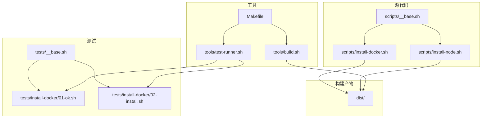
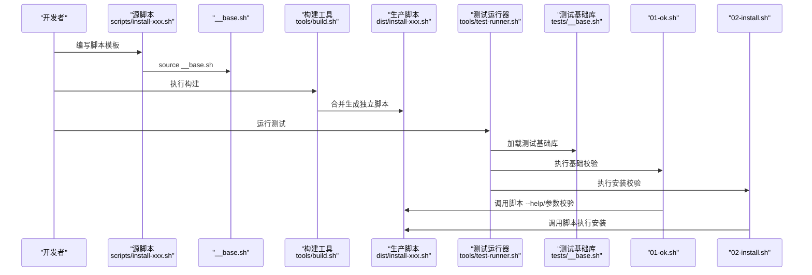
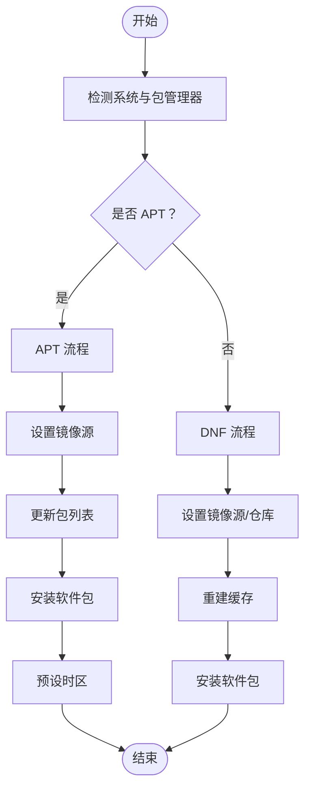
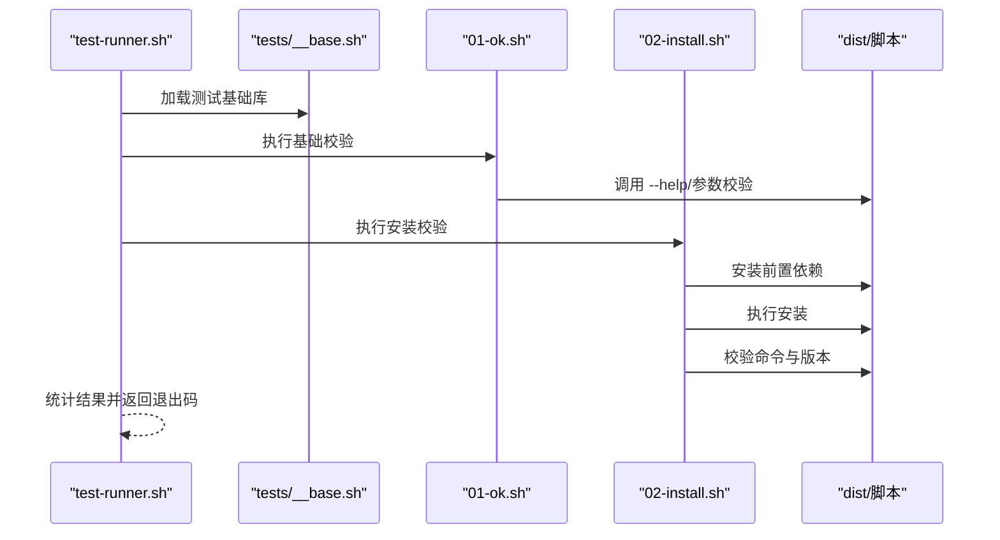
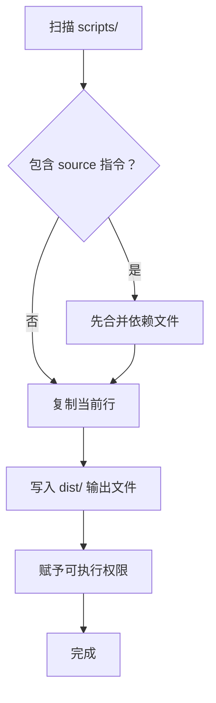
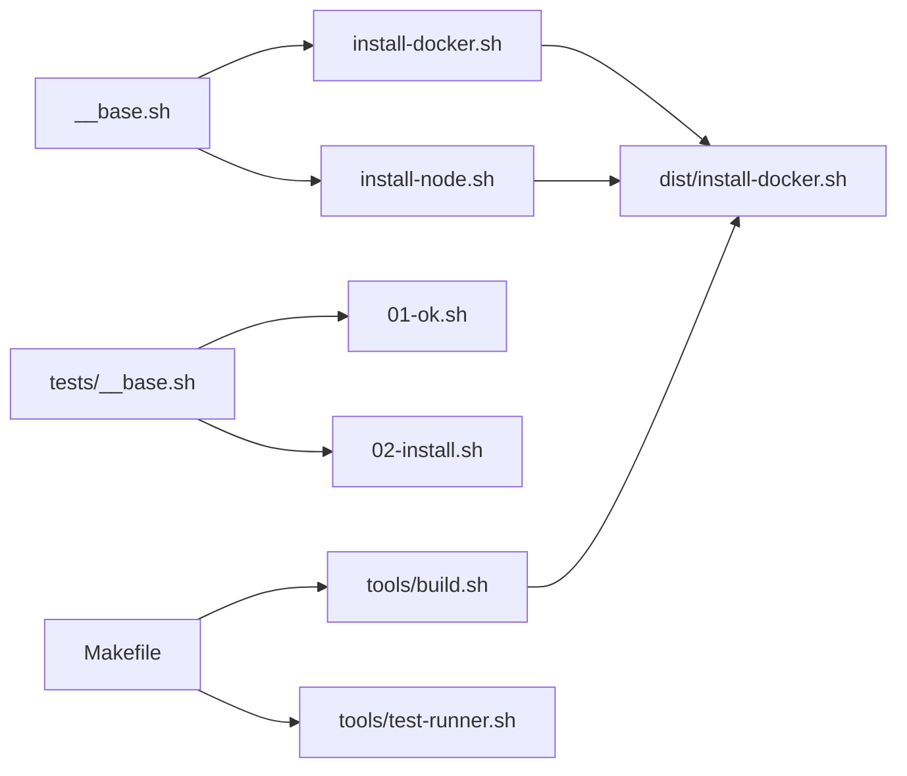

# 新脚本开发

<cite>
**本文引用的文件**
- [scripts/__base.sh](file://scripts/__base.sh)
- [scripts/install-docker.sh](file://scripts/install-docker.sh)
- [scripts/install-node.sh](file://scripts/install-node.sh)
- [tests/__base.sh](file://tests/__base.sh)
- [tests/install-docker/01-ok.sh](file://tests/install-docker/01-ok.sh)
- [tests/install-docker/02-install.sh](file://tests/install-docker/02-install.sh)
- [tools/build.sh](file://tools/build.sh)
- [tools/test-runner.sh](file://tools/test-runner.sh)
- [Makefile](file://Makefile)
- [docs/README.zh-CN.md](file://docs/README.zh-CN.md)
- [docs/overview/scripts.zh-CN.md](file://docs/overview/scripts.zh-CN.md)
</cite>

## 目录
1. [简介](#简介)
2. [项目结构](#项目结构)
3. [核心组件](#核心组件)
4. [架构总览](#架构总览)
5. [详细组件分析](#详细组件分析)
6. [依赖关系分析](#依赖关系分析)
7. [性能考虑](#性能考虑)
8. [故障排查指南](#故障排查指南)
9. [结论](#结论)
10. [附录](#附录)

## 简介
本指南面向希望基于 __base.sh 基础库创建新安装脚本的开发者。内容涵盖脚本模板使用、参数定义规范、函数调用约定、脚本结构设计原则（含操作系统检测、包管理器适配、错误处理与日志记录）、APT 与 DNF 的适配实现示例、测试用例编写方法与最佳实践，以及脚本构建与分发流程。

## 项目结构
该项目采用“源脚本 + 基础库 + 测试 + 构建工具”的组织方式：
- scripts/：源脚本与 __base.sh 基础库
- dist/：构建后可直接使用的生产脚本
- tests/：测试套件，按功能模块组织
- tools/：构建与测试运行工具
- docker/：测试用容器环境配置
- docs/：项目文档

图表来源
- [scripts/__base.sh](file://scripts/__base.sh)
- [scripts/install-docker.sh](file://scripts/install-docker.sh)
- [scripts/install-node.sh](file://scripts/install-node.sh)
- [tools/build.sh](file://tools/build.sh)
- [tools/test-runner.sh](file://tools/test-runner.sh)
- [Makefile](file://Makefile)

章节来源
- [docs/README.zh-CN.md](file://docs/README.zh-CN.md)
- [docs/overview/scripts.zh-CN.md](file://docs/overview/scripts.zh-CN.md)

## 核心组件
- 基础库 __base.sh：提供参数解析、系统检测、日志输出、APT/DNF 包管理适配、下载与 Docker 镜像拉取等通用能力。
- 源脚本：遵循统一模板，声明 SHELL_NAME/SHELL_DESC/PARAMTERS/SUPPORT_OS_LIST，调用 __base.sh 的能力完成安装。
- 测试框架：tests/__base.sh 提供断言与测试流程封装；各功能目录下有 ok/install 两类测试样例。
- 构建工具：tools/build.sh 将 scripts 下脚本与依赖合并生成 dist/ 下的独立可执行脚本。
- Makefile：提供一键构建与多环境测试的命令入口。

章节来源
- [scripts/__base.sh](file://scripts/__base.sh)
- [tests/__base.sh](file://tests/__base.sh)
- [tools/build.sh](file://tools/build.sh)
- [Makefile](file://Makefile)

## 架构总览
下面的序列图展示了“脚本模板 + 基础库 + 构建工具”的协作关系，以及测试运行链路。

图表来源
- [scripts/install-docker.sh](file://scripts/install-docker.sh)
- [scripts/__base.sh](file://scripts/__base.sh)
- [tools/build.sh](file://tools/build.sh)
- [tools/test-runner.sh](file://tools/test-runner.sh)
- [tests/__base.sh](file://tests/__base.sh)
- [tests/install-docker/01-ok.sh](file://tests/install-docker/01-ok.sh)
- [tests/install-docker/02-install.sh](file://tests/install-docker/02-install.sh)

## 详细组件分析

### 脚本模板与参数定义规范
- 脚本头部约定：设置解释器与内部分隔符常量，便于参数解析。
- 元信息字段：
  - SHELL_NAME：脚本名称（用于打印标题）
  - SHELL_DESC：脚本描述（用于打印说明）
  - PARAMTERS：默认参数列表（格式为“名称${_m_}别名${_m_}说明${_m_}默认值”）
  - SUPPORT_OS_LIST：支持的操作系统列表（每行“系统 版本 架构”）
- 初始化流程：source __base.sh 后调用 print_help_or_param "$@"，自动处理 --help/--debug 等参数与系统支持性检查。
- 参数获取：通过 get_param 获取最终生效参数值；has_param/get_user_param 用于判断与读取用户显式传入的参数。

章节来源
- [scripts/install-docker.sh](file://scripts/install-docker.sh)
- [scripts/install-node.sh](file://scripts/install-node.sh)
- [scripts/__base.sh](file://scripts/__base.sh)

### 函数调用约定
- 系统检测与包管理器适配：
  - os_parse_info_with_after：解析系统信息并设置 USE_APT_GET_INSTALL/USE_DNF_INSTALL
  - 在脚本中通过条件分支选择 install_by_apt_get 或 install_by_dnf
- 日志输出：
  - console_module_title/console_content/console_content_starting/console_content_complete/console_content_error/console_script_end 等统一输出风格
  - console_redirect_output：根据 --debug 控制重定向，减少非调试输出
- 包管理器适配：
  - APT：apt_setup_mirrors/apt_get_update/apt_get_install/apt_get_install_tzdata
  - DNF：dnf_setup_mirrors/dnf_config_manager_add_repo/dnf_update/dnf_install
- 其他通用能力：download_file、pull_docker_image 等

章节来源
- [scripts/__base.sh](file://scripts/__base.sh)
- [scripts/install-docker.sh](file://scripts/install-docker.sh)

### 脚本结构设计原则
- 分层清晰：基础库负责通用能力，源脚本负责业务逻辑；构建阶段合并为单一脚本。
- 参数驱动：通过 PARAMTERS 定义参数，统一解析与打印，便于维护与扩展。
- 平台兼容：通过 os_parse_info_with_after 判断包管理器，分别实现 APT/DNF 适配。
- 错误处理：统一使用 console_content_error 输出错误原因；必要时退出非零状态码。
- 日志记录：使用 console_time_s 记录耗时；console_redirect_output 控制静默输出。

章节来源
- [scripts/__base.sh](file://scripts/__base.sh)
- [scripts/install-docker.sh](file://scripts/install-docker.sh)

### APT 与 DNF 包管理器适配示例
- APT 示例（install-docker.sh）：
  - 通过 apt_setup_mirrors 设置国内镜像或默认镜像
  - apt_get_update 更新索引
  - apt_get_install 安装指定包及版本
  - apt_get_install_tzdata 预设时区
- DNF 示例（install-docker.sh）：
  - dnf_setup_mirrors 针对 Fedora/RedHat/EPEL 配置镜像
  - dnf_config_manager_add_repo 添加仓库
  - dnf_update 清理缓存并重建缓存
  - dnf_install 安装指定包及版本

图表来源
- [scripts/__base.sh](file://scripts/__base.sh)
- [scripts/install-docker.sh](file://scripts/install-docker.sh)

章节来源
- [scripts/__base.sh](file://scripts/__base.sh)
- [scripts/install-docker.sh](file://scripts/install-docker.sh)

### 测试用例编写方法与最佳实践
- 测试基础库（tests/__base.sh）：
  - 断言：assert_success/assert_file_exists/assert_dir_exists/assert_contains/assert_process_running
  - 测试流程：unit_test_initing/unit_test_common_suffix_args/unit_test_console_summary
  - 环境清理：cleanup_test_env/clean_docker_images_display_cache
- 功能测试样例：
  - 01-ok.sh：校验脚本存在、可执行、语法正确、--help 输出正常、当前系统支持性
  - 02-install.sh：先安装前置依赖，再执行安装脚本，最后验证命令可用与版本信息
- 测试运行器（tools/test-runner.sh）：
  - 解析参数、收集输出、统计结果、区分跳过/通过/失败
- Makefile 测试目标：
  - 提供 install-test-all/install-test-single 等多维度测试入口，支持 NETWORK/DEBUG/OUTPUT 等参数传递

图表来源
- [tools/test-runner.sh](file://tools/test-runner.sh)
- [tests/__base.sh](file://tests/__base.sh)
- [tests/install-docker/01-ok.sh](file://tests/install-docker/01-ok.sh)
- [tests/install-docker/02-install.sh](file://tests/install-docker/02-install.sh)

章节来源
- [tests/__base.sh](file://tests/__base.sh)
- [tests/install-docker/01-ok.sh](file://tests/install-docker/01-ok.sh)
- [tests/install-docker/02-install.sh](file://tests/install-docker/02-install.sh)
- [tools/test-runner.sh](file://tools/test-runner.sh)
- [Makefile](file://Makefile)

### 脚本构建流程与分发机制
- 构建工具（tools/build.sh）：
  - 递归扫描 scripts/ 目录，遇到 source 指令则先合并被依赖文件
  - 生成 dist/ 下的独立脚本，追加 shebang 与导入注释
  - 自动赋予可执行权限
- Makefile 目标：
  - build-scripts：调用 build.sh
  - install-test-all/install-test-single 等：构建后在多环境执行测试
- 分发策略：
  - dist/ 下的脚本可直接通过 curl/wget 下载执行
  - 文档提供快速使用示例与参数说明

图表来源
- [tools/build.sh](file://tools/build.sh)
- [Makefile](file://Makefile)

章节来源
- [tools/build.sh](file://tools/build.sh)
- [Makefile](file://Makefile)
- [docs/README.zh-CN.md](file://docs/README.zh-CN.md)

## 依赖关系分析
- 源脚本依赖 __base.sh（通过 source 引入），并在运行期调用其函数
- 测试脚本依赖 tests/__base.sh 与 __install.sh（部分测试场景），并通过 test-runner.sh 统一调度
- 构建工具依赖 scripts/ 下的脚本与 __base.sh，生成 dist/ 下的独立脚本
- Makefile 作为编排层，串联构建与测试流程

图表来源
- [scripts/__base.sh](file://scripts/__base.sh)
- [scripts/install-docker.sh](file://scripts/install-docker.sh)
- [scripts/install-node.sh](file://scripts/install-node.sh)
- [tests/__base.sh](file://tests/__base.sh)
- [tests/install-docker/01-ok.sh](file://tests/install-docker/01-ok.sh)
- [tests/install-docker/02-install.sh](file://tests/install-docker/02-install.sh)
- [tools/build.sh](file://tools/build.sh)
- [tools/test-runner.sh](file://tools/test-runner.sh)
- [Makefile](file://Makefile)

章节来源
- [scripts/__base.sh](file://scripts/__base.sh)
- [tests/__base.sh](file://tests/__base.sh)
- [tools/build.sh](file://tools/build.sh)
- [tools/test-runner.sh](file://tools/test-runner.sh)
- [Makefile](file://Makefile)

## 性能考虑
- 构建阶段：
  - 递归合并文件，避免重复依赖；仅对非下划线开头的脚本进行处理
  - 生成独立脚本，减少运行时 source 次数
- 运行阶段：
  - 使用 console_redirect_output 在非调试模式下抑制冗余输出，提升吞吐
  - APT/DNF 提供 update 与缓存控制函数，建议在批量安装前统一更新
- 测试阶段：
  - Makefile 支持 NETWORK/DEBUG/OUTPUT 等参数，便于在不同网络与环境下对比性能

章节来源
- [tools/build.sh](file://tools/build.sh)
- [scripts/__base.sh](file://scripts/__base.sh)
- [Makefile](file://Makefile)

## 故障排查指南
- 系统不支持：
  - 检查 SUPPORT_OS_LIST 是否包含当前系统；若不支持，脚本会提示并退出
- 参数解析异常：
  - 使用 print_help_or_param 打印默认参数与用户参数，确认传参是否正确
- 包管理器适配失败：
  - APT：确认 apt_setup_mirrors 是否成功替换源；检查 apt_get_update 是否报错
  - DNF：确认 dnf_setup_mirrors 与 dnf_config_manager_add_repo 是否成功；检查 dnf_update 是否报错
- 测试失败：
  - 使用 test-runner.sh 的 --debug 查看详细输出
  - 通过 unit_test_console_summary 统计失败项，定位具体断言失败点

章节来源
- [scripts/__base.sh](file://scripts/__base.sh)
- [tests/__base.sh](file://tests/__base.sh)
- [tools/test-runner.sh](file://tools/test-runner.sh)

## 结论
通过 __base.sh 基础库提供的统一参数解析、系统检测、日志输出与包管理器适配能力，开发者可以快速创建跨平台安装脚本。配合 tests/__base.sh 与 Makefile，能够建立稳定可靠的测试与构建流水线，确保脚本质量与可维护性。建议在新增脚本时严格遵循模板与参数规范，充分利用 APT/DNF 适配函数，并编写完整的测试用例。

## 附录
- 快速开始（直接使用）：从 dist/ 目录下载并执行脚本，支持 --network=in-china 与 --debug 等参数
- 本地使用：克隆仓库后，使用 ./dist/install-xxx.sh --help 查看帮助
- 开发流程：在 scripts/ 创建源脚本，在 tests/ 添加测试，执行 make build-scripts 与 make test-all

章节来源
- [docs/README.zh-CN.md](file://docs/README.zh-CN.md)
- [docs/overview/scripts.zh-CN.md](file://docs/overview/scripts.zh-CN.md)