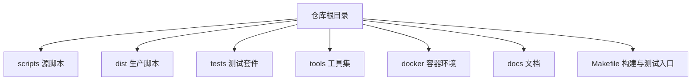
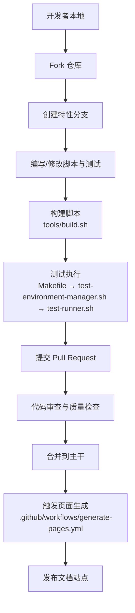
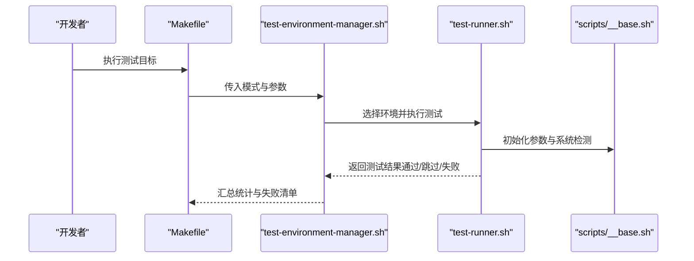
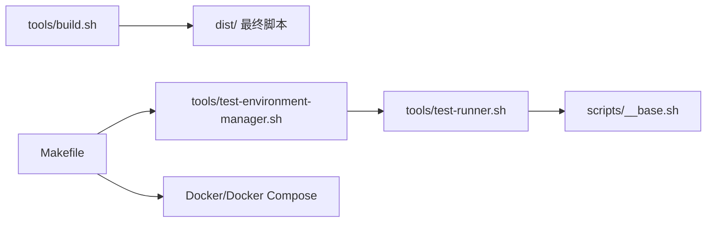

# 贡献流程

<cite>
**本文引用的文件**
- [README.md](file://README.md)
- [docs/README.md](file://docs/README.md)
- [Makefile](file://Makefile)
- [tools/build.sh](file://tools/build.sh)
- [tools/test-environment-manager.sh](file://tools/test-environment-manager.sh)
- [tools/test-runner.sh](file://tools/test-runner.sh)
- [scripts/__base.sh](file://scripts/__base.sh)
- [.github/workflows/generate-pages.yml](file://.github/workflows/generate-pages.yml)
</cite>

## 目录
1. [简介](#简介)
2. [项目结构](#项目结构)
3. [核心组件](#核心组件)
4. [架构总览](#架构总览)
5. [详细组件分析](#详细组件分析)
6. [依赖分析](#依赖分析)
7. [性能考虑](#性能考虑)
8. [故障排查指南](#故障排查指南)
9. [结论](#结论)
10. [附录](#附录)

## 简介
本指南面向希望为本项目做出贡献的开发者，系统阐述从 Fork 到 PR 合并的完整贡献流程；涵盖代码规范、测试与质量检查、文档更新、CI/CD 自动化、问题报告与功能请求提交规范，以及版本发布与变更日志维护流程。项目采用多平台脚本安装工具集合，通过构建与测试流水线确保在多种 Linux 发行版上的稳定性。

## 项目结构
项目采用按功能分层的组织方式：
- scripts：开发期源脚本（含通用基础模块）
- dist：生产可用的最终脚本（由构建工具生成）
- tests：覆盖安装与数据库同步场景的测试套件
- tools：构建与测试执行工具
- docker：多发行版容器化测试环境
- docs：项目文档与使用说明
- 根目录：顶层 Makefile 提供统一测试与构建入口

图示来源
- [Makefile:1-563](file://Makefile#L1-L563)
- [tools/build.sh:1-91](file://tools/build.sh#L1-L91)
- [tools/test-environment-manager.sh:1-334](file://tools/test-environment-manager.sh#L1-L334)

章节来源
- [docs/README.md:1-128](file://docs/README.md#L1-L128)
- [Makefile:1-563](file://Makefile#L1-L563)

## 核心组件
- 构建工具：将 scripts 下的源脚本合并生成 dist 下的可直接运行脚本，并赋予可执行权限。
- 测试框架：test-environment-manager 统一调度不同发行版容器中的 test-runner 执行测试，汇总结果并输出失败清单。
- 参数与环境：scripts/__base.sh 提供参数解析、系统检测、网络镜像切换等通用能力。
- Makefile：提供一键构建、一键测试、交互式容器、清理等常用命令。

章节来源
- [tools/build.sh:1-91](file://tools/build.sh#L1-L91)
- [tools/test-environment-manager.sh:1-334](file://tools/test-environment-manager.sh#L1-L334)
- [tools/test-runner.sh:1-156](file://tools/test-runner.sh#L1-L156)
- [scripts/__base.sh:1-1252](file://scripts/__base.sh#L1-L1252)
- [Makefile:1-563](file://Makefile#L1-L563)

## 架构总览
下图展示从本地开发到 CI/CD 页面生成的整体流程，包括构建、测试与文档发布的路径。

图示来源
- [tools/build.sh:1-91](file://tools/build.sh#L1-L91)
- [tools/test-environment-manager.sh:1-334](file://tools/test-environment-manager.sh#L1-L334)
- [tools/test-runner.sh:1-156](file://tools/test-runner.sh#L1-L156)
- [.github/workflows/generate-pages.yml](file://.github/workflows/generate-pages.yml)

## 详细组件分析

### 贡献流程与规范
- Fork 与分支
  - Fork 仓库后，在本地创建特性分支进行开发。
  - 分支命名建议遵循语义化前缀，如 feat/xxx、fix/xxx、docs/xxx。
- 提交规范
  - 提交信息应清晰描述变更目的与范围，避免空提交。
  - 变更需包含对应测试用例或更新现有测试。
- Pull Request 要求
  - PR 描述需说明背景、变更内容与影响范围。
  - 必须通过所有自动化测试并通过至少一名维护者审查。

章节来源
- [docs/README.md:117-124](file://docs/README.md#L117-L124)

### 开发环境搭建与工具配置
- 前置条件
  - 安装 Docker 与 docker-compose，用于容器化测试。
  - 确保网络可达，必要时使用网络参数优化下载速度。
- 本地构建
  - 使用构建工具生成 dist 下的最终脚本。
- 本地测试
  - 使用 Makefile 提供的测试目标在多发行版环境中验证脚本行为。
  - 支持指定网络配置、调试模式、输出目录等参数。

章节来源
- [docs/README.md:56-88](file://docs/README.md#L56-L88)
- [Makefile:1-563](file://Makefile#L1-L563)

### 代码审查标准与流程
- 质量检查
  - 代码风格与可读性：遵循脚本注释与函数命名约定。
  - 平台兼容性：确保在 Ubuntu/Debian/Fedora/RHEL 系列上均能正常工作。
- 测试验证
  - 所有新增或修改的功能必须配套测试用例。
  - 在 Makefile 提供的多环境测试矩阵中全部通过。
- 文档更新
  - 更新相关文档（如 overview 目录下的说明）以反映变更。

章节来源
- [docs/README.md:104-108](file://docs/README.md#L104-L108)
- [Makefile:84-532](file://Makefile#L84-L532)

### CI/CD 流水线与自动化测试
- 构建与测试
  - 构建：调用构建脚本生成 dist。
  - 测试：test-environment-manager 统一调度各发行版容器中的 test-runner 执行测试。
  - 结果汇总：统计通过/跳过/失败数量，并在失败时输出失败环境与参数。
- 文档发布
  - 触发页面生成工作流，自动部署文档站点。

图示来源
- [Makefile:84-532](file://Makefile#L84-L532)
- [tools/test-environment-manager.sh:1-334](file://tools/test-environment-manager.sh#L1-L334)
- [tools/test-runner.sh:1-156](file://tools/test-runner.sh#L1-L156)
- [scripts/__base.sh:1-1252](file://scripts/__base.sh#L1-L1252)

章节来源
- [Makefile:84-532](file://Makefile#L84-L532)
- [tools/test-environment-manager.sh:1-334](file://tools/test-environment-manager.sh#L1-L334)
- [tools/test-runner.sh:1-156](file://tools/test-runner.sh#L1-L156)
- [scripts/__base.sh:1-1252](file://scripts/__base.sh#L1-L1252)

### 问题报告与功能请求
- 问题报告
  - 提供操作系统版本、发行版代号、网络配置参数、测试日志路径等上下文信息。
  - 明确复现步骤与期望结果。
- 功能请求
  - 清晰描述需求背景、预期行为与影响范围。
  - 如可能，附带测试用例设计思路。

章节来源
- [docs/README.md:117-124](file://docs/README.md#L117-L124)

### 版本发布与变更日志
- 版本发布
  - 通过合并主干的变更进行发布，遵循最小化破坏性变更原则。
- 变更日志
  - 记录重大修复、新增支持的系统版本、脚本行为变更与已知限制。
  - 保持简洁明了，便于用户快速定位影响点。

章节来源
- [docs/README.md:125-128](file://docs/README.md#L125-L128)

## 依赖分析
- 构建链路
  - tools/build.sh 依赖 scripts 下的源脚本，生成 dist 下的最终脚本。
- 测试链路
  - Makefile 调用 tools/test-environment-manager.sh，后者根据模式与参数选择容器执行 tools/test-runner.sh。
  - test-runner.sh 依赖 scripts/__base.sh 进行参数解析与系统检测。
- 外部依赖
  - Docker 与 docker-compose 用于容器化测试。
  - 网络镜像参数用于优化中国区下载速度。

图示来源
- [tools/build.sh:1-91](file://tools/build.sh#L1-L91)
- [tools/test-environment-manager.sh:1-334](file://tools/test-environment-manager.sh#L1-L334)
- [tools/test-runner.sh:1-156](file://tools/test-runner.sh#L1-L156)
- [scripts/__base.sh:1-1252](file://scripts/__base.sh#L1-L1252)

章节来源
- [tools/build.sh:1-91](file://tools/build.sh#L1-L91)
- [tools/test-environment-manager.sh:1-334](file://tools/test-environment-manager.sh#L1-L334)
- [tools/test-runner.sh:1-156](file://tools/test-runner.sh#L1-L156)
- [scripts/__base.sh:1-1252](file://scripts/__base.sh#L1-L1252)

## 性能考虑
- 构建阶段
  - 合并脚本时仅处理非工具函数文件，避免重复导入与冗余内容。
- 测试阶段
  - 使用容器化隔离测试环境，减少对宿主机的依赖与污染。
  - 支持快速检查与并行化策略（在保证稳定性的前提下），优先修复失败环境。
- 网络优化
  - 提供网络参数以切换镜像源，缩短下载时间。

章节来源
- [tools/build.sh:55-81](file://tools/build.sh#L55-L81)
- [tools/test-environment-manager.sh:50-91](file://tools/test-environment-manager.sh#L50-L91)
- [docs/README.md:109-116](file://docs/README.md#L109-L116)

## 故障排查指南
- 构建失败
  - 检查 scripts 下是否存在缺失的依赖文件；确认输出目录权限。
- 测试失败
  - 查看 test-environment-manager 输出的失败环境与参数清单，定位具体容器与参数。
  - 使用 interactive 或 shell 目标进入容器进行交互式调试。
- 日志查看
  - 使用 results 目标汇总查看最近日志文件。
- 网络问题
  - 尝试添加网络参数切换镜像源；确认宿主机网络连通性。

章节来源
- [Makefile:534-563](file://Makefile#L534-L563)
- [tools/test-environment-manager.sh:184-220](file://tools/test-environment-manager.sh#L184-L220)

## 结论
本项目通过明确的贡献流程、完善的构建与测试体系、容器化多环境验证以及文档化的 CI/CD 流程，确保脚本在多平台上的稳定性与可维护性。建议贡献者严格遵循本文档的流程与规范，以提高审查效率与合并质量。

## 附录
- 快速参考
  - 构建：make build-scripts 或 ./tools/build.sh
  - 全量测试：make install-test-all 或 make syncdb-test-all
  - 交互式环境：make interactive
  - 清理：make clean

章节来源
- [docs/README.md:58-88](file://docs/README.md#L58-L88)
- [Makefile:48-563](file://Makefile#L48-L563)