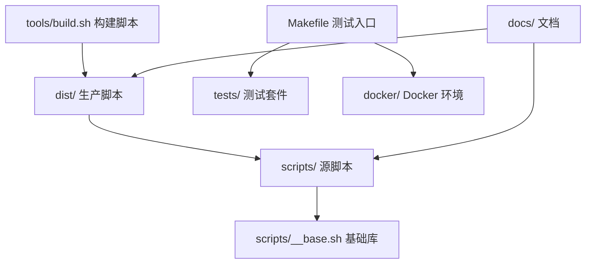
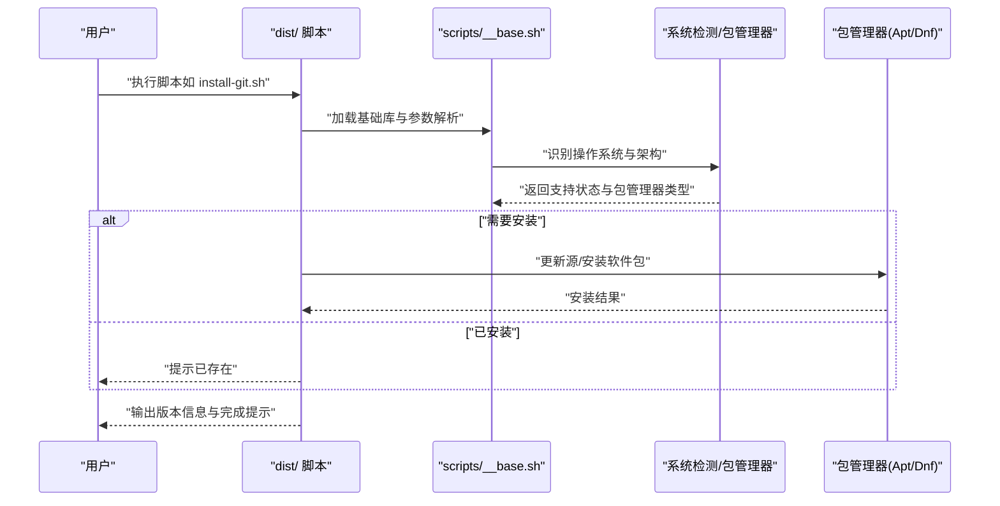
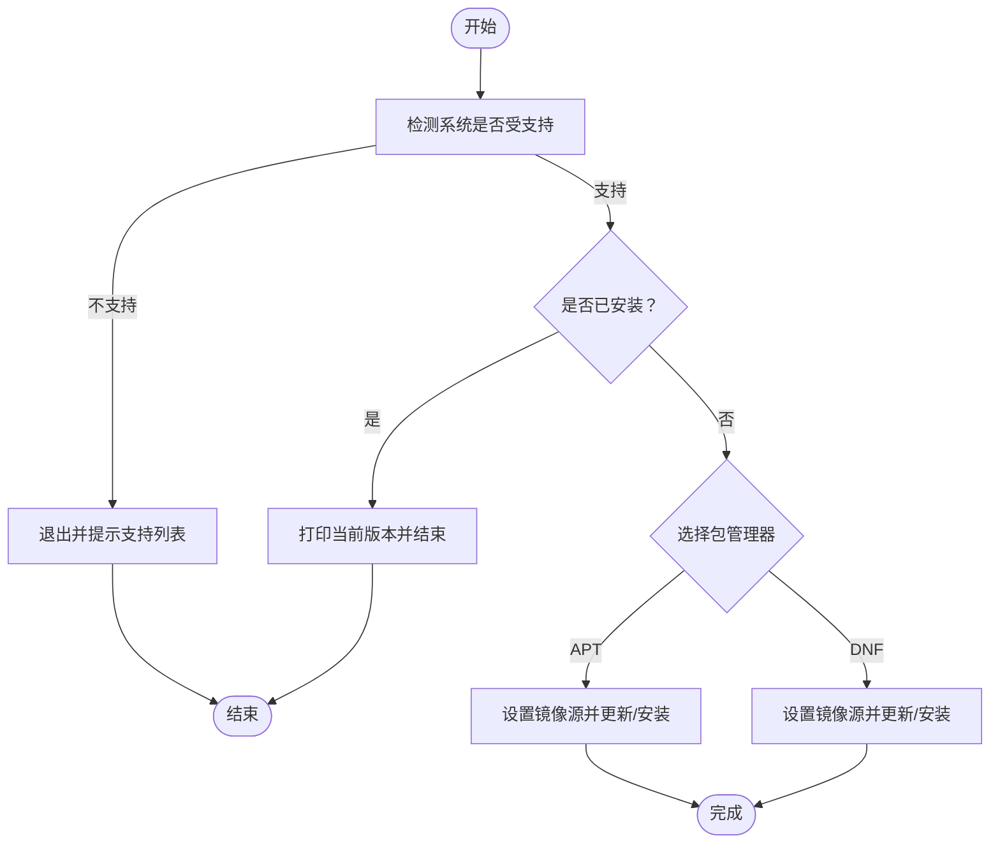
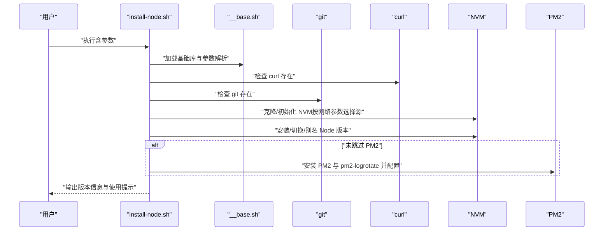
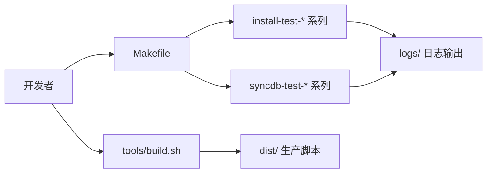
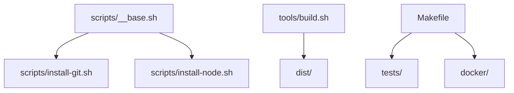

# 快速开始

<cite>
**本文引用的文件**
- [README.zh-CN.md](file://docs/README.zh-CN.md)
- [scripts/__base.sh](file://scripts/__base.sh)
- [scripts/install-git.sh](file://scripts/install-git.sh)
- [scripts/install-node.sh](file://scripts/install-node.sh)
- [Makefile](file://Makefile)
- [tools/build.sh](file://tools/build.sh)
- [tests/install-git/01-ok.sh](file://tests/install-git/01-ok.sh)
- [tests/install-git/02-install.sh](file://tests/install-git/02-install.sh)
- [tools/demo.sh](file://tools/demo.sh)
</cite>

## 目录
1. [简介](#简介)
2. [项目结构](#项目结构)
3. [核心组件](#核心组件)
4. [架构总览](#架构总览)
5. [详细组件分析](#详细组件分析)
6. [依赖关系分析](#依赖关系分析)
7. [性能考虑](#性能考虑)
8. [故障排除指南](#故障排除指南)
9. [结论](#结论)
10. [附录](#附录)

## 简介
HZ 9 Env Scripts 是一组面向多系统的“开箱即用”开发环境安装脚本集合，目标是让用户在多种 Linux 发行版与架构上，快速完成常用工具与运行时的安装。项目提供两套使用路径：
- 直接使用：从 dist/ 目录获取已合并的生产脚本，无需本地依赖，直接通过 curl/wget 获取并执行。
- 从源码开发：克隆仓库后，通过构建工具生成 dist/ 下的脚本，并可在 Docker 环境中进行全量测试。

## 项目结构
- dist/：最终生产脚本目录，可直接下载执行。
- scripts/：源脚本与基础库，每个安装脚本均依赖 __base.sh 提供的统一能力（参数解析、系统检测、日志输出、包管理适配等）。
- tools/：构建与演示脚本，如 build.sh 将 scripts/ 合并到 dist/；demo.sh 提供一键演示。
- tests/：按脚本维度组织的测试套件，覆盖“功能检查”和“真实安装验证”两类测试。
- docker/：测试用 Docker 镜像与编排配置。
- docs/：项目文档与使用说明。
- Makefile：集中化的构建与测试入口，支持多环境、多脚本的批量测试与日志记录。

图表来源
- [Makefile:1-563](file://Makefile#L1-L563)
- [tools/build.sh:1-91](file://tools/build.sh#L1-L91)
- [scripts/__base.sh:1-1252](file://scripts/__base.sh#L1-L1252)

章节来源
- [README.zh-CN.md:1-128](file://docs/README.zh-CN.md#L1-L128)
- [Makefile:1-563](file://Makefile#L1-L563)

## 核心组件
- 基础库 scripts/__base.sh
  - 统一参数解析与帮助输出，支持 --help/--debug/--network 等通用参数。
  - 系统识别与支持性判断，自动适配 APT/DNF 包管理器。
  - 日志与时间统计，支持调试模式下的详细输出。
- 安装脚本模板
  - 每个脚本定义自身名称、描述、支持系统列表与参数项，再调用基础库完成执行。
- 构建工具 tools/build.sh
  - 递归合并 scripts/ 下的脚本，将 source 引入的依赖一并内嵌，输出到 dist/ 并赋予可执行权限。
- 测试体系
  - tests/ 下按脚本分组的测试文件，覆盖“帮助/语法/可执行性”与“真实安装后的可用性校验”。

章节来源
- [scripts/__base.sh:1-1252](file://scripts/__base.sh#L1-L1252)
- [tools/build.sh:1-91](file://tools/build.sh#L1-L91)
- [tests/install-git/01-ok.sh:1-25](file://tests/install-git/01-ok.sh#L1-L25)
- [tests/install-git/02-install.sh:1-35](file://tests/install-git/02-install.sh#L1-L35)

## 架构总览
下图展示了“从 dist/ 脚本到实际安装”的端到端流程，以及与基础库、系统检测、包管理器的关系。

图表来源
- [scripts/install-git.sh:1-85](file://scripts/install-git.sh#L1-L85)
- [scripts/__base.sh:1-1252](file://scripts/__base.sh#L1-L1252)

## 详细组件分析

### 安装 Git 的完整流程（示例）
- 直接使用（推荐）
  - 通过 curl/wget 从 dist/ 直接获取并执行安装脚本。
  - 可选参数：--network=in-china（国内镜像优化）、--debug（调试输出）、--help（帮助）。
- 本地使用
  - 克隆仓库后，进入目录，直接执行 dist/install-git.sh 并传入所需参数。
- 实际安装逻辑
  - 若系统支持，脚本根据包管理器类型选择 apt/dnf 路径，设置镜像源（如指定 in-china），更新索引并安装。
  - 最终打印当前已安装版本，结束执行。

图表来源
- [scripts/install-git.sh:1-85](file://scripts/install-git.sh#L1-L85)
- [scripts/__base.sh:1-1252](file://scripts/__base.sh#L1-L1252)

章节来源
- [scripts/install-git.sh:1-85](file://scripts/install-git.sh#L1-L85)
- [docs/README.zh-CN.md:20-46](file://docs/README.zh-CN.md#L20-L46)

### Node.js 安装脚本（进阶示例）
- 支持参数
  - --network、--debug、--nvm-version、--node-version、--skip-pm2、--pm2-version。
- 关键流程
  - 检查 curl/git 是否存在；根据网络参数选择 NVM 源；安装/启用 NVM；安装指定版本 Node；可选安装 PM2 并配置日志轮转。
- 输出
  - 打印 NVM/Node/npm/pm2 版本信息，提供当前会话生效的使用指引。

图表来源
- [scripts/install-node.sh:1-202](file://scripts/install-node.sh#L1-L202)
- [scripts/__base.sh:1-1252](file://scripts/__base.sh#L1-L1252)

章节来源
- [scripts/install-node.sh:1-202](file://scripts/install-node.sh#L1-L202)

### 构建与测试流水线
- 构建
  - 使用 tools/build.sh 将 scripts/ 内容合并到 dist/，并赋予可执行权限。
- 测试
  - Makefile 提供统一入口，支持在单环境/全环境运行安装与数据库同步脚本测试，支持 NETWORK、DEBUG、OUTPUT 等参数传递。
  - tests/ 下的 01-ok.sh 侧重“脚本可用性检查”，02-install.sh 侧重“真实安装后校验”。

图表来源
- [Makefile:1-563](file://Makefile#L1-L563)
- [tools/build.sh:1-91](file://tools/build.sh#L1-L91)

章节来源
- [Makefile:1-563](file://Makefile#L1-L563)
- [tools/build.sh:1-91](file://tools/build.sh#L1-L91)
- [tests/install-git/01-ok.sh:1-25](file://tests/install-git/01-ok.sh#L1-L25)
- [tests/install-git/02-install.sh:1-35](file://tests/install-git/02-install.sh#L1-L35)

## 依赖关系分析
- dist/ 脚本依赖 scripts/__base.sh 提供的统一能力（参数解析、系统检测、日志、包管理器适配）。
- 安装脚本内部根据 USE_APT_GET_INSTALL/USE_DNF_INSTALL 判断走 apt/dnf 路径。
- 测试阶段依赖 Docker 环境与 Makefile 的任务编排，确保在多发行版上的一致性验证。

图表来源
- [scripts/__base.sh:1-1252](file://scripts/__base.sh#L1-L1252)
- [scripts/install-git.sh:1-85](file://scripts/install-git.sh#L1-L85)
- [scripts/install-node.sh:1-202](file://scripts/install-node.sh#L1-L202)
- [tools/build.sh:1-91](file://tools/build.sh#L1-L91)
- [Makefile:1-563](file://Makefile#L1-L563)

章节来源
- [scripts/__base.sh:1-1252](file://scripts/__base.sh#L1-L1252)
- [Makefile:1-563](file://Makefile#L1-L563)

## 性能考虑
- 国内网络优化：通过 --network=in-china 参数切换镜像源，显著提升下载速度与成功率。
- 构建产物合并：dist/ 脚本为独立可执行文件，避免运行时多次 source 引入带来的额外开销。
- 调试模式：--debug 可辅助定位问题，但会增加输出与耗时，建议仅在排查时开启。

## 故障排除指南
- 系统不受支持
  - 现象：脚本提示当前系统不受支持或打印支持列表。
  - 排查：确认操作系统版本与架构是否在 SUPPORT_OS_LIST 中；必要时联系维护者扩展支持。
- 无法联网或下载失败
  - 现象：安装过程中网络超时或包管理器更新失败。
  - 排查：尝试添加 --network=in-china；检查主机网络策略与 DNS 设置；必要时手动配置代理。
- 已安装但版本不符
  - 现象：脚本提示已安装但版本非预期。
  - 排查：根据脚本行为，可能需要重新安装指定版本；或调整默认别名。
- 权限不足
  - 现象：包管理器安装时报错。
  - 排查：确保以具备 sudo 权限的用户执行；或在容器中以 root 运行。
- 脚本不可执行
  - 现象：直接运行 dist/ 脚本报错。
  - 排查：确认 dist/ 脚本具备可执行权限；或通过 bash 显式执行。

章节来源
- [scripts/__base.sh:1-1252](file://scripts/__base.sh#L1-L1252)
- [scripts/install-git.sh:1-85](file://scripts/install-git.sh#L1-L85)
- [scripts/install-node.sh:1-202](file://scripts/install-node.sh#L1-L202)

## 结论
HZ 9 Env Scripts 通过统一的基础库与标准化的安装脚本，实现了在多发行版与架构上的“即取即用”。推荐优先使用 dist/ 目录的脚本以降低本地依赖成本；若需定制或贡献，可通过 scripts/ 与 Makefile 的测试体系进行验证与迭代。

## 附录

### 系统要求与前置条件
- 支持的操作系统
  - Ubuntu 20.04/22.04/24.04 AMD64
  - Debian 11.9/12.2 AMD64
  - Fedora 41 AMD64
  - Red Hat Enterprise Linux 8.10/9.6 AMD64
- 前置条件
  - 直接使用：无需本地依赖，仅需可访问互联网与 bash。
  - 本地开发：建议安装 make、Docker 与 docker-compose，以便使用 Makefile 的测试与构建流程。

章节来源
- [docs/README.zh-CN.md:47-55](file://docs/README.zh-CN.md#L47-L55)

### 参数与配置方法
- 通用参数
  - --help：打印帮助信息
  - --debug：启用调试输出
  - --network=in-china：使用国内镜像源（部分脚本）
- 脚本特有参数
  - install-git.sh：--git-version（指定版本，默认最新）
  - install-node.sh：--nvm-version、--node-version、--skip-pm2、--pm2-version
- 配置示例
  - 使用国内网络优化安装：curl .../dist/install-git.sh | bash -s -- --network=in-china
  - 启用调试模式：./dist/install-git.sh --debug

章节来源
- [scripts/install-git.sh:7-28](file://scripts/install-git.sh#L7-L28)
- [scripts/install-node.sh:7-17](file://scripts/install-node.sh#L7-L17)
- [docs/README.zh-CN.md:109-116](file://docs/README.zh-CN.md#L109-L116)

### 常见使用场景与最佳实践
- 场景一：首次环境初始化
  - 步骤：curl .../dist/install-git.sh | bash；随后安装其他工具。
  - 最佳实践：先安装基础工具（git/curl），再安装语言运行时（node）。
- 场景二：批量安装
  - 步骤：循环调用 curl .../dist/install-<tool>.sh | bash -s -- --network=in-china。
- 场景三：本地开发与贡献
  - 步骤：git clone 仓库；make build-scripts；make install-test-all；按需修改 scripts/ 并重新构建。

章节来源
- [docs/README.zh-CN.md:117-128](file://docs/README.zh-CN.md#L117-L128)
- [Makefile:84-297](file://Makefile#L84-L297)

### 第一个脚本的执行示例（安装 Git）
- 直接使用
  - curl -o- https://raw.githubusercontent.com/hz-9/env-scripts/master/dist/install-git.sh | bash
  - wget -qO- https://raw.githubusercontent.com/hz-9/env-scripts/master/dist/install-git.sh | bash
- 本地使用
  - git clone https://github.com/hz-9/env-scripts.git
  - cd env-scripts
  - ./dist/install-git.sh --help
  - ./dist/install-git.sh --network=in-china

章节来源
- [docs/README.zh-CN.md:20-46](file://docs/README.zh-CN.md#L20-L46)
- [tests/install-git/01-ok.sh:1-25](file://tests/install-git/01-ok.sh#L1-L25)
- [tests/install-git/02-install.sh:1-35](file://tests/install-git/02-install.sh#L1-L35)

### 开发与构建
- 构建脚本
  - make build-scripts 或 ./tools/build.sh
- 测试
  - make install-test-all 或 make install-test-single ENV=ubuntu22-04 SCRIPT=git
  - make interactive 启动交互式测试环境

章节来源
- [docs/README.zh-CN.md:56-89](file://docs/README.zh-CN.md#L56-L89)
- [Makefile:84-297](file://Makefile#L84-L297)
- [tools/demo.sh:1-101](file://tools/demo.sh#L1-L101)