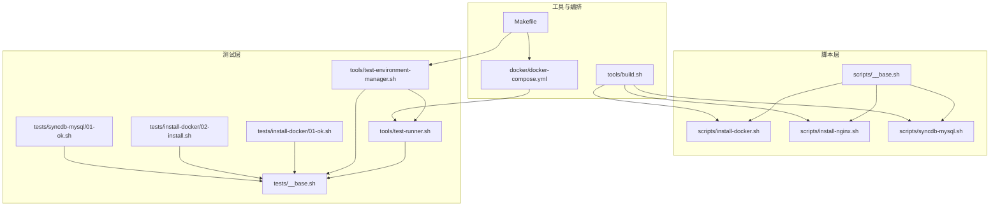
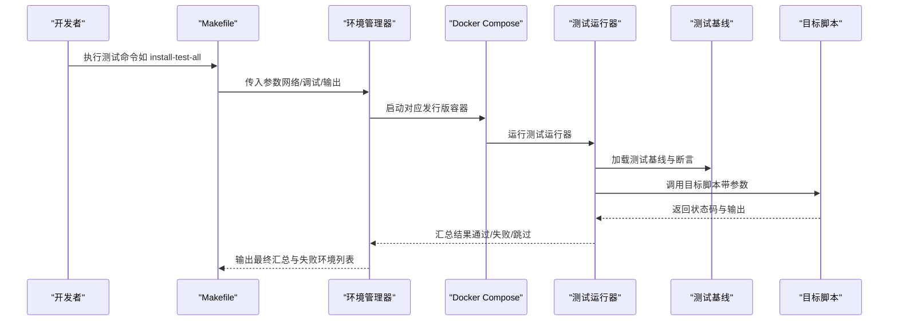
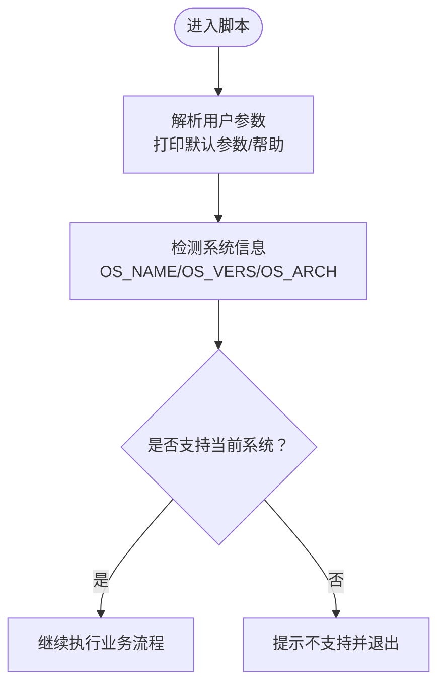
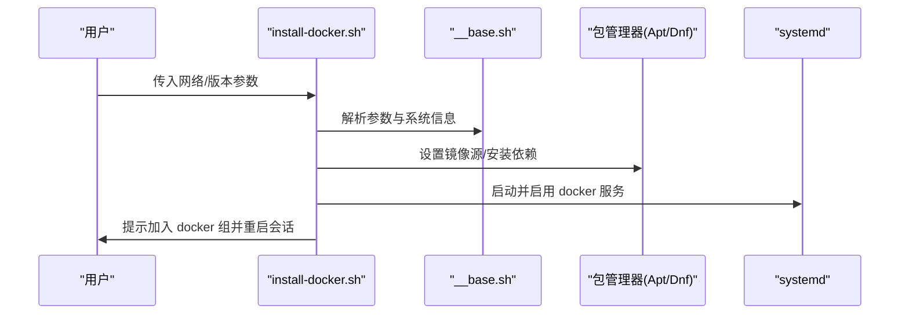
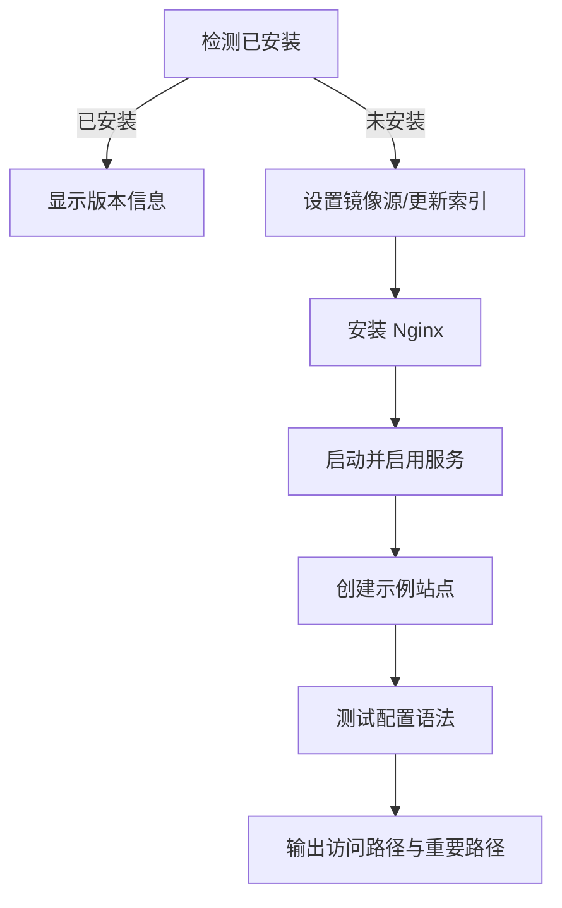
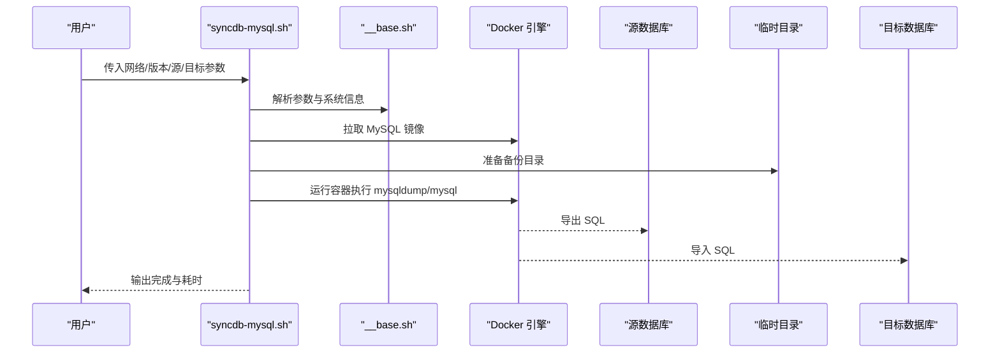
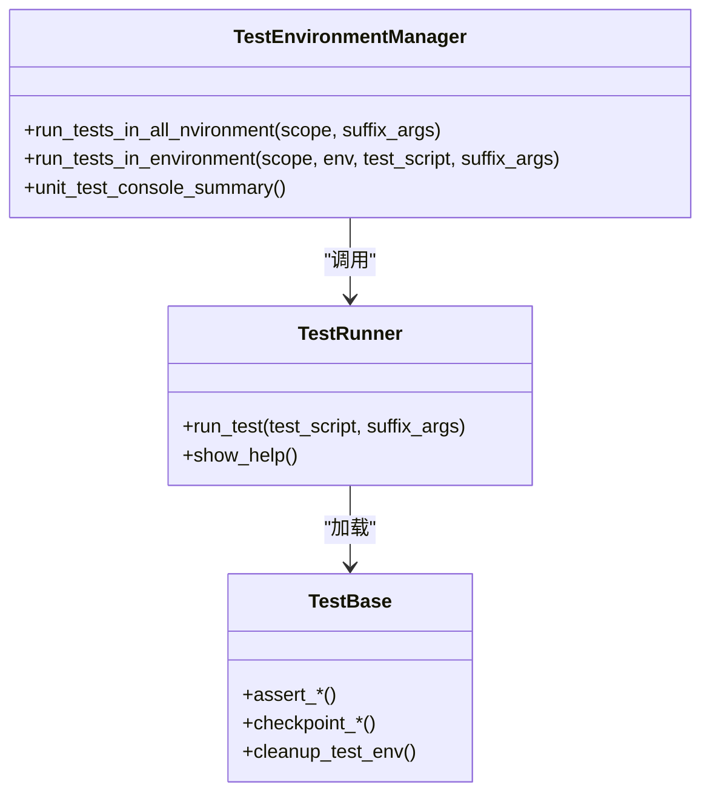
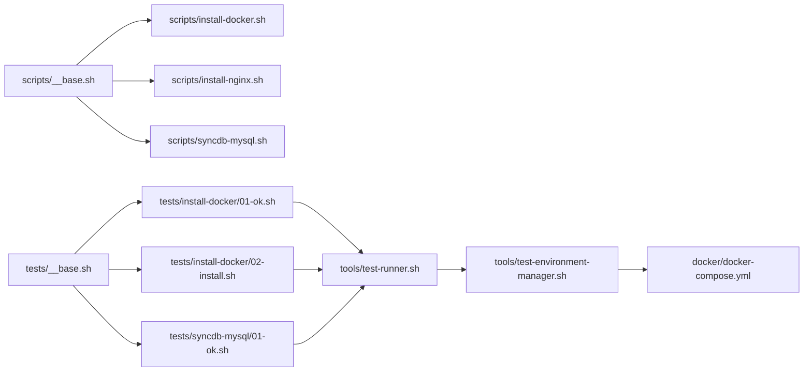

# 故障排除

<cite>
**本文引用的文件**
- [README.md](file://README.md)
- [scripts/__base.sh](file://scripts/__base.sh)
- [scripts/install-docker.sh](file://scripts/install-docker.sh)
- [scripts/install-nginx.sh](file://scripts/install-nginx.sh)
- [scripts/syncdb-mysql.sh](file://scripts/syncdb-mysql.sh)
- [tests/__base.sh](file://tests/__base.sh)
- [tools/test-runner.sh](file://tools/test-runner.sh)
- [tools/test-environment-manager.sh](file://tools/test-environment-manager.sh)
- [tools/build.sh](file://tools/build.sh)
- [Makefile](file://Makefile)
- [docker/docker-compose.yml](file://docker/docker-compose.yml)
- [tests/install-docker/01-ok.sh](file://tests/install-docker/01-ok.sh)
- [tests/install-docker/02-install.sh](file://tests/install-docker/02-install.sh)
- [tests/syncdb-mysql/01-ok.sh](file://tests/syncdb-mysql/01-ok.sh)
</cite>

## 目录
1. [简介](#简介)
2. [项目结构](#项目结构)
3. [核心组件](#核心组件)
4. [架构总览](#架构总览)
5. [详细组件分析](#详细组件分析)
6. [依赖关系分析](#依赖关系分析)
7. [性能考虑](#性能考虑)
8. [故障排除指南](#故障排除指南)
9. [结论](#结论)
10. [附录](#附录)

## 简介
本指南面向 HZ 9 Env Scripts 的使用者与维护者，聚焦于安装问题、网络配置问题、权限与安全问题、调试与日志分析、异常处理与预防、性能识别与优化、系统兼容性问题以及网络连接与防火墙配置等常见场景。文档基于仓库中的脚本与测试框架，提供可操作的诊断流程、工具使用方法与最佳实践。

## 项目结构
该仓库采用“脚本模块化 + 测试框架 + 容器化环境”的组织方式：
- scripts：通用基础库与各功能脚本（如安装 Docker、Nginx、数据库同步等）
- tests：按功能分组的测试套件，配合测试基线与断言函数
- tools：构建、运行测试与环境管理工具
- docker：多发行版容器镜像与 docker-compose 编排
- docs：文档与说明
- Makefile：统一的命令入口与日志输出

**图示来源**
- [scripts/__base.sh](file://scripts/__base.sh)
- [scripts/install-docker.sh](file://scripts/install-docker.sh)
- [scripts/install-nginx.sh](file://scripts/install-nginx.sh)
- [scripts/syncdb-mysql.sh](file://scripts/syncdb-mysql.sh)
- [tests/__base.sh](file://tests/__base.sh)
- [tools/test-runner.sh](file://tools/test-runner.sh)
- [tools/test-environment-manager.sh](file://tools/test-environment-manager.sh)
- [tools/build.sh](file://tools/build.sh)
- [Makefile](file://Makefile)
- [docker/docker-compose.yml](file://docker/docker-compose.yml)

**章节来源**
- [README.md](file://README.md)
- [Makefile](file://Makefile)

## 核心组件
- 通用基础库（参数解析、系统检测、控制台输出、包管理适配）：为所有脚本提供一致的参数、系统能力与日志格式化能力
- 功能脚本（安装 Docker/Nginx、数据库同步）：封装具体安装流程、网络镜像选择、服务启停与用户组加入等
- 测试框架（测试运行器、环境管理器、断言与检查点）：在多发行版容器中执行测试，记录结果并生成汇总
- 构建工具（合并脚本到 dist 目录）：将 scripts 下的脚本按依赖顺序合并，便于独立分发与测试
- 容器编排（docker-compose）：提供 Ubuntu/Debian/Fedora/RedHat 多版本测试环境，支持带 Docker 的环境用于数据库同步测试

**章节来源**
- [scripts/__base.sh](file://scripts/__base.sh)
- [tools/build.sh](file://tools/build.sh)
- [docker/docker-compose.yml](file://docker/docker-compose.yml)

## 架构总览
下图展示从命令入口到脚本执行与测试反馈的端到端流程：

**图示来源**
- [Makefile](file://Makefile)
- [tools/test-environment-manager.sh](file://tools/test-environment-manager.sh)
- [docker/docker-compose.yml](file://docker/docker-compose.yml)
- [tools/test-runner.sh](file://tools/test-runner.sh)
- [tests/__base.sh](file://tests/__base.sh)

## 详细组件分析

### 组件一：参数解析与系统检测（__base.sh）
- 参数解析：支持长/短选项、键值对、默认值打印与帮助输出
- 系统检测：识别 OS 名称/版本/架构，判断是否支持当前脚本；提供镜像源切换与包管理器适配
- 控制台输出：彩色日志、时间统计、调试开关、重定向输出以抑制噪声
- 包管理适配：APT/DNF 分支逻辑，镜像源替换（中国区）

**图示来源**
- [scripts/__base.sh](file://scripts/__base.sh)

**章节来源**
- [scripts/__base.sh](file://scripts/__base.sh)

### 组件二：安装 Docker（install-docker.sh）
- 支持 Ubuntu/Debian/Fedora/RedHat 系列
- 网络镜像选择：默认或中国区镜像源
- GPG 密钥与软件源写入、更新索引、安装组件与插件
- 服务启停与启用开机自启动、将当前用户加入 docker 组
- 建议：变更用户组后需重新登录生效

**图示来源**
- [scripts/install-docker.sh](file://scripts/install-docker.sh)
- [scripts/__base.sh](file://scripts/__base.sh)

**章节来源**
- [scripts/install-docker.sh](file://scripts/install-docker.sh)

### 组件三：安装 Nginx（install-nginx.sh）
- 支持 Ubuntu/Debian/Fedora/RedHat 系列
- 网络镜像选择与安装
- 启动并启用服务，创建示例站点，进行配置测试
- 建议：若需要开放防火墙，请结合系统防火墙策略（脚本注释了相关步骤）

**图示来源**
- [scripts/install-nginx.sh](file://scripts/install-nginx.sh)

**章节来源**
- [scripts/install-nginx.sh](file://scripts/install-nginx.sh)

### 组件四：数据库同步（syncdb-mysql.sh）
- 依赖 Docker 存在与可用
- 拉取指定版本 MySQL 镜像
- 使用临时目录导出/导入数据，完成跨主机同步
- 建议：确保网络连通与凭据正确，必要时开启本地镜像快速检测

**图示来源**
- [scripts/syncdb-mysql.sh](file://scripts/syncdb-mysql.sh)
- [scripts/__base.sh](file://scripts/__base.sh)

**章节来源**
- [scripts/syncdb-mysql.sh](file://scripts/syncdb-mysql.sh)

### 组件五：测试框架与环境管理（test-runner.sh、test-environment-manager.sh、tests/__base.sh）
- 测试运行器：执行单个测试文件，捕获输出与退出码，统计耗时，区分跳过/通过/失败
- 环境管理器：根据模式（all/all-env/all-script/single）在多发行版容器中执行测试，汇总结果并列出失败环境
- 测试基线：提供断言（文件存在/目录存在/进程运行/字符串包含）、检查点（开始/完成/跳过/错误）、清理临时目录等

**图示来源**
- [tools/test-runner.sh](file://tools/test-runner.sh)
- [tools/test-environment-manager.sh](file://tools/test-environment-manager.sh)
- [tests/__base.sh](file://tests/__base.sh)

**章节来源**
- [tools/test-runner.sh](file://tools/test-runner.sh)
- [tools/test-environment-manager.sh](file://tools/test-environment-manager.sh)
- [tests/__base.sh](file://tests/__base.sh)

## 依赖关系分析
- 脚本依赖关系：各功能脚本均 source 基础库；测试脚本依赖测试基线与公共断言
- 工具链依赖：Makefile 统一调度构建与测试；docker-compose 提供多发行版容器环境
- 运行时依赖：安装脚本依赖包管理器与系统服务；数据库同步依赖 Docker 可用

**图示来源**
- [scripts/__base.sh](file://scripts/__base.sh)
- [scripts/install-docker.sh](file://scripts/install-docker.sh)
- [scripts/install-nginx.sh](file://scripts/install-nginx.sh)
- [scripts/syncdb-mysql.sh](file://scripts/syncdb-mysql.sh)
- [tests/__base.sh](file://tests/__base.sh)
- [tests/install-docker/01-ok.sh](file://tests/install-docker/01-ok.sh)
- [tests/install-docker/02-install.sh](file://tests/install-docker/02-install.sh)
- [tests/syncdb-mysql/01-ok.sh](file://tests/syncdb-mysql/01-ok.sh)
- [tools/test-runner.sh](file://tools/test-runner.sh)
- [tools/test-environment-manager.sh](file://tools/test-environment-manager.sh)
- [docker/docker-compose.yml](file://docker/docker-compose.yml)

**章节来源**
- [Makefile](file://Makefile)
- [docker/docker-compose.yml](file://docker/docker-compose.yml)

## 性能考虑
- 日志与输出：调试模式下输出更详细，非调试模式将后台输出重定向至空设备以减少噪声
- 镜像源与缓存：脚本内置镜像源替换逻辑，建议在受限网络环境下使用“中国区”网络配置
- 容器缓存：环境管理器在不同发行版上对包管理器缓存策略做了适配，避免频繁下载
- 并发与批处理：通过 Makefile 的批量测试目标一次性触发多环境测试，提高效率

**章节来源**
- [scripts/__base.sh](file://scripts/__base.sh)
- [tests/__base.sh](file://tests/__base.sh)
- [Makefile](file://Makefile)

## 故障排除指南

### 一、安装问题
- 症状：脚本报错提示不支持当前系统
  - 排查要点：确认 OS 名称/版本/架构是否在脚本 SUPPORT_OS_LIST 中
  - 处理建议：升级脚本或在受支持环境中执行
  - 参考路径：[scripts/install-docker.sh](file://scripts/install-docker.sh)，[scripts/install-nginx.sh](file://scripts/install-nginx.sh)，[scripts/syncdb-mysql.sh](file://scripts/syncdb-mysql.sh)
- 症状：安装前缺少必要依赖（如 ca-certificates、curl）
  - 排查要点：脚本会在安装前检测依赖是否存在
  - 处理建议：先执行相应安装脚本（如 curl），再重试
  - 参考路径：[scripts/install-docker.sh](file://scripts/install-docker.sh)
- 症状：Docker 无法启动或无法加入 docker 组
  - 排查要点：确认 systemd 服务状态、用户组成员
  - 处理建议：重新登录会话或手动刷新 PATH/hash
  - 参考路径：[scripts/install-docker.sh](file://scripts/install-docker.sh)
- 症状：Nginx 无法启动或配置测试失败
  - 排查要点：检查服务状态、配置文件语法与站点目录权限
  - 处理建议：使用 systemctl status/nginx -t 检查
  - 参考路径：[scripts/install-nginx.sh](file://scripts/install-nginx.sh)

**章节来源**
- [scripts/install-docker.sh](file://scripts/install-docker.sh)
- [scripts/install-nginx.sh](file://scripts/install-nginx.sh)

### 二、网络配置问题
- 症状：安装过程中超时或下载失败
  - 排查要点：检查网络环境与镜像源配置
  - 处理建议：使用“中国区”网络配置参数；在受限网络下预拉取镜像
  - 参考路径：[scripts/install-docker.sh](file://scripts/install-docker.sh)，[scripts/install-nginx.sh](file://scripts/install-nginx.sh)，[scripts/syncdb-mysql.sh](file://scripts/syncdb-mysql.sh)
- 症状：数据库同步失败（网络不可达/凭据错误）
  - 排查要点：核对源/目标主机、端口、用户名与密码
  - 处理建议：在本地容器内验证连通性与凭据
  - 参考路径：[scripts/syncdb-mysql.sh](file://scripts/syncdb-mysql.sh)

**章节来源**
- [scripts/install-docker.sh](file://scripts/install-docker.sh)
- [scripts/install-nginx.sh](file://scripts/install-nginx.sh)
- [scripts/syncdb-mysql.sh](file://scripts/syncdb-mysql.sh)

### 三、权限与安全问题
- 症状：sudo 权限不足导致安装失败
  - 排查要点：确认执行用户具备 sudo 权限
  - 处理建议：以具备 sudo 权限的用户执行
- 症状：Docker 用户组权限未生效
  - 排查要点：确认当前用户已在 docker 组中
  - 处理建议：重新登录或手动刷新会话
  - 参考路径：[scripts/install-docker.sh](file://scripts/install-docker.sh)

**章节来源**
- [scripts/install-docker.sh](file://scripts/install-docker.sh)

### 四、调试模式与日志分析
- 调试模式
  - 在脚本中通过参数控制调试输出与后台输出重定向
  - 参考路径：[scripts/__base.sh](file://scripts/__base.sh)
- 日志收集
  - Makefile 提供统一的日志输出机制，测试结果保存在 logs 目录
  - 参考路径：[Makefile](file://Makefile)
- 测试运行器输出
  - 测试运行器会实时输出并统计耗时，区分跳过/通过/失败
  - 参考路径：[tools/test-runner.sh](file://tools/test-runner.sh)
- 环境管理器汇总
  - 环境管理器输出最终汇总与失败环境列表
  - 参考路径：[tools/test-environment-manager.sh](file://tools/test-environment-manager.sh)

**章节来源**
- [scripts/__base.sh](file://scripts/__base.sh)
- [Makefile](file://Makefile)
- [tools/test-runner.sh](file://tools/test-runner.sh)
- [tools/test-environment-manager.sh](file://tools/test-environment-manager.sh)

### 五、错误诊断标准流程
- 步骤一：确认系统支持与参数正确
  - 使用脚本帮助输出与系统检测
  - 参考路径：[scripts/__base.sh](file://scripts/__base.sh)
- 步骤二：在受控容器环境中复现
  - 使用 docker-compose 提供的多发行版环境
  - 参考路径：[docker/docker-compose.yml](file://docker/docker-compose.yml)
- 步骤三：启用调试模式并收集日志
  - 使用 Makefile 或测试运行器的调试参数
  - 参考路径：[Makefile](file://Makefile)，[tools/test-runner.sh](file://tools/test-runner.sh)
- 步骤四：定位失败原因（网络/权限/依赖/服务）
  - 结合测试基线断言与环境管理器失败列表
  - 参考路径：[tests/__base.sh](file://tests/__base.sh)，[tools/test-environment-manager.sh](file://tools/test-environment-manager.sh)

**章节来源**
- [scripts/__base.sh](file://scripts/__base.sh)
- [docker/docker-compose.yml](file://docker/docker-compose.yml)
- [Makefile](file://Makefile)
- [tools/test-runner.sh](file://tools/test-runner.sh)
- [tests/__base.sh](file://tests/__base.sh)
- [tools/test-environment-manager.sh](file://tools/test-environment-manager.sh)

### 六、异常情况处理与预防
- 预防措施
  - 在受限网络下优先使用“中国区”镜像配置
  - 预先安装必要依赖（如 curl、ca-certificates）
  - 在数据库同步前准备临时目录与权限
- 异常处理
  - 安装失败：查看测试运行器输出与环境管理器汇总
  - 服务启动失败：检查 systemd 状态与日志
  - 权限问题：确认用户组与会话刷新

**章节来源**
- [scripts/install-docker.sh](file://scripts/install-docker.sh)
- [scripts/install-nginx.sh](file://scripts/install-nginx.sh)
- [scripts/syncdb-mysql.sh](file://scripts/syncdb-mysql.sh)
- [tools/test-runner.sh](file://tools/test-runner.sh)
- [tools/test-environment-manager.sh](file://tools/test-environment-manager.sh)

### 七、系统兼容性问题
- 症状：脚本提示不支持当前操作系统
  - 排查要点：确认 OS_NAME/OS_VERS/OS_ARCH 是否在 SUPPORT_OS_LIST
  - 处理建议：在受支持的发行版/版本上执行
  - 参考路径：[scripts/install-docker.sh](file://scripts/install-docker.sh)，[scripts/install-nginx.sh](file://scripts/install-nginx.sh)，[scripts/syncdb-mysql.sh](file://scripts/syncdb-mysql.sh)

**章节来源**
- [scripts/install-docker.sh](file://scripts/install-docker.sh)
- [scripts/install-nginx.sh](file://scripts/install-nginx.sh)
- [scripts/syncdb-mysql.sh](file://scripts/syncdb-mysql.sh)

### 八、网络连接与防火墙配置
- 症状：Nginx 无法对外提供服务
  - 排查要点：检查系统防火墙策略（ufw/firewalld）
  - 处理建议：开放 http/https 服务或相应端口
  - 参考路径：[scripts/install-nginx.sh](file://scripts/install-nginx.sh)

**章节来源**
- [scripts/install-nginx.sh](file://scripts/install-nginx.sh)

### 九、日志收集与分析方法
- 收集
  - 使用 Makefile 的测试目标自动输出日志文件
  - 通过环境管理器查看失败环境详情
- 分析
  - 关注测试运行器的耗时与退出码
  - 对照测试基线断言定位失败点

**章节来源**
- [Makefile](file://Makefile)
- [tools/test-environment-manager.sh](file://tools/test-environment-manager.sh)
- [tools/test-runner.sh](file://tools/test-runner.sh)
- [tests/__base.sh](file://tests/__base.sh)

### 十、社区支持与问题报告
- 文档入口与在线文档链接
  - 参考路径：[README.md](file://README.md)

**章节来源**
- [README.md](file://README.md)

## 结论
本指南围绕 HZ 9 Env Scripts 的安装、网络、权限、调试与日志、异常处理、性能优化、兼容性与网络防火墙等方面提供了系统化的排查思路与实操建议。建议在受控容器环境中复现问题，并结合测试框架的断言与汇总输出快速定位根因。

## 附录

### A. 常用命令速查
- 构建脚本到 dist 目录：make build-scripts
- 构建镜像：make build-images
- 在所有环境运行安装测试：make install-test-all
- 在指定环境运行安装测试：make install-test-all-script ENV=ubuntu22-04
- 在指定脚本运行安装测试：make install-test-all-env SCRIPT=git
- 在指定文件运行安装测试：make install-test-file ENV=ubuntu22-04 FILE=tests/install-git/01-ok.sh
- 查看日志：make logs
- 清理资源：make clean

**章节来源**
- [Makefile](file://Makefile)

### B. 关键脚本参数参考
- 安装脚本通用参数：--help/-h、--debug、--network（default/in-china）
- 数据库同步脚本参数：--from-hostname/--from-port/--from-username/--from-password/--from-database、--to-hostname/--to-port/--to-username/--to-password/--to-database、--db-version、--docker-image-quick-check、--temp
- 参考路径：[scripts/install-docker.sh](file://scripts/install-docker.sh)，[scripts/install-nginx.sh](file://scripts/install-nginx.sh)，[scripts/syncdb-mysql.sh](file://scripts/syncdb-mysql.sh)

**章节来源**
- [scripts/install-docker.sh](file://scripts/install-docker.sh)
- [scripts/install-nginx.sh](file://scripts/install-nginx.sh)
- [scripts/syncdb-mysql.sh](file://scripts/syncdb-mysql.sh)