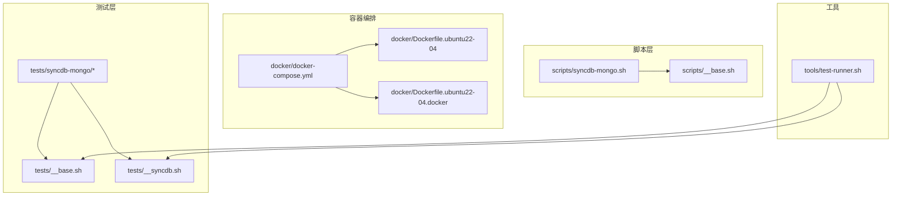
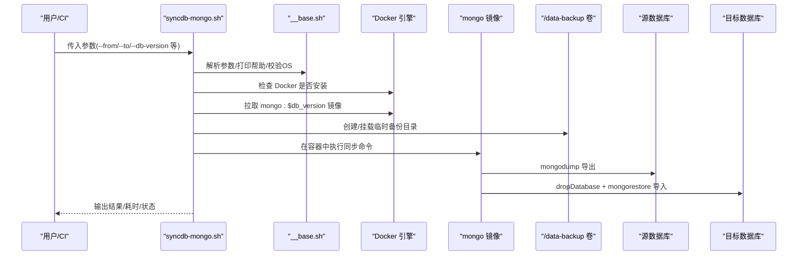
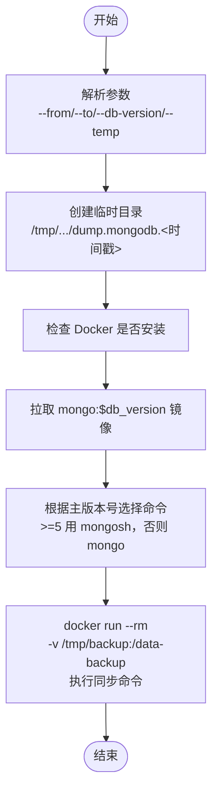
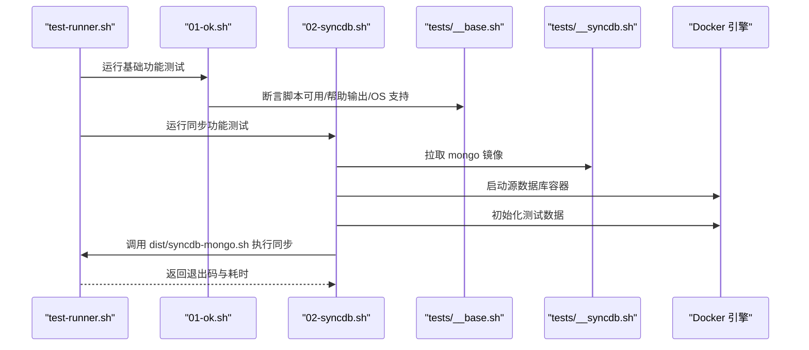
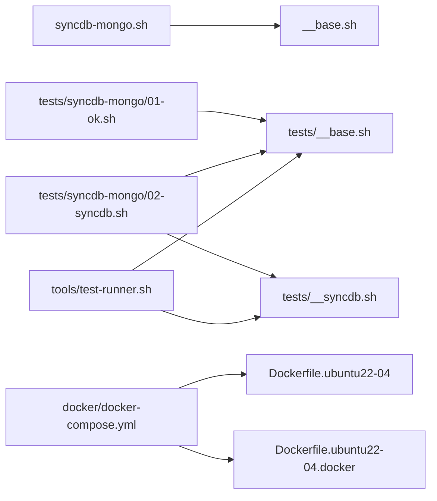

# MongoDB 同步架构

<cite>
**本文引用的文件列表**
- [scripts/syncdb-mongo.sh](file://scripts/syncdb-mongo.sh)
- [scripts/__base.sh](file://scripts/__base.sh)
- [docker/docker-compose.yml](file://docker/docker-compose.yml)
- [docker/Dockerfile.ubuntu22-04](file://docker/Dockerfile.ubuntu22-04)
- [docker/Dockerfile.ubuntu22-04.docker](file://docker/Dockerfile.ubuntu22-04.docker)
- [tests/syncdb-mongo/__base.sh](file://tests/syncdb-mongo/__base.sh)
- [tests/syncdb-mongo/01-ok.sh](file://tests/syncdb-mongo/01-ok.sh)
- [tests/syncdb-mongo/02-syncdb.sh](file://tests/syncdb-mongo/02-syncdb.sh)
- [tests/__syncdb.sh](file://tests/__syncdb.sh)
- [tests/__base.sh](file://tests/__base.sh)
- [tools/test-runner.sh](file://tools/test-runner.sh)
</cite>

## 目录
1. [简介](#简介)
2. [项目结构](#项目结构)
3. [核心组件](#核心组件)
4. [架构总览](#架构总览)
5. [详细组件分析](#详细组件分析)
6. [依赖关系分析](#依赖关系分析)
7. [性能考虑](#性能考虑)
8. [故障排查指南](#故障排查指南)
9. [结论](#结论)
10. [附录](#附录)

## 简介
本文件面向 MongoDB 数据库同步架构，系统性解析基于 Docker 的 MongoDB 同步脚本实现，涵盖：
- mongodump/mongorestore 的数据导出与导入机制
- Docker 容器化同步流程、镜像拉取与卷挂载
- 参数配置体系（源/目标数据库连接与认证）
- 数据库版本检测与适配策略（mongosh 与 mongo 的选择）
- 使用示例、配置指南与测试验证
- 性能优化建议与数据一致性保障方案

## 项目结构
该项目采用“脚本 + Docker + 测试”的分层组织方式：
- scripts：核心同步脚本与通用基础模块
- docker：多发行版 Dockerfile 与 docker-compose 编排
- tests：针对各数据库类型的同步测试套件
- tools：测试运行器与环境准备工具
- docs：项目文档与说明

图表来源
- [scripts/syncdb-mongo.sh:1-144](file://scripts/syncdb-mongo.sh#L1-L144)
- [scripts/__base.sh:1-1252](file://scripts/__base.sh#L1-L1252)
- [docker/docker-compose.yml:1-297](file://docker/docker-compose.yml#L1-L297)
- [docker/Dockerfile.ubuntu22-04:1-33](file://docker/Dockerfile.ubuntu22-04#L1-L33)
- [docker/Dockerfile.ubuntu22-04.docker:1-52](file://docker/Dockerfile.ubuntu22-04.docker#L1-L52)
- [tests/syncdb-mongo/__base.sh:1-109](file://tests/syncdb-mongo/__base.sh#L1-L109)
- [tests/syncdb-mongo/01-ok.sh:1-25](file://tests/syncdb-mongo/01-ok.sh#L1-L25)
- [tests/syncdb-mongo/02-syncdb.sh:1-96](file://tests/syncdb-mongo/02-syncdb.sh#L1-L96)
- [tests/__syncdb.sh:1-47](file://tests/__syncdb.sh#L1-L47)
- [tests/__base.sh:1-464](file://tests/__base.sh#L1-L464)
- [tools/test-runner.sh:1-156](file://tools/test-runner.sh#L1-L156)

章节来源
- [scripts/syncdb-mongo.sh:1-144](file://scripts/syncdb-mongo.sh#L1-L144)
- [docker/docker-compose.yml:1-297](file://docker/docker-compose.yml#L1-L297)

## 核心组件
- 同步脚本：负责参数解析、Docker 环境校验、镜像拉取、临时目录管理、执行同步命令
- 基础模块：提供参数解析、操作系统识别、输出日志、Docker 镜像拉取等通用能力
- 测试框架：统一的测试基座、断言与报告，支持多 OS 与 Docker 环境
- 容器编排：多发行版 Dockerfile 与 docker-compose，覆盖 Ubuntu/Debian/Fedora/RedHat 及其 Docker CE/Compose 场景

章节来源
- [scripts/syncdb-mongo.sh:9-44](file://scripts/syncdb-mongo.sh#L9-L44)
- [scripts/__base.sh:478-742](file://scripts/__base.sh#L478-L742)
- [tests/__base.sh:212-275](file://tests/__base.sh#L212-L275)
- [docker/docker-compose.yml:1-297](file://docker/docker-compose.yml#L1-L297)

## 架构总览
整体流程分为“参数解析 → 环境校验 → 镜像拉取 → 临时目录准备 → 执行同步 → 结束收尾”。同步过程在容器内完成，通过卷挂载共享临时备份目录，确保数据安全与可追溯。

图表来源
- [scripts/syncdb-mongo.sh:48-136](file://scripts/syncdb-mongo.sh#L48-L136)
- [scripts/__base.sh:1202-1236](file://scripts/__base.sh#L1202-L1236)

## 详细组件分析

### 同步脚本（syncdb-mongo.sh）
- 参数定义：包含网络环境、数据库版本、源/目标主机、端口、用户名、密码、数据库名、临时目录等
- 支持系统：Ubuntu/Debian/Fedora/RedHat 多版本
- 关键流程：
  - 临时目录与时间戳子目录创建
  - Docker 与 Compose 版本信息输出
  - 拉取 mongo:$db_version 镜像
  - 根据版本选择 mongosh 或 mongo
  - 在容器内执行：mongodump 导出 → dropDatabase → mongorestore 导入
  - 通过卷挂载 /data-backup 实现跨容器持久化

图表来源
- [scripts/syncdb-mongo.sh:50-136](file://scripts/syncdb-mongo.sh#L50-L136)

章节来源
- [scripts/syncdb-mongo.sh:9-44](file://scripts/syncdb-mongo.sh#L9-L44)
- [scripts/syncdb-mongo.sh:50-136](file://scripts/syncdb-mongo.sh#L50-L136)

### 基础模块（__base.sh）
- 参数解析：支持长/短参数、默认值、帮助输出
- 操作系统识别：自动判断 OS 名称/版本/架构，并与支持列表比对
- 日志输出：彩色标题、键值对、耗时统计、调试开关
- Docker 镜像拉取：本地快速检查与远程拉取逻辑
- 其他：APT/DNF 包管理、镜像源切换、下载工具等（用于通用场景）

章节来源
- [scripts/__base.sh:478-742](file://scripts/__base.sh#L478-L742)
- [scripts/__base.sh:1202-1236](file://scripts/__base.sh#L1202-L1236)

### 测试框架与用例（tests）
- 统一测试基座：断言、计时、报告、清理、Docker 镜像拉取
- MongoDB 同步测试：
  - 01-ok：验证脚本存在、可执行、语法正确、帮助输出、OS 支持
  - 02-syncdb：启动容器、初始化数据、执行同步、校验结果
- 测试运行器：支持按目录/文件/脚本维度运行，传递网络与调试参数

图表来源
- [tools/test-runner.sh:87-148](file://tools/test-runner.sh#L87-L148)
- [tests/syncdb-mongo/01-ok.sh:12-18](file://tests/syncdb-mongo/01-ok.sh#L12-L18)
- [tests/syncdb-mongo/02-syncdb.sh:13-95](file://tests/syncdb-mongo/02-syncdb.sh#L13-L95)
- [tests/__syncdb.sh:20-46](file://tests/__syncdb.sh#L20-L46)

章节来源
- [tests/syncdb-mongo/01-ok.sh:1-25](file://tests/syncdb-mongo/01-ok.sh#L1-L25)
- [tests/syncdb-mongo/02-syncdb.sh:1-96](file://tests/syncdb-mongo/02-syncdb.sh#L1-L96)
- [tests/__base.sh:212-275](file://tests/__base.sh#L212-L275)
- [tests/__syncdb.sh:1-47](file://tests/__syncdb.sh#L1-L47)

### 容器化与编排（Docker）
- 多发行版 Dockerfile：基础镜像、非交互安装、权限与用户设置、工作目录与入口命令
- docker-compose：构建多 OS 测试环境，挂载宿主机 Docker Socket，支持交互式容器
- Docker CE/Compose 场景：提供带 Docker 官方仓库安装与 Compose 插件的专用镜像

章节来源
- [docker/Dockerfile.ubuntu22-04:1-33](file://docker/Dockerfile.ubuntu22-04#L1-L33)
- [docker/Dockerfile.ubuntu22-04.docker:1-52](file://docker/Dockerfile.ubuntu22-04.docker#L1-L52)
- [docker/docker-compose.yml:1-297](file://docker/docker-compose.yml#L1-L297)

## 依赖关系分析
- 同步脚本依赖基础模块的参数解析、日志与 Docker 镜像拉取能力
- 测试用例依赖统一测试基座与同步测试基座，调用 dist 中的同步脚本
- docker-compose 与 Dockerfile 提供一致的测试环境，便于 CI/CD 集成

图表来源
- [scripts/syncdb-mongo.sh:46](file://scripts/syncdb-mongo.sh#L46)
- [tests/syncdb-mongo/01-ok.sh:6-7](file://tests/syncdb-mongo/01-ok.sh#L6-L7)
- [tests/syncdb-mongo/02-syncdb.sh:6-8](file://tests/syncdb-mongo/02-syncdb.sh#L6-L8)
- [tools/test-runner.sh:6](file://tools/test-runner.sh#L6)
- [docker/docker-compose.yml:1-297](file://docker/docker-compose.yml#L1-L297)

章节来源
- [scripts/syncdb-mongo.sh:46](file://scripts/syncdb-mongo.sh#L46)
- [tests/syncdb-mongo/01-ok.sh:6-7](file://tests/syncdb-mongo/01-ok.sh#L6-L7)
- [tests/syncdb-mongo/02-syncdb.sh:6-8](file://tests/syncdb-mongo/02-syncdb.sh#L6-L8)
- [tools/test-runner.sh:6](file://tools/test-runner.sh#L6)

## 性能考虑
- 并发与资源：容器内执行同步，建议在 CI 中限制并发度，避免磁盘与网络争用
- 传输路径：通过卷挂载 /data-backup，减少网络传输；如需跨主机，建议使用高速网络或压缩传输
- 版本适配：高版本使用 mongosh，低版本使用 mongo，避免兼容性问题导致重试
- 临时目录：合理设置 --temp，确保磁盘空间充足，避免 IO 抖动
- 增量策略：当前实现为全量导出/导入；如需增量，可在业务侧引入时间戳字段或变更流，配合自定义脚本实现

## 故障排查指南
- Docker 未安装：脚本会直接提示并退出，请先安装 Docker 与 Compose
- 镜像拉取失败：检查网络与镜像名称；可启用本地快速检查以避免重复拉取
- 权限与认证：确认 --from/--to 的用户名/密码与认证数据库（默认 admin）正确
- 版本不匹配：当 db-version 与本地镜像架构不一致时，会触发重新拉取
- 数据库不可达：在测试环境中可通过等待机制与 ping/listDatabases 验证连通性

章节来源
- [scripts/syncdb-mongo.sh:85-98](file://scripts/syncdb-mongo.sh#L85-L98)
- [scripts/__base.sh:1210-1236](file://scripts/__base.sh#L1210-L1236)
- [tests/syncdb-mongo/__base.sh:78-109](file://tests/syncdb-mongo/__base.sh#L78-L109)

## 结论
该架构以 Docker 为核心，结合统一参数解析与测试框架，实现了跨平台、可复用的 MongoDB 同步方案。通过镜像拉取、卷挂载与容器内执行，既保证了环境一致性，又简化了部署与运维。未来可扩展增量同步、索引重建策略与更细粒度的错误恢复机制。

## 附录

### 参数配置系统
- 网络环境：--network（支持 default/in-china，影响镜像源）
- 数据库版本：--db-version（决定使用 mongosh 或 mongo）
- 源数据库：--from-hostname/--from-port/--from-username/--from-password/--from-database
- 目标数据库：--to-hostname/--to-port/--to-username/--to-password/--to-database
- 临时目录：--temp（默认 /tmp 下的时间戳子目录）

章节来源
- [scripts/syncdb-mongo.sh:9-30](file://scripts/syncdb-mongo.sh#L9-L30)

### 数据库版本检测与适配
- 主版本号 >= 5：使用 mongosh
- 主版本号 < 5：使用 mongo
- 该策略确保命令行工具与版本兼容

章节来源
- [scripts/syncdb-mongo.sh:114-118](file://scripts/syncdb-mongo.sh#L114-L118)
- [tests/syncdb-mongo/__base.sh:7-11](file://tests/syncdb-mongo/__base.sh#L7-L11)

### 使用示例与配置指南
- 基础用法：传入源/目标数据库连接与认证信息，以及 --db-version
- 测试用例参考：
  - 01-ok：验证脚本基本可用与帮助输出
  - 02-syncdb：在容器内初始化数据后执行同步并校验结果
- docker-compose：可直接运行多 OS 测试环境，或构建带 Docker CE/Compose 的专用镜像

章节来源
- [tests/syncdb-mongo/01-ok.sh:12-18](file://tests/syncdb-mongo/01-ok.sh#L12-L18)
- [tests/syncdb-mongo/02-syncdb.sh:13-95](file://tests/syncdb-mongo/02-syncdb.sh#L13-L95)
- [docker/docker-compose.yml:156-297](file://docker/docker-compose.yml#L156-L297)

### 集合级别同步与索引处理
- 当前实现为数据库级全量导出/导入，未显式指定集合范围
- 如需集合级同步，可在 mongodump/mongorestore 命令中增加 --collection 参数
- 索引处理：mongorestore 默认会重建索引；如需跳过索引，可使用 --noIndexRestore

章节来源
- [scripts/syncdb-mongo.sh:120-128](file://scripts/syncdb-mongo.sh#L120-L128)

### 数据一致性保证
- 事务与复制：若源/目标均为副本集，可结合 oplog 与复制延迟评估进行一致性校验
- 校验方法：在同步前后对比集合数量、文档总数与关键字段哈希
- 回滚策略：建议在 CI 中记录同步日志与耗时，失败时保留 /data-backup 以便人工审计

章节来源
- [tests/syncdb-mongo/02-syncdb.sh:60-75](file://tests/syncdb-mongo/02-syncdb.sh#L60-L75)