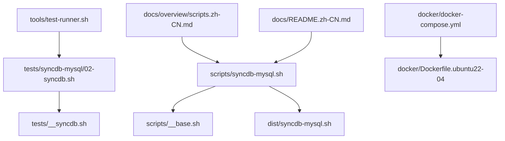
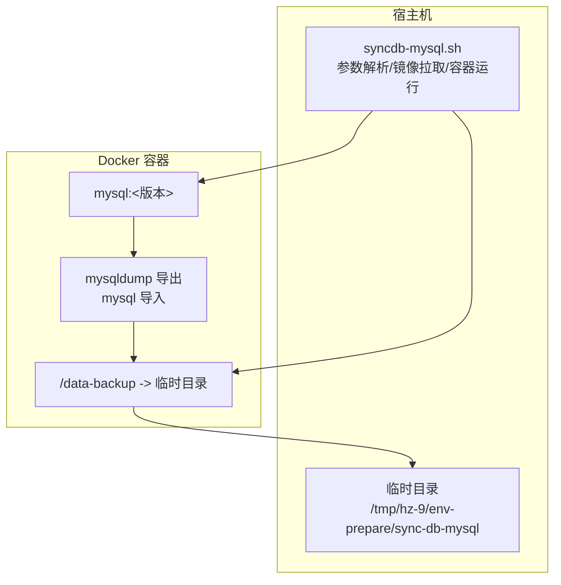
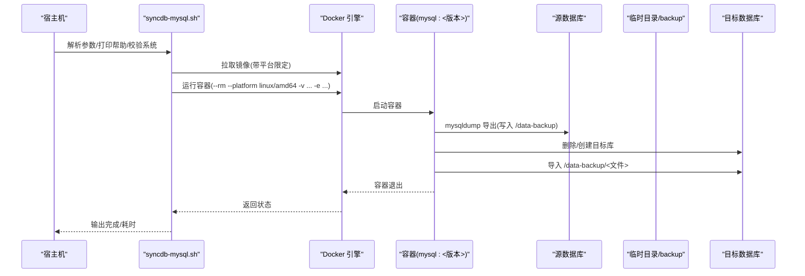
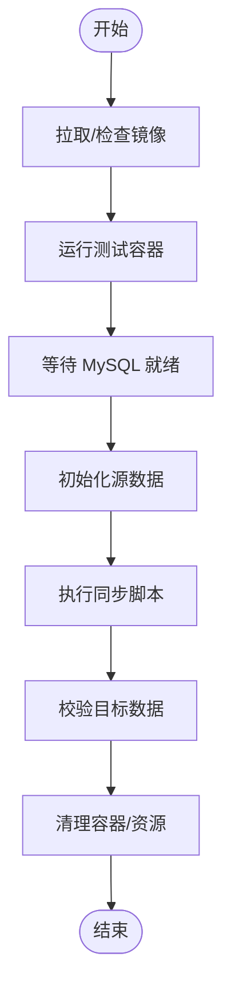
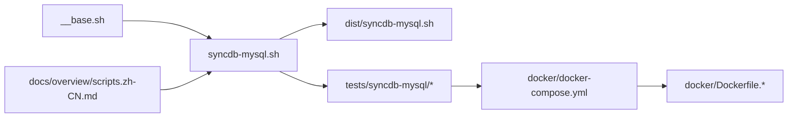

# MySQL 同步架构

<cite>
**本文引用的文件**   
- [syncdb-mysql.sh](file://scripts/syncdb-mysql.sh)
- [__base.sh](file://scripts/__base.sh)
- [docker-compose.yml](file://docker/docker-compose.yml)
- [Dockerfile.ubuntu22-04](file://docker/Dockerfile.ubuntu22-04)
- [02-syncdb.sh](file://tests/syncdb-mysql/02-syncdb.sh)
- [__syncdb.sh](file://tests/__syncdb.sh)
- [scripts.zh-CN.md](file://docs/overview/scripts.zh-CN.md)
- [README.zh-CN.md](file://docs/README.zh-CN.md)
- [test-runner.sh](file://tools/test-runner.sh)
</cite>

## 目录
1. [简介](#简介)
2. [项目结构](#项目结构)
3. [核心组件](#核心组件)
4. [架构总览](#架构总览)
5. [详细组件分析](#详细组件分析)
6. [依赖关系分析](#依赖关系分析)
7. [性能考虑](#性能考虑)
8. [故障排除指南](#故障排除指南)
9. [结论](#结论)
10. [附录](#附录)

## 简介
本文件面向 MySQL 数据库同步架构，围绕同步脚本的实现原理与容器化流程展开，重点解释 mysqldump 与 mysql 命令的数据导出导入机制，详述 Docker 容器化同步流程（容器启动参数、卷挂载、网络通信），参数配置系统（源/目标数据库连接参数）、临时目录管理与备份文件命名规则，并提供完整使用示例、配置指南、不同版本 MySQL 的兼容性处理、性能优化建议与故障排除方案。

## 项目结构
该仓库提供“生产就绪”的同步脚本与配套测试、构建与容器化环境。MySQL 同步脚本位于 scripts/ 目录，经构建后生成 dist/ 下可直接使用的脚本；tests/ 目录包含针对不同发行版的端到端测试；docker/ 目录提供多发行版的测试容器与 docker-compose 配置；docs/ 提供中文文档与脚本清单。

**图示来源**
- [syncdb-mysql.sh](file://scripts/syncdb-mysql.sh)
- [__base.sh](file://scripts/__base.sh)
- [02-syncdb.sh](file://tests/syncdb-mysql/02-syncdb.sh)
- [__syncdb.sh](file://tests/__syncdb.sh)
- [docker-compose.yml](file://docker/docker-compose.yml)
- [Dockerfile.ubuntu22-04](file://docker/Dockerfile.ubuntu22-04)
- [test-runner.sh](file://tools/test-runner.sh)
- [scripts.zh-CN.md](file://docs/overview/scripts.zh-CN.md)
- [README.zh-CN.md](file://docs/README.zh-CN.md)

**章节来源**
- [scripts.zh-CN.md](file://docs/overview/scripts.zh-CN.md)
- [README.zh-CN.md](file://docs/README.zh-CN.md)

## 核心组件
- MySQL 同步脚本：负责解析参数、校验环境、拉取镜像、在容器内执行 mysqldump 导出与 mysql 导入，以及临时目录与备份文件管理。
- 基础库模块：提供参数解析、操作系统识别、控制台输出、Docker 镜像拉取等通用能力。
- 测试与容器化：通过 docker-compose 在多发行版容器中运行测试，验证同步流程与兼容性。
- 文档与使用指南：提供脚本清单、使用示例与网络优化参数说明。

**章节来源**
- [syncdb-mysql.sh](file://scripts/syncdb-mysql.sh)
- [__base.sh](file://scripts/__base.sh)
- [docker-compose.yml](file://docker/docker-compose.yml)
- [scripts.zh-CN.md](file://docs/overview/scripts.zh-CN.md)

## 架构总览
MySQL 同步采用“宿主机脚本 + Docker 容器执行”的架构：宿主机脚本负责参数解析、镜像拉取与容器运行，容器内部执行 mysqldump 导出与 mysql 导入，数据通过卷挂载在宿主机临时目录与容器内共享。

**图示来源**
- [syncdb-mysql.sh](file://scripts/syncdb-mysql.sh)
- [docker-compose.yml](file://docker/docker-compose.yml)

## 详细组件分析

### 参数配置系统
- 通用参数
  - --help：打印帮助信息
  - --debug：启用调试模式
  - --network：网络环境（如 in-china）
  - --docker-image-quick-check：本地快速检测镜像存在与平台匹配
- MySQL 特定参数
  - --db-version：目标镜像版本（默认 8.0）
  - --from-*：源数据库连接参数（hostname/port/username/password/database）
  - --to-*：目标数据库连接参数（hostname/port/username/password/database）
  - --temp：临时目录路径（默认 /tmp/hz-9/env-prepare/sync-db-mysql）

参数解析与帮助输出由基础库统一实现，支持别名、默认值与帮助展示。

**章节来源**
- [syncdb-mysql.sh](file://scripts/syncdb-mysql.sh)
- [__base.sh](file://scripts/__base.sh)

### 临时目录与备份文件管理
- 临时目录
  - 读取 --temp 参数，若不存在则自动创建
  - 作为容器卷挂载点，用于存放导出的 SQL 文件
- 备份文件命名
  - 文件名包含时间戳，避免覆盖
  - 文件扩展名为 .sql

**章节来源**
- [syncdb-mysql.sh](file://scripts/syncdb-mysql.sh)

### Docker 容器化同步流程
- 镜像选择与拉取
  - 镜像名称：mysql:<db-version>（默认 8.0）
  - 支持本地快速检测与平台匹配（linux/amd64）
- 容器运行参数
  - 平台固定：--platform linux/amd64
  - 环境变量：MYSQL_ROOT_PASSWORD（容器内 root 密码）
  - 卷挂载：宿主机临时目录/backup -> 容器内 /data-backup
  - 一次性运行：--rm
- 容器内执行流程
  - mysqldump 导出到 /data-backup/<备份文件>
  - mysql 执行 DROP DATABASE IF EXISTS 与 CREATE DATABASE
  - mysql 将 /data-backup/<备份文件> 导入目标库

**图示来源**
- [syncdb-mysql.sh](file://scripts/syncdb-mysql.sh)

**章节来源**
- [syncdb-mysql.sh](file://scripts/syncdb-mysql.sh)
- [__base.sh](file://scripts/__base.sh)

### mysqldump 与 mysql 命令机制
- mysqldump
  - 从源数据库导出 SQL 到容器内的 /data-backup 目录
  - 使用 --from-* 参数进行连接认证与选择数据库
- mysql
  - 先执行 DROP DATABASE IF EXISTS，再执行 CREATE DATABASE
  - 最后将导出的 SQL 文件导入目标数据库

注意：脚本未显式设置字符集或事务隔离级别，建议在实际使用中结合业务需求调整。

**章节来源**
- [syncdb-mysql.sh](file://scripts/syncdb-mysql.sh)

### 测试与容器化验证
- 测试脚本
  - tests/syncdb-mysql/02-syncdb.sh：初始化源数据库数据、等待 MySQL 就绪、调用同步脚本、校验结果
  - tests/__syncdb.sh：封装镜像拉取、容器生命周期管理等通用步骤
- 容器编排
  - docker/docker-compose.yml：定义多发行版测试环境，挂载项目目录与 Docker Socket，提供交互式容器
  - docker/Dockerfile.ubuntu22-04：基础测试镜像，复制项目并赋予脚本执行权限
- 测试运行器
  - tools/test-runner.sh：统一执行测试、统计耗时、输出报告

**图示来源**
- [02-syncdb.sh](file://tests/syncdb-mysql/02-syncdb.sh)
- [__syncdb.sh](file://tests/__syncdb.sh)
- [docker-compose.yml](file://docker/docker-compose.yml)
- [Dockerfile.ubuntu22-04](file://docker/Dockerfile.ubuntu22-04)
- [test-runner.sh](file://tools/test-runner.sh)

**章节来源**
- [02-syncdb.sh](file://tests/syncdb-mysql/02-syncdb.sh)
- [__syncdb.sh](file://tests/__syncdb.sh)
- [docker-compose.yml](file://docker/docker-compose.yml)
- [Dockerfile.ubuntu22-04](file://docker/Dockerfile.ubuntu22-04)
- [test-runner.sh](file://tools/test-runner.sh)

## 依赖关系分析
- syncdb-mysql.sh 依赖 __base.sh 提供的参数解析、系统检测、控制台输出与镜像拉取能力
- 测试链路依赖 docker-compose 与 Dockerfile 提供的测试环境
- 文档与使用指南提供脚本清单与示例，便于用户正确传参与使用

**图示来源**
- [__base.sh](file://scripts/__base.sh)
- [syncdb-mysql.sh](file://scripts/syncdb-mysql.sh)
- [docker-compose.yml](file://docker/docker-compose.yml)
- [Dockerfile.ubuntu22-04](file://docker/Dockerfile.ubuntu22-04)
- [scripts.zh-CN.md](file://docs/overview/scripts.zh-CN.md)

**章节来源**
- [__base.sh](file://scripts/__base.sh)
- [syncdb-mysql.sh](file://scripts/syncdb-mysql.sh)
- [docker-compose.yml](file://docker/docker-compose.yml)
- [scripts.zh-CN.md](file://docs/overview/scripts.zh-CN.md)

## 性能考虑
- 镜像拉取与平台匹配
  - 使用 --platform linux/amd64 固定平台，避免跨平台层转换带来的额外开销
  - 启用 --docker-image-quick-check 可跳过重复拉取，提升本地迭代效率
- 临时目录与 I/O
  - 将临时目录挂载到 SSD 或高性能磁盘，减少 mysqldump 与导入的 I/O 延迟
  - 控制备份文件大小与数量，避免磁盘空间不足
- 并发与网络
  - 在企业内网或国内网络环境下，优先使用 --network=in-china 优化镜像拉取
  - 如需批量同步，可在宿主机侧并发运行多个容器任务（注意目标库并发导入的锁竞争）
- 数据库层面
  - 对大型表建议在导入前禁用外键检查与自动提交，导入后再恢复（需根据业务评估风险）
  - 导入完成后执行 ANALYZE/REBUILD 等统计更新，确保查询计划最优

[本节为通用指导，不直接分析具体文件]

## 故障排除指南
- Docker 未安装或版本不匹配
  - 现象：脚本提示未安装 Docker 或版本信息缺失
  - 处理：先安装 Docker 并确保 docker 与 docker compose 命令可用
- 镜像拉取失败或平台不匹配
  - 现象：拉取镜像超时或平台不匹配导致失败
  - 处理：开启 --docker-image-quick-check，或手动 docker pull 指定平台镜像
- 容器内 mysqldump/mysql 执行失败
  - 现象：容器退出但无详细错误
  - 处理：启用 --debug 查看完整输出；确认源/目标数据库连通性与凭据正确
- 权限与网络问题
  - 现象：容器无法访问源/目标数据库
  - 处理：确认宿主机网络策略、防火墙放行端口；必要时在容器内使用 host 网络或映射端口
- 备份文件损坏或为空
  - 现象：导入阶段报错或目标库为空
  - 处理：检查临时目录权限与磁盘空间；确认 mysqldump 成功写入 /data-backup；核对文件名与时间戳
- 测试环境异常
  - 现象：测试容器启动失败或 MySQL 不就绪
  - 处理：使用 docker-compose 日志排查；确认容器端口映射与环境变量；参考测试脚本中的等待逻辑

**章节来源**
- [syncdb-mysql.sh](file://scripts/syncdb-mysql.sh)
- [__syncdb.sh](file://tests/__syncdb.sh)
- [02-syncdb.sh](file://tests/syncdb-mysql/02-syncdb.sh)

## 结论
该 MySQL 同步架构通过“宿主机脚本 + Docker 容器执行”的方式，将 mysqldump 与 mysql 的数据迁移过程标准化、容器化与可测试化。脚本提供了完善的参数体系、镜像拉取与平台匹配、临时目录与备份文件管理，并通过多发行版容器化测试保障了跨平台兼容性。结合本文提供的性能优化与故障排除建议，可在生产环境中稳定、高效地完成 MySQL 数据库的同步任务。

[本节为总结性内容，不直接分析具体文件]

## 附录

### 使用示例与配置指南
- 直接使用 dist/ 下脚本
  - 示例：从远端源库同步到本地目标库，指定网络优化与版本
  - 参考：脚本清单与使用示例
- 本地开发与构建
  - 从 scripts/ 源码构建为 dist/ 生产脚本
  - 使用 tools/test-runner.sh 在 docker-compose 定义的多发行版环境中运行测试

**章节来源**
- [scripts.zh-CN.md](file://docs/overview/scripts.zh-CN.md)
- [README.zh-CN.md](file://docs/README.zh-CN.md)
- [test-runner.sh](file://tools/test-runner.sh)

### 不同版本 MySQL 的兼容性处理
- 版本选择
  - 通过 --db-version 指定 mysql:<版本> 镜像，默认 8.0
- 平台一致性
  - 固定 --platform linux/amd64，避免跨平台差异
- 网络优化
  - 使用 --network=in-china 优化镜像拉取与依赖下载

**章节来源**
- [syncdb-mysql.sh](file://scripts/syncdb-mysql.sh)
- [scripts.zh-CN.md](file://docs/overview/scripts.zh-CN.md)