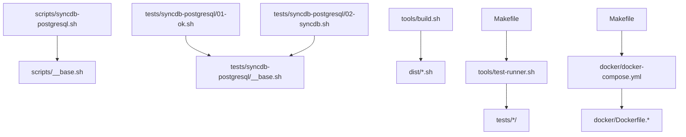
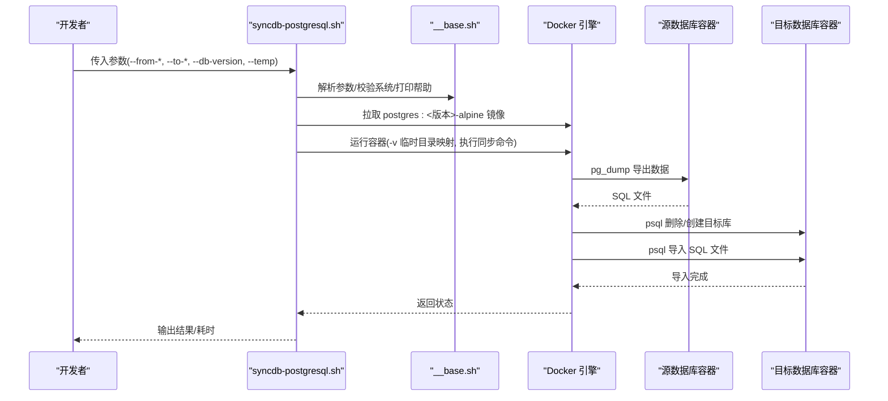
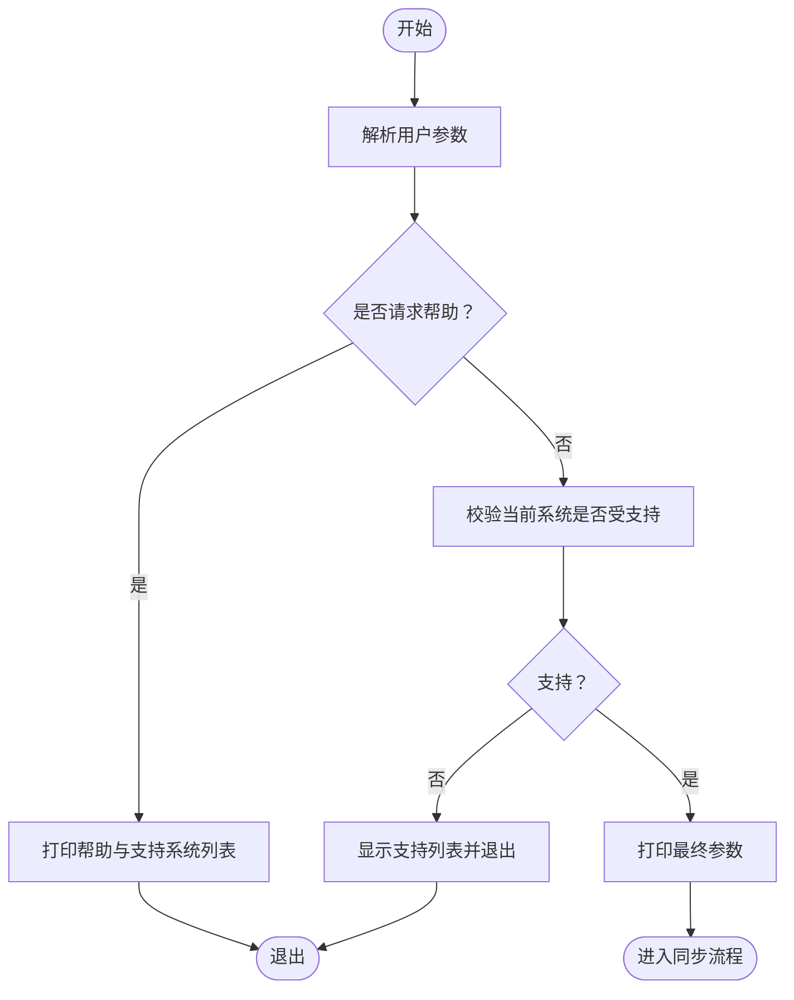
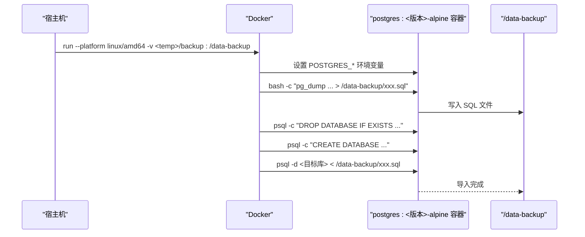
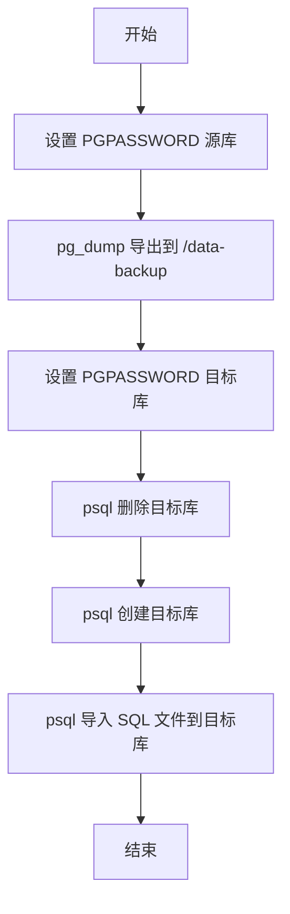
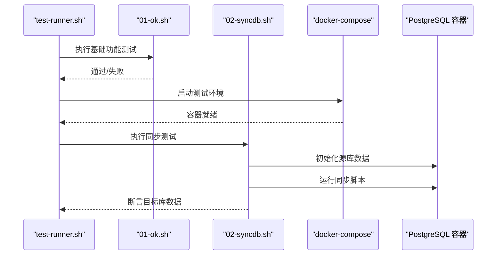
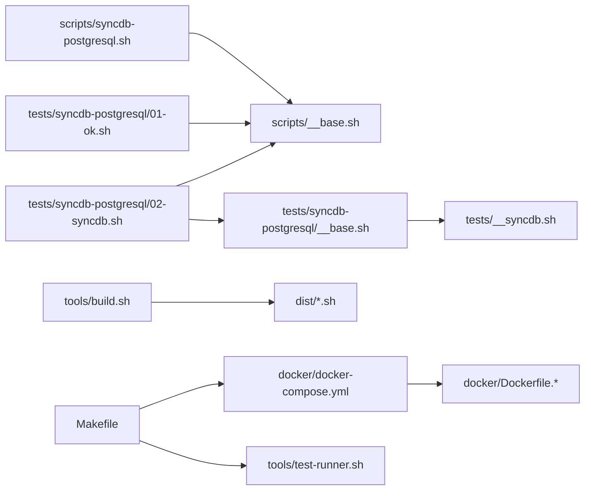
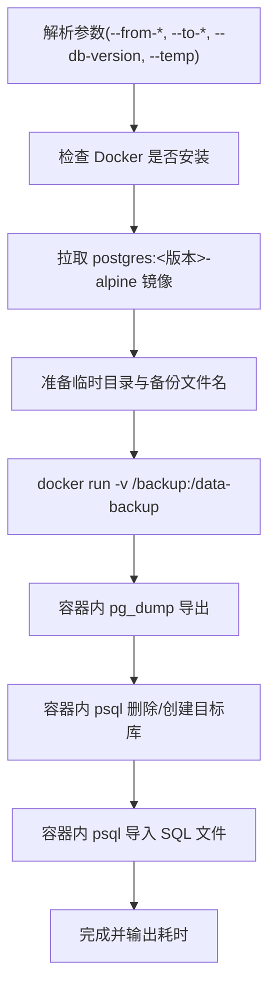

# PostgreSQL 同步架构

<cite>
**本文档引用的文件**
- [scripts/syncdb-postgresql.sh](file://scripts/syncdb-postgresql.sh)
- [scripts/__base.sh](file://scripts/__base.sh)
- [tests/syncdb-postgresql/__base.sh](file://tests/syncdb-postgresql/__base.sh)
- [tests/syncdb-postgresql/01-ok.sh](file://tests/syncdb-postgresql/01-ok.sh)
- [tests/syncdb-postgresql/02-syncdb.sh](file://tests/syncdb-postgresql/02-syncdb.sh)
- [tests/__syncdb.sh](file://tests/__syncdb.sh)
- [docker/docker-compose.yml](file://docker/docker-compose.yml)
- [docker/Dockerfile.ubuntu22-04](file://docker/Dockerfile.ubuntu22-04)
- [docker/Dockerfile.ubuntu22-04.docker](file://docker/Dockerfile.ubuntu22-04.docker)
- [tools/build.sh](file://tools/build.sh)
- [tools/test-runner.sh](file://tools/test-runner.sh)
- [Makefile](file://Makefile)
- [README.md](file://README.md)
</cite>

## 目录
1. [简介](#简介)
2. [项目结构](#项目结构)
3. [核心组件](#核心组件)
4. [架构总览](#架构总览)
5. [详细组件分析](#详细组件分析)
6. [依赖关系分析](#依赖关系分析)
7. [性能考虑](#性能考虑)
8. [故障排除指南](#故障排除指南)
9. [结论](#结论)
10. [附录](#附录)

## 简介
本文件面向 PostgreSQL 数据库同步架构，系统性解析基于 pg_dump 与 psql 的数据导出导入机制、Docker 容器化同步流程（含环境变量与数据目录挂载）、参数配置体系（源/目标数据库连接与认证）、数据库版本检测与兼容性处理策略，并提供完整使用示例、配置指南、性能调优建议与错误处理方案。

## 项目结构
该仓库采用“脚本分发 + 测试驱动 + 多平台容器化”的组织方式：
- scripts：核心同步脚本与通用基础模块
- tests：各数据库类型的测试套件（含 PostgreSQL）
- docker：多发行版 Dockerfile 与 docker-compose 编排
- tools：构建与测试运行工具
- Makefile：统一构建与测试入口

**图表来源**
- [scripts/syncdb-postgresql.sh:1-142](file://scripts/syncdb-postgresql.sh#L1-L142)
- [scripts/__base.sh:1-800](file://scripts/__base.sh#L1-L800)
- [tests/syncdb-postgresql/01-ok.sh:1-25](file://tests/syncdb-postgresql/01-ok.sh#L1-L25)
- [tests/syncdb-postgresql/02-syncdb.sh:1-117](file://tests/syncdb-postgresql/02-syncdb.sh#L1-L117)
- [tests/syncdb-postgresql/__base.sh:1-92](file://tests/syncdb-postgresql/__base.sh#L1-L92)
- [tools/build.sh:1-91](file://tools/build.sh#L1-L91)
- [tools/test-runner.sh:1-156](file://tools/test-runner.sh#L1-L156)
- [docker/docker-compose.yml:1-297](file://docker/docker-compose.yml#L1-L297)
- [docker/Dockerfile.ubuntu22-04:1-33](file://docker/Dockerfile.ubuntu22-04#L1-L33)
- [docker/Dockerfile.ubuntu22-04.docker:1-52](file://docker/Dockerfile.ubuntu22-04.docker#L1-L52)
- [Makefile:1-563](file://Makefile#L1-L563)

**章节来源**
- [README.md:1-6](file://README.md#L1-L6)
- [Makefile:1-563](file://Makefile#L1-L563)

## 核心组件
- PostgreSQL 同步脚本：负责参数解析、Docker 镜像拉取、临时目录准备、在容器内执行 pg_dump 与 psql 的完整同步流程。
- 通用基础模块：提供参数解析、操作系统识别、控制台输出、日志时间戳等通用能力。
- 测试框架：包含单元测试与集成测试，覆盖脚本可用性、语法、帮助输出以及实际同步流程验证。
- 容器编排：通过 docker-compose 提供多平台测试环境，支持直接在容器中安装 Docker 并运行测试。
- 构建工具：将多文件脚本合并到 dist 目录，便于分发与测试。

**章节来源**
- [scripts/syncdb-postgresql.sh:1-142](file://scripts/syncdb-postgresql.sh#L1-L142)
- [scripts/__base.sh:1-800](file://scripts/__base.sh#L1-L800)
- [tests/syncdb-postgresql/01-ok.sh:1-25](file://tests/syncdb-postgresql/01-ok.sh#L1-L25)
- [tests/syncdb-postgresql/02-syncdb.sh:1-117](file://tests/syncdb-postgresql/02-syncdb.sh#L1-L117)
- [docker/docker-compose.yml:1-297](file://docker/docker-compose.yml#L1-L297)
- [tools/build.sh:1-91](file://tools/build.sh#L1-L91)

## 架构总览
PostgreSQL 同步采用“容器内执行”的架构：在宿主机上准备临时目录，拉取指定版本的 postgres 镜像，在容器内执行 pg_dump 导出与 psql 恢复，避免宿主机环境差异带来的兼容性问题。

**图表来源**
- [scripts/syncdb-postgresql.sh:50-142](file://scripts/syncdb-postgresql.sh#L50-L142)
- [scripts/__base.sh:478-742](file://scripts/__base.sh#L478-L742)
- [tests/syncdb-postgresql/__base.sh:50-92](file://tests/syncdb-postgresql/__base.sh#L50-L92)
- [tests/syncdb-postgresql/02-syncdb.sh:24-117](file://tests/syncdb-postgresql/02-syncdb.sh#L24-L117)

## 详细组件分析

### 参数配置系统
- 支持参数：
  - 基础：--help、--debug、--network
  - 数据库版本：--db-version（默认 15.4）
  - 源端：--from-hostname、--from-port、--from-username、--from-password、--from-database
  - 目标端：--to-hostname、--to-port、--to-username、--to-password、--to-database
  - 临时目录：--temp（默认路径）
- 参数解析与帮助输出由通用模块提供，支持长/短参数与默认值展示。
- 操作系统支持列表在脚本中声明，用于运行前校验。

**图表来源**
- [scripts/syncdb-postgresql.sh:48-742](file://scripts/syncdb-postgresql.sh#L48-L742)
- [scripts/__base.sh:606-742](file://scripts/__base.sh#L606-L742)

**章节来源**
- [scripts/syncdb-postgresql.sh:7-28](file://scripts/syncdb-postgresql.sh#L7-L28)
- [scripts/__base.sh:606-742](file://scripts/__base.sh#L606-L742)

### Docker 容器化同步流程
- 镜像选择：postgres:<db-version>-alpine
- 卷挂载：将宿主机临时目录映射到容器内的 /data-backup，用于存放导出的 SQL 文件
- 环境变量：设置 POSTGRES_DB、POSTGRES_USER、POSTGRES_PASSWORD，确保容器内 psql 可用
- 平台约束：显式指定 --platform linux/amd64，保证跨平台一致性
- 同步命令在容器内串行执行：先导出，再删除/创建目标库，最后导入

**图表来源**
- [scripts/syncdb-postgresql.sh:102-134](file://scripts/syncdb-postgresql.sh#L102-L134)

**章节来源**
- [scripts/syncdb-postgresql.sh:102-134](file://scripts/syncdb-postgresql.sh#L102-L134)

### 数据库版本检测与兼容性处理
- 脚本层面：通过 --db-version 指定镜像版本，默认 15.4；镜像名形如 postgres:<版本>-alpine
- 测试层面：测试用例可指定不同版本（如 9.6），以验证不同版本的兼容性
- 兼容性策略：
  - 使用官方 postgres:<版本>-alpine 镜像，减少宿主机差异
  - 在容器内执行 pg_dump/psql，避免宿主机客户端与服务端版本不一致导致的问题
  - 通过 Makefile 的测试矩阵覆盖多发行版与多版本组合

**章节来源**
- [scripts/syncdb-postgresql.sh:13,104,105:13-13](file://scripts/syncdb-postgresql.sh#L13-L13)
- [tests/syncdb-postgresql/02-syncdb.sh:18](file://tests/syncdb-postgresql/02-syncdb.sh#L18)
- [Makefile:301-532](file://Makefile#L301-L532)

### 数据导出与导入机制（pg_dump 与 psql）
- 导出：在容器内使用 pg_dump，连接源数据库，将结果写入 /data-backup/<文件名>.sql
- 目标库管理：先通过 psql 删除目标库，再创建同名库，确保干净状态
- 导入：在容器内使用 psql 将 SQL 文件导入目标库

**图表来源**
- [scripts/syncdb-postgresql.sh:114-123](file://scripts/syncdb-postgresql.sh#L114-L123)

**章节来源**
- [scripts/syncdb-postgresql.sh:114-123](file://scripts/syncdb-postgresql.sh#L114-L123)

### 测试与验证
- 基础功能测试：验证脚本存在、可执行、语法正确、帮助输出正常、当前系统受支持
- 同步流程测试：启动源数据库容器，初始化测试数据，运行同步脚本，断言目标库数据正确
- 测试环境：通过 docker-compose 提供多发行版容器，部分镜像内置 Docker CE 与 Compose，便于自举测试

**图表来源**
- [tools/test-runner.sh:1-156](file://tools/test-runner.sh#L1-L156)
- [tests/syncdb-postgresql/01-ok.sh:1-25](file://tests/syncdb-postgresql/01-ok.sh#L1-L25)
- [tests/syncdb-postgresql/02-syncdb.sh:1-117](file://tests/syncdb-postgresql/02-syncdb.sh#L1-L117)
- [docker/docker-compose.yml:1-297](file://docker/docker-compose.yml#L1-L297)

**章节来源**
- [tests/syncdb-postgresql/01-ok.sh:1-25](file://tests/syncdb-postgresql/01-ok.sh#L1-L25)
- [tests/syncdb-postgresql/02-syncdb.sh:1-117](file://tests/syncdb-postgresql/02-syncdb.sh#L1-L117)
- [tests/syncdb-postgresql/__base.sh:1-92](file://tests/syncdb-postgresql/__base.sh#L1-L92)
- [docker/docker-compose.yml:1-297](file://docker/docker-compose.yml#L1-L297)

## 依赖关系分析
- 脚本依赖关系：syncdb-postgresql.sh 依赖 __base.sh 提供的参数解析、系统检测、控制台输出等能力
- 构建依赖：build.sh 将 scripts 下的脚本合并到 dist，供测试与分发使用
- 测试依赖：测试脚本依赖 __syncdb.sh 提供的 Docker 镜像拉取与快速检查逻辑
- 容器依赖：docker-compose.yml 定义了多平台镜像与测试环境，部分镜像内置 Docker CE/Compose

**图表来源**
- [scripts/syncdb-postgresql.sh:46](file://scripts/syncdb-postgresql.sh#L46)
- [scripts/__base.sh:1-800](file://scripts/__base.sh#L1-L800)
- [tests/syncdb-postgresql/01-ok.sh:6-8](file://tests/syncdb-postgresql/01-ok.sh#L6-L8)
- [tests/syncdb-postgresql/02-syncdb.sh:6-9](file://tests/syncdb-postgresql/02-syncdb.sh#L6-L9)
- [tests/syncdb-postgresql/__base.sh:3](file://tests/syncdb-postgresql/__base.sh#L3)
- [tests/__syncdb.sh:1-47](file://tests/__syncdb.sh#L1-L47)
- [tools/build.sh:1-91](file://tools/build.sh#L1-L91)
- [docker/docker-compose.yml:1-297](file://docker/docker-compose.yml#L1-L297)
- [Makefile:1-563](file://Makefile#L1-L563)

**章节来源**
- [scripts/syncdb-postgresql.sh:46](file://scripts/syncdb-postgresql.sh#L46)
- [tests/__syncdb.sh:1-47](file://tests/__syncdb.sh#L1-L47)
- [tools/build.sh:1-91](file://tools/build.sh#L1-L91)
- [docker/docker-compose.yml:1-297](file://docker/docker-compose.yml#L1-L297)
- [Makefile:1-563](file://Makefile#L1-L563)

## 性能考虑
- 镜像选择：使用 alpine 版本镜像，减小体积与启动时间
- 平台一致性：固定 --platform linux/amd64，避免跨平台性能波动
- 临时目录：将 /data-backup 映射到宿主机目录，减少网络传输开销
- 并行测试：Makefile 提供多环境并行测试入口，便于规模化验证
- 版本隔离：通过 --db-version 精确控制镜像版本，避免升级带来的性能回退

[本节为通用指导，无需特定文件引用]

## 故障排除指南
- Docker 未安装：脚本会检测 docker --version，未安装则提示安装后重试
- 镜像拉取失败：可通过测试框架提供的快速检查逻辑优化镜像拉取
- 端口冲突：源/目标端口需与容器映射一致，确保 psql 可连通
- 权限问题：确认 PGPASSWORD 设置正确，且源/目标库用户具备相应权限
- 版本不匹配：若宿主机 PostgreSQL 客户端与服务端版本差异大，建议在容器内执行同步

**章节来源**
- [scripts/syncdb-postgresql.sh:87-98](file://scripts/syncdb-postgresql.sh#L87-L98)
- [tests/__syncdb.sh:20-46](file://tests/__syncdb.sh#L20-L46)

## 结论
该 PostgreSQL 同步架构通过“容器内执行 + 版本化镜像 + 统一参数与测试体系”，有效解决了跨平台、版本兼容与环境差异带来的挑战。配合完善的测试矩阵与构建工具，能够稳定地支撑多发行版与多版本的同步场景。

## 附录

### 使用示例与配置指南
- 基本用法
  - 指定源/目标数据库连接参数与 --db-version
  - 指定 --temp 临时目录（默认路径已定义）
  - 可选开启 --debug 查看详细输出
- 不同版本适配策略
  - 使用 --db-version 指定目标镜像版本（如 9.6、15.4）
  - 测试用例展示了 9.6 的适配验证
- 网络环境
  - 可通过 --network 指定网络环境（如 in-china），配合测试框架使用

**章节来源**
- [scripts/syncdb-postgresql.sh:7-28](file://scripts/syncdb-postgresql.sh#L7-L28)
- [tests/syncdb-postgresql/02-syncdb.sh:18](file://tests/syncdb-postgresql/02-syncdb.sh#L18)
- [Makefile:39-41](file://Makefile#L39-L41)

### 关键流程图（代码级）

**图表来源**
- [scripts/syncdb-postgresql.sh:50-142](file://scripts/syncdb-postgresql.sh#L50-L142)