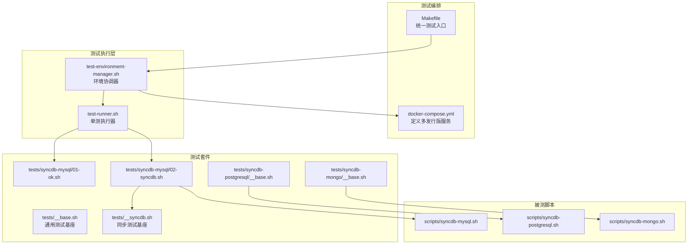
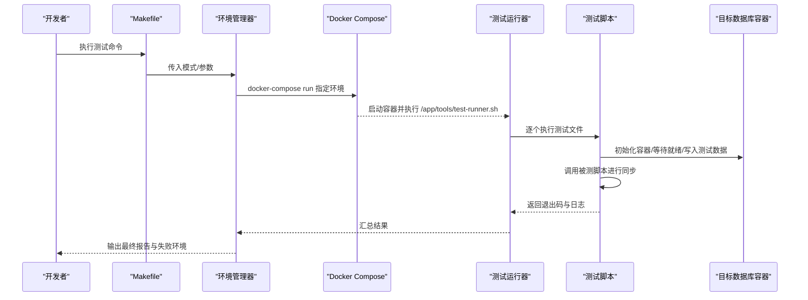
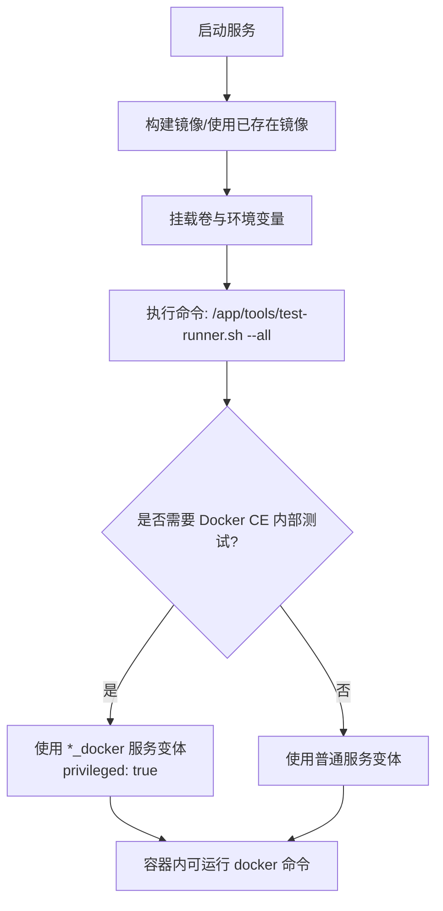
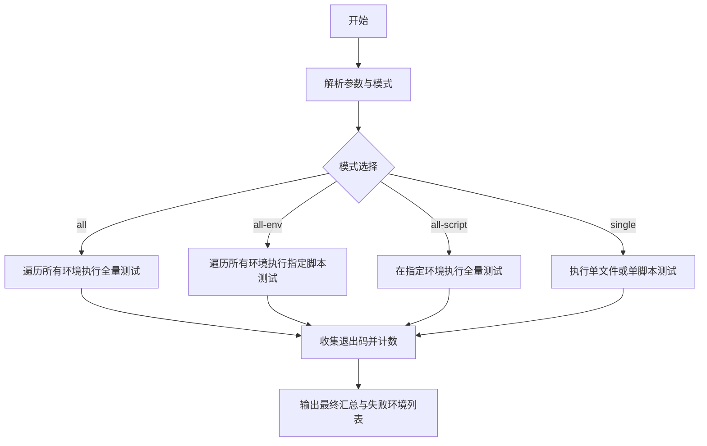
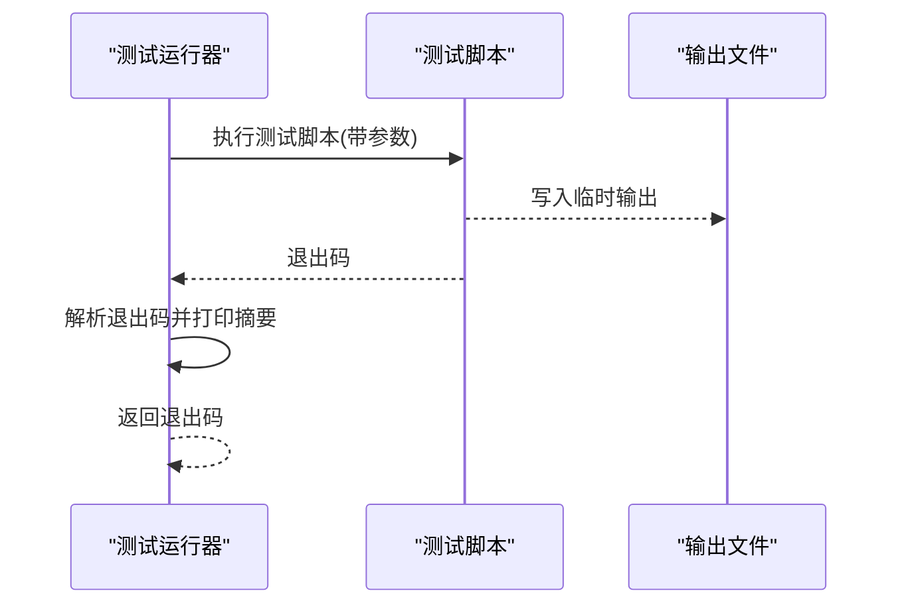
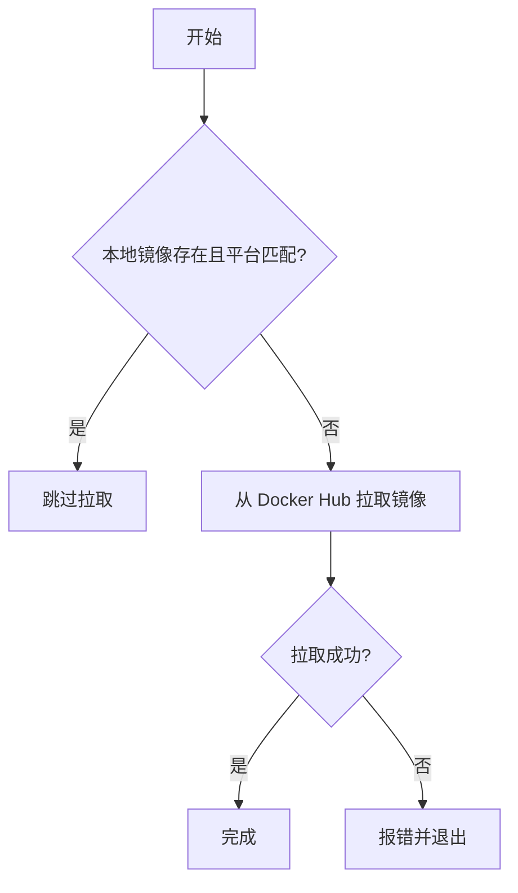
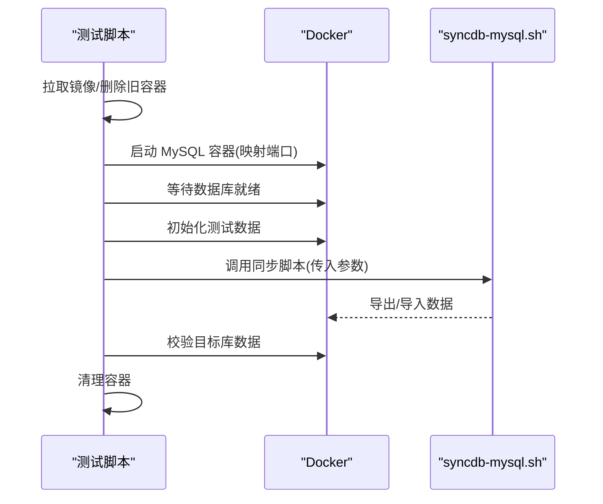
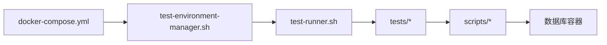

# 容器化测试系统

<cite>
**本文引用的文件**
- [docker-compose.yml](file://docker/docker-compose.yml)
- [Makefile](file://Makefile)
- [test-environment-manager.sh](file://tools/test-environment-manager.sh)
- [test-runner.sh](file://tools/test-runner.sh)
- [__base.sh](file://tests/__base.sh)
- [__syncdb.sh](file://tests/__syncdb.sh)
- [syncdb-mysql/__base.sh](file://tests/syncdb-mysql/__base.sh)
- [syncdb-mysql/01-ok.sh](file://tests/syncdb-mysql/01-ok.sh)
- [syncdb-mysql/02-syncdb.sh](file://tests/syncdb-mysql/02-syncdb.sh)
- [syncdb-postgresql/__base.sh](file://tests/syncdb-postgresql/__base.sh)
- [syncdb-mongo/__base.sh](file://tests/syncdb-mongo/__base.sh)
- [syncdb-mysql.sh](file://scripts/syncdb-mysql.sh)
- [syncdb-postgresql.sh](file://scripts/syncdb-postgresql.sh)
- [syncdb-mongo.sh](file://scripts/syncdb-mongo.sh)
- [README.md](file://docs/README.md)
</cite>

## 目录
1. [简介](#简介)
2. [项目结构](#项目结构)
3. [核心组件](#核心组件)
4. [架构总览](#架构总览)
5. [详细组件分析](#详细组件分析)
6. [依赖关系分析](#依赖关系分析)
7. [性能考量](#性能考量)
8. [故障排除指南](#故障排除指南)
9. [结论](#结论)
10. [附录](#附录)

## 简介
本项目为数据库同步脚本提供容器化测试架构，覆盖 MySQL、PostgreSQL、MongoDB 的跨平台同步能力验证。通过 Docker Compose 在多种 Linux 发行版环境中运行测试，确保脚本在不同系统与网络环境下的一致性与可靠性。测试体系分为“基础功能测试”和“同步流程测试”，分别验证脚本可用性与真实数据迁移流程。

## 项目结构
- docker：包含各发行版的 Dockerfile 与统一的 docker-compose.yml，定义测试容器镜像构建与服务编排。
- tests：按功能域划分的测试套件，安装类与同步类测试分离；同步类测试进一步按数据库类型细分。
- scripts：生产脚本源码，dist 中为打包后的可直接使用脚本。
- tools：测试执行工具链，包括环境管理器与测试运行器。
- Makefile：统一入口，封装常用测试命令与参数传递。

**图表来源**
- [docker-compose.yml](file://docker/docker-compose.yml)
- [Makefile](file://Makefile)
- [test-environment-manager.sh](file://tools/test-environment-manager.sh)
- [test-runner.sh](file://tools/test-runner.sh)
- [__base.sh](file://tests/__base.sh)
- [__syncdb.sh](file://tests/__syncdb.sh)
- [syncdb-mysql/01-ok.sh](file://tests/syncdb-mysql/01-ok.sh)
- [syncdb-mysql/02-syncdb.sh](file://tests/syncdb-mysql/02-syncdb.sh)
- [syncdb-postgresql/__base.sh](file://tests/syncdb-postgresql/__base.sh)
- [syncdb-mongo/__base.sh](file://tests/syncdb-mongo/__base.sh)
- [syncdb-mysql.sh](file://scripts/syncdb-mysql.sh)
- [syncdb-postgresql.sh](file://scripts/syncdb-postgresql.sh)
- [syncdb-mongo.sh](file://scripts/syncdb-mongo.sh)

**章节来源**
- [README.md](file://docs/README.md)
- [docker-compose.yml](file://docker/docker-compose.yml)
- [Makefile](file://Makefile)

## 核心组件
- Docker Compose 多环境服务：定义 Ubuntu/Debian/Fedora/RHEL 各版本测试容器，以及带 Docker CE 的增强版容器，支持交互式调试。
- 测试环境管理器：负责扫描测试目录、按模式调度到对应容器、汇总结果与失败环境列表。
- 测试运行器：负责单个测试脚本的执行、输出捕获、退出码处理与时间统计。
- 同步测试基座：封装 Docker 镜像拉取、容器初始化、等待数据库就绪、数据初始化与清理等通用步骤。
- 被测脚本：MySQL/PostgreSQL/MongoDB 同步脚本，负责实际备份导出与恢复导入流程。

**章节来源**
- [docker-compose.yml](file://docker/docker-compose.yml)
- [test-environment-manager.sh](file://tools/test-environment-manager.sh)
- [test-runner.sh](file://tools/test-runner.sh)
- [__syncdb.sh](file://tests/__syncdb.sh)

## 架构总览
整体测试架构采用“编排层-执行层-测试层-被测层”的分层设计。编排层通过 docker-compose 在多发行版容器中运行；执行层由环境管理器与运行器协作完成；测试层包含基础测试与同步测试两类；被测层为各数据库同步脚本。

**图表来源**
- [Makefile](file://Makefile)
- [test-environment-manager.sh](file://tools/test-environment-manager.sh)
- [docker-compose.yml](file://docker/docker-compose.yml)
- [test-runner.sh](file://tools/test-runner.sh)

## 详细组件分析

### Docker Compose 配置与多数据库环境
- 服务定义：为 Ubuntu 20.04/22.04/24.04、Debian 11.9/12.2、Fedora 41、RHEL 8.10/9.6 提供基础测试环境；另提供带 Docker CE 的增强版服务用于真实容器内测试。
- 卷挂载：共享宿主机 Docker Socket 以允许容器内拉起数据库容器；挂载 dist/scripts/tests/tools 到容器内便于测试。
- 命令入口：默认执行测试运行器并传入 --all 参数，或通过 Makefile 指定具体测试范围。
- 平台与网络：固定平台为 linux/amd64；未显式声明 networks，容器默认连接 docker-compose 默认网络。

**图表来源**
- [docker-compose.yml](file://docker/docker-compose.yml)

**章节来源**
- [docker-compose.yml](file://docker/docker-compose.yml)

### 测试环境管理器（test-environment-manager.sh）
- 模式驱动：支持 all、all-env、all-script、single 四种模式，分别用于全量测试、按脚本全量、按环境全量与单文件/单脚本测试。
- 目录扫描：根据 scope 与 test-dir 或 script 名称扫描 tests 下的测试文件，构造运行参数。
- 容器执行：调用 docker-compose run 在指定环境容器中执行 test-runner.sh，并收集退出码。
- 结果汇总：统计总次数、通过、跳过、失败；记录失败环境及其参数，最终输出汇总报告。

**图表来源**
- [test-environment-manager.sh](file://tools/test-environment-manager.sh)

**章节来源**
- [test-environment-manager.sh](file://tools/test-environment-manager.sh)

### 测试运行器（test-runner.sh）
- 单测执行：接收测试脚本路径与附加参数，实时输出到终端并同时写入临时文件以便检测跳过状态。
- 退出码语义：0 表示通过，1 表示失败，2 表示跳过；根据退出码输出相应提示并返回给环境管理器。
- 时间统计：记录每个测试的开始与结束时间，计算耗时并在报告中展示。

**图表来源**
- [test-runner.sh](file://tools/test-runner.sh)

**章节来源**
- [test-runner.sh](file://tools/test-runner.sh)

### 同步测试基座（tests/__syncdb.sh）
- 镜像拉取优化：支持快速检查本地镜像是否存在且平台匹配，避免重复下载。
- 容器生命周期：提供删除容器的辅助函数，便于测试前后清理。
- 通用参数：通过 unit_test_common_suffix_args 统一传递网络、调试、输出等参数。

**图表来源**
- [__syncdb.sh](file://tests/__syncdb.sh)

**章节来源**
- [__syncdb.sh](file://tests/__syncdb.sh)

### MySQL 同步测试（tests/syncdb-mysql）
- 基础测试（01-ok.sh）：验证脚本文件存在、可执行、语法正确、帮助信息正常、当前系统支持。
- 同步测试（02-syncdb.sh）：拉取镜像、删除旧容器、启动 MySQL 容器、等待就绪、初始化测试数据、调用同步脚本、校验目标库数据一致性、清理容器。
- 关键参数：源/目标主机、端口、用户名、密码、数据库名、临时目录等均通过参数传递，便于复用与调试。

**图表来源**
- [syncdb-mysql/02-syncdb.sh](file://tests/syncdb-mysql/02-syncdb.sh)
- [syncdb-mysql.sh](file://scripts/syncdb-mysql.sh)

**章节来源**
- [syncdb-mysql/01-ok.sh](file://tests/syncdb-mysql/01-ok.sh)
- [syncdb-mysql/02-syncdb.sh](file://tests/syncdb-mysql/02-syncdb.sh)
- [syncdb-mysql/__base.sh](file://tests/syncdb-mysql/__base.sh)
- [syncdb-mysql.sh](file://scripts/syncdb-mysql.sh)

### PostgreSQL 同步测试（tests/syncdb-postgresql）
- 基座差异：镜像名称含 alpine 后缀；端口映射与环境变量设置遵循 PostgreSQL 规范；等待就绪使用 pg_isready。
- 参数传递：与 MySQL 类似，通过参数传入源/目标主机、端口、认证信息与数据库名。

**章节来源**
- [syncdb-postgresql/__base.sh](file://tests/syncdb-postgresql/__base.sh)
- [syncdb-postgresql.sh](file://scripts/syncdb-postgresql.sh)

### MongoDB 同步测试（tests/syncdb-mongo）
- 版本适配：根据主版本号选择 mongosh 或 mongo shell；端口映射与认证遵循 MongoDB 规范。
- 就绪检测：先 ping，再列出数据库确认可用性，提升稳定性。

**章节来源**
- [syncdb-mongo/__base.sh](file://tests/syncdb-mongo/__base.sh)
- [syncdb-mongo.sh](file://scripts/syncdb-mongo.sh)

### 测试用例组织结构
- 基础测试：位于 tests/syncdb-*/01-ok.sh，验证脚本元信息与系统支持情况，不涉及数据库实例。
- 同步测试：位于 tests/syncdb-*/02-syncdb.sh，包含完整的数据库实例创建、数据准备、同步执行与结果验证。
- 分离设计：基础测试轻量、快速；同步测试完整覆盖真实场景，二者互补。

**章节来源**
- [syncdb-mysql/01-ok.sh](file://tests/syncdb-mysql/01-ok.sh)
- [syncdb-mysql/02-syncdb.sh](file://tests/syncdb-mysql/02-syncdb.sh)

### 测试环境初始化流程
- 镜像准备：优先本地快速检查，必要时从 Docker Hub 拉取；增强版服务启用特权模式以允许容器内运行 Docker。
- 容器启动：按数据库类型设置环境变量（如 MYSQL_ROOT_PASSWORD、POSTGRES_*、MONGO_INITDB_*），映射端口至宿主。
- 就绪等待：使用数据库自带工具轮询直到服务可连接，避免后续步骤因依赖未就绪而失败。
- 数据初始化：在源数据库中创建测试表与样例数据，为目标数据库准备空库。
- 清理收尾：测试结束后删除容器，释放资源。

**章节来源**
- [__syncdb.sh](file://tests/__syncdb.sh)
- [syncdb-mysql/__base.sh](file://tests/syncdb-mysql/__base.sh)
- [syncdb-postgresql/__base.sh](file://tests/syncdb-postgresql/__base.sh)
- [syncdb-mongo/__base.sh](file://tests/syncdb-mongo/__base.sh)

### 测试执行流程与结果验证
- 执行流程：Makefile -> 环境管理器 -> docker-compose -> 测试运行器 -> 具体测试脚本 -> 被测同步脚本 -> 数据库容器 -> 结果回传。
- 结果验证：基础测试关注脚本元信息与系统支持；同步测试关注数据一致性（如目标库是否存在目标表、记录条数一致等）。
- 报告输出：每项测试输出开始/结束摘要与耗时；最终汇总通过/失败/跳过的数量，并列出失败环境及参数。

**章节来源**
- [Makefile](file://Makefile)
- [test-environment-manager.sh](file://tools/test-environment-manager.sh)
- [test-runner.sh](file://tools/test-runner.sh)
- [syncdb-mysql/02-syncdb.sh](file://tests/syncdb-mysql/02-syncdb.sh)

### 测试环境清理与资源管理
- 容器清理：测试脚本在退出前删除数据库容器，避免残留影响后续测试。
- 镜像缓存：针对不同发行版的包管理器配置缓存保留策略，减少重复下载。
- 日志归档：Makefile 将测试输出重定向到 logs 目录下的时间戳日志文件，便于问题追溯。

**章节来源**
- [__base.sh](file://tests/__base.sh)
- [Makefile](file://Makefile)

## 依赖关系分析
- 编排层依赖：docker-compose.yml 定义的服务与卷挂载直接影响测试容器的可用性与权限。
- 执行层依赖：test-environment-manager.sh 依赖 docker-compose 命令与测试运行器；test-runner.sh 依赖测试脚本与输出捕获。
- 测试层依赖：同步测试依赖 __syncdb.sh 提供的通用能力；各数据库测试依赖对应脚本的参数与行为。
- 被测层依赖：同步脚本依赖 Docker 与对应数据库客户端工具；Makefile 提供统一参数传递。

**图表来源**
- [docker-compose.yml](file://docker/docker-compose.yml)
- [test-environment-manager.sh](file://tools/test-environment-manager.sh)
- [test-runner.sh](file://tools/test-runner.sh)
- [syncdb-mysql.sh](file://scripts/syncdb-mysql.sh)
- [syncdb-postgresql.sh](file://scripts/syncdb-postgresql.sh)
- [syncdb-mongo.sh](file://scripts/syncdb-mongo.sh)

**章节来源**
- [docker-compose.yml](file://docker/docker-compose.yml)
- [test-environment-manager.sh](file://tools/test-environment-manager.sh)
- [test-runner.sh](file://tools/test-runner.sh)
- [syncdb-mysql.sh](file://scripts/syncdb-mysql.sh)
- [syncdb-postgresql.sh](file://scripts/syncdb-postgresql.sh)
- [syncdb-mongo.sh](file://scripts/syncdb-mongo.sh)

## 性能考量
- 镜像拉取优化：本地快速检查与平台匹配判断可显著减少等待时间。
- 并发策略：当前实现按环境串行执行；若需加速可在 CI 中并行多个环境任务。
- I/O 优化：将临时目录挂载到宿主机可减少容器内文件操作开销；注意磁盘空间与清理策略。
- 网络配置：通过 --network 参数支持特定网络环境（如国内镜像），提升下载速度与稳定性。

## 故障排除指南
- 容器无法启动或端口冲突：检查宿主机端口占用与防火墙设置；确认容器端口映射未与已有服务冲突。
- 数据库未就绪：增加等待重试次数或调整等待条件；确认数据库镜像版本与环境变量配置正确。
- 权限问题：增强版服务需 privileged 权限；确保宿主机 Docker Socket 已正确挂载。
- 日志定位：查看 logs 目录下对应时间戳日志文件；结合测试运行器输出定位失败步骤。
- 系统不支持：基础测试会检测当前系统是否受支持，若跳过则需更换环境或修正脚本。

**章节来源**
- [test-environment-manager.sh](file://tools/test-environment-manager.sh)
- [test-runner.sh](file://tools/test-runner.sh)
- [Makefile](file://Makefile)

## 结论
该容器化测试系统通过 Docker Compose 实现多发行版与多数据库类型的统一测试，配合环境管理器与运行器形成清晰的执行链路。基础测试与同步测试分离的设计兼顾了效率与完整性，结合完善的清理与日志机制，能够稳定地验证数据库同步脚本在不同环境中的表现。

## 附录
- 快速开始：参考文档与 Makefile 中的测试命令示例，选择合适模式与环境执行测试。
- 常用命令：build、install-test-all、syncdb-test-all、interactive、clean、logs、results 等。

**章节来源**
- [README.md](file://docs/README.md)
- [Makefile](file://Makefile)