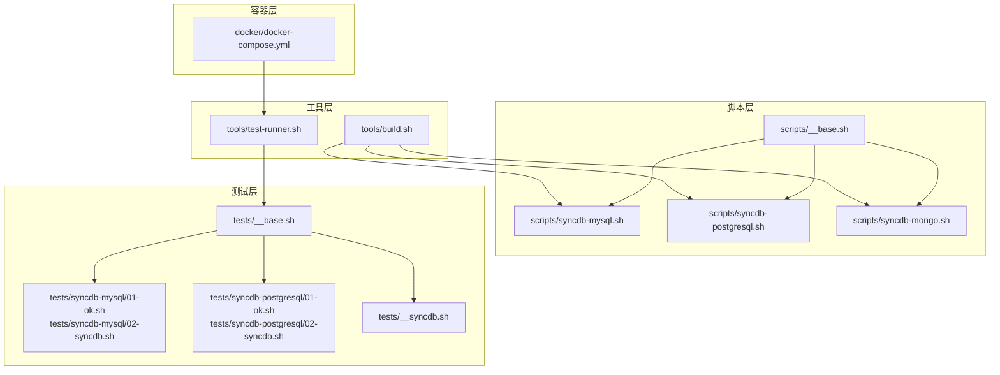
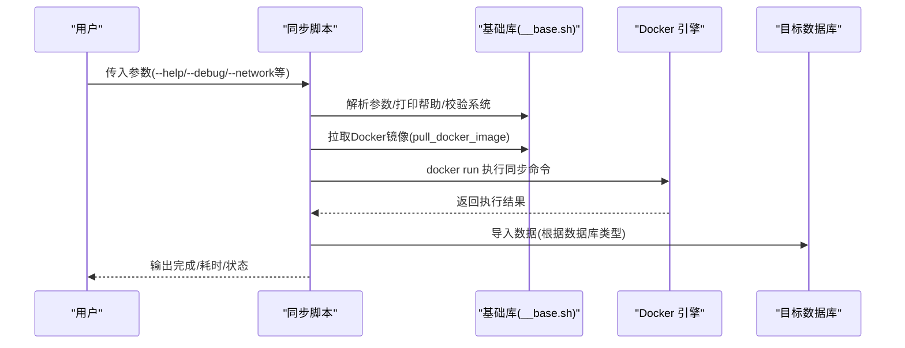
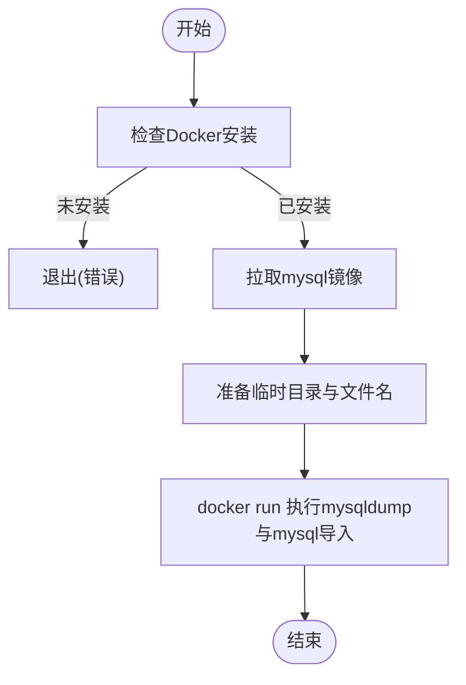
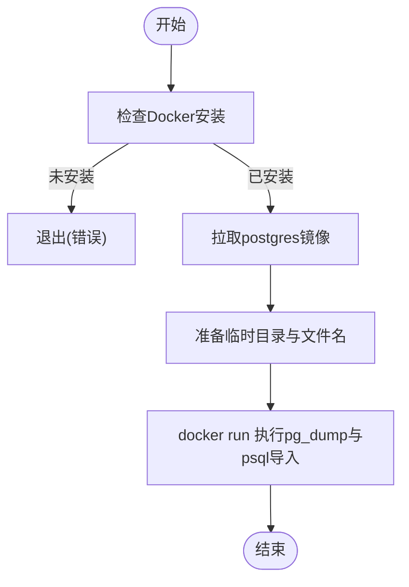
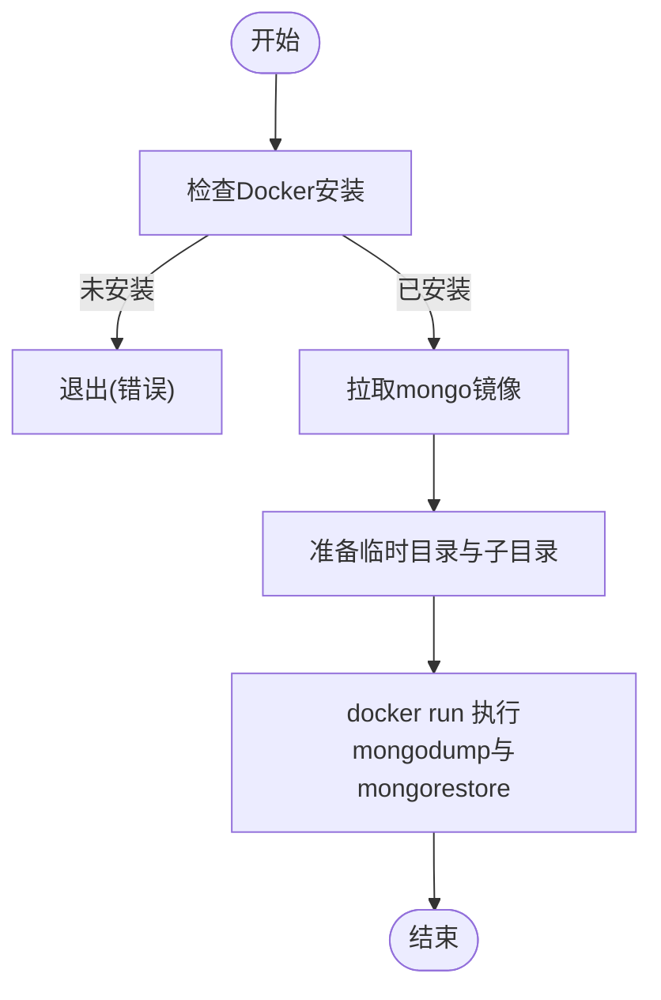
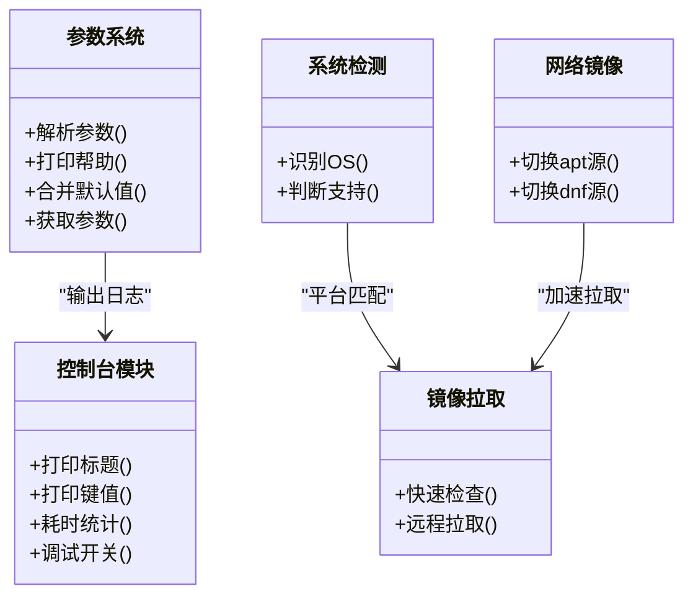
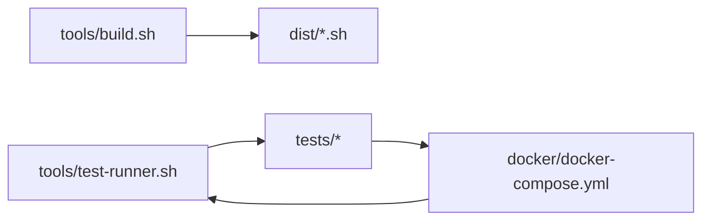

# 数据库同步系统

<cite>
**本文档引用的文件**
- [scripts/syncdb-mysql.sh](file://scripts/syncdb-mysql.sh)
- [scripts/syncdb-postgresql.sh](file://scripts/syncdb-postgresql.sh)
- [scripts/syncdb-mongo.sh](file://scripts/syncdb-mongo.sh)
- [scripts/__base.sh](file://scripts/__base.sh)
- [docker/docker-compose.yml](file://docker/docker-compose.yml)
- [tools/build.sh](file://tools/build.sh)
- [tools/test-runner.sh](file://tools/test-runner.sh)
- [tests/syncdb-mysql/01-ok.sh](file://tests/syncdb-mysql/01-ok.sh)
- [tests/syncdb-mysql/02-syncdb.sh](file://tests/syncdb-mysql/02-syncdb.sh)
- [tests/syncdb-postgresql/01-ok.sh](file://tests/syncdb-postgresql/01-ok.sh)
- [tests/syncdb-postgresql/02-syncdb.sh](file://tests/syncdb-postgresql/02-syncdb.sh)
- [tests/__base.sh](file://tests/__base.sh)
- [tests/__syncdb.sh](file://tests/__syncdb.sh)
</cite>

## 目录
1. [简介](#简介)
2. [项目结构](#项目结构)
3. [核心组件](#核心组件)
4. [架构总览](#架构总览)
5. [详细组件分析](#详细组件分析)
6. [依赖关系分析](#依赖关系分析)
7. [性能考量](#性能考量)
8. [故障排除指南](#故障排除指南)
9. [结论](#结论)
10. [附录](#附录)

## 简介
本项目为 HZ 9 Env Scripts 的数据库同步系统，提供统一的命令行工具，支持在不同操作系统与网络环境下，通过 Docker 容器化方式对 MySQL、PostgreSQL 和 MongoDB 三类数据库进行高效的数据同步。系统采用模块化的 Bash 脚本架构，结合内置参数解析、日志输出、Docker 镜像拉取与执行、以及完善的测试框架，确保跨平台一致性与可维护性。

## 项目结构
系统采用分层组织：
- scripts：核心同步脚本与通用基础库
- docker：容器编排与测试环境
- tests：针对各数据库同步脚本的功能与集成测试
- tools：构建与测试运行工具
- dist：构建产物目录（由 build.sh 合并生成）

**图表来源**
- [scripts/__base.sh](file://scripts/__base.sh)
- [scripts/syncdb-mysql.sh](file://scripts/syncdb-mysql.sh)
- [scripts/syncdb-postgresql.sh](file://scripts/syncdb-postgresql.sh)
- [scripts/syncdb-mongo.sh](file://scripts/syncdb-mongo.sh)
- [tools/build.sh](file://tools/build.sh)
- [tools/test-runner.sh](file://tools/test-runner.sh)
- [docker/docker-compose.yml](file://docker/docker-compose.yml)
- [tests/__base.sh](file://tests/__base.sh)
- [tests/syncdb-mysql/01-ok.sh](file://tests/syncdb-mysql/01-ok.sh)
- [tests/syncdb-mysql/02-syncdb.sh](file://tests/syncdb-mysql/02-syncdb.sh)
- [tests/syncdb-postgresql/01-ok.sh](file://tests/syncdb-postgresql/01-ok.sh)
- [tests/syncdb-postgresql/02-syncdb.sh](file://tests/syncdb-postgresql/02-syncdb.sh)
- [tests/__syncdb.sh](file://tests/__syncdb.sh)

**章节来源**
- [scripts/syncdb-mysql.sh](file://scripts/syncdb-mysql.sh)
- [scripts/syncdb-postgresql.sh](file://scripts/syncdb-postgresql.sh)
- [scripts/syncdb-mongo.sh](file://scripts/syncdb-mongo.sh)
- [scripts/__base.sh](file://scripts/__base.sh)
- [docker/docker-compose.yml](file://docker/docker-compose.yml)
- [tools/build.sh](file://tools/build.sh)
- [tools/test-runner.sh](file://tools/test-runner.sh)
- [tests/__base.sh](file://tests/__base.sh)
- [tests/__syncdb.sh](file://tests/__syncdb.sh)

## 核心组件
- 参数解析与帮助系统：统一的参数定义、别名、默认值与帮助输出，支持 --help/-h、--debug 等通用选项。
- 控制台输出模块：彩色日志、模块标题、键值对输出、耗时统计等，便于调试与审计。
- 操作系统检测与镜像拉取：自动识别当前系统，按需拉取对应 Docker 镜像，支持快速检查本地镜像存在性与平台匹配。
- 数据库同步流程：分别封装 MySQL、PostgreSQL、MongoDB 的导出/导入命令，通过 Docker 容器执行，实现无主机污染的同步。

**章节来源**
- [scripts/__base.sh](file://scripts/__base.sh)
- [scripts/syncdb-mysql.sh](file://scripts/syncdb-mysql.sh)
- [scripts/syncdb-postgresql.sh](file://scripts/syncdb-postgresql.sh)
- [scripts/syncdb-mongo.sh](file://scripts/syncdb-mongo.sh)

## 架构总览
系统以“脚本 + 基础库 + 容器”三层架构实现：
- 脚本层：每个数据库同步脚本独立实现参数解析、临时目录管理、Docker 镜像拉取与执行。
- 基础库层：提供参数解析、控制台输出、系统检测、镜像拉取、网络镜像配置等通用能力。
- 容器层：通过 docker run 在隔离环境中执行数据库客户端工具，完成数据导出与导入。

**图表来源**
- [scripts/syncdb-mysql.sh](file://scripts/syncdb-mysql.sh)
- [scripts/syncdb-postgresql.sh](file://scripts/syncdb-postgresql.sh)
- [scripts/syncdb-mongo.sh](file://scripts/syncdb-mongo.sh)
- [scripts/__base.sh](file://scripts/__base.sh)

## 详细组件分析

### MySQL 同步组件
- 参数与默认值：支持 --network、--db-version、--docker-image-quick-check、--from-*、--to-*、--temp 等。
- 临时目录与文件：在指定临时目录下生成带时间戳的 SQL 备份文件。
- Docker 执行：以 mysql:版本 作为容器镜像，挂载临时目录到 /data-backup，执行 mysqldump 导出与 mysql 导入。
- 错误处理：若未安装 Docker 则直接退出；容器内命令失败不影响脚本继续执行，但会记录耗时与状态。

**图表来源**
- [scripts/syncdb-mysql.sh](file://scripts/syncdb-mysql.sh)

**章节来源**
- [scripts/syncdb-mysql.sh](file://scripts/syncdb-mysql.sh)

### PostgreSQL 同步组件
- 参数与默认值：与 MySQL 类似，但默认端口为 5432，用户名默认 postgres。
- Docker 执行：以 postgres:版本-alpine 作为镜像，使用 PGPASSWORD 环境变量与 psql/pg_dump 工具。
- 数据库操作：先 DROP 再 CREATE 目标数据库，再导入备份文件。

**图表来源**
- [scripts/syncdb-postgresql.sh](file://scripts/syncdb-postgresql.sh)

**章节来源**
- [scripts/syncdb-postgresql.sh](file://scripts/syncdb-postgresql.sh)

### MongoDB 同步组件
- 参数与默认值：默认端口 27017，用户名默认 root，数据库默认 admin。
- 版本适配：根据版本号选择 mongosh 或 mongo 命令。
- Docker 执行：以 mongo:版本 作为镜像，使用 mongodump/mongorestore 导出/导入。
- 数据库操作：先对目标数据库执行 dropDatabase，再从导出目录恢复。

**图表来源**
- [scripts/syncdb-mongo.sh](file://scripts/syncdb-mongo.sh)

**章节来源**
- [scripts/syncdb-mongo.sh](file://scripts/syncdb-mongo.sh)

### 基础库组件
- 参数系统：支持多字段参数定义、别名、默认值与帮助输出；解析用户输入并合并默认值。
- 控制台模块：提供彩色日志、模块标题、键值输出、耗时统计、调试开关等。
- 系统检测：识别 OS 名称、版本、架构，判断是否支持当前系统。
- 镜像拉取：支持快速检查本地镜像是否存在且平台匹配，否则从远程拉取。
- 网络镜像：支持 in-china 与 default 两种网络模式，自动切换 apt/dnf 源或 EPEL 源。

**图表来源**
- [scripts/__base.sh](file://scripts/__base.sh)

**章节来源**
- [scripts/__base.sh](file://scripts/__base.sh)

## 依赖关系分析
- 构建流程：build.sh 将 scripts 下的脚本按 source 指令递归合并到 dist 目录，生成可直接执行的单文件脚本。
- 测试流程：test-runner.sh 统一调度 tests 下的测试用例，支持按目录/脚本筛选、网络配置与调试模式。
- 容器编排：docker-compose.yml 提供多发行版测试环境，挂载宿主 Docker Socket 以便在容器中运行 Docker。

**图表来源**
- [tools/build.sh](file://tools/build.sh)
- [tools/test-runner.sh](file://tools/test-runner.sh)
- [docker/docker-compose.yml](file://docker/docker-compose.yml)

**章节来源**
- [tools/build.sh](file://tools/build.sh)
- [tools/test-runner.sh](file://tools/test-runner.sh)
- [docker/docker-compose.yml](file://docker/docker-compose.yml)

## 性能考量
- 镜像拉取优化：启用 --docker-image-quick-check 可跳过重复拉取，提升二次执行效率。
- 平台匹配：强制 --platform linux/amd64，避免跨平台兼容性导致的性能回退。
- 临时目录：将备份文件写入宿主机目录并通过卷挂载到容器，减少拷贝开销。
- 网络加速：在 in-china 网络模式下替换 apt/dnf 源，显著降低镜像与依赖下载时间。
- 并发测试：docker-compose 支持多环境并行测试，缩短回归周期。

[本节为通用指导，无需列出具体文件来源]

## 故障排除指南
- Docker 未安装
  - 现象：脚本直接退出并提示未安装 Docker。
  - 处理：先安装 Docker 并确保 docker/compose 可用。
  - 参考路径：[scripts/syncdb-*.sh](file://scripts/syncdb-mysql.sh)

- 镜像拉取失败
  - 现象：拉取超时或权限错误。
  - 处理：检查网络与代理；在 in-china 模式下自动切换镜像源；必要时手动 docker login。
  - 参考路径：[scripts/__base.sh](file://scripts/__base.sh)

- 权限与认证错误
  - 现象：mysqldump/mysql、pg_dump/psql、mongodump/mongorestore 报错。
  - 处理：确认 --from-* 与 --to-* 的主机、端口、用户名、密码与数据库名称正确；MongoDB 需要 --authenticationDatabase。
  - 参考路径：[scripts/syncdb-*.sh](file://scripts/syncdb-mysql.sh)

- 容器内命令失败
  - 现象：容器执行返回非零退出码。
  - 处理：开启 --debug 查看完整输出；检查源数据库可达性与防火墙；确认目标数据库存在且有足够权限。
  - 参考路径：[scripts/syncdb-*.sh](file://scripts/syncdb-mysql.sh)

- 测试环境异常
  - 现象：测试用例跳过或失败。
  - 处理：使用 test-runner.sh 的 --network 与 --debug 参数；检查 docker-compose 服务是否正常启动。
  - 参考路径：[tools/test-runner.sh](file://tools/test-runner.sh)，[docker/docker-compose.yml](file://docker/docker-compose.yml)

**章节来源**
- [scripts/syncdb-mysql.sh](file://scripts/syncdb-mysql.sh)
- [scripts/syncdb-postgresql.sh](file://scripts/syncdb-postgresql.sh)
- [scripts/syncdb-mongo.sh](file://scripts/syncdb-mongo.sh)
- [scripts/__base.sh](file://scripts/__base.sh)
- [tools/test-runner.sh](file://tools/test-runner.sh)
- [docker/docker-compose.yml](file://docker/docker-compose.yml)

## 结论
HZ 9 Env Scripts 的数据库同步系统通过模块化脚本与容器化执行，实现了对 MySQL、PostgreSQL、MongoDB 的一致化同步流程。配合参数解析、日志输出、镜像拉取与网络镜像配置，系统在多平台与复杂网络环境下具备良好的可用性与可维护性。建议在生产环境中结合备份策略、监控告警与自动化巡检，持续保障数据同步的可靠性与性能。

[本节为总结性内容，无需列出具体文件来源]

## 附录

### 使用示例与配置指南
- 基本用法
  - 查看帮助：脚本 --help/-h
  - 开启调试：--debug
  - 指定网络：--network in-china 或 default
  - 快速检查镜像：--docker-image-quick-check
- MySQL 示例
  - 指定源与目标：--from-hostname/--from-port/--from-username/--from-password/--from-database
  - --to-* 对应目标数据库连接信息
  - --temp 指定临时目录
- PostgreSQL 示例
  - 默认端口 5432，用户名 postgres
  - --db-version 指定版本（如 15.4）
- MongoDB 示例
  - 默认端口 27017，用户名 root
  - 自动根据版本选择 mongosh 或 mongo

**章节来源**
- [scripts/syncdb-mysql.sh](file://scripts/syncdb-mysql.sh)
- [scripts/syncdb-postgresql.sh](file://scripts/syncdb-postgresql.sh)
- [scripts/syncdb-mongo.sh](file://scripts/syncdb-mongo.sh)

### 测试与验证
- 单元测试
  - 01-ok.sh：验证脚本语法、帮助输出与系统支持情况
  - 02-syncdb.sh：实际执行同步流程，初始化源数据库数据后验证目标库是否同步成功
- 测试运行
  - 使用 tools/test-runner.sh 统一调度，支持 --test-dir、--test-file、--script、--network、--debug 等参数
- 容器测试环境
  - docker/docker-compose.yml 提供 Ubuntu/Debian/Fedora/RedHat 多版本测试容器，挂载宿主 Docker Socket

**章节来源**
- [tests/syncdb-mysql/01-ok.sh](file://tests/syncdb-mysql/01-ok.sh)
- [tests/syncdb-mysql/02-syncdb.sh](file://tests/syncdb-mysql/02-syncdb.sh)
- [tests/syncdb-postgresql/01-ok.sh](file://tests/syncdb-postgresql/01-ok.sh)
- [tests/syncdb-postgresql/02-syncdb.sh](file://tests/syncdb-postgresql/02-syncdb.sh)
- [tests/__base.sh](file://tests/__base.sh)
- [tests/__syncdb.sh](file://tests/__syncdb.sh)
- [tools/test-runner.sh](file://tools/test-runner.sh)
- [docker/docker-compose.yml](file://docker/docker-compose.yml)