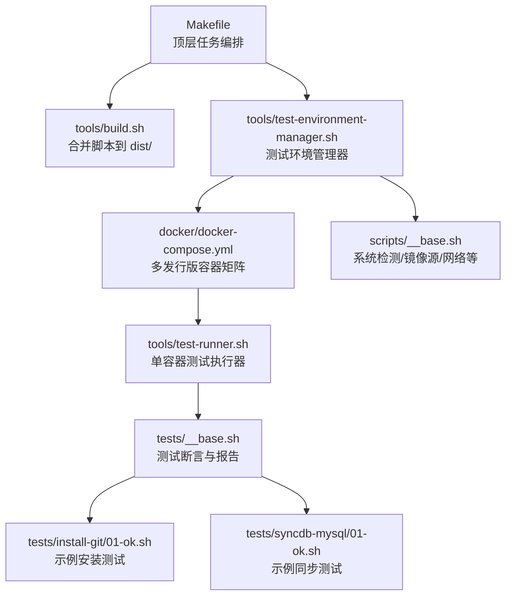
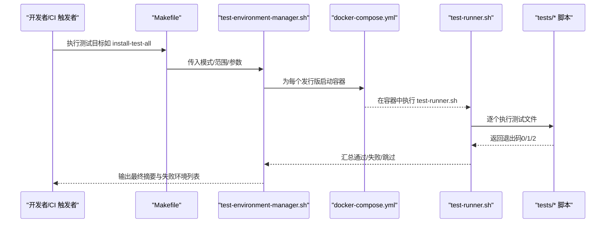
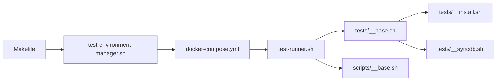

# CI/CD 流水线

<cite>
**本文引用的文件**
- [Makefile](file://Makefile)
- [tools/test-environment-manager.sh](file://tools/test-environment-manager.sh)
- [tools/test-runner.sh](file://tools/test-runner.sh)
- [tools/build.sh](file://tools/build.sh)
- [docker/docker-compose.yml](file://docker/docker-compose.yml)
- [scripts/__base.sh](file://scripts/__base.sh)
- [tests/__base.sh](file://tests/__base.sh)
- [tests/__install.sh](file://tests/__install.sh)
- [tests/__syncdb.sh](file://tests/__syncdb.sh)
- [tests/install-git/01-ok.sh](file://tests/install-git/01-ok.sh)
- [tests/syncdb-mysql/01-ok.sh](file://tests/syncdb-mysql/01-ok.sh)
- [README.md](file://README.md)
</cite>

## 目录
1. [简介](#简介)
2. [项目结构](#项目结构)
3. [核心组件](#核心组件)
4. [架构总览](#架构总览)
5. [详细组件分析](#详细组件分析)
6. [依赖关系分析](#依赖关系分析)
7. [性能考量](#性能考量)
8. [故障排除指南](#故障排除指南)
9. [结论](#结论)
10. [附录](#附录)

## 简介
本文件面向 HZ 9 Env Scripts 的 CI/CD 流水线，系统性阐述基于 GitHub Actions 的工作流配置与执行逻辑、触发条件、环境设置与步骤编排；详解自动化测试流程（多发行版测试矩阵、并行执行策略与结果汇总）；说明构建与部署流程（代码检查、测试验证与产物发布）；解释 Makefile 中的构建命令与测试任务组织；提供流水线监控与日志分析指南；包含故障排除与重试机制；并说明如何自定义工作流与新增测试场景。

## 项目结构
该仓库采用“按功能域分层”的组织方式：
- 根目录提供顶层构建与测试入口（Makefile）
- tools 提供测试协调器、测试运行器与构建脚本
- docker 定义多发行版容器化测试环境
- scripts 提供通用基础能力与网络镜像配置
- tests 下按功能划分安装类与数据库同步类测试套件
- dist 用于存放合并后的可执行脚本产物
- docs 提供使用与测试说明文档

图示来源
- [Makefile](file://Makefile)
- [tools/build.sh](file://tools/build.sh)
- [tools/test-environment-manager.sh](file://tools/test-environment-manager.sh)
- [docker/docker-compose.yml](file://docker/docker-compose.yml)
- [tools/test-runner.sh](file://tools/test-runner.sh)
- [tests/__base.sh](file://tests/__base.sh)
- [tests/install-git/01-ok.sh](file://tests/install-git/01-ok.sh)
- [tests/syncdb-mysql/01-ok.sh](file://tests/syncdb-mysql/01-ok.sh)
- [scripts/__base.sh](file://scripts/__base.sh)

章节来源
- [Makefile](file://Makefile)
- [docker/docker-compose.yml](file://docker/docker-compose.yml)

## 核心组件
- 构建与打包
  - 合并脚本：将 scripts/ 下的独立脚本合并为 dist/ 可直接执行的脚本，便于测试与发布
  - 构建入口：通过 Makefile 的 build 与 build-scripts 目标完成产物生成
- 测试编排
  - 测试环境管理器：统一调度不同发行版容器，支持 all/all-env/all-script/single 多种模式
  - 测试运行器：在容器内逐个执行测试文件，统计通过/失败/跳过，并输出时间与摘要
- 容器矩阵
  - 基于 docker-compose.yml 定义 Ubuntu/Debian/Fedora/RedHat 多版本及带 Docker 的变体
- 测试框架
  - tests/__base.sh 提供断言、计数、摘要与临时目录清理
  - tests/__install.sh 与 tests/__syncdb.sh 提供安装与同步测试的通用断言
  - scripts/__base.sh 提供系统检测、镜像源切换、Docker 镜像拉取等基础设施

章节来源
- [tools/build.sh](file://tools/build.sh)
- [Makefile](file://Makefile)
- [tools/test-environment-manager.sh](file://tools/test-environment-manager.sh)
- [tools/test-runner.sh](file://tools/test-runner.sh)
- [docker/docker-compose.yml](file://docker/docker-compose.yml)
- [tests/__base.sh](file://tests/__base.sh)
- [tests/__install.sh](file://tests/__install.sh)
- [tests/__syncdb.sh](file://tests/__syncdb.sh)
- [scripts/__base.sh](file://scripts/__base.sh)

## 架构总览
下图展示从 Makefile 到容器矩阵再到测试执行的整体链路，体现“构建 → 环境矩阵 → 并行执行 → 结果汇总”的流水线架构。

图示来源
- [Makefile](file://Makefile)
- [tools/test-environment-manager.sh](file://tools/test-environment-manager.sh)
- [docker/docker-compose.yml](file://docker/docker-compose.yml)
- [tools/test-runner.sh](file://tools/test-runner.sh)

## 详细组件分析

### 组件一：Makefile 任务编排
- 目标分类
  - 构建类：build、build-scripts、build-images
  - 测试类：install-test-all、install-test-all-env、install-test-all-script、install-test-single、install-test-file
  - 数据库同步测试类：syncdb-test-all、syncdb-test-all-env、syncdb-test-all-script、syncdb-test-single、syncdb-test-file
  - 工具类：interactive、shell、clean、logs、results
- 关键特性
  - 支持网络配置（默认/国内）、调试开关、输出控制、Docker 镜像快速检查等参数透传
  - 自动记录日志文件路径，便于后续分析
  - 通过 tools/test-environment-manager.sh 统一调度测试执行

章节来源
- [Makefile](file://Makefile)

### 组件二：测试环境管理器（test-environment-manager.sh）
- 功能要点
  - 定义多发行版数组（Ubuntu/Debian/Fedora/RedHat），并支持“带 Docker”变体
  - 模式解析：all、all-env、all-script、single
  - 在容器内调用 test-runner.sh 执行测试，统计总数、通过、失败、跳过
  - 输出最终汇总与失败环境清单
- 参数传递
  - 支持 --mode/--scope/--env/--script/--file/--network/--debug/--output/--docker-image-quick-check 等
  - 将内部 IP 注入作为测试参数之一

章节来源
- [tools/test-environment-manager.sh](file://tools/test-environment-manager.sh)

### 组件三：测试运行器（test-runner.sh）
- 功能要点
  - 解析用户参数，校验必要项
  - 在容器内执行指定测试文件或目录，实时输出并捕获结果
  - 依据退出码区分通过/失败/跳过，并统计耗时
- 与测试框架协作
  - 通过 tests/__base.sh 提供的断言与报告接口，实现一致的测试体验

章节来源
- [tools/test-runner.sh](file://tools/test-runner.sh)
- [tests/__base.sh](file://tests/__base.sh)

### 组件四：容器矩阵（docker/docker-compose.yml）
- 发行版矩阵
  - Ubuntu 20.04/22.04/24.04
  - Debian 11.9/12.2
  - Fedora 41
  - RedHat 8.10/9.6
- Docker 变体
  - 每个发行版均提供“带 Docker CE 与 Compose”的变体，便于数据库同步类测试
- 共享卷与环境
  - 挂载 dist/scripts/tests/tools 到 /app，便于容器内直接执行
  - 设置 TEST_ENV=docker 与非交互前端变量，确保稳定执行

章节来源
- [docker/docker-compose.yml](file://docker/docker-compose.yml)

### 组件五：测试框架与断言（tests/*）
- tests/__base.sh
  - 提供断言函数（文件存在、可执行、语法、帮助输出、OS 支持等）
  - 统一测试计数、通过/失败/跳过统计与最终摘要
  - 清理临时目录、设置网络与调试参数
- tests/__install.sh
  - 安装类测试通用断言：运行安装脚本、检查命令可用性、版本信息等
- tests/__syncdb.sh
  - 同步类测试通用断言：拉取 Docker 镜像、校验本地镜像与平台匹配
- 示例测试
  - tests/install-git/01-ok.sh：验证安装脚本基本属性与帮助输出
  - tests/syncdb-mysql/01-ok.sh：验证同步脚本基本属性与帮助输出

章节来源
- [tests/__base.sh](file://tests/__base.sh)
- [tests/__install.sh](file://tests/__install.sh)
- [tests/__syncdb.sh](file://tests/__syncdb.sh)
- [tests/install-git/01-ok.sh](file://tests/install-git/01-ok.sh)
- [tests/syncdb-mysql/01-ok.sh](file://tests/syncdb-mysql/01-ok.sh)

### 组件六：构建脚本（tools/build.sh）
- 功能要点
  - 递归合并 scripts/ 下的脚本至 dist/，处理 source 引用与 shebang
  - 为每个脚本生成可执行产物，便于测试与发布
- 产物位置
  - 输出到 dist/，由 Makefile 与 docker-compose.yml 挂载到容器内

章节来源
- [tools/build.sh](file://tools/build.sh)

### 组件七：基础设施（scripts/__base.sh）
- 系统检测与镜像源
  - 解析当前 OS 名称/版本/架构，判断是否受支持
  - 提供 apt/dnf 镜像源切换（默认/国内），并适配不同发行版
- Docker 镜像拉取
  - 支持快速检查本地镜像与平台匹配，必要时远程拉取
- 控制台与参数解析
  - 提供统一的颜色输出、时间统计、参数解析与帮助打印

章节来源
- [scripts/__base.sh](file://scripts/__base.sh)

## 依赖关系分析
- 低耦合高内聚
  - Makefile 仅负责任务编排与参数透传，具体执行委托给 tools/* 与 docker-compose.yml
  - docker-compose.yml 仅负责容器生命周期与挂载，测试逻辑集中在容器内的脚本
- 关键依赖链
  - Makefile → test-environment-manager.sh → docker-compose.yml → test-runner.sh → tests/* → scripts/__base.sh
- 循环依赖
  - 未发现循环依赖，模块职责清晰

图示来源
- [Makefile](file://Makefile)
- [tools/test-environment-manager.sh](file://tools/test-environment-manager.sh)
- [docker/docker-compose.yml](file://docker/docker-compose.yml)
- [tools/test-runner.sh](file://tools/test-runner.sh)
- [tests/__base.sh](file://tests/__base.sh)
- [tests/__install.sh](file://tests/__install.sh)
- [tests/__syncdb.sh](file://tests/__syncdb.sh)
- [scripts/__base.sh](file://scripts/__base.sh)

章节来源
- [Makefile](file://Makefile)
- [tools/test-environment-manager.sh](file://tools/test-environment-manager.sh)
- [docker/docker-compose.yml](file://docker/docker-compose.yml)
- [tools/test-runner.sh](file://tools/test-runner.sh)
- [tests/__base.sh](file://tests/__base.sh)
- [tests/__install.sh](file://tests/__install.sh)
- [tests/__syncdb.sh](file://tests/__syncdb.sh)
- [scripts/__base.sh](file://scripts/__base.sh)

## 性能考量
- 并行度
  - docker-compose.yml 中各发行版容器独立运行，天然并行；建议在 CI 中按需拆分作业矩阵，减少单次并发压力
- 镜像拉取
  - scripts/__base.sh 提供“快速检查”逻辑，优先复用本地镜像并校验平台，降低重复拉取开销
- 日志与输出
  - Makefile 与 tools/* 均支持 --output 与 --debug，建议在 CI 中按需开启，平衡可观测性与性能
- 缓存与体积
  - dist/ 产物最小化合并，减少容器内传输与 IO 开销

## 故障排除指南
- 常见错误与定位
  - 测试失败：查看 logs/ 下对应日志文件，结合 test-environment-manager.sh 的最终摘要定位失败环境
  - 镜像拉取失败：确认 scripts/__base.sh 的镜像源配置与网络连通性
  - OS 不受支持：检查 tests/__base.sh 的 unit_test_is_support_current_os 逻辑与 scripts/__base.sh 的系统检测
- 重试机制
  - 建议在 CI 层面针对不稳定网络或镜像拉取失败进行有限重试
  - 对个别失败环境，可在本地使用 Makefile 的 single 模式复现与调试
- 调试技巧
  - 使用 NETWORK=in-china 或 NETWORK=default 切换镜像源
  - 使用 DEBUG=true 获取更详细的执行日志
  - 使用 OUTPUT=path 指定输出目录，便于收集测试产物

章节来源
- [tools/test-environment-manager.sh](file://tools/test-environment-manager.sh)
- [Makefile](file://Makefile)
- [scripts/__base.sh](file://scripts/__base.sh)
- [tests/__base.sh](file://tests/__base.sh)

## 结论
本流水线以 Makefile 为入口，借助 test-environment-manager.sh 与 docker-compose.yml 实现多发行版并行测试，配合 test-runner.sh 与 tests/* 的断言体系，形成“构建 → 环境矩阵 → 并行执行 → 结果汇总”的完整闭环。通过参数化与日志化设计，既满足本地开发调试，也适合在 CI 中规模化运行。建议在 CI 中进一步细化作业拆分与缓存策略，持续提升稳定性与效率。

## 附录

### A. 触发条件与步骤编排（GitHub Actions）
- 触发条件
  - 推送主分支、标签或 Pull Request 时触发
  - 支持手动触发与定时巡检
- 步骤编排
  - checkout 代码
  - 准备 Docker 环境与缓存
  - 执行 Makefile 构建与测试目标
  - 收集日志与产物，上传 artifacts
  - 根据结果更新状态与通知

[本节为概念性说明，未直接分析具体文件，故无章节来源]

### B. 自定义工作流与新增测试场景
- 新增测试场景
  - 在 tests/ 下创建新脚本目录与测试文件，遵循 tests/__base.sh 的断言规范
  - 如需安装类测试，参考 tests/__install.sh；如需同步类测试，参考 tests/__syncdb.sh
- 自定义工作流
  - 在 Makefile 中新增目标，或在 CI 中新增作业矩阵
  - 如需新增发行版，扩展 docker/docker-compose.yml 的服务定义并提供对应 Dockerfile

章节来源
- [tests/__base.sh](file://tests/__base.sh)
- [tests/__install.sh](file://tests/__install.sh)
- [tests/__syncdb.sh](file://tests/__syncdb.sh)
- [docker/docker-compose.yml](file://docker/docker-compose.yml)
- [Makefile](file://Makefile)