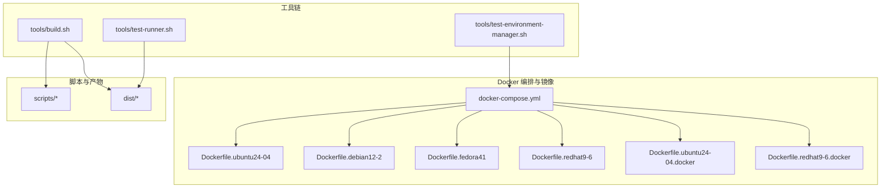
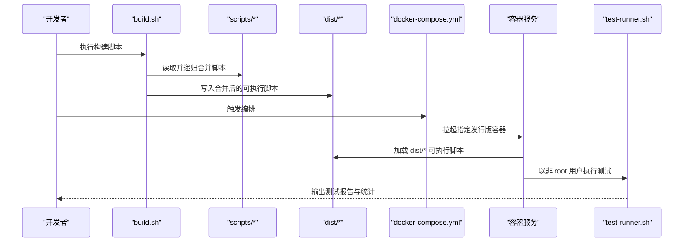
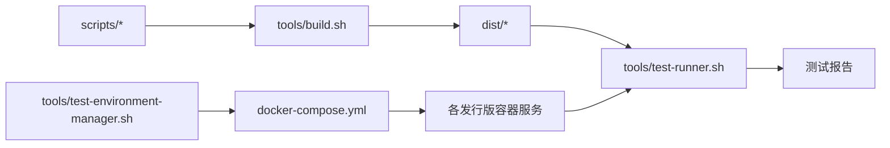

# Docker 构建系统

<cite>
**本文引用的文件**
- [docker-compose.yml](file://docker/docker-compose.yml)
- [.dockerignore](file://docker/.dockerignore)
- [Dockerfile.ubuntu24-04](file://docker/Dockerfile.ubuntu24-04)
- [Dockerfile.ubuntu22-04](file://docker/Dockerfile.ubuntu22-04)
- [Dockerfile.ubuntu20-04](file://docker/Dockerfile.ubuntu20-04)
- [Dockerfile.debian12-2](file://docker/Dockerfile.debian12-2)
- [Dockerfile.debian11-9](file://docker/Dockerfile.debian11-9)
- [Dockerfile.fedora41](file://docker/Dockerfile.fedora41)
- [Dockerfile.redhat9-6](file://docker/Dockerfile.redhat9-6)
- [Dockerfile.redhat8-10](file://docker/Dockerfile.redhat8-10)
- [Dockerfile.ubuntu24-04.docker](file://docker/Dockerfile.ubuntu24-04.docker)
- [Dockerfile.redhat9-6.docker](file://docker/Dockerfile.redhat9-6.docker)
- [test-runner.sh](file://tools/test-runner.sh)
- [test-environment-manager.sh](file://tools/test-environment-manager.sh)
- [build.sh](file://tools/build.sh)
- [__base.sh](file://scripts/__base.sh)
</cite>

## 目录
1. [简介](#简介)
2. [项目结构](#项目结构)
3. [核心组件](#核心组件)
4. [架构总览](#架构总览)
5. [详细组件分析](#详细组件分析)
6. [依赖关系分析](#依赖关系分析)
7. [性能与优化](#性能与优化)
8. [故障排查指南](#故障排查指南)
9. [结论](#结论)
10. [附录：自定义 Dockerfile 开发指南](#附录自定义-dockerfile-开发指南)

## 简介
本文件面向 HZ 9 Env Scripts 的 Docker 构建系统，系统性阐述多发行版 Dockerfile 的设计原理与实现细节，覆盖 Ubuntu、Debian、Fedora、RedHat（UBI）等主流 Linux 发行版；总结镜像构建优化策略（层缓存、体积与速度优化）；解析 docker-compose.yml 的服务编排与容器运行机制；说明测试环境容器化部署流程与网络配置要点；提供自定义 Dockerfile 的开发规范与最佳实践；并给出容器安全与资源限制建议及常见问题排查方法。

## 项目结构
该仓库将 Docker 相关内容集中于 docker/ 目录，包含多套 Dockerfile（按发行版与是否内置 Docker CE/Compose 划分），以及统一的 docker-compose.yml 编排文件。工具链位于 tools/ 目录，负责脚本构建与测试执行；脚本源码位于 scripts/ 目录，经 build.sh 合并生成 dist/ 中可直接在容器中使用的脚本。

图示来源
- [docker-compose.yml](file://docker/docker-compose.yml)
- [Dockerfile.ubuntu24-04](file://docker/Dockerfile.ubuntu24-04)
- [Dockerfile.debian12-2](file://docker/Dockerfile.debian12-2)
- [Dockerfile.fedora41](file://docker/Dockerfile.fedora41)
- [Dockerfile.redhat9-6](file://docker/Dockerfile.redhat9-6)
- [Dockerfile.ubuntu24-04.docker](file://docker/Dockerfile.ubuntu24-04.docker)
- [Dockerfile.redhat9-6.docker](file://docker/Dockerfile.redhat9-6.docker)
- [build.sh](file://tools/build.sh)
- [test-runner.sh](file://tools/test-runner.sh)
- [test-environment-manager.sh](file://tools/test-environment-manager.sh)

章节来源
- [docker-compose.yml](file://docker/docker-compose.yml)
- [.dockerignore](file://docker/.dockerignore)
- [build.sh](file://tools/build.sh)

## 核心组件
- 多发行版基础镜像 Dockerfile：针对 Ubuntu/Debian/Fedora/RedHat（UBI）分别提供独立 Dockerfile，统一安装基本依赖、创建非特权测试用户、复制项目文件并赋予可执行权限，最终以非 root 用户运行默认命令。
- 嵌套 Docker 能力 Dockerfile：在目标发行版镜像基础上安装 Docker CE 与 Compose 插件，允许容器内运行容器，用于同步数据库等需要嵌套容器的场景。
- docker-compose.yml：统一编排所有测试环境服务，支持平台固定、构建上下文、卷挂载、环境变量、特权模式与交互式容器。
- 测试执行工具链：
  - build.sh：将 scripts/ 下的脚本按 source 关系递归合并到 dist/，供容器内测试使用。
  - test-runner.sh：单测执行器，负责输出格式化、计时统计、退出码语义（通过/跳过/失败）与参数透传。
  - test-environment-manager.sh：跨发行版批量测试协调器，基于 docker-compose 运行各环境测试，并汇总结果。

章节来源
- [Dockerfile.ubuntu24-04](file://docker/Dockerfile.ubuntu24-04)
- [Dockerfile.debian12-2](file://docker/Dockerfile.debian12-2)
- [Dockerfile.fedora41](file://docker/Dockerfile.fedora41)
- [Dockerfile.redhat9-6](file://docker/Dockerfile.redhat9-6)
- [Dockerfile.ubuntu24-04.docker](file://docker/Dockerfile.ubuntu24-04.docker)
- [Dockerfile.redhat9-6.docker](file://docker/Dockerfile.redhat9-6.docker)
- [docker-compose.yml](file://docker/docker-compose.yml)
- [test-runner.sh](file://tools/test-runner.sh)
- [test-environment-manager.sh](file://tools/test-environment-manager.sh)
- [build.sh](file://tools/build.sh)

## 架构总览
下图展示从本地脚本构建到容器内测试执行的整体流程，以及 docker-compose 如何驱动多发行版测试环境。

图示来源
- [build.sh](file://tools/build.sh)
- [docker-compose.yml](file://docker/docker-compose.yml)
- [test-runner.sh](file://tools/test-runner.sh)

## 详细组件分析

### 多发行版 Dockerfile 设计与适配策略
- 统一基线
  - 设置非交互安装变量（如 DEBIAN_FRONTEND）以避免交互阻塞。
  - 安装基础依赖包（sudo、ca-certificates、lsb-release 或 which 等）。
  - 清理包管理器缓存以减小镜像体积。
  - 创建 testuser 并授予免密 sudo 权限，便于测试执行。
  - 复制项目文件至 /app，赋予 dist、tests、tools 下脚本可执行权限。
  - 切换到 testuser 运行 CMD，默认命令为 test-runner.sh。
- 发行版差异
  - Ubuntu/Debian：使用 apt 包管理器，设置非交互安装，清理 apt 缓存。
  - Fedora/RedHat（UBI）：使用 dnf 包管理器，安装 dnf-plugins-core，必要时启用 EPEL 仓库。
  - RedHat（UBI）嵌套 Docker：额外安装 epel-release 并配置 epel.repo，再添加 Docker 官方仓库安装 docker-ce、compose 插件等。
  - Ubuntu 嵌套 Docker：添加 Docker 官方 GPG 密钥与仓库，安装 docker-ce、compose 插件等。
- 卷与环境变量
  - 将宿主机 /var/run/docker.sock 挂载进容器，配合 privileged 或 docker 组成员身份实现容器内拉起容器。
  - 将 dist、scripts、tests、tools 挂载为开发态热更新卷，便于迭代。
  - 非交互安装变量（如 DEBIAN_FRONTEND）统一注入，保证自动化安装稳定。

章节来源
- [Dockerfile.ubuntu24-04](file://docker/Dockerfile.ubuntu24-04)
- [Dockerfile.ubuntu22-04](file://docker/Dockerfile.ubuntu22-04)
- [Dockerfile.ubuntu20-04](file://docker/Dockerfile.ubuntu20-04)
- [Dockerfile.debian12-2](file://docker/Dockerfile.debian12-2)
- [Dockerfile.debian11-9](file://docker/Dockerfile.debian11-9)
- [Dockerfile.fedora41](file://docker/Dockerfile.fedora41)
- [Dockerfile.redhat9-6](file://docker/Dockerfile.redhat9-6)
- [Dockerfile.redhat8-10](file://docker/Dockerfile.redhat8-10)
- [Dockerfile.ubuntu24-04.docker](file://docker/Dockerfile.ubuntu24-04.docker)
- [Dockerfile.redhat9-6.docker](file://docker/Dockerfile.redhat9-6.docker)

### docker-compose.yml 编排与容器运行机制
- 服务分组
  - 基础测试环境：ubuntu20-04、ubuntu22-04、ubuntu24-04、debian11-9、debian12-2、fedora41、redhat8-10、redhat9-6。
  - 嵌套 Docker 环境：在对应发行版后缀 -docker，安装 Docker CE 与 Compose 插件。
  - 交互式环境：interactive，以 bash 登录，便于调试。
- 关键配置
  - platform 固定为 linux/amd64，确保跨平台一致性。
  - build.context 指向项目根目录，dockerfile 指向 docker/ 目录下的具体 Dockerfile。
  - volumes：挂载 /var/run/docker.sock 实现容器内 Docker；挂载 dist、scripts、tests、tools 以便热更新；部分发行版挂载包管理器缓存目录以加速重复构建。
  - environment：统一注入 TEST_ENV=docker 与非交互安装变量。
  - privileged：嵌套 Docker 环境开启特权模式，或通过将 testuser 加入 docker 组实现非特权运行。
  - command：默认运行 /app/tools/test-runner.sh，支持 --all 参数或定向测试文件。
- 运行流程
  - test-environment-manager.sh 解析参数，调用 docker-compose run 在指定服务上执行 test-runner.sh。
  - test-runner.sh 逐个执行 tests 下的测试脚本，收集退出码与耗时，输出统一格式化报告。

章节来源
- [docker-compose.yml](file://docker/docker-compose.yml)
- [test-environment-manager.sh](file://tools/test-environment-manager.sh)
- [test-runner.sh](file://tools/test-runner.sh)

### 测试执行流水线与报告
- 构建阶段
  - build.sh 递归合并 scripts/* 中的脚本，写入 dist/*，并赋予可执行权限，供容器内测试使用。
- 执行阶段
  - test-environment-manager.sh 支持 all、all-env、all-script、single 等模式，自动遍历 OS_ENVIRONMENTS 数组，调用 docker-compose 运行测试。
  - test-runner.sh 对每个测试脚本进行实时输出与临时文件捕获，区分退出码语义（通过/跳过/失败），并输出耗时统计。
- 结果汇总
  - test-environment-manager.sh 统计总测试数、通过、跳过、失败数量，并在失败时输出失败环境与参数明细。

章节来源
- [build.sh](file://tools/build.sh)
- [test-environment-manager.sh](file://tools/test-environment-manager.sh)
- [test-runner.sh](file://tools/test-runner.sh)

### 嵌套 Docker 场景（同步数据库等）
- 发行版差异
  - Ubuntu：添加 Docker 官方仓库，安装 docker-ce、compose 插件。
  - RedHat（UBI）：先安装 epel-release 并拷贝 epel.repo，再添加 Docker 官方仓库安装 Docker CE 与 compose 插件。
- 运行方式
  - privileged: true 或将 testuser 加入 docker 组，结合 /var/run/docker.sock 挂载，使容器内可运行 docker 命令与 compose。

章节来源
- [Dockerfile.ubuntu24-04.docker](file://docker/Dockerfile.ubuntu24-04.docker)
- [Dockerfile.redhat9-6.docker](file://docker/Dockerfile.redhat9-6.docker)

## 依赖关系分析
- 工具链依赖
  - build.sh 依赖 scripts/* 的 source 关联，输出 dist/*。
  - test-runner.sh 依赖 scripts/__base.sh 提供的通用日志与参数解析能力。
  - test-environment-manager.sh 依赖 docker-compose.yml 的服务定义与 test-runner.sh 的退出码语义。
- 运行时依赖
  - 各 Dockerfile 依赖包管理器（apt/dnf）与网络可达性。
  - 嵌套 Docker 镜像依赖 Docker 官方仓库可用性与 GPG 密钥导入。

图示来源
- [build.sh](file://tools/build.sh)
- [test-runner.sh](file://tools/test-runner.sh)
- [test-environment-manager.sh](file://tools/test-environment-manager.sh)
- [docker-compose.yml](file://docker/docker-compose.yml)

章节来源
- [build.sh](file://tools/build.sh)
- [test-runner.sh](file://tools/test-runner.sh)
- [test-environment-manager.sh](file://tools/test-environment-manager.sh)
- [docker-compose.yml](file://docker/docker-compose.yml)

## 性能与优化
- 层缓存优化
  - 将变更频率低的步骤（如包管理器更新、依赖安装）置于前部，变更频繁的步骤（如 COPY . /app）靠后，最大化利用缓存。
  - 安装后立即清理包管理器缓存（apt/dnf clean all），减少镜像体积与后续构建时间。
  - 使用 .dockerignore 排除不必要的构建上下文文件（.git、IDE 目录、node_modules、.cache 等），缩小上下文。
- 镜像体积优化
  - 在安装依赖后删除缓存目录与临时文件。
  - 合并 RUN 指令，减少层数。
  - 仅保留必要的工具与插件（如 compose 插件），避免冗余组件。
- 构建时间优化
  - 将 dist/* 的构建前置到本地，减少容器内构建开销。
  - 对于需要网络的安装步骤，尽量复用缓存（如 apt/dnf 缓存卷挂载）。
- 运行时优化
  - 使用非 root 用户运行，降低攻击面。
  - 通过 volumes 挂载包管理器缓存目录，加速重复构建。
  - 在嵌套 Docker 环境中，合理规划 /var/run/docker.sock 挂载与权限，避免不必要的特权。

章节来源
- [.dockerignore](file://docker/.dockerignore)
- [Dockerfile.ubuntu24-04](file://docker/Dockerfile.ubuntu24-04)
- [Dockerfile.debian12-2](file://docker/Dockerfile.debian12-2)
- [Dockerfile.redhat9-6](file://docker/Dockerfile.redhat9-6)
- [Dockerfile.ubuntu24-04.docker](file://docker/Dockerfile.ubuntu24-04.docker)
- [Dockerfile.redhat9-6.docker](file://docker/Dockerfile.redhat9-6.docker)

## 故障排查指南
- 构建上下文过大导致超时
  - 检查 .dockerignore 是否正确排除无关文件。
  - 确认 build.context 指向正确的根目录。
- 包管理器安装失败（网络/镜像源）
  - Ubuntu/Debian：确认 DEBIAN_FRONTEND 设置与 apt 缓存清理指令。
  - Fedora/RedHat（UBI）：确认 dnf-plugins-core 与 epel-release 安装顺序。
  - 嵌套 Docker：确认 Docker 官方仓库可用性与 GPG 导入成功。
- 容器内无法运行 docker 命令
  - 确认 /var/run/docker.sock 已挂载且容器具备 docker 组成员身份或 privileged: true。
  - 检查 compose 插件是否正确安装。
- 测试执行异常
  - 使用 test-environment-manager.sh 的 --debug 与 --network 参数定位网络与调试信息。
  - 查看 test-runner.sh 的退出码语义与输出报告，定位具体失败用例。
- 交互式调试
  - 使用 interactive 服务进入 bash，手动验证依赖与路径。

章节来源
- [.dockerignore](file://docker/.dockerignore)
- [docker-compose.yml](file://docker/docker-compose.yml)
- [test-environment-manager.sh](file://tools/test-environment-manager.sh)
- [test-runner.sh](file://tools/test-runner.sh)

## 结论
该 Docker 构建系统通过标准化的多发行版 Dockerfile 与 docker-compose 编排，实现了对 Ubuntu、Debian、Fedora、RedHat（UBI）等环境的一致测试覆盖；配合 build.sh 的脚本合并与 test-runner.sh/test-environment-manager.sh 的测试执行与汇总，形成了完整的 CI/CD 基础设施。通过合理的层缓存策略、镜像体积优化与运行时权限控制，系统在稳定性与效率之间取得了良好平衡。

## 附录：自定义 Dockerfile 开发指南
- 基本模板遵循
  - 明确基镜像版本，设置非交互安装变量。
  - 安装基础依赖并清理缓存。
  - 创建 testuser 并授予免密 sudo 权限。
  - 复制项目文件，赋予 dist、tests、tools 下脚本可执行权限。
  - 切换到 testuser，CMD 指向 test-runner.sh。
- 发行版适配要点
  - Ubuntu/Debian：apt-get 更新与清理，lsb-release。
  - Fedora/RedHat（UBI）：dnf 安装 dnf-plugins-core，必要时启用 EPEL。
  - 嵌套 Docker：添加官方仓库与 GPG 密钥，安装 docker-ce 与 compose 插件。
- 卷与网络
  - 挂载 /var/run/docker.sock 以支持容器内 Docker。
  - 挂载 dist、scripts、tests、tools 以实现热更新。
  - 必要时挂载包管理器缓存目录以提升构建速度。
- 安全与资源
  - 默认非 root 用户运行，最小权限原则。
  - 嵌套 Docker 环境优先考虑 docker 组成员而非 privileged。
  - 在生产环境中增加 CPU/内存限制与只读根文件系统等约束。
- 调试与验证
  - 使用 interactive 服务进入容器，验证依赖与路径。
  - 通过 test-environment-manager.sh 的 --mode 与 --env 参数快速验证目标环境。

章节来源
- [Dockerfile.ubuntu24-04](file://docker/Dockerfile.ubuntu24-04)
- [Dockerfile.debian12-2](file://docker/Dockerfile.debian12-2)
- [Dockerfile.fedora41](file://docker/Dockerfile.fedora41)
- [Dockerfile.redhat9-6](file://docker/Dockerfile.redhat9-6)
- [Dockerfile.ubuntu24-04.docker](file://docker/Dockerfile.ubuntu24-04.docker)
- [Dockerfile.redhat9-6.docker](file://docker/Dockerfile.redhat9-6.docker)
- [docker-compose.yml](file://docker/docker-compose.yml)
- [test-environment-manager.sh](file://tools/test-environment-manager.sh)
- [test-runner.sh](file://tools/test-runner.sh)