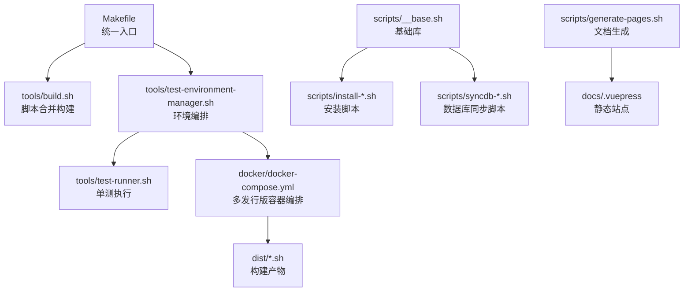
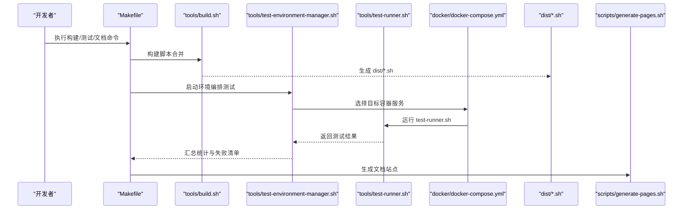
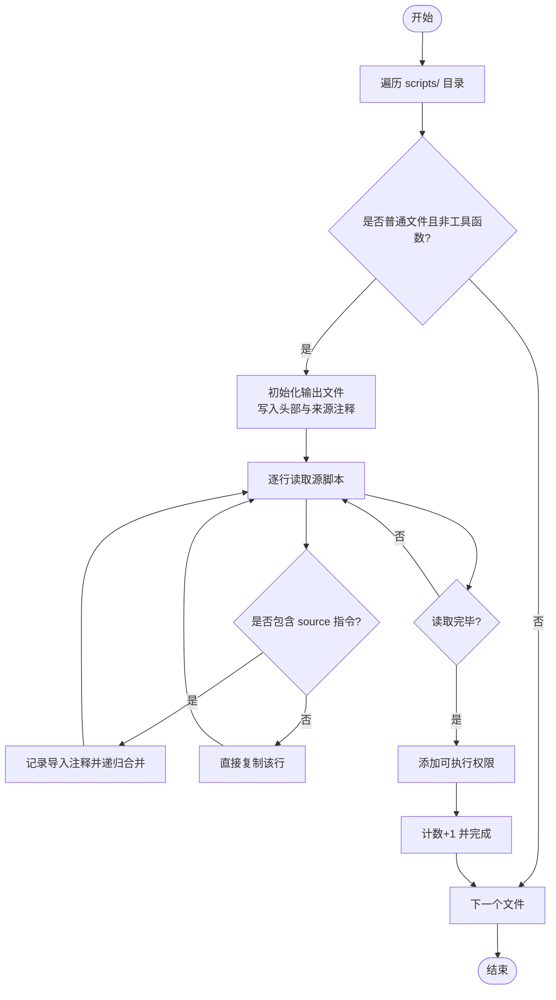
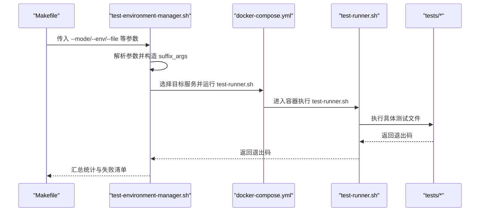
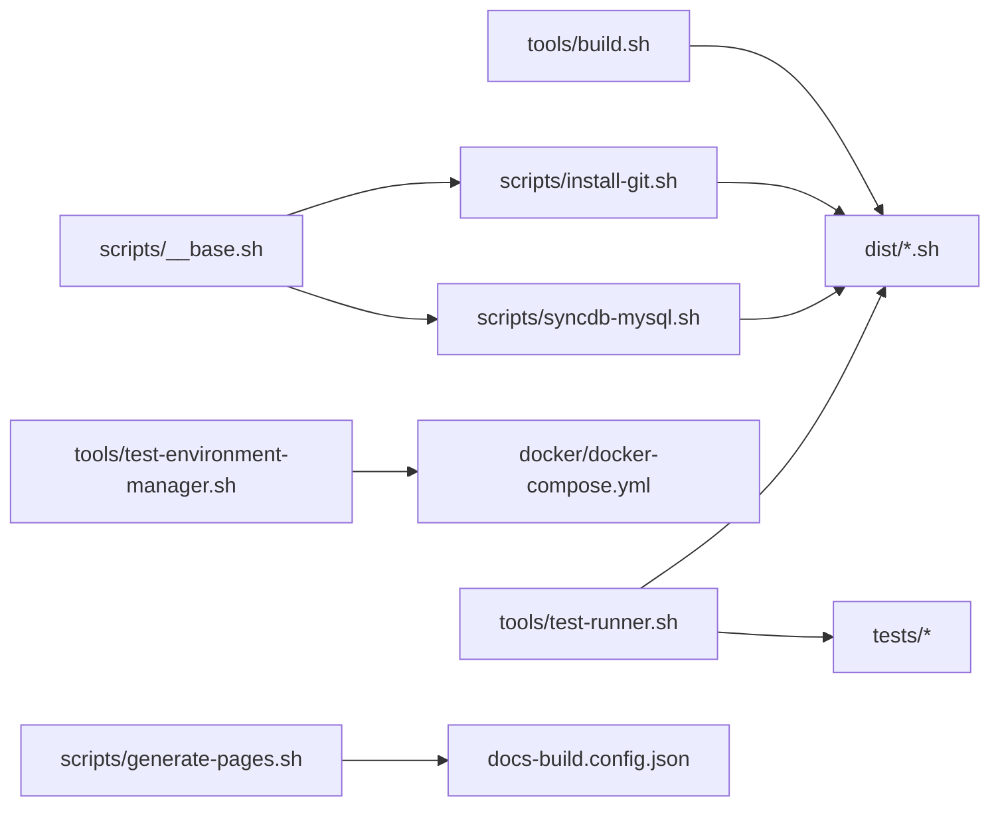

# 构建与部署

<cite>
**本文引用的文件**   
- [README.md](file://README.md)
- [Makefile](file://Makefile)
- [package.json](file://package.json)
- [docs-build.config.json](file://docs-build.config.json)
- [tools/build.sh](file://tools/build.sh)
- [tools/test-environment-manager.sh](file://tools/test-environment-manager.sh)
- [tools/test-runner.sh](file://tools/test-runner.sh)
- [docker/docker-compose.yml](file://docker/docker-compose.yml)
- [scripts/__base.sh](file://scripts/__base.sh)
- [scripts/install-git.sh](file://scripts/install-git.sh)
- [scripts/syncdb-mysql.sh](file://scripts/syncdb-mysql.sh)
- [scripts/generate-pages.sh](file://scripts/generate-pages.sh)
- [tests/install-git/01-ok.sh](file://tests/install-git/01-ok.sh)
- [tests/syncdb-mysql/01-ok.sh](file://tests/syncdb-mysql/01-ok.sh)
</cite>

## 目录
1. [简介](#简介)
2. [项目结构](#项目结构)
3. [核心组件](#核心组件)
4. [架构总览](#架构总览)
5. [详细组件分析](#详细组件分析)
6. [依赖关系分析](#依赖关系分析)
7. [性能考量](#性能考量)
8. [故障排除指南](#故障排除指南)
9. [结论](#结论)
10. [附录](#附录)

## 简介
本文件面向 HZ 9 Env Scripts 的构建与部署体系，系统性阐述以下内容：
- 脚本构建流程：源脚本合并机制、依赖解析与输出文件格式
- Docker 构建系统：多发行版 Dockerfile 编写与镜像优化策略
- CI/CD 流水线与自动化测试：命令行驱动的测试编排与日志归档
- 文档生成与静态站点托管：VuePress 配置与构建产物路径
- 本地构建与测试指南：Makefile 命令、参数与运行方式
- 部署策略与版本管理：基于 dist 输出与容器化分发
- 性能优化与安全最佳实践：网络镜像、缓存与最小化层设计

## 项目结构
仓库采用“功能模块 + 工具链 + 容器化测试”的组织方式：
- scripts：按功能拆分的安装与同步脚本，统一通过 __base.sh 提供基础能力（参数解析、系统检测、日志输出、包管理适配等）
- tools：构建与测试工具链（build.sh、test-environment-manager.sh、test-runner.sh）
- docker：多发行版 Dockerfile 与 docker-compose 编排，覆盖 Ubuntu/Debian/Fedora/RHEL 及其 docker 版本
- tests：按功能划分的测试套件，每个脚本配套基础检查用例
- docs/docs-build.config.json：文档站点配置（VuePress），generate-pages.sh 用于生成静态站点
- Makefile：统一入口，封装构建、测试、清理、交互式调试等常用任务

图表来源
- [Makefile:1-563](file://Makefile#L1-L563)
- [tools/build.sh:1-91](file://tools/build.sh#L1-L91)
- [tools/test-environment-manager.sh:1-334](file://tools/test-environment-manager.sh#L1-L334)
- [tools/test-runner.sh:1-156](file://tools/test-runner.sh#L1-L156)
- [docker/docker-compose.yml:1-297](file://docker/docker-compose.yml#L1-L297)
- [scripts/__base.sh:1-1252](file://scripts/__base.sh#L1-L1252)
- [scripts/install-git.sh:1-85](file://scripts/install-git.sh#L1-L85)
- [scripts/syncdb-mysql.sh:1-138](file://scripts/syncdb-mysql.sh#L1-L138)
- [scripts/generate-pages.sh:1-29](file://scripts/generate-pages.sh#L1-L29)

章节来源
- [README.md:1-6](file://README.md#L1-L6)
- [Makefile:1-563](file://Makefile#L1-L563)
- [package.json:1-3](file://package.json#L1-L3)

## 核心组件
- 构建工具链
  - build.sh：递归合并 scripts 下的脚本，处理 source 指令，去除重复 shebang，生成可直接执行的 dist/*.sh
  - test-environment-manager.sh：根据模式在不同容器环境中批量执行测试，汇总统计与失败列表
  - test-runner.sh：在容器内逐个执行测试文件，输出带时间统计的控制台报告
- 基础库 __base.sh：提供参数解析、系统信息探测、日志输出、包管理器适配、网络镜像切换等通用能力
- 多发行版容器编排：docker-compose.yml 定义 8+ 个目标环境与 6+ 个 docker 版本环境，挂载 dist/scripts/tests/tools，统一以 test-runner.sh 作为入口
- 文档生成：generate-pages.sh 清理历史产物后调用 @hz-9/docs-build，依据 docs-build.config.json 生成 VuePress 静态站点

章节来源
- [tools/build.sh:1-91](file://tools/build.sh#L1-L91)
- [tools/test-environment-manager.sh:1-334](file://tools/test-environment-manager.sh#L1-L334)
- [tools/test-runner.sh:1-156](file://tools/test-runner.sh#L1-L156)
- [scripts/__base.sh:1-1252](file://scripts/__base.sh#L1-L1252)
- [docker/docker-compose.yml:1-297](file://docker/docker-compose.yml#L1-L297)
- [scripts/generate-pages.sh:1-29](file://scripts/generate-pages.sh#L1-L29)
- [docs-build.config.json:1-167](file://docs-build.config.json#L1-L167)

## 架构总览
下图展示从源码到测试、再到文档产出的整体流程。

图表来源
- [Makefile:1-563](file://Makefile#L1-L563)
- [tools/build.sh:1-91](file://tools/build.sh#L1-L91)
- [tools/test-environment-manager.sh:1-334](file://tools/test-environment-manager.sh#L1-L334)
- [tools/test-runner.sh:1-156](file://tools/test-runner.sh#L1-L156)
- [docker/docker-compose.yml:1-297](file://docker/docker-compose.yml#L1-L297)
- [scripts/generate-pages.sh:1-29](file://scripts/generate-pages.sh#L1-L29)

## 详细组件分析

### 组件一：脚本构建与合并机制
- 输入：scripts/ 下的独立脚本（如 install-git.sh、syncdb-mysql.sh）
- 依赖解析：识别 source 指令，递归读取被依赖脚本内容；对首个 shebang 行替换为导入注释，避免重复 shebang
- 输出：dist/ 下生成与源脚本同名的合并后可执行脚本，具备统一头部与来源注释
- 复杂度：对每个脚本进行一次线性扫描，整体复杂度 O(N+M)，N 为脚本数量，M 为总行数
- 错误处理：未找到文件时发出警告并跳过；构建失败会删除部分产物以保持一致性

图表来源
- [tools/build.sh:1-91](file://tools/build.sh#L1-L91)

章节来源
- [tools/build.sh:1-91](file://tools/build.sh#L1-L91)

### 组件二：测试环境编排与执行
- 模式支持：all、all-env、all-script、single；支持指定测试文件或脚本子集
- 参数传递：通过 test-environment-manager.sh 解析短/长选项，拼装 suffix_args 传给容器内的 test-runner.sh
- 失败判定：test-runner.sh 返回 0/1/2（成功/失败/跳过）；编排器汇总并记录失败环境与参数
- 日志与统计：控制台输出详细报告，包含耗时与最终汇总

图表来源
- [Makefile:84-532](file://Makefile#L84-L532)
- [tools/test-environment-manager.sh:1-334](file://tools/test-environment-manager.sh#L1-L334)
- [tools/test-runner.sh:1-156](file://tools/test-runner.sh#L1-L156)
- [docker/docker-compose.yml:1-297](file://docker/docker-compose.yml#L1-L297)

章节来源
- [Makefile:84-532](file://Makefile#L84-L532)
- [tools/test-environment-manager.sh:1-334](file://tools/test-environment-manager.sh#L1-L334)
- [tools/test-runner.sh:1-156](file://tools/test-runner.sh#L1-L156)

### 组件三：Docker 构建系统与镜像优化
- 多发行版覆盖：Ubuntu 20.04/22.04/24.04、Debian 11.9/12.2、Fedora 41、RHEL 8.10/9.6
- Dockerfile 分类：每种发行版提供标准版与 docker 版（含 Docker CE 与 Compose），便于在容器内测试数据库同步脚本
- 优化策略：
  - 使用平台限定 linux/amd64，确保跨主机一致性
  - 挂载缓存目录（apt/dnf 缓存）减少重复下载
  - 仅挂载必要目录（dist/scripts/tests/tools），降低攻击面
  - privileged: true 仅用于 docker 版本容器，满足 Docker-in-Docker 场景
- 建议：为各发行版固定基础镜像标签，配合 CI 使用缓存层加速构建

章节来源
- [docker/docker-compose.yml:1-297](file://docker/docker-compose.yml#L1-L297)

### 组件四：文档生成与静态站点托管
- generate-pages.sh：清理 docs/.vuepress/src 后，使用 @hz-9/docs-build 与 docs-build.config.json 生成 VuePress 源
- docs-build.config.json：定义站点基础路径、语言、导航栏与侧边栏，支持中英双语
- 静态站点：构建产物位于 docs/.vuepress，可直接托管于 GitHub Pages 或其他静态托管平台

章节来源
- [scripts/generate-pages.sh:1-29](file://scripts/generate-pages.sh#L1-L29)
- [docs-build.config.json:1-167](file://docs-build.config.json#L1-L167)

### 组件五：脚本模板与参数约定
- 统一头部：SHELL_NAME、SHELL_DESC、PARAMTERS、SUPPORT_OS_LIST
- 公共基座：source ./__base.sh 后调用 print_help_or_param 解析参数与系统校验
- 包管理适配：自动识别 apt/dnf 并按网络环境切换镜像源
- 示例脚本：
  - install-git.sh：演示参数解析、系统检测、apt/dnf 安装流程
  - syncdb-mysql.sh：演示临时目录准备、Docker 检测、镜像拉取与数据同步命令执行

章节来源
- [scripts/__base.sh:1-1252](file://scripts/__base.sh#L1-L1252)
- [scripts/install-git.sh:1-85](file://scripts/install-git.sh#L1-L85)
- [scripts/syncdb-mysql.sh:1-138](file://scripts/syncdb-mysql.sh#L1-L138)

## 依赖关系分析
- 构建阶段：build.sh 依赖 scripts/ 下的脚本与其 source 依赖，输出 dist/*.sh
- 测试阶段：test-environment-manager.sh 依赖 docker-compose.yml 中的服务定义，test-runner.sh 依赖 dist/*.sh 与 tests/* 下的具体测试
- 文档阶段：generate-pages.sh 依赖 docs-build.config.json 与 docs/ 内容

图表来源
- [scripts/__base.sh:1-1252](file://scripts/__base.sh#L1-L1252)
- [scripts/install-git.sh:1-85](file://scripts/install-git.sh#L1-L85)
- [scripts/syncdb-mysql.sh:1-138](file://scripts/syncdb-mysql.sh#L1-L138)
- [tools/build.sh:1-91](file://tools/build.sh#L1-L91)
- [tools/test-environment-manager.sh:1-334](file://tools/test-environment-manager.sh#L1-L334)
- [tools/test-runner.sh:1-156](file://tools/test-runner.sh#L1-L156)
- [docker/docker-compose.yml:1-297](file://docker/docker-compose.yml#L1-L297)
- [scripts/generate-pages.sh:1-29](file://scripts/generate-pages.sh#L1-L29)
- [docs-build.config.json:1-167](file://docs-build.config.json#L1-L167)

章节来源
- [tools/build.sh:1-91](file://tools/build.sh#L1-L91)
- [tools/test-environment-manager.sh:1-334](file://tools/test-environment-manager.sh#L1-L334)
- [tools/test-runner.sh:1-156](file://tools/test-runner.sh#L1-L156)
- [docker/docker-compose.yml:1-297](file://docker/docker-compose.yml#L1-L297)
- [scripts/generate-pages.sh:1-29](file://scripts/generate-pages.sh#L1-L29)
- [docs-build.config.json:1-167](file://docs-build.config.json#L1-L167)

## 性能考量
- 构建性能
  - 使用缓存目录挂载（apt/dnf 缓存）减少重复下载
  - 合并脚本时一次性扫描，避免多次 I/O
- 测试性能
  - 并行模式可通过 Makefile 的不同模式组合实现；当前编排以串行为主，便于定位问题
  - 使用 --docker-image-quick-check 可跳过镜像拉取步骤（若本地已有）
- 镜像体积
  - 基于官方发行版镜像，尽量复用公共层
  - 在 docker 版本容器中按需安装 Docker/Compose，避免在标准版重复安装
- 网络优化
  - 支持 in-china 网络配置，自动切换镜像源，缩短依赖下载时间

## 故障排除指南
- 构建失败
  - 现象：build.sh 输出“构建失败”并清理部分产物
  - 排查：确认 scripts/ 下脚本存在且无语法错误；检查 source 指令指向的相对路径
- 测试失败
  - 现象：test-environment-manager.sh 记录失败环境与参数
  - 排查：查看 logs/ 下对应日志文件；确认目标环境镜像已构建；检查网络参数与内部 IP 注入
- 文档生成异常
  - 现象：generate-pages.sh 报错或生成空站点
  - 排查：确认 docs-build.config.json 语法正确；确保 docs/ 下有符合规范的 Markdown 文件
- 权限问题
  - 现象：容器内无法执行 Docker 命令
  - 排查：docker 版本容器启用 privileged；确保宿主机 Docker Socket 已挂载

章节来源
- [tools/build.sh:1-91](file://tools/build.sh#L1-L91)
- [tools/test-environment-manager.sh:1-334](file://tools/test-environment-manager.sh#L1-L334)
- [tools/test-runner.sh:1-156](file://tools/test-runner.sh#L1-L156)
- [scripts/generate-pages.sh:1-29](file://scripts/generate-pages.sh#L1-L29)

## 结论
本项目通过“脚本合并 + 容器化测试 + 文档生成”的流水线，实现了跨发行版的一致性验证与可维护的交付产物。借助 Makefile 的统一入口与清晰的参数约定，团队可以高效地完成本地构建、自动化测试与文档发布。建议在 CI 中结合缓存与并行策略进一步提升效率，并持续完善测试覆盖面与镜像优化。

## 附录

### 本地构建与测试完整指南
- 构建脚本
  - make build-scripts：执行 tools/build.sh，生成 dist/*.sh
  - make build-images：使用 docker-compose.yml 构建所有目标镜像
  - make build：先构建脚本再构建镜像
- 自动化测试
  - make install-test-all：在所有环境运行安装类测试
  - make install-test-all-env SCRIPT=git：在所有环境运行指定安装脚本测试
  - make install-test-all-script ENV=ubuntu22-04：在指定环境运行全部安装测试
  - make install-test-single ENV=ubuntu22-04 SCRIPT=git：在指定环境运行单个安装测试
  - make install-test-file ENV=ubuntu22-04 FILE=tests/install-git/01-ok.sh：运行指定测试文件
  - 同理支持 syncdb-* 测试（替换 scope）
- 辅助命令
  - make interactive：进入交互式容器环境
  - make shell：进入 Ubuntu 容器 Bash
  - make clean：清理镜像与容器
  - make logs/results：查看日志与汇总结果

章节来源
- [Makefile:1-563](file://Makefile#L1-L563)

### 部署策略与版本管理
- 发布物：dist/ 下的合并脚本即为最终交付物，可直接分发或集成进 CI 产物
- 版本管理：建议以 Git 标签或分支区分版本；每次构建后更新 docs/.vuepress 对应版本信息
- 容器分发：将 docker-compose.yml 中的目标镜像推送到镜像仓库，CI 拉取并运行测试

### 安全考虑与最佳实践
- 最小权限：仅在需要 Docker-in-Docker 的 docker 版本容器中启用 privileged
- 仅挂载必要目录：避免暴露宿主机敏感文件
- 固定镜像标签：CI 中锁定基础镜像版本，减少漂移风险
- 网络隔离：在企业网络中优先使用内网镜像源，减少外部依赖