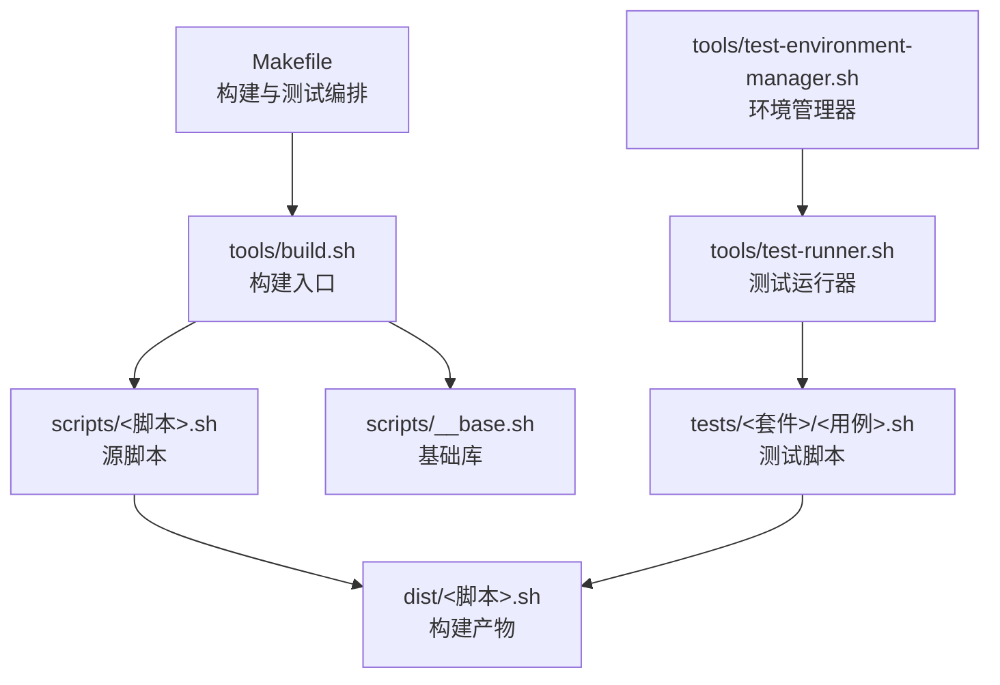
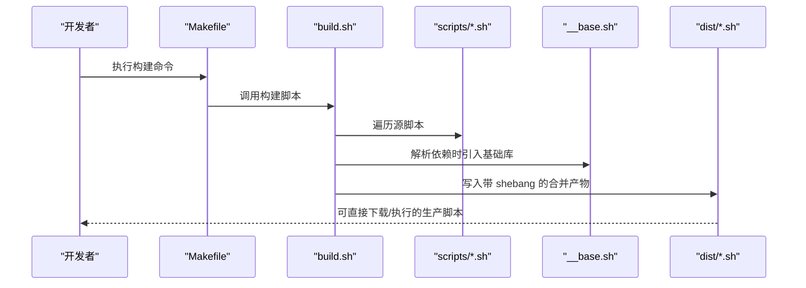
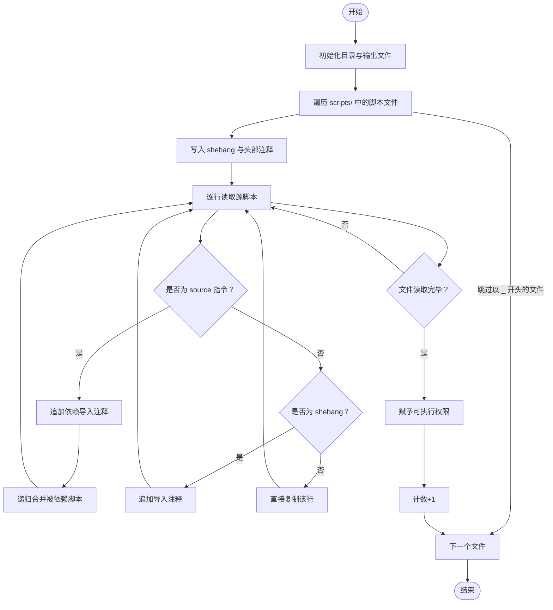
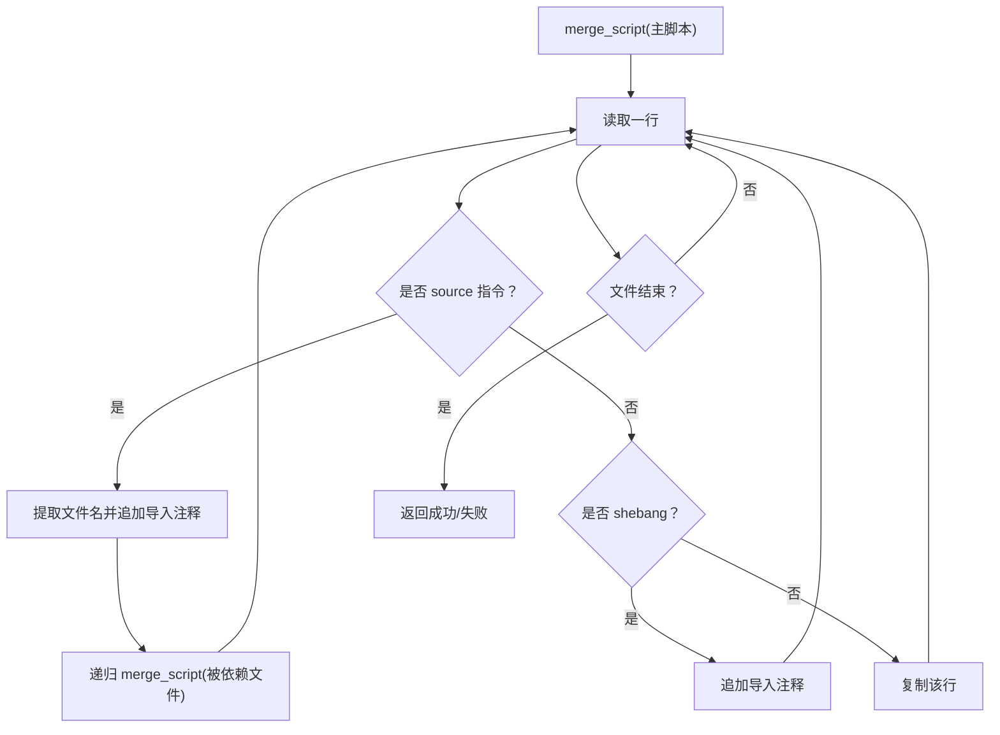
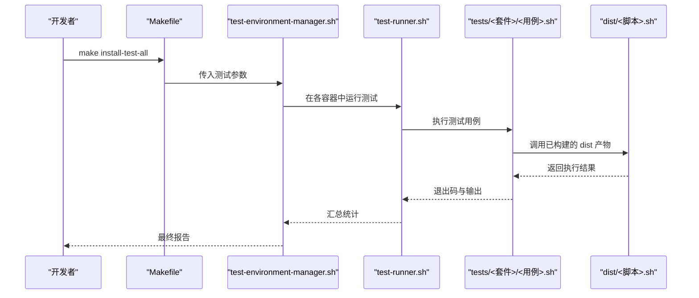
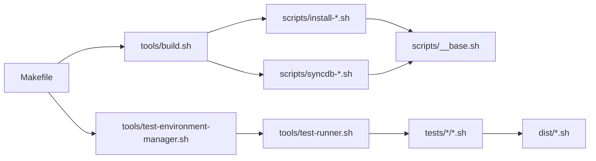

# 脚本构建系统

<cite>
**本文引用的文件**
- [tools/build.sh](file://tools/build.sh)
- [scripts/__base.sh](file://scripts/__base.sh)
- [scripts/install-git.sh](file://scripts/install-git.sh)
- [scripts/install-docker.sh](file://scripts/install-docker.sh)
- [tests/install-git/01-ok.sh](file://tests/install-git/01-ok.sh)
- [tests/install-git/02-install.sh](file://tests/install-git/02-install.sh)
- [tests/__base.sh](file://tests/__base.sh)
- [tools/test-environment-manager.sh](file://tools/test-environment-manager.sh)
- [tools/test-runner.sh](file://tools/test-runner.sh)
- [Makefile](file://Makefile)
- [docs/README.md](file://docs/README.md)
- [README.md](file://README.md)
- [docs-build.config.json](file://docs-build.config.json)
</cite>

## 目录
1. [简介](#简介)
2. [项目结构](#项目结构)
3. [核心组件](#核心组件)
4. [架构总览](#架构总览)
5. [详细组件分析](#详细组件分析)
6. [依赖关系分析](#依赖关系分析)
7. [性能考量](#性能考量)
8. [故障排查指南](#故障排查指南)
9. [结论](#结论)
10. [附录](#附录)

## 简介
本文件面向 HZ 9 Env Scripts 的脚本构建系统，聚焦于 build.sh 的工作原理与实现细节，涵盖以下主题：
- 源文件递归合并机制：如何解析 source 指令、处理 shebang 注释导入标记、以及输出文件生成流程
- 依赖解析算法：基于正则匹配与递归调用的依赖图遍历
- 错误处理与文件验证：失败回滚、权限设置、存在性检查
- 自定义脚本开发指南：命名规范、依赖声明、测试要求
- 构建优化策略与性能考虑
- 调试与常见问题排查方法

## 项目结构
该仓库采用“源代码在 scripts/、构建产物在 dist/、测试在 tests/”的清晰分层组织方式；构建工具位于 tools/，并通过 Makefile 提供统一入口。

图表来源
- [tools/build.sh:1-91](file://tools/build.sh#L1-L91)
- [Makefile:49-62](file://Makefile#L49-L62)
- [tools/test-environment-manager.sh:1-334](file://tools/test-environment-manager.sh#L1-L334)
- [tools/test-runner.sh:1-156](file://tools/test-runner.sh#L1-L156)

章节来源
- [docs/README.md:9-18](file://docs/README.md#L9-L18)
- [Makefile:10-47](file://Makefile#L10-L47)

## 核心组件
- 构建脚本 build.sh：负责扫描 scripts/ 目录，递归解析每个脚本的 source 依赖，生成带 shebang 的 dist/ 输出文件，并赋予可执行权限
- 基础库 __base.sh：提供参数解析、系统检测、日志输出、网络镜像配置等通用能力
- 测试框架：通过 test-environment-manager.sh 和 test-runner.sh 组织多环境测试，覆盖安装与数据库同步脚本
- Makefile：提供一键构建与测试命令，串联构建与测试流程

章节来源
- [tools/build.sh:1-91](file://tools/build.sh#L1-L91)
- [scripts/__base.sh:1-1252](file://scripts/__base.sh#L1-L1252)
- [tools/test-environment-manager.sh:1-334](file://tools/test-environment-manager.sh#L1-L334)
- [tools/test-runner.sh:1-156](file://tools/test-runner.sh#L1-L156)
- [Makefile:49-62](file://Makefile#L49-L62)

## 架构总览
下图展示了从源脚本到最终 dist 产物的构建路径，以及测试阶段如何使用 dist 产物进行跨环境验证。

图表来源
- [Makefile:49-62](file://Makefile#L49-L62)
- [tools/build.sh:46-81](file://tools/build.sh#L46-L81)
- [scripts/__base.sh:1-1252](file://scripts/__base.sh#L1-L1252)

## 详细组件分析

### 构建脚本 build.sh 工作原理
- 入口与目录定位：获取项目根目录，设定 scripts 与 dist 目录
- 清理与初始化：创建 dist 目录并清空旧产物
- 主循环：遍历 scripts/ 下的脚本文件，跳过以下划线开头的工具函数文件
- 输出文件头：为每个 dist 产物写入 shebang、生成注释、源文件信息
- 递归合并：
  - 行级读取源脚本
  - 匹配 source 指令：记录依赖导入注释并递归合并
  - 匹配 shebang：替换为“来自某文件”的导入注释
  - 其他行：原样复制
- 权限与计数：成功后赋予可执行权限，统计处理数量；失败删除部分产物并提示

图表来源
- [tools/build.sh:14-81](file://tools/build.sh#L14-L81)

章节来源
- [tools/build.sh:14-81](file://tools/build.sh#L14-L81)

### 依赖解析算法与递归合并
- 正则匹配：使用 Bash 扩展正则捕获 source 后的文件名
- 依赖图遍历：对每个被依赖文件执行相同解析流程，确保拓扑顺序
- 导入注释：在输出中插入“Import dependency: ...”或“import from ...”，便于追溯来源
- 重复依赖：由于递归合并，同一依赖可能多次出现，但不影响功能一致性

图表来源
- [tools/build.sh:19-44](file://tools/build.sh#L19-L44)

章节来源
- [tools/build.sh:19-44](file://tools/build.sh#L19-L44)

### 脚本模板系统与指令处理
- source 指令处理：识别并递归合并被依赖脚本，同时在输出中记录导入注释
- shebang 替换机制：将源脚本中的 shebang 替换为“import from ...”注释，避免多 shebang 冲突
- 注释导入标记：所有导入行为均以注释形式体现在输出文件中，便于审计与调试

章节来源
- [tools/build.sh:30-42](file://tools/build.sh#L30-L42)

### 输出文件生成与权限控制
- 头部信息：包含生成时间、源文件路径、项目标识等注释
- 可执行权限：成功构建后自动赋予 +x 权限
- 失败清理：若合并失败，删除部分产物并提示失败

章节来源
- [tools/build.sh:64-79](file://tools/build.sh#L64-L79)

### 测试驱动的构建验证
- 测试入口：Makefile 将构建与测试串联，先构建再测试
- 环境管理：test-environment-manager.sh 负责在多容器环境中调度测试
- 测试运行：test-runner.sh 执行单个测试文件并汇总结果
- 测试用例：tests/ 下按功能划分套件，包含基础可用性与实际安装验证

图表来源
- [Makefile:86-119](file://Makefile#L86-L119)
- [tools/test-environment-manager.sh:222-326](file://tools/test-environment-manager.sh#L222-L326)
- [tools/test-runner.sh:86-148](file://tools/test-runner.sh#L86-L148)

章节来源
- [Makefile:86-119](file://Makefile#L86-L119)
- [tools/test-environment-manager.sh:1-334](file://tools/test-environment-manager.sh#L1-L334)
- [tools/test-runner.sh:1-156](file://tools/test-runner.sh#L1-L156)
- [tests/install-git/01-ok.sh:1-25](file://tests/install-git/01-ok.sh#L1-L25)
- [tests/install-git/02-install.sh:1-35](file://tests/install-git/02-install.sh#L1-L35)

### 自定义脚本开发指南
- 命名规范
  - 安装类脚本：install-<name>.sh
  - 数据库同步类脚本：syncdb-<name>.sh
- 依赖声明
  - 使用 source 指令引入 scripts/__base.sh 或其他内部模块
  - 保持依赖层级清晰，避免循环依赖
- 参数与帮助
  - 在脚本中定义 PARAMTERS 数组与 SUPPORT_OS_LIST
  - 使用 __base.sh 提供的帮助打印与参数解析函数
- 测试要求
  - 在 tests/ 下为每个脚本创建对应套件目录
  - 至少包含基础可用性测试与实际安装/同步测试
  - 使用 tests/__base.sh 提供的断言与报告函数
- 构建与发布
  - 通过 make build-scripts 生成 dist 产物
  - 使用 make install-test-all 进行全量验证

章节来源
- [scripts/install-git.sh:1-85](file://scripts/install-git.sh#L1-L85)
- [scripts/install-docker.sh:1-217](file://scripts/install-docker.sh#L1-L217)
- [tests/install-git/01-ok.sh:1-25](file://tests/install-git/01-ok.sh#L1-L25)
- [tests/install-git/02-install.sh:1-35](file://tests/install-git/02-install.sh#L1-L35)
- [tests/__base.sh:212-337](file://tests/__base.sh#L212-L337)
- [docs/README.md:58-103](file://docs/README.md#L58-L103)

## 依赖关系分析
- 构建期依赖
  - build.sh 依赖 scripts/ 下的脚本与其 source 引用的基础库
  - __base.sh 提供系统检测、参数解析、日志输出等能力
- 运行期依赖
  - dist 产物在目标系统上依赖包管理器与网络环境
  - 测试阶段依赖 Docker 环境与镜像
- 外部集成点
  - Makefile 作为统一编排入口
  - docs-build.config.json 用于文档站点生成

图表来源
- [tools/build.sh:11-12](file://tools/build.sh#L11-L12)
- [Makefile:49-62](file://Makefile#L49-L62)
- [tools/test-environment-manager.sh:14-24](file://tools/test-environment-manager.sh#L14-L24)
- [tools/test-runner.sh:86-148](file://tools/test-runner.sh#L86-L148)

章节来源
- [tools/build.sh:11-12](file://tools/build.sh#L11-L12)
- [Makefile:49-62](file://Makefile#L49-L62)
- [tools/test-environment-manager.sh:14-24](file://tools/test-environment-manager.sh#L14-L24)
- [tools/test-runner.sh:86-148](file://tools/test-runner.sh#L86-L148)

## 性能考量
- I/O 优化
  - 单次遍历 scripts/ 并行写入 dist/，减少多次打开关闭文件的开销
  - 逐行读取与写入，内存占用低，适合大体量脚本
- 递归合并复杂度
  - 对于深度嵌套的依赖图，递归深度与重复依赖需关注；建议保持依赖树扁平化
- 构建缓存
  - dist 目录每次构建前清空，确保一致性；如需增量构建，可在后续版本引入哈希校验
- 测试并发
  - test-environment-manager.sh 在多容器中并行执行不同环境的测试，缩短整体耗时

## 故障排查指南
- 构建失败
  - 检查 scripts/ 中是否存在缺失的被依赖文件；build.sh 会输出警告并终止当前脚本构建
  - 确认 dist 目录可写且无权限问题
- 产物不可执行
  - 确认构建流程已赋予 +x 权限；若失败会删除部分产物
- 测试失败
  - 查看 logs/ 下的测试日志文件，定位具体失败步骤
  - 使用 make results 快速汇总最近测试结果
- 网络与镜像
  - 在中国网络环境下，使用 --network=in-china 参数以启用镜像加速
  - 如需快速检查镜像可用性，可传递 --docker-image-quick-check 参数

章节来源
- [tools/build.sh:24-27](file://tools/build.sh#L24-L27)
- [tools/build.sh:76-79](file://tools/build.sh#L76-L79)
- [Makefile:86-119](file://Makefile#L86-L119)
- [Makefile:555-562](file://Makefile#L555-L562)
- [tools/test-environment-manager.sh:265-267](file://tools/test-environment-manager.sh#L265-L267)

## 结论
build.sh 通过简洁高效的递归合并策略，将 scripts/ 中的模块化脚本整合为可直接部署的 dist/ 产物；配合 __base.sh 的通用能力与完善的测试体系，实现了跨平台、可复用、可验证的脚本构建与交付流水线。建议在扩展新脚本时遵循命名与依赖规范，确保构建与测试流程稳定可靠。

## 附录
- 文档站点配置：docs-build.config.json 定义了站点语言、导航与侧边栏结构，便于本地预览与发布
- 项目概览：docs/README.md 提供了目录结构、快速开始与贡献指南

章节来源
- [docs-build.config.json:1-167](file://docs-build.config.json#L1-L167)
- [docs/README.md:1-128](file://docs/README.md#L1-L128)
- [README.md:1-6](file://README.md#L1-L6)