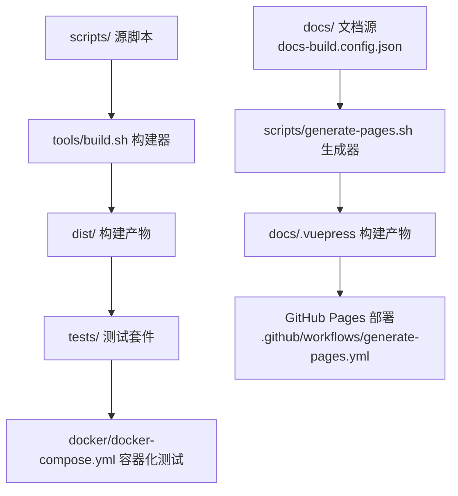
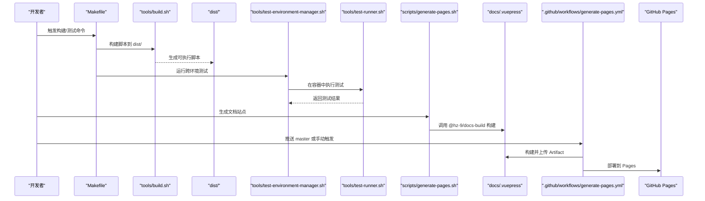
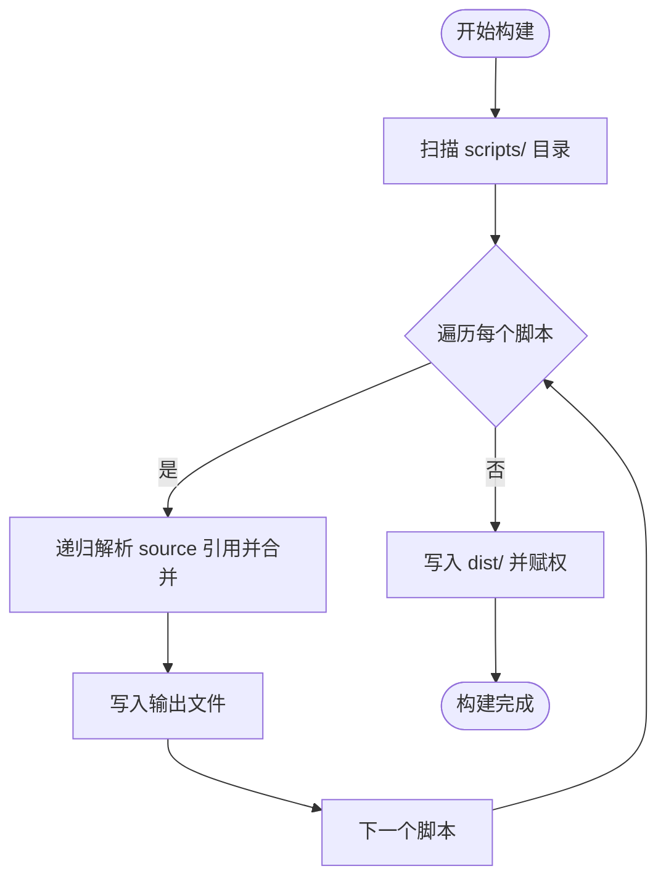
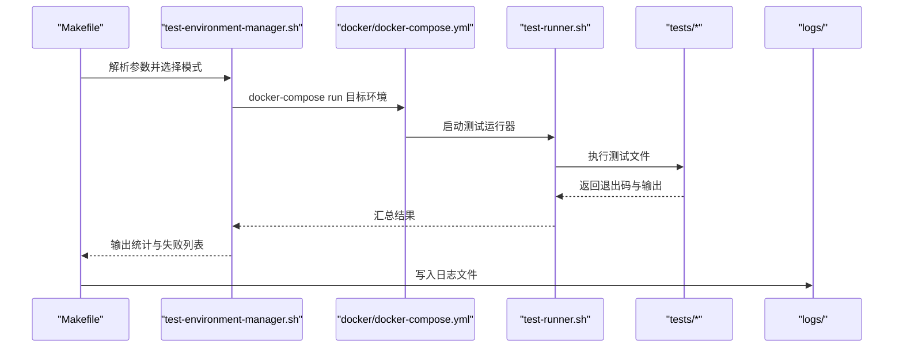
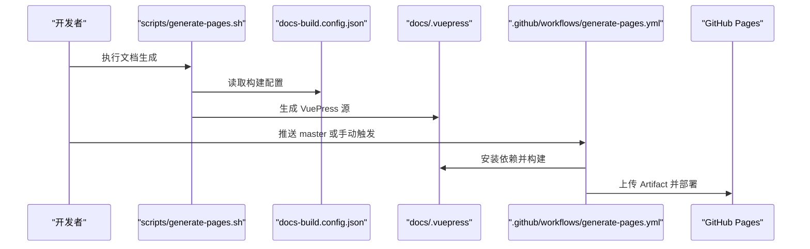
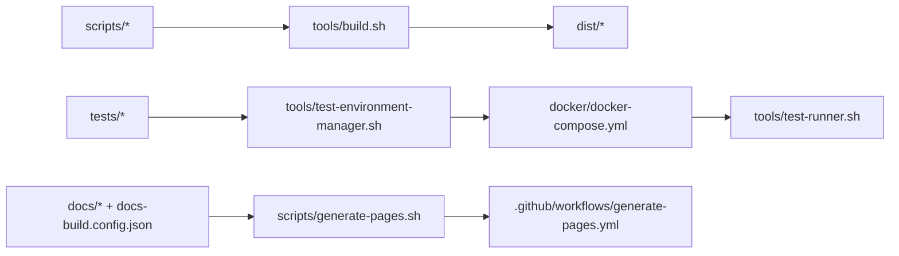

# 部署策略

<cite>
**本文引用的文件**
- [README.md](file://README.md)
- [Makefile](file://Makefile)
- [tools/build.sh](file://tools/build.sh)
- [.github/workflows/generate-pages.yml](file://.github/workflows/generate-pages.yml)
- [scripts/generate-pages.sh](file://scripts/generate-pages.sh)
- [docs-build.config.json](file://docs-build.config.json)
- [docker/docker-compose.yml](file://docker/docker-compose.yml)
- [tools/test-environment-manager.sh](file://tools/test-environment-manager.sh)
- [tools/test-runner.sh](file://tools/test-runner.sh)
- [tests/__install.sh](file://tests/__install.sh)
- [docs/overview/directory-structure.md](file://docs/overview/directory-structure.md)
</cite>

## 目录
1. [简介](#简介)
2. [项目结构](#项目结构)
3. [核心组件](#核心组件)
4. [架构总览](#架构总览)
5. [详细组件分析](#详细组件分析)
6. [依赖关系分析](#依赖关系分析)
7. [性能考量](#性能考量)
8. [故障排查指南](#故障排查指南)
9. [结论](#结论)
10. [附录](#附录)

## 简介
本文件面向 HZ 9 Env Scripts 的部署与发布策略，聚焦以下目标：
- 生产环境脚本的分发与安装流程（dist/ 输出与版本管理）
- 静态站点生成与托管（VuePress 文档构建与 GitHub Pages 部署）
- 脚本分发的安全策略与完整性校验建议
- 版本控制与发布流程（标签管理、变更日志与向后兼容）
- 本地部署与测试环境搭建
- 部署监控与回滚策略
- 扩展部署管道与新增部署目标的方法

## 项目结构
该项目采用“源脚本 → 构建 → 测试 → 文档生成 → 发布”的流水线组织方式。关键目录与职责如下：
- scripts/：源脚本集合（安装类与数据库同步类），由构建工具合并到 dist/
- dist/：构建产物输出目录，包含最终可直接分发的脚本
- tests/：按功能维度组织的测试套件，配合容器化测试环境执行
- docker/：多发行版 Dockerfile 与 docker-compose 编排，覆盖 Ubuntu/Debian/Fedora/RHEL 及其 Docker 增强变体
- tools/：构建与测试工具链（构建器、测试运行器、环境管理器等）
- docs/ 与 docs-build.config.json：文档源与 VuePress 构建配置
- .github/workflows/：GitHub Actions 工作流，负责文档站点的自动构建与部署

图表来源
- [tools/build.sh:1-91](file://tools/build.sh#L1-L91)
- [docker/docker-compose.yml:1-297](file://docker/docker-compose.yml#L1-L297)
- [scripts/generate-pages.sh:1-29](file://scripts/generate-pages.sh#L1-L29)
- [docs-build.config.json:1-167](file://docs-build.config.json#L1-L167)
- [.github/workflows/generate-pages.yml:1-70](file://.github/workflows/generate-pages.yml#L1-L70)

章节来源
- [docs/overview/directory-structure.md:7-178](file://docs/overview/directory-structure.md#L7-L178)
- [README.md:1-6](file://README.md#L1-L6)

## 核心组件
- 构建器（tools/build.sh）：递归解析源脚本中的 source 引用，合并为单文件可执行脚本，写入 dist/ 并赋予执行权限
- 测试环境管理器（tools/test-environment-manager.sh）：统一调度不同 OS 环境的测试执行，汇总结果并输出日志
- 测试运行器（tools/test-runner.sh）：在选定容器内执行具体测试文件，捕获输出与退出码，支持跳过/通过/失败三种状态
- 文档生成器（scripts/generate-pages.sh）：清理历史生成物，调用 @hz-9/docs-build 生成 VuePress 源，再由工作流构建并上传
- GitHub Pages 工作流（.github/workflows/generate-pages.yml）：在 master 推送或手动触发时，完成 Node 环境准备、依赖安装、构建与部署

章节来源
- [tools/build.sh:1-91](file://tools/build.sh#L1-L91)
- [tools/test-environment-manager.sh:1-334](file://tools/test-environment-manager.sh#L1-L334)
- [tools/test-runner.sh:1-156](file://tools/test-runner.sh#L1-L156)
- [scripts/generate-pages.sh:1-29](file://scripts/generate-pages.sh#L1-L29)
- [.github/workflows/generate-pages.yml:1-70](file://.github/workflows/generate-pages.yml#L1-L70)

## 架构总览
下图展示从源代码到文档发布的端到端流程，以及各组件间的依赖关系。

图表来源
- [Makefile:48-563](file://Makefile#L48-L563)
- [tools/build.sh:1-91](file://tools/build.sh#L1-L91)
- [tools/test-environment-manager.sh:1-334](file://tools/test-environment-manager.sh#L1-L334)
- [tools/test-runner.sh:1-156](file://tools/test-runner.sh#L1-L156)
- [scripts/generate-pages.sh:1-29](file://scripts/generate-pages.sh#L1-L29)
- [.github/workflows/generate-pages.yml:26-70](file://.github/workflows/generate-pages.yml#L26-L70)

## 详细组件分析

### 构建与分发（dist/ 与版本管理）
- 构建流程
  - 构建器扫描 scripts/ 下的脚本，递归解析 source 引用，将依赖注入为注释标记，最终写入 dist/ 并赋予执行权限
  - 每个脚本在 dist/ 中保留与源脚本同名的文件，便于替换与分发
- 版本管理建议
  - 当前仓库未内置版本号注入逻辑；建议在构建阶段为 dist/ 产物追加版本信息（如时间戳、Git 描述符），并在发布时生成对应标签
  - 对于 dist/ 产物的命名与版本化，可在 Makefile 中扩展规则，例如生成 install-git-vX.Y.Z.sh 的带版本文件名
- 分发策略
  - 将 dist/ 中的脚本作为最终交付物，通过 HTTPS 下载或包管理渠道分发
  - 为每个版本生成独立的 dist/ 快照，便于回溯与审计

图表来源
- [tools/build.sh:19-81](file://tools/build.sh#L19-L81)

章节来源
- [tools/build.sh:1-91](file://tools/build.sh#L1-L91)
- [Makefile:48-83](file://Makefile#L48-L83)

### 测试与质量保障（容器化跨环境）
- 测试矩阵
  - 支持 Ubuntu 20.04/22.04/24.04、Debian 11.9/12.2、Fedora 41、RHEL 8.10/9.6 共 8 个基础环境
  - 每个基础镜像均提供“含 Docker CE 与 Compose”的增强变体，用于数据库同步类脚本的容器化测试
- 执行流程
  - Makefile 提供多种测试模式（全量、按脚本、按环境、单文件等），通过 test-environment-manager.sh 协调
  - test-environment-manager.sh 调用 docker-compose 在目标容器中执行 test-runner.sh
  - test-runner.sh 执行具体测试文件，捕获输出与退出码，区分跳过/通过/失败三态
- 日志与报告
  - Makefile 会将测试日志重定向到 logs/ 目录，便于问题定位与审计

图表来源
- [Makefile:84-532](file://Makefile#L84-L532)
- [tools/test-environment-manager.sh:49-159](file://tools/test-environment-manager.sh#L49-L159)
- [docker/docker-compose.yml:1-297](file://docker/docker-compose.yml#L1-L297)
- [tools/test-runner.sh:8-147](file://tools/test-runner.sh#L8-L147)

章节来源
- [Makefile:84-532](file://Makefile#L84-L532)
- [tools/test-environment-manager.sh:1-334](file://tools/test-environment-manager.sh#L1-L334)
- [tools/test-runner.sh:1-156](file://tools/test-runner.sh#L1-L156)
- [docker/docker-compose.yml:1-297](file://docker/docker-compose.yml#L1-L297)
- [tests/__install.sh:1-46](file://tests/__install.sh#L1-L46)

### 文档生成与托管（VuePress + GitHub Pages）
- 文档生成
  - generate-pages.sh 清理历史生成物，调用 @hz-9/docs-build 读取 docs-build.config.json，生成 docs/.vuepress/src
- 构建与部署
  - generate-pages.yml 在 GitHub 上设置 Node 环境，安装 docs/.vuepress 依赖并执行构建，随后上传 Artifact 并部署到 GitHub Pages
- 站点配置
  - docs-build.config.json 指定站点基础路径、语言、导航与侧边栏，确保多语言与多页面结构正确

图表来源
- [scripts/generate-pages.sh:1-29](file://scripts/generate-pages.sh#L1-L29)
- [docs-build.config.json:1-167](file://docs-build.config.json#L1-L167)
- [.github/workflows/generate-pages.yml:26-70](file://.github/workflows/generate-pages.yml#L26-L70)

章节来源
- [scripts/generate-pages.sh:1-29](file://scripts/generate-pages.sh#L1-L29)
- [docs-build.config.json:1-167](file://docs-build.config.json#L1-L167)
- [.github/workflows/generate-pages.yml:1-70](file://.github/workflows/generate-pages.yml#L1-L70)

### 安全策略与完整性验证
- 当前实现要点
  - dist/ 产物为明文脚本，未见内置哈希签名或校验机制
- 建议措施
  - 在构建阶段生成 SHA-256 校验文件（与 dist/ 脚本一一对应），随版本发布包一同分发
  - 在客户端下载后执行校验，仅在通过校验后再执行
  - 对外分发渠道（如包管理器或 CDN）启用 HTTPS 与证书校验
  - 对脚本来源与变更建立最小权限的签出与构建流程，避免污染

章节来源
- [tools/build.sh:64-80](file://tools/build.sh#L64-L80)

### 版本控制与发布流程
- 标签管理
  - 建议以语义化版本（X.Y.Z）打标签，每次发布前在构建产物中注入版本标识
- 变更日志
  - 建议在 docs/overview/testing.md 或新增 CHANGELOG.md 记录每次发布的关键变更与兼容性影响
- 向后兼容
  - 对安装脚本的参数与行为保持稳定，必要时引入兼容层或迁移指引

章节来源
- [docs/overview/directory-structure.md:7-178](file://docs/overview/directory-structure.md#L7-L178)

### 本地部署与测试环境搭建
- 一键构建与测试
  - 使用 Makefile 的 build-scripts、install-test-all、syncdb-test-all 等目标，快速在本地完成构建与跨环境测试
- 交互式调试
  - 使用 interactive 与 shell 目标进入容器交互式环境，便于问题复现与调试
- 日志查看
  - 使用 logs 与 results 目标查看与汇总测试日志

章节来源
- [Makefile:10-563](file://Makefile#L10-L563)
- [docker/docker-compose.yml:281-297](file://docker/docker-compose.yml#L281-L297)

### 部署监控与回滚策略
- 监控建议
  - 在 GitHub Pages 部署后记录 page_url 与构建时间，结合邮件通知（当前工作流已包含邮件步骤）形成发布确认闭环
- 回滚策略
  - 通过 GitHub Pages 的 Artifact 与历史部署记录进行回滚；对 dist/ 产物保留多版本快照，便于快速恢复

章节来源
- [.github/workflows/generate-pages.yml:26-70](file://.github/workflows/generate-pages.yml#L26-L70)

### 扩展部署管道与新增部署目标
- 新增 OS 环境
  - 在 docker/ 新增对应 Dockerfile 与 docker-compose.yml 条目，补充测试矩阵与 Makefile 相关目标
- 新增脚本类型
  - 在 scripts/ 新增源脚本，在 tests/ 对应目录添加测试，使用 make build-scripts 与测试目标验证
- 新增部署目标
  - 可在 Makefile 中新增目标，或在 .github/workflows/ 新增工作流，实现多目标并行发布

章节来源
- [docker/docker-compose.yml:1-297](file://docker/docker-compose.yml#L1-L297)
- [Makefile:48-563](file://Makefile#L48-L563)
- [docs/overview/directory-structure.md:7-178](file://docs/overview/directory-structure.md#L7-L178)

## 依赖关系分析
- 构建链路
  - scripts/ ← tools/build.sh ← dist/
- 测试链路
  - tests/ ← tools/test-environment-manager.sh ← docker/docker-compose.yml ← tools/test-runner.sh
- 文档链路
  - docs/ + docs-build.config.json ← scripts/generate-pages.sh ← .github/workflows/generate-pages.yml

图表来源
- [tools/build.sh:1-91](file://tools/build.sh#L1-L91)
- [tools/test-environment-manager.sh:1-334](file://tools/test-environment-manager.sh#L1-L334)
- [docker/docker-compose.yml:1-297](file://docker/docker-compose.yml#L1-L297)
- [tools/test-runner.sh:1-156](file://tools/test-runner.sh#L1-L156)
- [scripts/generate-pages.sh:1-29](file://scripts/generate-pages.sh#L1-L29)
- [docs-build.config.json:1-167](file://docs-build.config.json#L1-L167)
- [.github/workflows/generate-pages.yml:1-70](file://.github/workflows/generate-pages.yml#L1-L70)

章节来源
- [Makefile:48-563](file://Makefile#L48-L563)

## 性能考量
- 构建性能
  - 构建器逐文件扫描与合并，建议在 CI 中缓存 dist/ 产物，减少重复构建
- 测试性能
  - docker-compose 会在每次测试前拉起容器，建议在 CI 中复用容器或启用构建缓存
- 文档构建
  - VuePress 依赖安装与构建耗时较长，建议在 CI 中缓存 node_modules

## 故障排查指南
- 构建失败
  - 检查 scripts/ 中是否存在缺失的 source 依赖；确认 dist/ 是否被正确清空与重建
- 测试失败
  - 查看 logs/ 下对应日志文件；使用 make results 快速汇总最近测试结果
  - 使用 make interactive 或 make shell 进入容器交互式环境复现问题
- 文档生成失败
  - 确认 docs-build.config.json 语法正确；检查 Node 版本与依赖安装是否成功

章节来源
- [Makefile:534-563](file://Makefile#L534-L563)
- [tools/test-environment-manager.sh:184-220](file://tools/test-environment-manager.sh#L184-L220)
- [tools/test-runner.sh:66-84](file://tools/test-runner.sh#L66-L84)

## 结论
本项目已具备完善的构建、测试与文档发布能力，支持多发行版与多场景的自动化验证。建议在现有基础上补充版本化与完整性校验机制，完善变更日志与回滚策略，以满足生产级部署要求。

## 附录
- 关键命令参考
  - 构建脚本：make build-scripts
  - 全量安装测试：make install-test-all
  - 全量数据库同步测试：make syncdb-test-all
  - 交互式环境：make interactive
  - 查看日志：make logs；查看测试结果：make results
- 文档生成
  - 本地生成：bash scripts/generate-pages.sh
  - GitHub 自动化：.github/workflows/generate-pages.yml

章节来源
- [Makefile:10-563](file://Makefile#L10-L563)
- [scripts/generate-pages.sh:1-29](file://scripts/generate-pages.sh#L1-L29)
- [.github/workflows/generate-pages.yml:1-70](file://.github/workflows/generate-pages.yml#L1-L70)