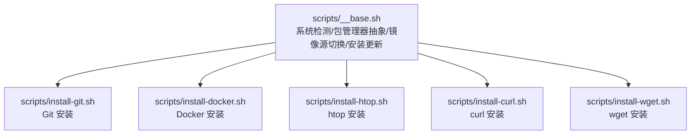
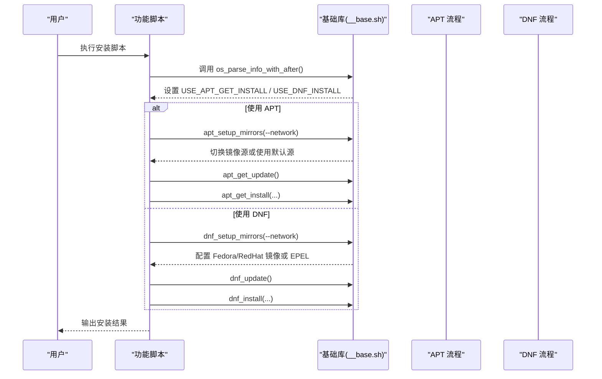
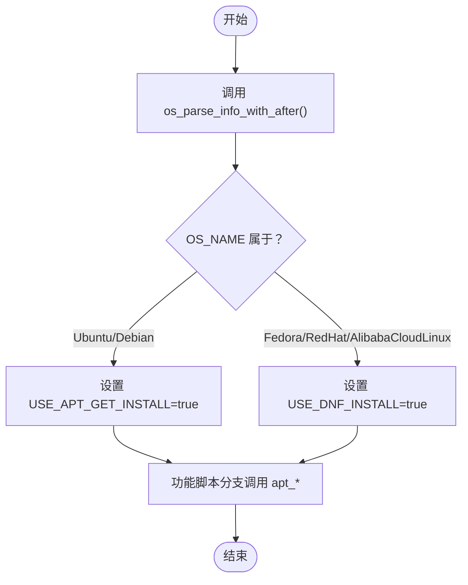
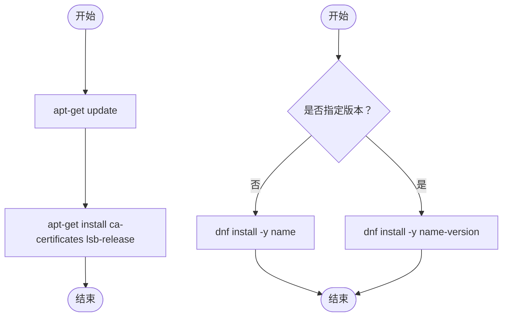
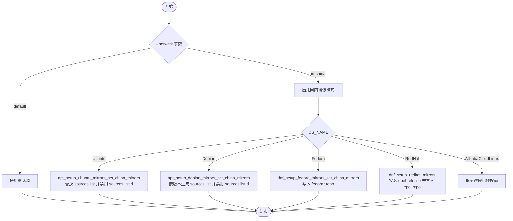

# 包管理器适配

<cite>
**本文引用的文件**
- [scripts/__base.sh](file://scripts/__base.sh)
- [scripts/install-git.sh](file://scripts/install-git.sh)
- [scripts/install-docker.sh](file://scripts/install-docker.sh)
- [scripts/install-htop.sh](file://scripts/install-htop.sh)
- [scripts/install-curl.sh](file://scripts/install-curl.sh)
- [scripts/install-wget.sh](file://scripts/install-wget.sh)
</cite>

## 目录
1. [简介](#简介)
2. [项目结构](#项目结构)
3. [核心组件](#核心组件)
4. [架构总览](#架构总览)
5. [详细组件分析](#详细组件分析)
6. [依赖关系分析](#依赖关系分析)
7. [性能考量](#性能考量)
8. [故障排除指南](#故障排除指南)
9. [结论](#结论)
10. [附录](#附录)

## 简介
本文件面向 HZ 9 Env Scripts 的包管理器适配机制，系统化说明如何在 Ubuntu/Debian（APT）与 Fedora/RedHat（DNF）之间实现统一的包管理策略。重点覆盖以下内容：
- 统一入口与系统识别：通过 os_parse_info_with_after 设置 USE_APT_GET_INSTALL 与 USE_DNF_INSTALL 标志位，驱动后续安装流程。
- APT 与 DNF 的差异化实现：对比 apt_install_base_packages 与 dnf_install 的差异、更新源配置与镜像切换策略。
- 镜像源切换设计：详解 apt_setup_mirrors、apt_setup_ubuntu_mirrors_set_china_mirrors、apt_setup_debian_mirrors_set_china_mirrors 的实现；以及 dnf_setup_mirrors、dnf_setup_fedora_mirrors_set_china_mirrors、dnf_setup_redhat_mirrors 的实现。
- 跨发行版兼容性：如何在不同发行版与版本间保持一致的安装体验与错误处理。
- 使用示例与排障建议：提供不同发行版的典型命令行示例与常见问题排查路径。

## 项目结构
整体采用“基础库 + 功能脚本”的分层组织：
- 基础库 scripts/__base.sh 提供系统检测、包管理器抽象、镜像源切换、安装与更新等通用能力。
- 各功能脚本（如 install-git.sh、install-docker.sh 等）基于基础库进行二次封装，按需调用 APT 或 DNF 流程。



图示来源
- [scripts/__base.sh](file://scripts/__base.sh)
- [scripts/install-git.sh](file://scripts/install-git.sh)
- [scripts/install-docker.sh](file://scripts/install-docker.sh)
- [scripts/install-htop.sh](file://scripts/install-htop.sh)
- [scripts/install-curl.sh](file://scripts/install-curl.sh)
- [scripts/install-wget.sh](file://scripts/install-wget.sh)

章节来源
- [scripts/__base.sh](file://scripts/__base.sh)
- [scripts/install-git.sh](file://scripts/install-git.sh)
- [scripts/install-docker.sh](file://scripts/install-docker.sh)
- [scripts/install-htop.sh](file://scripts/install-htop.sh)
- [scripts/install-curl.sh](file://scripts/install-curl.sh)
- [scripts/install-wget.sh](file://scripts/install-wget.sh)

## 核心组件
- 系统识别与标志位设置
  - os_parse_info_with_after：解析当前系统类型与版本，设置 USE_APT_GET_INSTALL 或 USE_DNF_INSTALL，作为后续分支选择依据。
- APT 能力集
  - apt_install_base_packages：最小化安装基础依赖（如 ca-certificates、lsb-release），优先尝试原版源以保证最低可用性。
  - apt_setup_mirrors：根据网络环境 in-china 切换至华为云镜像；对 Ubuntu/Debian 分别生成 sources.list 并禁用 sources.list.d 下的其他源文件。
  - apt_get_update / apt_get_install / apt_get_install_tzdata：更新软件列表、按默认或指定版本安装、交互式设置时区数据。
- DNF 能力集
  - dnf_setup_mirrors：根据 OS_NAME（Fedora/RedHat/AlibabaCloudLinux）选择镜像策略；Fedora 使用华为云镜像配置多仓库；RedHat 通过 EPEL 官方或华为云安装与配置。
  - dnf_config_manager_add_repo：多策略添加第三方仓库（dnf-plugins-core、新语法、手动下载），增强兼容性。
  - dnf_update / dnf_install：缓存重建与安装流程。
- 通用工具
  - console_*：统一输出、计时、重定向与错误提示。
  - download_file：统一下载工具，前置校验 curl。

章节来源
- [scripts/__base.sh](file://scripts/__base.sh)

## 架构总览
下图展示从系统识别到包安装的整体流程，体现 APT/DNF 的分流与镜像源切换的关键节点。



图示来源
- [scripts/__base.sh](file://scripts/__base.sh)
- [scripts/install-git.sh](file://scripts/install-git.sh)
- [scripts/install-docker.sh](file://scripts/install-docker.sh)

## 详细组件分析

### 系统识别与包管理器选择
- 关键点
  - os_parse_info_with_after 将 Ubuntu/Debian 归类为 APT 场景，Fedora/RedHat/AlibabaCloudLinux 归类为 DNF 场景。
  - 该标志位贯穿各功能脚本，决定调用 apt_* 还是 dnf_* 流程。
- 设计要点
  - 通过集中式判断，避免在每个功能脚本中重复解析系统信息。
  - 对未知系统直接报错并退出，确保安装流程可控。



图示来源
- [scripts/__base.sh](file://scripts/__base.sh)

章节来源
- [scripts/__base.sh](file://scripts/__base.sh)

### APT 差异化实现：apt_install_base_packages vs. dnf_install
- apt_install_base_packages
  - 目标：在尽可能短的时间内完成基础依赖安装，优先使用原版源，失败也容忍（|| true）。
  - 行为：执行 apt-get update 与安装 ca-certificates、lsb-release。
- dnf_install
  - 目标：在 DNF 环境下安装指定包或指定版本。
  - 行为：支持默认安装与带版本号安装；无版本时直接安装，有版本时拼接 name-version 后安装。
- 错误处理
  - APT：更新与安装均使用 || true，避免因网络或源问题中断整个流程。
  - DNF：安装失败会直接返回错误并终止，便于快速定位问题。



图示来源
- [scripts/__base.sh](file://scripts/__base.sh)

章节来源
- [scripts/__base.sh](file://scripts/__base.sh)

### 镜像源切换设计与实现
- APT 镜像切换（apt_setup_mirrors）
  - in-china 模式：备份原 sources.list，禁用 sources.list.d 下所有 *.list 与 *.sources，再根据 OS_NAME 选择 Ubuntu 或 Debian 的镜像配置。
  - Ubuntu：完全替换 /etc/apt/sources.list，仅保留华为云镜像源。
  - Debian：根据版本（11/12/其他）选择不同的组件集合（non-free-firmware 在 Debian 12 支持），并禁用 sources.list.d 下的默认源文件。
- DNF 镜像切换（dnf_setup_mirrors）
  - Fedora：写入 fedora.repo、fedora-updates.repo、updates-testing.repo（默认禁用）等多仓库文件，华为云镜像源。
  - RedHat：先安装 epel-release（可选华为云镜像源），再写入 epel.repo 使用华为云镜像。
  - AlibabaCloudLinux：提示镜像已预配置，无需额外操作。



图示来源
- [scripts/__base.sh](file://scripts/__base.sh)

章节来源
- [scripts/__base.sh](file://scripts/__base.sh)

### 包管理器选择逻辑与跨发行版兼容性
- 选择逻辑
  - os_parse_info_with_after 依据 OS_NAME 决定 USE_APT_GET_INSTALL 或 USE_DNF_INSTALL。
- 兼容性策略
  - APT：统一走 apt_get_update / apt_get_install；对 Ubuntu/Debian 的差异通过 apt_setup_mirrors 与 sources.list 配置屏蔽。
  - DNF：统一走 dnf_setup_mirrors / dnf_update / dnf_install；对 Fedora/RedHat 的差异通过 dnf_setup_fedora_mirrors_set_china_mirrors 与 dnf_setup_redhat_mirrors 屏蔽。
  - 第三方仓库：dnf_config_manager_add_repo 通过多种方式尝试添加仓库，提升在不同系统上的成功率。
- 最佳实践
  - 在功能脚本中统一调用 apt_setup_mirrors / dnf_setup_mirrors，避免在脚本内部重复判断。
  - 对于需要 GPG 导入或自定义 sources.list 的场景（如 Docker），在 APT 路径中显式处理，DNF 路径中通过 dnf config-manager 或手动写入 repo 文件。

章节来源
- [scripts/__base.sh](file://scripts/__base.sh)
- [scripts/install-docker.sh](file://scripts/install-docker.sh)

### 不同发行版的具体使用示例
以下示例展示在不同发行版上安装常用工具时的典型命令行参数与行为差异。请根据实际环境调整参数（如 --network、--git-version 等）。

- Ubuntu 20.04/22.04/24.04 安装 Git
  - 默认源：install-git.sh --network default --git-version default
  - 华为云镜像：install-git.sh --network in-china --git-version default
- Debian 11.9/12.2 安装 Git
  - 默认源：install-git.sh --network default --git-version default
  - 华为云镜像：install-git.sh --network in-china --git-version default
- Fedora 41 安装 htop
  - 默认源：install-htop.sh --network default --htop-version default
  - 华为云镜像：install-htop.sh --network in-china --htop-version default
- RedHat 8.10/9.6 安装 curl
  - 默认源：install-curl.sh --network default --curl-version default
  - 华为云镜像：install-curl.sh --network in-china --curl-version default
- Ubuntu/Debian 安装 Docker CE
  - 默认源：install-docker.sh --network default --docker-version default
  - 华为云镜像：install-docker.sh --network in-china --docker-version default
- Fedora/RedHat 安装 Docker CE
  - 默认源：install-docker.sh --network default --docker-version default
  - 华为云镜像：install-docker.sh --network in-china --docker-version default

章节来源
- [scripts/install-git.sh](file://scripts/install-git.sh)
- [scripts/install-htop.sh](file://scripts/install-htop.sh)
- [scripts/install-curl.sh](file://scripts/install-curl.sh)
- [scripts/install-docker.sh](file://scripts/install-docker.sh)

## 依赖关系分析
- 基础库依赖
  - 各功能脚本通过 source ./__base.sh 引入系统检测、包管理器抽象与镜像源切换能力。
- 组件耦合
  - 功能脚本与基础库为单向依赖，基础库不反向依赖功能脚本，降低耦合度。
- 外部依赖
  - APT 路径依赖 apt-get、lsb_release、ca-certificates 等系统工具。
  - DNF 路径依赖 dnf、dnf-plugins-core、epel-release 等包与仓库。

```mermaid
graph LR
Subgraph "功能脚本"
IGit["install-git.sh"]
IDocker["install-docker.sh"]
IHtop["install-htop.sh"]
ICurl["install-curl.sh"]
IWget["install-wget.sh"]
end
BaseLib["scripts/__base.sh"]
IGit --> BaseLib
IDocker --> BaseLib
IHtop --> BaseLib
ICurl --> BaseLib
IWget --> BaseLib
```

图示来源
- [scripts/__base.sh](file://scripts/__base.sh)
- [scripts/install-git.sh](file://scripts/install-git.sh)
- [scripts/install-docker.sh](file://scripts/install-docker.sh)
- [scripts/install-htop.sh](file://scripts/install-htop.sh)
- [scripts/install-curl.sh](file://scripts/install-curl.sh)
- [scripts/install-wget.sh](file://scripts/install-wget.sh)

章节来源
- [scripts/__base.sh](file://scripts/__base.sh)
- [scripts/install-git.sh](file://scripts/install-git.sh)
- [scripts/install-docker.sh](file://scripts/install-docker.sh)
- [scripts/install-htop.sh](file://scripts/install-htop.sh)
- [scripts/install-curl.sh](file://scripts/install-curl.sh)
- [scripts/install-wget.sh](file://scripts/install-wget.sh)

## 性能考量
- APT
  - apt_install_base_packages 优先使用原版源，减少镜像切换开销；若网络不佳，仍可通过后续 apt_setup_mirrors 切换镜像。
  - apt_get_update 仅做必要更新，避免频繁清理缓存导致的重复下载。
- DNF
  - dnf_setup_mirrors 针对 Fedora/RedHat 写入多个仓库文件，建议在首次配置时完成，后续复用缓存。
  - dnf_update 使用 makecache，避免每次安装前都全量重建索引。
- 通用优化
  - 通过 console_redirect_output 控制调试输出，减少 I/O 开销。
  - dnf_config_manager_add_repo 多策略尝试，尽量一次成功，避免重复尝试带来的网络与时间成本。

## 故障排除指南
- 常见问题与定位
  - 无法识别系统或不支持的系统：检查 os_parse_info_with_after 是否正确设置 USE_APT_GET_INSTALL/USE_DNF_INSTALL。
  - APT 安装失败但流程未中断：确认 apt_install_base_packages 是否已成功执行；检查 apt_get_update 与 apt_get_install 的输出。
  - DNF 安装失败直接退出：查看 dnf_install 的返回值与错误信息，确认包名与版本是否存在。
  - 镜像源切换无效：确认 apt_setup_mirrors 或 dnf_setup_mirrors 是否被调用；检查 sources.list 与 repo 文件是否被正确写入。
  - 第三方仓库添加失败：检查 dnf_config_manager_add_repo 的三种回退策略是否全部尝试过。
- 排查步骤
  - 启用 --debug 查看详细输出。
  - 手动验证系统信息：OS_NAME、OS_VERS、OS_ARCH。
  - 手动执行更新与安装命令，定位具体环节。
  - 检查网络与代理设置，必要时切换 --network 为 in-china。

章节来源
- [scripts/__base.sh](file://scripts/__base.sh)
- [scripts/install-git.sh](file://scripts/install-git.sh)
- [scripts/install-docker.sh](file://scripts/install-docker.sh)
- [scripts/install-htop.sh](file://scripts/install-htop.sh)
- [scripts/install-curl.sh](file://scripts/install-curl.sh)
- [scripts/install-wget.sh](file://scripts/install-wget.sh)

## 结论
HZ 9 Env Scripts 通过集中式的系统识别与包管理器抽象，实现了对 APT 与 DNF 的统一适配。APT 路径侧重最小化初始化与镜像源替换，DNF 路径侧重多仓库配置与 EPEL 集成。配合多策略仓库添加与统一输出/重定向机制，整体具备良好的跨发行版兼容性与可维护性。建议在新增功能时遵循现有模式，统一调用基础库提供的镜像切换与安装接口，以降低集成成本与风险。

## 附录
- 参考实现位置
  - 系统识别与标志位：[scripts/__base.sh](file://scripts/__base.sh)
  - APT 镜像切换与安装：[scripts/__base.sh](file://scripts/__base.sh)
  - DNF 镜像切换与安装：[scripts/__base.sh](file://scripts/__base.sh)
  - 功能脚本示例（Git/Docker/htop/curl/wget）：[scripts/install-git.sh](file://scripts/install-git.sh)、[scripts/install-docker.sh](file://scripts/install-docker.sh)、[scripts/install-htop.sh](file://scripts/install-htop.sh)、[scripts/install-curl.sh](file://scripts/install-curl.sh)、[scripts/install-wget.sh](file://scripts/install-wget.sh)