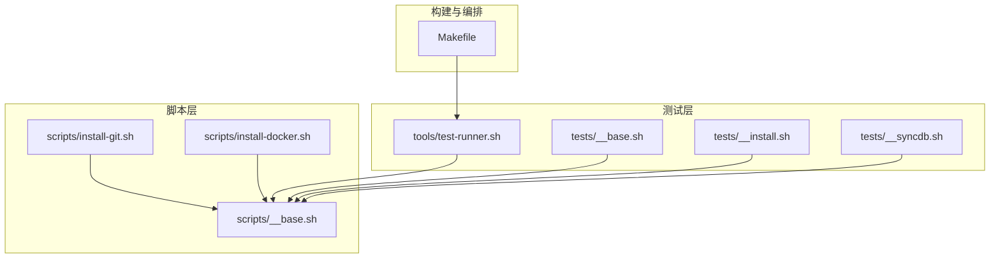
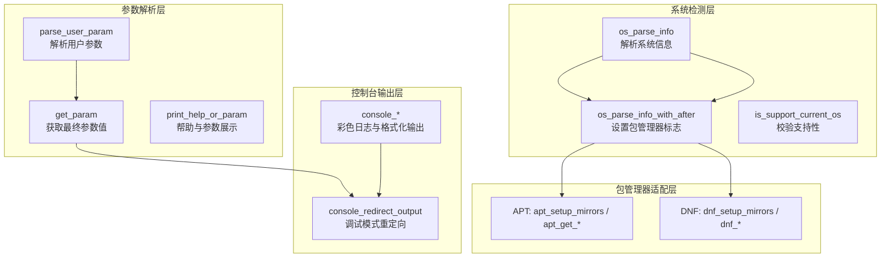
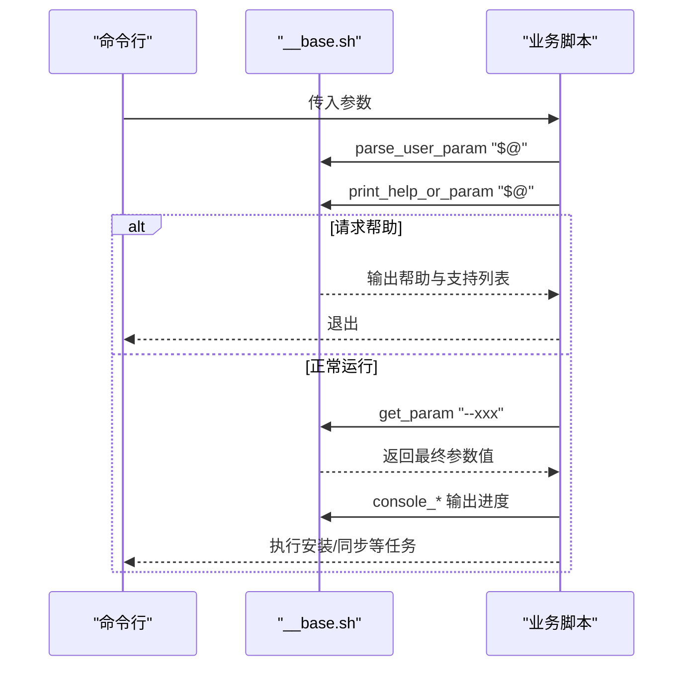
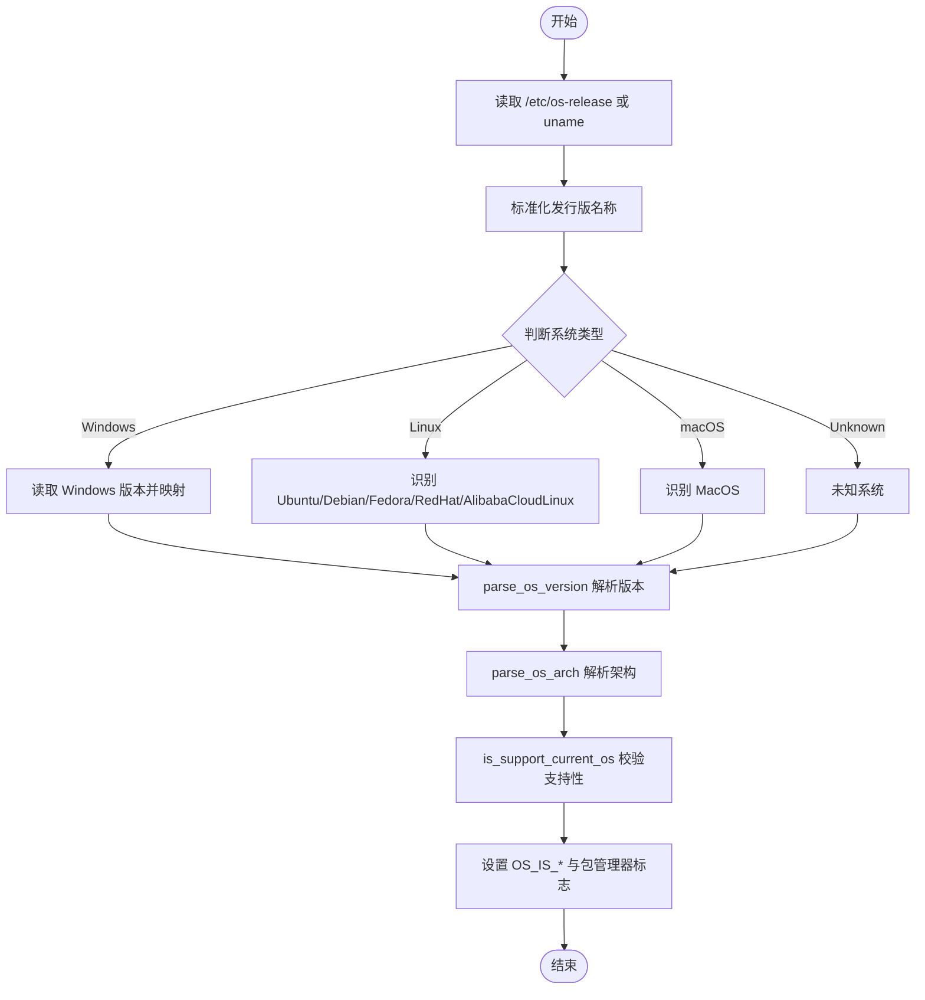
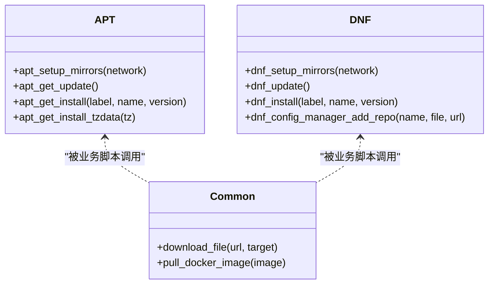
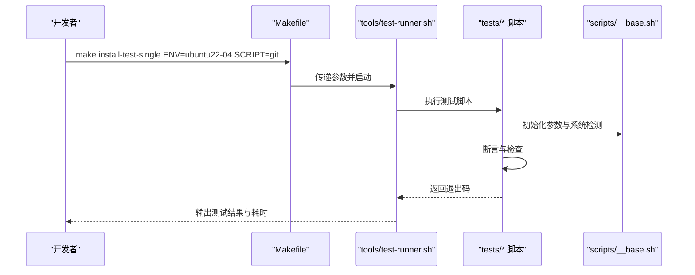
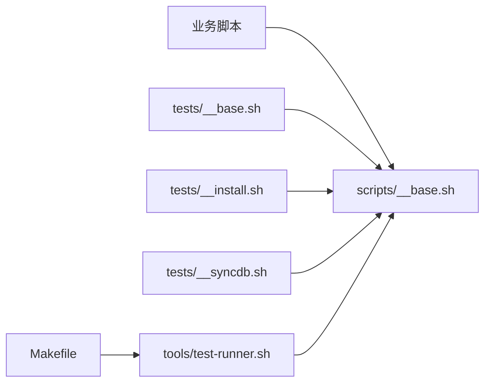

# 基础库设计

<cite>
**本文档引用的文件**
- [scripts/__base.sh](file://scripts/__base.sh)
- [tests/__base.sh](file://tests/__base.sh)
- [tests/__install.sh](file://tests/__install.sh)
- [tests/__syncdb.sh](file://tests/__syncdb.sh)
- [Makefile](file://Makefile)
- [scripts/install-git.sh](file://scripts/install-git.sh)
- [scripts/install-docker.sh](file://scripts/install-docker.sh)
- [tools/test-runner.sh](file://tools/test-runner.sh)
</cite>

## 目录
1. [简介](#简介)
2. [项目结构](#项目结构)
3. [核心组件](#核心组件)
4. [架构总览](#架构总览)
5. [详细组件分析](#详细组件分析)
6. [依赖关系分析](#依赖关系分析)
7. [性能考虑](#性能考虑)
8. [故障排除指南](#故障排除指南)
9. [结论](#结论)
10. [附录](#附录)

## 简介
本文件面向 HZ 9 Env Scripts 的基础库设计，重点围绕 scripts/__base.sh 展开，系统性阐述其模块化组织结构、函数封装策略、全局变量管理、操作系统检测机制、参数解析系统（双层设计）、日志输出与颜色编码、包管理器适配层（APT/DNF 统一抽象），以及扩展与定制方法。通过与测试框架、安装脚本、同步数据库脚本及构建工具的协同，基础库为整个环境脚本体系提供了统一的基础设施。

## 项目结构
基础库位于 scripts 目录下，作为所有业务脚本的公共依赖被 source 引入；测试框架位于 tests 目录，提供断言、环境初始化、测试执行等能力；Makefile 提供一键化的测试与构建流程；示例脚本（如安装 Git、Docker）展示了基础库的典型使用模式。

图表来源
- [scripts/__base.sh](file://scripts/__base.sh)
- [scripts/install-git.sh](file://scripts/install-git.sh)
- [scripts/install-docker.sh](file://scripts/install-docker.sh)
- [tests/__base.sh](file://tests/__base.sh)
- [tests/__install.sh](file://tests/__install.sh)
- [tests/__syncdb.sh](file://tests/__syncdb.sh)
- [tools/test-runner.sh](file://tools/test-runner.sh)
- [Makefile](file://Makefile)

章节来源
- [scripts/__base.sh](file://scripts/__base.sh)
- [Makefile](file://Makefile)

## 核心组件
基础库采用“模块化 + 全局状态 + 统一抽象”的设计：
- 参数解析模块：支持双层参数定义与解析，兼容不同 Bash 版本，提供默认值、别名、帮助信息展示与用户参数覆盖逻辑。
- 操作系统检测模块：统一解析发行版名称、版本、架构，并判断支持性，同时设置包管理器可用标志。
- 控制台输出模块：提供彩色日志、时间戳、模块标题、键值对输出、调试模式控制与重定向策略。
- 包管理器适配层：在 APT/DNF 之上提供统一接口，屏蔽不同发行版差异，支持镜像源切换、更新、安装、版本选择、缓存配置等。
- 工具与辅助：下载、Docker 镜像拉取、路径格式转换等通用能力。

章节来源
- [scripts/__base.sh](file://scripts/__base.sh)

## 架构总览
基础库通过模块化组织实现高内聚低耦合：各模块独立声明变量与函数，对外暴露统一接口；业务脚本仅需关注自身逻辑，通过调用基础库提供的函数完成参数解析、系统检测、日志输出与包管理操作。

图表来源
- [scripts/__base.sh](file://scripts/__base.sh)

## 详细组件分析

### 参数解析系统（双层设计）
- 用户参数解析：parse_user_param 将命令行参数解析为内部存储格式，支持长/短选项、带/不带值形式，统一使用分隔符进行字段拆分。
- 默认参数定义：在业务脚本中定义 PARAMTERS 数组，包含 name、alias、message、default 四段信息，用于生成帮助与默认值展示。
- 参数合并策略：get_param 在存在用户参数时优先返回用户值，否则回退到别名或默认值；print_help_or_param 负责帮助信息与支持性检查的输出。
- 辅助函数：has_user_param/get_user_param/print_user_param 提供用户参数的存在性检查、取值与打印。

图表来源
- [scripts/__base.sh](file://scripts/__base.sh)
- [scripts/install-git.sh](file://scripts/install-git.sh)

章节来源
- [scripts/__base.sh](file://scripts/__base.sh)
- [scripts/install-git.sh](file://scripts/install-git.sh)

### 操作系统检测机制
- os_parse_info：优先读取 /etc/os-release 获取发行版名称与版本 ID，否则回退 uname 输出；随后根据名称映射为标准化的 OS_NAME，并设置 OS_IS_* 标志位。
- 版本与架构解析：parse_os_version 支持 macOS、Debian、AlibabaCloudLinux、WindowsServer 等差异化处理；parse_os_arch 将 arm64/x86_64 映射为 ARM64/AMD64。
- 支持性判断：is_support_current_os 逐条比对 SUPPORT_OS_LIST 中的三元组（名称/版本/架构），若匹配则标记 OS_IS_SUPPORT=true。
- 包管理器标志：os_parse_info_with_after 根据 OS_NAME 设置 USE_APT_GET_INSTALL 或 USE_DNF_INSTALL，便于后续分支逻辑。

图表来源
- [scripts/__base.sh](file://scripts/__base.sh)

章节来源
- [scripts/__base.sh](file://scripts/__base.sh)

### 日志输出系统与调试模式
- 彩色编码：定义 RED/GREEN/YELLOW/BLUE/PURPLE/CYAN/WHITE/NC 常量，配合 printf 实现不同级别的日志输出。
- 时间戳与模块化输出：console_time_s 提供秒级时间戳；console_module_title/console_key_value/console_content 提供模块标题、键值对与缩进内容输出。
- 调试模式控制：console_redirect_output 根据 --debug 决定是否重定向到 /dev/null；console_content_starting/console_content_complete/console_content_error 动态调整输出格式与换行策略。
- 行为一致性：所有安装/同步流程均通过 console_* 族函数输出，确保跨脚本的一致性与可读性。

章节来源
- [scripts/__base.sh](file://scripts/__base.sh)

### 包管理器适配层（APT/DNF 统一抽象）
- APT 抽象：
  - apt_setup_mirrors：根据网络环境切换华为云镜像源，针对 Ubuntu/Debian 分别写入 sources.list 并禁用其他源文件。
  - apt_get_update/apt_get_install/apt_get_install_tzdata：封装更新与安装流程，支持指定版本与错误提示。
- DNF 抽象：
  - dnf_setup_mirrors：Fedora 使用自定义 repo 文件，RedHat 通过 EPEL 官方/镜像源安装 epel-release 并配置 epel.repo。
  - dnf_update/dnf_install：封装缓存重建与安装流程。
- 通用能力：
  - dnf_config_manager_add_repo：多策略尝试添加第三方仓库，提升兼容性。
  - download_file：基于 curl 下载文件，支持调试模式下的二次确认输出。
  - pull_docker_image：支持本地镜像快速检查与平台架构匹配验证，必要时远程拉取。

图表来源
- [scripts/__base.sh](file://scripts/__base.sh)

章节来源
- [scripts/__base.sh](file://scripts/__base.sh)

### 测试框架与使用模式
- 测试基座：tests/__base.sh 提供断言工具（文件/目录/进程存在性、字符串包含等）、测试环境清理与初始化、测试报告汇总等。
- 测试脚本：tests/__install.sh 与 tests/__syncdb.sh 定义安装与同步类测试的通用流程，如运行脚本、检查命令可用性、版本验证、Docker 镜像拉取等。
- 执行器：tools/test-runner.sh 作为测试入口，负责参数解析、环境注入、实时输出与退出码处理（0/1/2 分别代表通过/失败/跳过）。
- Makefile：提供一键化测试命令，自动拼装参数并通过 test-environment-manager.sh 驱动容器化测试环境。

图表来源
- [Makefile](file://Makefile)
- [tools/test-runner.sh](file://tools/test-runner.sh)
- [tests/__base.sh](file://tests/__base.sh)
- [tests/__install.sh](file://tests/__install.sh)
- [tests/__syncdb.sh](file://tests/__syncdb.sh)

章节来源
- [Makefile](file://Makefile)
- [tools/test-runner.sh](file://tools/test-runner.sh)
- [tests/__base.sh](file://tests/__base.sh)
- [tests/__install.sh](file://tests/__install.sh)
- [tests/__syncdb.sh](file://tests/__syncdb.sh)

## 依赖关系分析
- 脚本对基础库的依赖：所有业务脚本（如 install-git.sh、install-docker.sh）通过 source 引入 __base.sh，从而共享参数解析、系统检测、日志输出与包管理器抽象。
- 测试对基础库的依赖：测试基座与测试脚本同样 source __base.sh，确保测试环境初始化、断言与报告输出的一致性。
- 构建与执行链路：Makefile 通过 test-runner.sh 驱动测试，间接依赖 __base.sh 的参数与系统检测能力。

图表来源
- [scripts/__base.sh](file://scripts/__base.sh)
- [tests/__base.sh](file://tests/__base.sh)
- [tests/__install.sh](file://tests/__install.sh)
- [tests/__syncdb.sh](file://tests/__syncdb.sh)
- [tools/test-runner.sh](file://tools/test-runner.sh)
- [Makefile](file://Makefile)

章节来源
- [scripts/__base.sh](file://scripts/__base.sh)
- [tests/__base.sh](file://tests/__base.sh)
- [tests/__install.sh](file://tests/__install.sh)
- [tests/__syncdb.sh](file://tests/__syncdb.sh)
- [tools/test-runner.sh](file://tools/test-runner.sh)
- [Makefile](file://Makefile)

## 性能考虑
- 镜像源切换：APT/DNF 在中国网络环境下切换华为云镜像源，减少下载延迟；同时禁用其他源文件，避免冗余查询。
- 缓存与重定向：在非调试模式下，console_redirect_output 将子进程输出重定向至 /dev/null，降低 I/O 开销与噪声。
- 快速检查：Docker 镜像拉取前先进行本地存在性与平台匹配检查，避免不必要的网络传输。
- 版本选择：apt_get_install 支持指定版本，若目标版本不可用则列出可用版本并优雅退出，避免无效重试。

## 故障排除指南
- 参数解析异常
  - 症状：get_param 无法正确返回值或报错。
  - 排查：确认 PARAMTERS 是否正确定义，用户参数是否以 --name=value 或 --name 形式传入；使用 print_help_or_param 查看最终参数值。
- 系统支持性检查失败
  - 症状：脚本报错提示不支持当前系统。
  - 排查：核对 SUPPORT_OS_LIST 是否包含当前 OS_NAME/OS_VERS/OS_ARCH；使用 print_system_info/print_system_extra_info 输出诊断信息。
- 包管理器安装失败
  - 症状：apt/dnf 安装阶段报错。
  - 排查：检查 apt_setup_mirrors/dnf_setup_mirrors 是否成功写入源文件；确认网络环境与代理设置；查看 console_content_error 的具体原因。
- 调试模式输出过多
  - 症状：调试模式下输出冗长。
  - 处理：移除 --debug 或使用 console_redirect_output 控制重定向策略。
- Docker 镜像拉取失败
  - 症状：镜像拉取超时或平台不匹配。
  - 排查：开启 --docker-image-quick-check；检查本地镜像与平台架构；必要时手动拉取并重试。

章节来源
- [scripts/__base.sh](file://scripts/__base.sh)
- [tests/__base.sh](file://tests/__base.sh)

## 结论
HZ 9 Env Scripts 的基础库通过模块化设计与统一抽象，实现了参数解析、系统检测、日志输出与包管理器适配的标准化，显著降低了业务脚本的复杂度与维护成本。结合测试框架与 Makefile 的自动化流程，形成了从开发、测试到部署的完整闭环。建议在扩展新功能时遵循现有命名规范与模块边界，确保与既有组件的兼容性与一致性。

## 附录
- 扩展与定制建议
  - 新增参数：在业务脚本中扩展 PARAMTERS 数组，定义 name/alias/message/default；在脚本中通过 get_param 获取值。
  - 新增系统支持：在 SUPPORT_OS_LIST 中添加目标 OS 的三元组（名称/版本/架构）。
  - 新增包管理器：在 APT/DNF 抽象层新增函数，保持与现有接口一致；在 os_parse_info_with_after 中设置对应标志位。
  - 新增日志级别：在控制台模块中新增相应函数，复用现有颜色与格式化策略。
  - 新增工具函数：在基础库中新增通用能力（如下载、镜像拉取），并在业务脚本中按需调用。