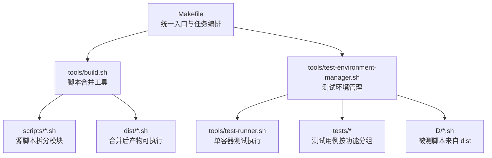
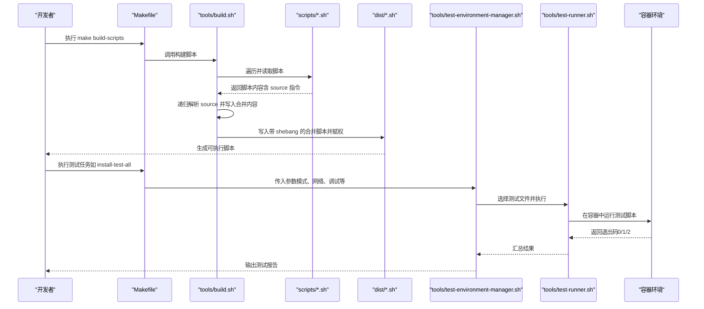
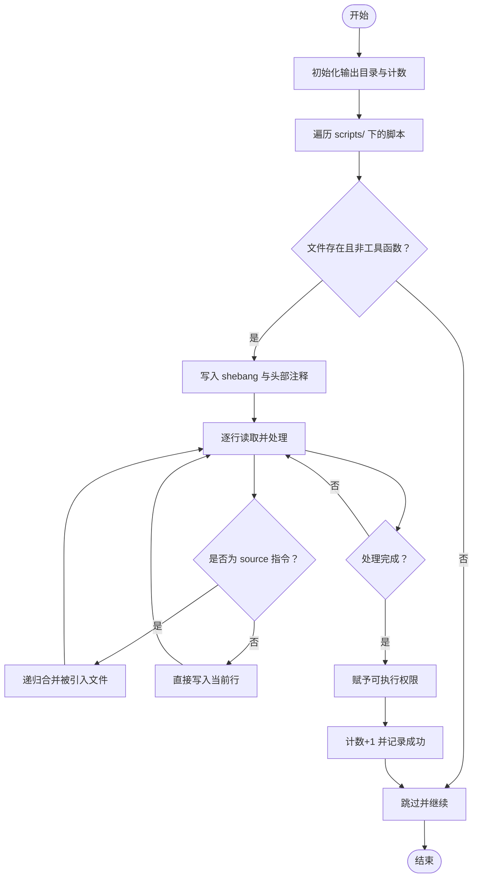
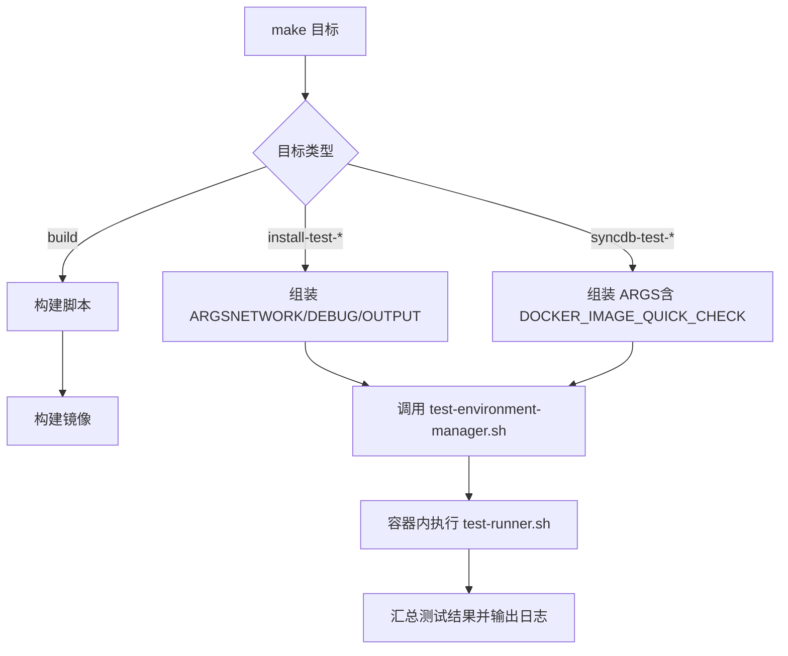
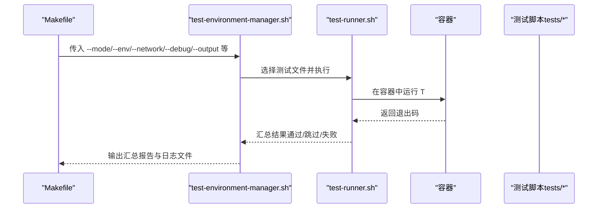
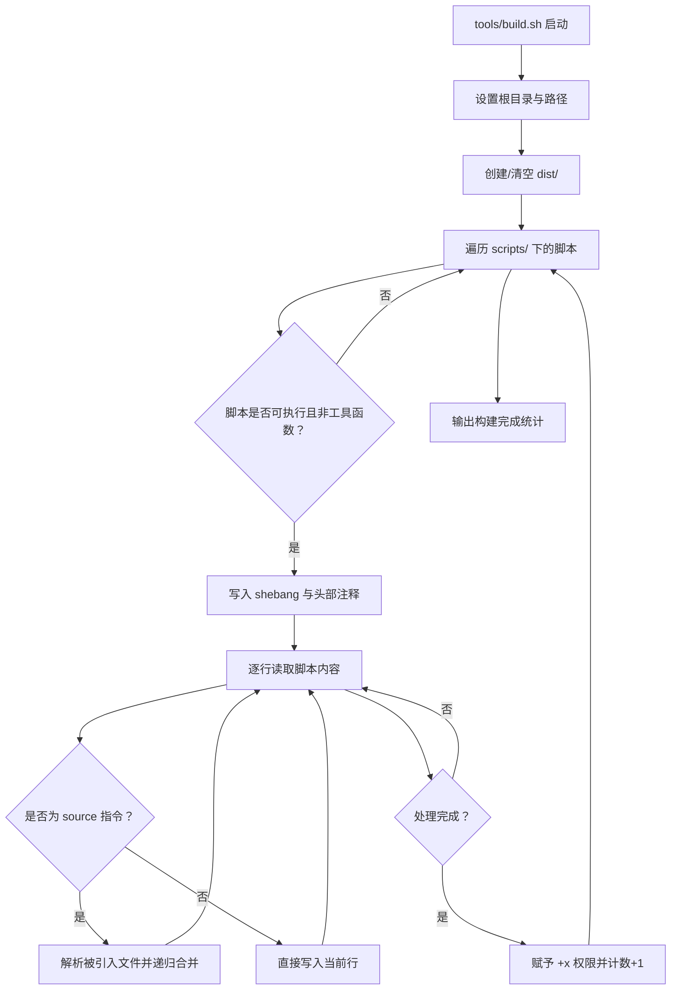
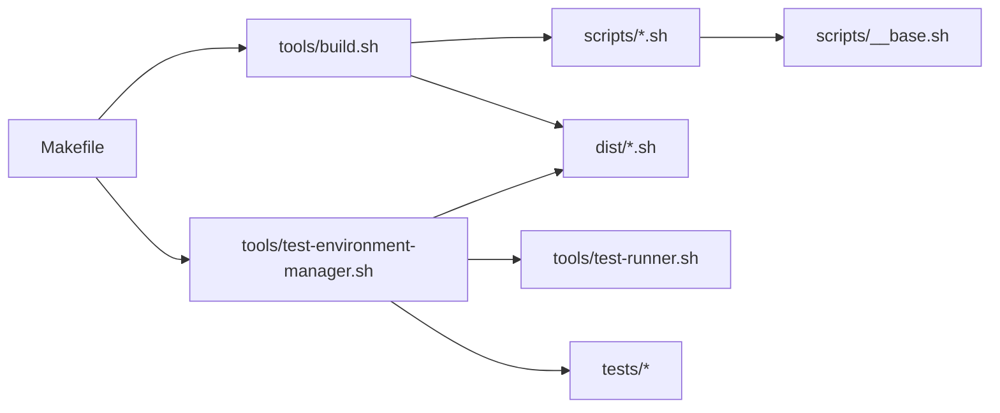

# 构建系统

<cite>
**本文引用的文件**
- [Makefile](file://Makefile)
- [tools/build.sh](file://tools/build.sh)
- [scripts/__base.sh](file://scripts/__base.sh)
- [scripts/install-git.sh](file://scripts/install-git.sh)
- [tools/test-environment-manager.sh](file://tools/test-environment-manager.sh)
- [tools/test-runner.sh](file://tools/test-runner.sh)
- [tests/install-git/01-ok.sh](file://tests/install-git/01-ok.sh)
- [tests/install-git/02-install.sh](file://tests/install-git/02-install.sh)
- [docs-build.config.json](file://docs-build.config.json)
- [package.json](file://package.json)
</cite>

## 目录
1. [简介](#简介)
2. [项目结构](#项目结构)
3. [核心组件](#核心组件)
4. [架构总览](#架构总览)
5. [详细组件分析](#详细组件分析)
6. [依赖分析](#依赖分析)
7. [性能考虑](#性能考虑)
8. [故障排查指南](#故障排查指南)
9. [结论](#结论)
10. [附录](#附录)

## 简介
本文件面向 HZ 9 Env Scripts 的构建系统，系统性阐述脚本构建流程的设计原理与实现细节，重点覆盖以下方面：
- 源脚本的合并机制：如何通过工具脚本递归解析并合并脚本，处理 source 指令与 shebang 替换。
- 依赖解析与最终输出：如何在 dist 目录生成可直接执行的单体脚本，并保证可执行权限与完整性。
- Makefile 构建目标设计：clean、build、build-scripts、test 系列任务的依赖关系与参数传递。
- 多发行版差异化处理：如何在统一构建流程中适配不同 Linux 发行版与版本。
- 缓存策略与性能优化：构建阶段的最小化重算与日志输出优化。
- 实际使用示例与扩展建议：帮助开发者快速上手并定制构建流程。

## 项目结构
该仓库采用“脚本分拆 + 工具合并”的组织方式：
- scripts/：按功能拆分的 Bash 脚本（如安装器、同步器等），每个脚本以 install- 或 syncdb- 前缀命名。
- tools/：构建与测试工具脚本，负责合并脚本、运行测试环境管理与测试执行。
- dist/：构建产物输出目录，存放合并后的可执行脚本。
- tests/：按功能划分的测试套件，配合测试框架进行跨发行版验证。
- Makefile：统一入口，提供构建、测试、清理等任务。

图表来源
- [Makefile:48-82](file://Makefile#L48-L82)
- [tools/build.sh:14-81](file://tools/build.sh#L14-L81)
- [tools/test-environment-manager.sh:14-24](file://tools/test-environment-manager.sh#L14-L24)

章节来源
- [Makefile:1-563](file://Makefile#L1-L563)
- [tools/build.sh:1-91](file://tools/build.sh#L1-L91)

## 核心组件
- 构建工具：tools/build.sh
  - 作用：遍历 scripts/ 下的脚本，递归解析 source 指令，合并为 dist/ 下的单体脚本；为每个输出文件添加 shebang 并赋予可执行权限。
  - 关键点：对 source 行进行正则匹配与递归调用；对原脚本 shebang 进行注释替换，避免重复 shebang。
- 测试环境管理：tools/test-environment-manager.sh
  - 作用：根据模式（all、all-env、all-script、single）扫描 tests/ 目录，通过 docker-compose 在指定发行版容器中执行测试。
  - 关键点：支持网络配置、调试开关、输出路径、镜像快速检查等参数透传。
- 测试执行器：tools/test-runner.sh
  - 作用：在容器内执行具体测试文件，收集退出码并输出统计信息；支持跳过（返回 2）、成功（返回 0）、失败（返回 1）三种状态。
- Makefile 任务
  - build：先构建脚本再构建镜像。
  - build-scripts：调用 tools/build.sh 生成 dist/ 产物。
  - test 系列：封装测试参数并通过 test-environment-manager.sh 统一调度。

章节来源
- [tools/build.sh:19-44](file://tools/build.sh#L19-L44)
- [tools/test-environment-manager.sh:222-332](file://tools/test-environment-manager.sh#L222-L332)
- [tools/test-runner.sh:8-64](file://tools/test-runner.sh#L8-L64)
- [Makefile:48-563](file://Makefile#L48-L563)

## 架构总览
下图展示从源脚本到最终可执行脚本的构建与测试链路，以及 Makefile 的任务编排关系。

图表来源
- [Makefile:48-119](file://Makefile#L48-L119)
- [tools/build.sh:46-81](file://tools/build.sh#L46-L81)
- [tools/test-environment-manager.sh:222-332](file://tools/test-environment-manager.sh#L222-L332)
- [tools/test-runner.sh:8-64](file://tools/test-runner.sh#L8-L64)

## 详细组件分析

### 构建工具：tools/build.sh
- 设计要点
  - 递归合并：遇到 source 行时，解析被引入文件名并递归写入其内容；同时记录导入来源以便追踪依赖。
  - shebang 处理：原脚本的 shebang 不复制到合并文件，而是以注释形式记录导入来源，最终由合并文件头部的 shebang 提供执行入口。
  - 输出控制：为每个 dist/ 文件写入头部注释（包含生成时间、来源路径等），并在成功时赋予 +x 权限。
  - 错误处理：若某脚本不存在或合并失败，则删除部分输出并返回失败，避免产生不完整产物。
- 性能与健壮性
  - 单次遍历：对每个脚本只读一次，逐行处理，时间复杂度近似 O(N)（N 为脚本总行数）。
  - 清理旧产物：每次构建前清空 dist/，减少残留影响。
  - 可执行性：自动赋予 +x，确保生成脚本可直接运行。

图表来源
- [tools/build.sh:14-81](file://tools/build.sh#L14-L81)

章节来源
- [tools/build.sh:19-44](file://tools/build.sh#L19-L44)
- [tools/build.sh:46-81](file://tools/build.sh#L46-L81)

### Makefile 构建目标与参数传递
- build：串联构建脚本与构建镜像两个子任务，确保产物与测试环境一致。
- build-scripts：调用 tools/build.sh，打印构建进度与结果。
- 测试系列目标：install-test-all、install-test-all-env、install-test-all-script、install-test-single、install-test-file、syncdb-test-all、syncdb-test-all-env、syncdb-test-all-script、syncdb-test-single、syncdb-test-file。
  - 参数透传：所有测试目标会将 NETWORK、DEBUG、OUTPUT、DOCKER_IMAGE_QUICK_CHECK 等参数拼接为 ARGS 并传递给 test-environment-manager.sh。
  - 日志记录：测试过程输出到 logs/ 目录，便于问题定位。
- 通用命令：interactive、shell、clean、logs、results。

图表来源
- [Makefile:84-532](file://Makefile#L84-L532)
- [tools/test-environment-manager.sh:222-332](file://tools/test-environment-manager.sh#L222-L332)
- [tools/test-runner.sh:86-148](file://tools/test-runner.sh#L86-L148)

章节来源
- [Makefile:48-563](file://Makefile#L48-L563)

### 测试环境管理与执行
- test-environment-manager.sh
  - 支持多种模式：all（全环境全脚本）、all-env（特定脚本在全环境）、all-script（全脚本在特定环境）、single（单文件或单脚本在单环境）。
  - 参数解析：支持 --mode、--env、--network、--debug、--output、--docker-image-quick-check、--file、--script、--scope 等。
  - 容器执行：通过 docker-compose 在对应发行版容器中运行 tools/test-runner.sh，并统计通过/跳过/失败数量。
- test-runner.sh
  - 单文件执行：捕获输出并判断退出码，返回 0/1/2 分别表示成功/失败/跳过。
  - 参数透传：接收 --env、--network、--debug、--output、--docker-image-quick-check、--internal-ip 等参数。

图表来源
- [tools/test-environment-manager.sh:222-332](file://tools/test-environment-manager.sh#L222-L332)
- [tools/test-runner.sh:86-148](file://tools/test-runner.sh#L86-L148)

章节来源
- [tools/test-environment-manager.sh:14-24](file://tools/test-environment-manager.sh#L14-L24)
- [tools/test-environment-manager.sh:222-332](file://tools/test-environment-manager.sh#L222-L332)
- [tools/test-runner.sh:8-64](file://tools/test-runner.sh#L8-L64)

### 多发行版差异化处理
- 发行版枚举：Makefile 中定义了支持的环境列表（ubuntu20-04、ubuntu22-04、ubuntu24-04、debian11-9、debian12-2、fedora41、redhat8-10、redhat9-6）。
- 脚本层差异化：各安装脚本（如 scripts/install-git.sh）通过 SUPPORT_OS_LIST 声明支持的系统组合（名称、版本、架构），并在运行时通过 __base.sh 的 OS 解析与安装器选择逻辑（apt/dnf）实现差异化安装。
- 测试层差异化：测试环境管理器按环境列表逐一执行，确保跨发行版一致性。

章节来源
- [Makefile:42-46](file://Makefile#L42-L46)
- [scripts/install-git.sh:16-28](file://scripts/install-git.sh#L16-L28)
- [scripts/__base.sh:80-263](file://scripts/__base.sh#L80-L263)

### 构建流程图（代码级）

图表来源
- [tools/build.sh:14-81](file://tools/build.sh#L14-L81)

## 依赖分析
- 构建阶段
  - tools/build.sh 依赖 scripts/ 下的脚本文件；每个脚本通过 source 引入 __base.sh 与功能模块。
  - dist/ 产物由 scripts/ 合并而来，最终供测试与发布使用。
- 测试阶段
  - tools/test-environment-manager.sh 依赖 docker-compose 定义的镜像与服务，按环境拉起容器执行 tools/test-runner.sh。
  - tools/test-runner.sh 依赖 tests/ 下的具体测试文件，测试文件再依赖 dist/ 下的被测脚本。
- Makefile 作为编排中心，将上述组件串联起来，形成端到端的 CI/CD 流程。

图表来源
- [tools/build.sh:14-81](file://tools/build.sh#L14-L81)
- [tools/test-environment-manager.sh:14-24](file://tools/test-environment-manager.sh#L14-L24)
- [Makefile:48-563](file://Makefile#L48-L563)

章节来源
- [Makefile:48-563](file://Makefile#L48-L563)

## 性能考虑
- 构建性能
  - 单次遍历：每个脚本仅读取一次，逐行处理，避免重复 IO。
  - 最小化重算：构建前清空 dist/，避免历史残留导致的二次解析。
  - 并发友好：构建工具本身为串行处理，适合在 CI 中顺序执行。
- 测试性能
  - 容器隔离：通过 docker-compose 在独立环境中执行测试，避免相互干扰。
  - 参数透传：通过 Makefile 将必要参数（如网络配置、调试开关）一次性注入，减少重复配置成本。
- 日志与可观测性
  - 测试输出统一写入 logs/，便于问题定位与回溯。

[本节为通用性能讨论，无需列出具体文件来源]

## 故障排查指南
- 构建失败
  - 现象：tools/build.sh 输出“构建失败”并删除部分输出文件。
  - 排查：确认 scripts/ 下脚本是否存在、语法是否正确；检查 source 指令指向的文件是否存在于 scripts/。
- 测试失败
  - 现象：test-environment-manager.sh 输出失败环境与参数，test-runner.sh 返回非 0 退出码。
  - 排查：查看 logs/ 下对应日志文件；确认容器镜像已构建、网络配置正确、被测脚本在 dist/ 中存在且可执行。
- 权限问题
  - 现象：生成脚本不可执行。
  - 排查：确认 tools/build.sh 是否成功赋予 +x 权限；在容器内执行测试时注意挂载权限。

章节来源
- [tools/build.sh:72-79](file://tools/build.sh#L72-L79)
- [tools/test-environment-manager.sh:184-220](file://tools/test-environment-manager.sh#L184-L220)
- [tools/test-runner.sh:53-64](file://tools/test-runner.sh#L53-L64)

## 结论
该构建系统通过“脚本拆分 + 工具合并 + 多发行版测试”的方式，实现了高内聚、低耦合的开发与交付流程。tools/build.sh 提供了可靠的合并与依赖解析能力，Makefile 则提供了清晰的任务编排与参数传递机制。结合容器化的测试体系，能够稳定地在多发行版环境下验证脚本的可用性与一致性。

[本节为总结性内容，无需列出具体文件来源]

## 附录

### 实际使用示例
- 本地构建
  - 执行 make build-scripts 生成 dist/ 下的可执行脚本。
- 全量测试（安装类）
  - 执行 make install-test-all，自动在所有环境与脚本上运行测试，并输出日志文件。
- 指定脚本测试
  - 执行 make install-test-all-env SCRIPT=git，仅在所有环境上运行 install-git 的测试。
- 指定环境测试
  - 执行 make install-test-all-script ENV=ubuntu22-04，仅在 ubuntu22-04 上运行所有安装类测试。
- 单文件测试
  - 执行 make install-test-file ENV=ubuntu22-04 FILE=tests/install-git/01-ok.sh，仅运行该测试文件。
- 同步数据库脚本测试
  - 执行 make syncdb-test-single ENV=ubuntu22-04 SCRIPT=mysql，运行 mysql 同步脚本的测试。

章节来源
- [Makefile:84-532](file://Makefile#L84-L532)

### 扩展与定制建议
- 新增脚本
  - 在 scripts/ 下新增 install-xxx.sh 或 syncdb-xxx.sh，遵循参数与 SUPPORT_OS_LIST 规范；确保通过 __base.sh 的参数解析与 OS 判定逻辑。
- 自定义网络配置
  - 在测试时通过 NETWORK=in-china 传递网络参数，测试框架会将其透传至被测脚本。
- 文档站点构建
  - 使用 docs-build.config.json 配置站点语言、导航与输出目录，结合 docs/ 下的 Markdown 内容生成静态站点。

章节来源
- [scripts/install-git.sh:7-28](file://scripts/install-git.sh#L7-L28)
- [docs-build.config.json:1-167](file://docs-build.config.json#L1-L167)
- [package.json:1-3](file://package.json#L1-L3)