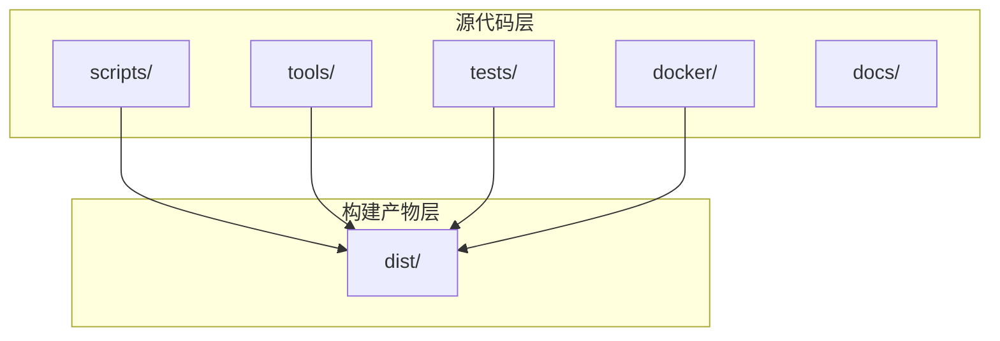
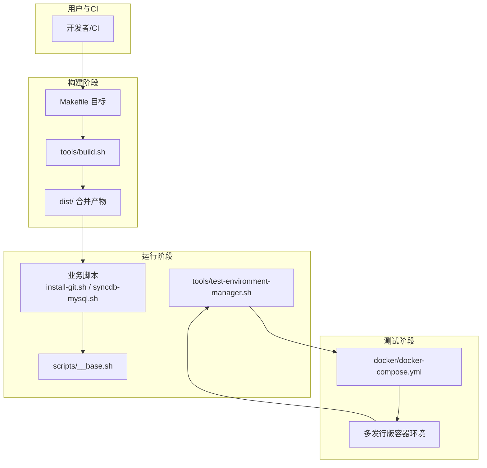
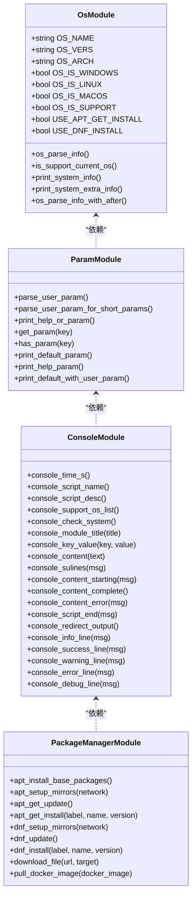
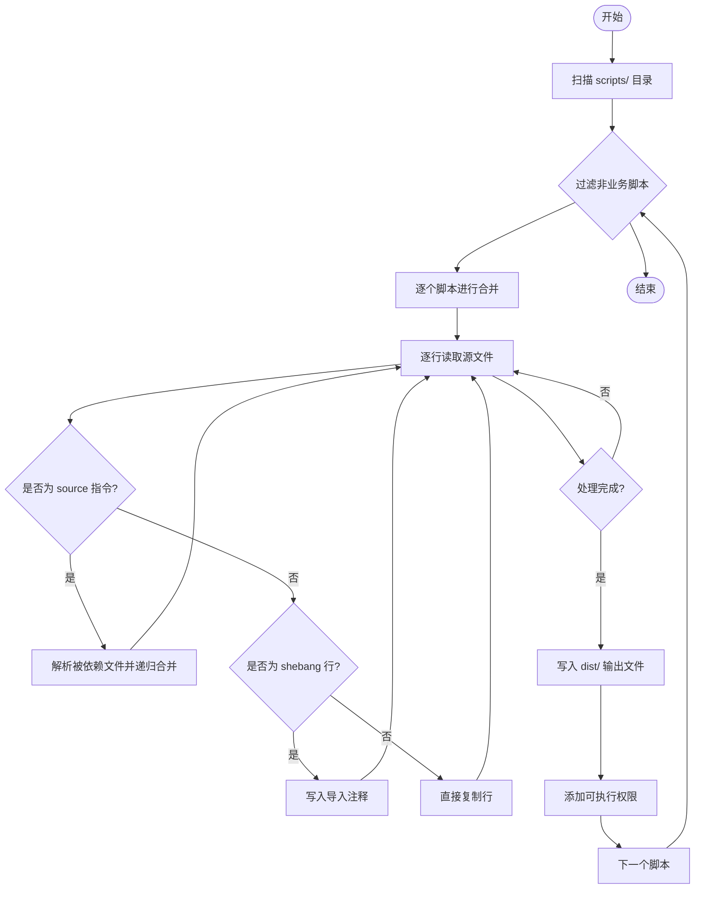
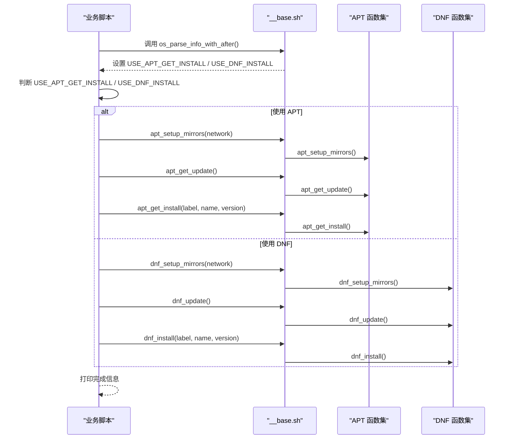
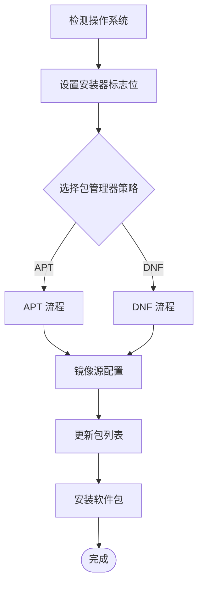
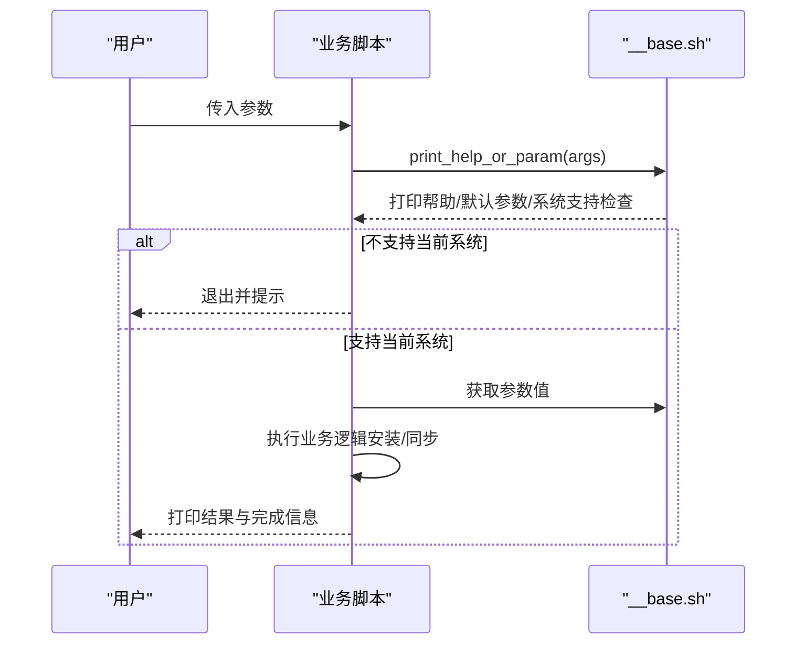
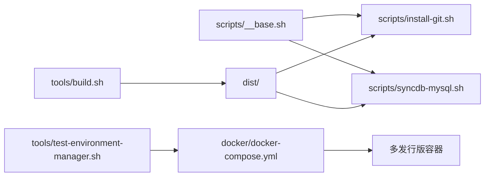

# 核心架构

<cite>
**本文档引用的文件**
- [scripts/__base.sh](file://scripts/__base.sh)
- [tools/build.sh](file://tools/build.sh)
- [Makefile](file://Makefile)
- [scripts/install-git.sh](file://scripts/install-git.sh)
- [scripts/syncdb-mysql.sh](file://scripts/syncdb-mysql.sh)
- [tools/test-environment-manager.sh](file://tools/test-environment-manager.sh)
- [docker/docker-compose.yml](file://docker/docker-compose.yml)
- [tests/install-git/01-ok.sh](file://tests/install-git/01-ok.sh)
- [tests/install-git/02-install.sh](file://tests/install-git/02-install.sh)
- [README.md](file://README.md)
</cite>

## 目录
1. [简介](#简介)
2. [项目结构](#项目结构)
3. [核心组件](#核心组件)
4. [架构总览](#架构总览)
5. [详细组件分析](#详细组件分析)
6. [依赖关系分析](#依赖关系分析)
7. [性能考量](#性能考量)
8. [故障排查指南](#故障排查指南)
9. [结论](#结论)

## 简介
HZ 9 Env Scripts 是一套面向多发行版 Linux 的开发环境准备脚本集合，目标是通过统一的抽象层与构建系统，实现跨平台、可测试、可维护的自动化安装与数据库同步脚本。其核心理念包括：
- 模块化架构：将通用能力拆分为独立模块（操作系统检测、参数解析、日志输出、包管理器适配等），便于复用与扩展。
- 模板方法模式：在具体脚本中定义“骨架”流程（如打印帮助、校验系统支持、打印默认参数、执行安装或同步），由基础库提供统一的控制流。
- 策略模式：通过条件判断选择不同的包管理器策略（APT 或 DNF），并在不同网络环境下切换镜像源，实现对多发行版与多网络环境的适配。
- 自动化构建：通过构建脚本将源脚本与基础库合并生成最终可执行文件，减少运行时依赖与加载开销。
- 跨发行版兼容：通过统一的抽象层屏蔽底层差异，确保脚本在 Ubuntu、Debian、Fedora、RedHat 等平台上一致行为。

## 项目结构
项目采用按功能分层的组织方式：
- scripts：业务脚本与基础库，其中 __base.sh 提供核心抽象与工具函数。
- tools：构建与测试工具，包括构建脚本与测试环境管理器。
- tests：针对各业务脚本的单元测试与集成测试。
- docker：多发行版容器镜像配置，用于在隔离环境中进行测试。
- dist：构建产物目录，存放合并后的可执行脚本。
- docs：文档资源。

**图表来源**
- [scripts/__base.sh](file://scripts/__base.sh)
- [tools/build.sh](file://tools/build.sh)
- [Makefile](file://Makefile)

**章节来源**
- [README.md](file://README.md)
- [Makefile](file://Makefile)

## 核心组件
- 基础库（__base.sh）：提供操作系统检测、参数解析、日志输出、包管理器适配、下载与 Docker 镜像拉取等通用能力。
- 构建系统（tools/build.sh + Makefile）：负责将源脚本与基础库合并，生成最终可执行文件，并提供一键构建与测试命令。
- 业务脚本：如安装 Git、同步 MySQL 数据库等，遵循模板方法模式，调用基础库完成统一流程。
- 测试框架：通过 docker-compose 在多发行版容器中运行测试，验证脚本在不同环境下的正确性。

**章节来源**
- [scripts/__base.sh](file://scripts/__base.sh)
- [tools/build.sh](file://tools/build.sh)
- [Makefile](file://Makefile)

## 架构总览
系统采用“基础库 + 业务脚本 + 构建与测试工具”的分层架构，配合 Docker 容器化测试环境，形成闭环的质量保障体系。

**图表来源**
- [tools/build.sh](file://tools/build.sh)
- [Makefile](file://Makefile)
- [scripts/__base.sh](file://scripts/__base.sh)
- [scripts/install-git.sh](file://scripts/install-git.sh)
- [scripts/syncdb-mysql.sh](file://scripts/syncdb-mysql.sh)
- [tools/test-environment-manager.sh](file://tools/test-environment-manager.sh)
- [docker/docker-compose.yml](file://docker/docker-compose.yml)

## 详细组件分析

### 基础库（__base.sh）设计原理
基础库通过模块化的方式组织功能，每个模块封装特定职责，降低耦合度并提升内聚性。

- 操作系统检测模块
  - 解析 /etc/os-release 或 uname 输出，识别发行版名称、版本与架构。
  - 支持 Windows Server、Ubuntu、Debian、Fedora、RedHat、AlibabaCloudLinux、macOS 等。
  - 将结果标准化为 OS_NAME、OS_VERS、OS_ARCH，并设置 OS_IS_* 标志位。
  - 提供 is_support_current_os 判断当前系统是否受支持。

- 参数解析模块
  - 统一解析 --key=value、--key、-k=value、-k 等形式的参数。
  - 支持别名参数（--help/-h）与默认值。
  - 提供 print_help_or_param、get_param、has_param 等便捷接口。

- 日志输出模块
  - 提供彩色输出、时间戳、模块标题、键值对格式化等能力。
  - 支持根据 --debug 参数动态控制输出与重定向。

- 包管理器适配层
  - APT：支持 Ubuntu/Debian，提供 apt_setup_mirrors、apt_get_update、apt_get_install 等。
  - DNF：支持 Fedora/RedHat/AlibabaCloudLinux，提供 dnf_setup_mirrors、dnf_update、dnf_install 等。
  - 统一镜像源策略：支持中国境内网络环境，自动切换华为云镜像源；非中国环境使用官方源。

- 下载与 Docker 镜像管理
  - download_file：基于 curl 下载文件。
  - pull_docker_image：支持本地快速检测与远程拉取。

**图表来源**
- [scripts/__base.sh](file://scripts/__base.sh)

**章节来源**
- [scripts/__base.sh](file://scripts/__base.sh)

### 脚本构建系统自动化流程
构建系统通过 tools/build.sh 将 scripts 目录中的脚本与其依赖的基础库合并，生成 dist 目录下的最终可执行文件。

**图表来源**
- [tools/build.sh](file://tools/build.sh)

**章节来源**
- [tools/build.sh](file://tools/build.sh)
- [Makefile](file://Makefile)

### 包管理器适配层设计
基础库通过条件分支选择合适的包管理器策略，并在不同网络环境下切换镜像源，实现跨发行版与多网络环境的统一处理。

**图表来源**
- [scripts/__base.sh](file://scripts/__base.sh)
- [scripts/install-git.sh](file://scripts/install-git.sh)

**章节来源**
- [scripts/__base.sh](file://scripts/__base.sh)
- [scripts/install-git.sh](file://scripts/install-git.sh)

### 抽象层设计与跨发行版兼容
抽象层通过统一的变量与函数接口屏蔽底层差异，确保脚本在不同发行版上的一致行为。

- 统一变量命名：OS_NAME、OS_VERS、OS_ARCH、OS_IS_*、USE_APT_GET_INSTALL、USE_DNF_INSTALL。
- 统一函数接口：apt_setup_mirrors、apt_get_update、apt_get_install、dnf_setup_mirrors、dnf_update、dnf_install。
- 条件分支策略：根据 USE_APT_GET_INSTALL 或 USE_DNF_INSTALL 决定调用路径。
- 网络环境适配：根据 --network 参数选择镜像源策略。

**图表来源**
- [scripts/__base.sh](file://scripts/__base.sh)

**章节来源**
- [scripts/__base.sh](file://scripts/__base.sh)

### 业务脚本模板方法模式应用
业务脚本遵循模板方法模式，定义统一的执行骨架，具体步骤由基础库提供。

**图表来源**
- [scripts/install-git.sh](file://scripts/install-git.sh)
- [scripts/syncdb-mysql.sh](file://scripts/syncdb-mysql.sh)
- [scripts/__base.sh](file://scripts/__base.sh)

**章节来源**
- [scripts/install-git.sh](file://scripts/install-git.sh)
- [scripts/syncdb-mysql.sh](file://scripts/syncdb-mysql.sh)
- [scripts/__base.sh](file://scripts/__base.sh)

## 依赖关系分析
- 业务脚本依赖基础库：所有业务脚本通过 source 引入 __base.sh。
- 构建系统依赖业务脚本：build.sh 会递归解析 source 指令并合并文件。
- 测试框架依赖构建产物：test-environment-manager.sh 通过 docker-compose 在容器中运行 dist 目录下的脚本。
- Docker 环境依赖测试框架：docker-compose.yml 定义了多发行版容器服务，启动时执行 test-runner.sh。

**图表来源**
- [scripts/__base.sh](file://scripts/__base.sh)
- [scripts/install-git.sh](file://scripts/install-git.sh)
- [scripts/syncdb-mysql.sh](file://scripts/syncdb-mysql.sh)
- [tools/build.sh](file://tools/build.sh)
- [tools/test-environment-manager.sh](file://tools/test-environment-manager.sh)
- [docker/docker-compose.yml](file://docker/docker-compose.yml)

**章节来源**
- [Makefile](file://Makefile)
- [tools/build.sh](file://tools/build.sh)
- [tools/test-environment-manager.sh](file://tools/test-environment-manager.sh)
- [docker/docker-compose.yml](file://docker/docker-compose.yml)

## 性能考量
- 构建阶段优化：合并脚本减少运行时加载与解析成本，提升首次执行效率。
- 包管理器缓存：APT/DNF 分别利用各自缓存目录，减少重复下载与索引重建。
- 镜像源选择：在中国网络环境下优先使用华为云镜像源，缩短下载时间。
- Docker 快速检测：在拉取镜像前检查本地是否存在且架构匹配，避免不必要的网络传输。

[本节为通用指导，无需特定文件来源]

## 故障排查指南
- 构建失败
  - 检查 tools/build.sh 是否存在目标文件与 source 指令。
  - 确认 dist 目录权限与磁盘空间充足。
- 测试失败
  - 查看 docker/docker-compose.yml 中对应容器的日志与退出码。
  - 使用 make interactive 或 make shell 进入容器交互式调试。
- 参数解析异常
  - 确认参数格式符合 --key=value 或 --key 形式。
  - 使用 --help 查看帮助信息与默认参数。
- 包管理器错误
  - 检查网络环境参数 --network 是否正确。
  - 确认镜像源配置是否成功写入 /etc/apt/sources.list 或 /etc/yum.repos.d/。

**章节来源**
- [tools/build.sh](file://tools/build.sh)
- [tools/test-environment-manager.sh](file://tools/test-environment-manager.sh)
- [docker/docker-compose.yml](file://docker/docker-compose.yml)
- [tests/install-git/01-ok.sh](file://tests/install-git/01-ok.sh)
- [tests/install-git/02-install.sh](file://tests/install-git/02-install.sh)

## 结论
HZ 9 Env Scripts 通过模块化架构、模板方法模式与策略模式，实现了跨发行版、多网络环境的统一脚本体系。基础库提供强大的抽象与适配能力，构建系统确保产物可移植性，测试框架在容器化环境中保证质量。该架构既满足了快速迭代的需求，也为后续扩展与维护奠定了坚实基础。