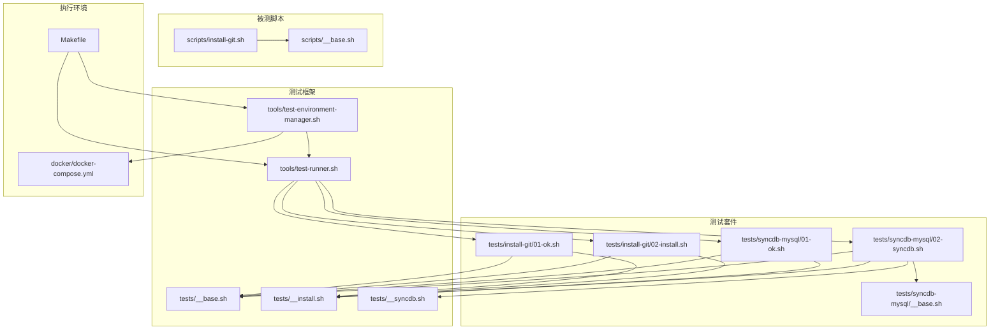
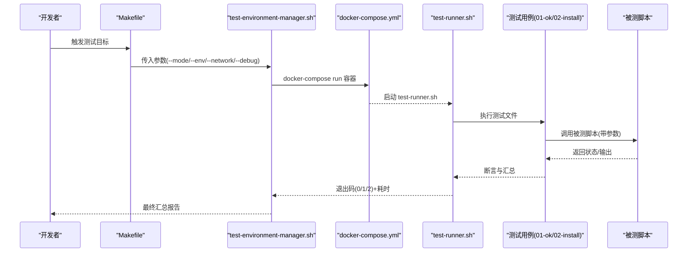
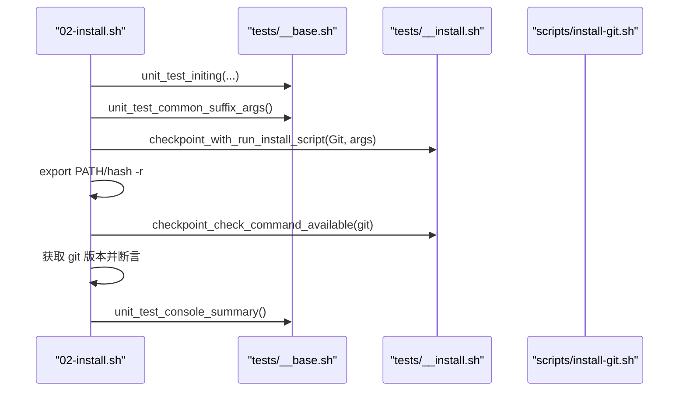
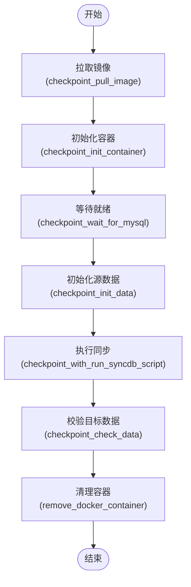
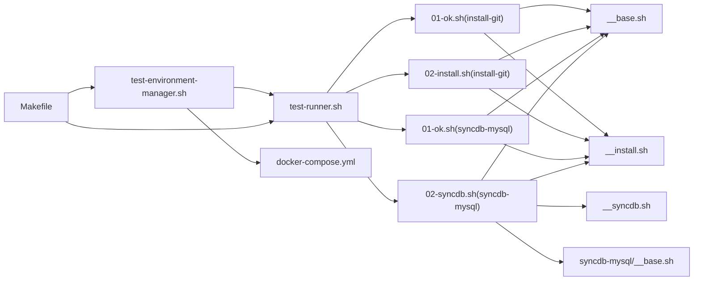

# 测试工具详解

<cite>
**本文引用的文件**
- [tests/__base.sh](file://tests/__base.sh)
- [tests/__install.sh](file://tests/__install.sh)
- [tests/__syncdb.sh](file://tests/__syncdb.sh)
- [tools/test-runner.sh](file://tools/test-runner.sh)
- [tools/test-environment-manager.sh](file://tools/test-environment-manager.sh)
- [tests/install-git/01-ok.sh](file://tests/install-git/01-ok.sh)
- [tests/install-git/02-install.sh](file://tests/install-git/02-install.sh)
- [tests/syncdb-mysql/01-ok.sh](file://tests/syncdb-mysql/01-ok.sh)
- [tests/syncdb-mysql/02-syncdb.sh](file://tests/syncdb-mysql/02-syncdb.sh)
- [tests/syncdb-mysql/__base.sh](file://tests/syncdb-mysql/__base.sh)
- [scripts/install-git.sh](file://scripts/install-git.sh)
- [Makefile](file://Makefile)
- [scripts/__base.sh](file://scripts/__base.sh)
- [docker/docker-compose.yml](file://docker/docker-compose.yml)
- [docs/overview/testing.zh-CN.md](file://docs/overview/testing.zh-CN.md)
</cite>

## 目录
1. [简介](#简介)
2. [项目结构](#项目结构)
3. [核心组件](#核心组件)
4. [架构总览](#架构总览)
5. [详细组件分析](#详细组件分析)
6. [依赖关系分析](#依赖关系分析)
7. [性能与稳定性考量](#性能与稳定性考量)
8. [故障排查指南](#故障排查指南)
9. [结论](#结论)
10. [附录](#附录)

## 简介
本文件面向 HZ 9 Env Scripts 的测试体系，系统化讲解测试套件的结构、命名规范、执行流程与最佳实践。重点覆盖两类测试：
- 安装类测试（install-git、install-curl 等）：验证脚本语法、帮助信息、操作系统兼容性以及真实安装流程。
- 数据库同步测试（syncdb-mysql、syncdb-postgresql、syncdb-mongo）：验证容器拉取、初始化、数据同步与校验。

同时提供测试脚本标准格式、断言与清理步骤、调试技巧、环境隔离方法及质量评估建议。

## 项目结构
测试相关目录与文件概览如下：
- tests/：测试套件根目录，按功能划分子目录
  - install-*/：安装类测试套件，每个工具一个目录，包含 01-ok.sh 与 02-install.sh
  - syncdb-*/：数据库同步测试套件，包含 01-ok.sh、02-syncdb.sh 及 __base.sh
  - __base.sh、__install.sh、__syncdb.sh：测试通用工具与断言
- tools/：测试执行工具
  - test-runner.sh：单文件测试执行器
  - test-environment-manager.sh：跨环境批量测试协调器
- scripts/：被测脚本与基础库
  - __base.sh：脚本通用能力（参数解析、OS 判定、日志等）
  - install-*.sh：待测安装脚本示例（如 install-git.sh）
- docker/：Docker 环境定义，提供多 OS 隔离测试环境
- Makefile：统一入口，封装常用测试命令与参数传递
- docs/overview/testing.zh-CN.md：官方测试指南

图表来源
- [tests/__base.sh:1-464](file://tests/__base.sh#L1-L464)
- [tests/__install.sh:1-66](file://tests/__install.sh#L1-L66)
- [tests/__syncdb.sh:1-47](file://tests/__syncdb.sh#L1-L47)
- [tools/test-runner.sh:1-156](file://tools/test-runner.sh#L1-L156)
- [tools/test-environment-manager.sh:1-334](file://tools/test-environment-manager.sh#L1-L334)
- [tests/install-git/01-ok.sh:1-25](file://tests/install-git/01-ok.sh#L1-L25)
- [tests/install-git/02-install.sh:1-35](file://tests/install-git/02-install.sh#L1-L35)
- [tests/syncdb-mysql/01-ok.sh:1-25](file://tests/syncdb-mysql/01-ok.sh#L1-L25)
- [tests/syncdb-mysql/02-syncdb.sh:1-102](file://tests/syncdb-mysql/02-syncdb.sh#L1-L102)
- [tests/syncdb-mysql/__base.sh:1-87](file://tests/syncdb-mysql/__base.sh#L1-L87)
- [scripts/__base.sh:1-200](file://scripts/__base.sh#L1-L200)
- [scripts/install-git.sh:1-85](file://scripts/install-git.sh#L1-L85)
- [docker/docker-compose.yml:1-297](file://docker/docker-compose.yml#L1-L297)
- [Makefile:1-563](file://Makefile#L1-L563)

章节来源
- [Makefile:1-563](file://Makefile#L1-L563)
- [docker/docker-compose.yml:1-297](file://docker/docker-compose.yml#L1-L297)
- [docs/overview/testing.zh-CN.md:1-173](file://docs/overview/testing.zh-CN.md#L1-L173)

## 核心组件
- 测试基础库（tests/__base.sh）
  - 提供断言函数族：assert_success、assert_file_exists、assert_dir_exists、assert_contains、assert_process_running 等
  - 提供测试生命周期钩子：checkpoint_*（开始/完成/错误/跳过）、unit_test_*（初始化、汇总、帮助输出）
  - 提供环境准备：unit_test_initing、unit_test_common_suffix_args、unit_test_is_support_current_os
  - 提供临时目录与清理：setup_test_env、cleanup_test_env
- 安装类测试工具（tests/__install.sh）
  - checkpoint_with_run_install_script：执行安装脚本并处理退出码（0 成功、2 跳过）
  - checkpoint_check_command_available：校验命令可用性
  - checkpoint_check_software_version：校验版本信息
- 数据库同步测试工具（tests/__syncdb.sh）
  - checkpoint_pull_image/checkpoint_pull_image_from_docker_hub：拉取镜像或快速检查
  - remove_docker_container：容器清理辅助
- 单文件测试执行器（tools/test-runner.sh）
  - 解析参数、运行指定测试文件、收集输出、统计退出码（0/1/2），打印时间与状态
- 跨环境测试协调器（tools/test-environment-manager.sh）
  - 统一扫描 tests/ 下的测试目录，按模式（all/all-env/all-script/single）调度到各 OS 容器
  - 收集并汇总最终报告，记录失败环境与参数
- 被测脚本与基础库（scripts/__base.sh、scripts/install-git.sh）
  - scripts/__base.sh：参数解析、OS 识别、安装适配（APT/DNF）、日志与模块化输出
  - scripts/install-git.sh：示例安装脚本，支持 --network、--git-version 等参数

章节来源
- [tests/__base.sh:1-464](file://tests/__base.sh#L1-L464)
- [tests/__install.sh:1-66](file://tests/__install.sh#L1-L66)
- [tests/__syncdb.sh:1-47](file://tests/__syncdb.sh#L1-L47)
- [tools/test-runner.sh:1-156](file://tools/test-runner.sh#L1-L156)
- [tools/test-environment-manager.sh:1-334](file://tools/test-environment-manager.sh#L1-L334)
- [scripts/__base.sh:1-200](file://scripts/__base.sh#L1-L200)
- [scripts/install-git.sh:1-85](file://scripts/install-git.sh#L1-L85)

## 架构总览
测试执行链路从 Makefile 入口进入，经由 test-environment-manager.sh 将测试分发至 docker-compose 定义的多 OS 容器，再由 test-runner.sh 执行具体测试文件，最终汇总报告。

图表来源
- [Makefile:84-297](file://Makefile#L84-L297)
- [tools/test-environment-manager.sh:49-91](file://tools/test-environment-manager.sh#L49-L91)
- [docker/docker-compose.yml:1-297](file://docker/docker-compose.yml#L1-L297)
- [tools/test-runner.sh:8-64](file://tools/test-runner.sh#L8-L64)
- [tests/install-git/01-ok.sh:1-25](file://tests/install-git/01-ok.sh#L1-L25)
- [tests/install-git/02-install.sh:1-35](file://tests/install-git/02-install.sh#L1-L35)
- [scripts/install-git.sh:1-85](file://scripts/install-git.sh#L1-L85)

## 详细组件分析

### 命名规范与组织结构
- 目录命名
  - 安装类：tests/install-<tool>（如 install-git、install-curl）
  - 数据库同步：tests/syncdb-<db>（如 syncdb-mysql、syncdb-postgresql、syncdb-mongo）
- 文件命名
  - 01-ok.sh：基础功能验证（脚本存在、可执行、语法、帮助输出、OS 支持）
  - 02-<type>.sh：具体功能验证（install 表示安装流程；syncdb 表示同步流程）
- 示例
  - tests/install-git/01-ok.sh：校验 install-git.sh 的基础能力
  - tests/install-git/02-install.sh：执行安装并校验命令可用与版本
  - tests/syncdb-mysql/01-ok.sh：校验 syncdb-mysql.sh 的基础能力
  - tests/syncdb-mysql/02-syncdb.sh：拉取镜像、初始化容器、执行同步并校验数据

章节来源
- [docs/overview/testing.zh-CN.md:160-173](file://docs/overview/testing.zh-CN.md#L160-L173)
- [tests/install-git/01-ok.sh:1-25](file://tests/install-git/01-ok.sh#L1-L25)
- [tests/install-git/02-install.sh:1-35](file://tests/install-git/02-install.sh#L1-L35)
- [tests/syncdb-mysql/01-ok.sh:1-25](file://tests/syncdb-mysql/01-ok.sh#L1-L25)
- [tests/syncdb-mysql/02-syncdb.sh:1-102](file://tests/syncdb-mysql/02-syncdb.sh#L1-L102)

### 安装类测试（install-*）
- 01-ok.sh 作用
  - 校验脚本文件存在与可执行
  - 校验脚本语法（非空）
  - 校验 --help 输出包含帮助提示
  - 校验当前 OS 是否受支持（不支持则跳过）
  - 可选输出帮助内容
- 02-install.sh 作用
  - 通过 unit_test_common_suffix_args 注入网络/调试等参数
  - 使用 checkpoint_with_run_install_script 执行安装脚本
  - 重新加载 PATH 并刷新 hash
  - 使用 checkpoint_check_command_available 校验命令可用
  - 使用 checkpoint_check_software_version 获取并校验版本

图表来源
- [tests/install-git/02-install.sh:1-35](file://tests/install-git/02-install.sh#L1-L35)
- [tests/__base.sh:212-275](file://tests/__base.sh#L212-L275)
- [tests/__install.sh:6-24](file://tests/__install.sh#L6-L24)
- [scripts/install-git.sh:1-85](file://scripts/install-git.sh#L1-L85)

章节来源
- [tests/install-git/01-ok.sh:1-25](file://tests/install-git/01-ok.sh#L1-L25)
- [tests/install-git/02-install.sh:1-35](file://tests/install-git/02-install.sh#L1-L35)
- [tests/__install.sh:1-66](file://tests/__install.sh#L1-L66)
- [scripts/install-git.sh:1-85](file://scripts/install-git.sh#L1-L85)

### 数据库同步测试（syncdb-*）
- 01-ok.sh 作用
  - 校验脚本文件存在、可执行、语法、帮助输出、OS 支持
- 02-syncdb.sh 作用
  - 通过 tests/syncdb-mysql/__base.sh 组装参数（镜像、端口、凭据、临时目录等）
  - 使用 checkpoint_pull_image 拉取镜像或快速检查
  - 初始化容器、等待 MySQL 就绪
  - 初始化源数据库数据
  - 调用 checkpoint_with_run_syncdb_script 执行同步脚本
  - 校验目标库数据一致性
  - 清理容器

图表来源
- [tests/syncdb-mysql/02-syncdb.sh:1-102](file://tests/syncdb-mysql/02-syncdb.sh#L1-L102)
- [tests/syncdb-mysql/__base.sh:1-87](file://tests/syncdb-mysql/__base.sh#L1-L87)
- [tests/__syncdb.sh:1-47](file://tests/__syncdb.sh#L1-L47)
- [tests/__install.sh:48-66](file://tests/__install.sh#L48-L66)

章节来源
- [tests/syncdb-mysql/01-ok.sh:1-25](file://tests/syncdb-mysql/01-ok.sh#L1-L25)
- [tests/syncdb-mysql/02-syncdb.sh:1-102](file://tests/syncdb-mysql/02-syncdb.sh#L1-L102)
- [tests/syncdb-mysql/__base.sh:1-87](file://tests/syncdb-mysql/__base.sh#L1-L87)
- [tests/__syncdb.sh:1-47](file://tests/__syncdb.sh#L1-L47)

### 测试脚本标准格式与编写规范
- 前置条件
  - 引入测试基础库与对应工具：source tests/__base.sh、tests/__install.sh 或 tests/__syncdb.sh
  - 设置 SCRIPT_PATH 指向 dist 下的被测脚本路径
  - 调用 unit_test_initing 设置测试名称与环境参数
- 断言验证
  - 基础验证：checkpoint_check_script_file_exists、checkpoint_check_script_is_executable、checkpoint_check_script_syntax、checkpoint_check_script_help_output、checkpoint_check_current_os_is_supported
  - 安装类：checkpoint_with_run_install_script、checkpoint_check_command_available、checkpoint_check_software_version
  - 同步类：checkpoint_pull_image、checkpoint_init_container、checkpoint_wait_for_mysql、checkpoint_with_run_syncdb_script、checkpoint_check_data
- 清理步骤
  - 使用 cleanup_test_env 自动清理 TEST_TMP_DIR
  - 对于容器场景，调用 remove_docker_container
- 输出与汇总
  - 使用 unit_test_console_summary 输出单元测试统计
  - 使用 unit_test_console_help_message 可选输出帮助内容

章节来源
- [tests/__base.sh:414-463](file://tests/__base.sh#L414-L463)
- [tests/__install.sh:6-66](file://tests/__install.sh#L6-L66)
- [tests/__syncdb.sh:1-47](file://tests/__syncdb.sh#L1-L47)
- [tests/install-git/01-ok.sh:1-25](file://tests/install-git/01-ok.sh#L1-L25)
- [tests/install-git/02-install.sh:1-35](file://tests/install-git/02-install.sh#L1-L35)
- [tests/syncdb-mysql/02-syncdb.sh:1-102](file://tests/syncdb-mysql/02-syncdb.sh#L1-L102)

### 新功能测试用例添加流程
- 创建目录
  - 安装类：tests/install-<tool>/
  - 同步类：tests/syncdb-<db>/
- 添加文件
  - 至少包含 01-ok.sh 与 02-<type>.sh
  - 在 02-<type>.sh 中引入 tests/__install.sh 或 tests/__syncdb.sh
- 参数配置
  - 通过 unit_test_common_suffix_args 注入 --network、--debug、--docker-image-quick-check 等
  - 同步类在 __base.sh 中组装数据库连接参数与临时目录
- 运行验证
  - 使用 Makefile 目标进行全量/单环境/单脚本测试
  - 关注日志与最终汇总报告

章节来源
- [docs/overview/testing.zh-CN.md:165-173](file://docs/overview/testing.zh-CN.md#L165-L173)
- [tests/syncdb-mysql/__base.sh:1-87](file://tests/syncdb-mysql/__base.sh#L1-L87)
- [Makefile:84-297](file://Makefile#L84-L297)

### 测试调试技巧与环境隔离
- 调试技巧
  - 使用 --debug 与 --output 参数查看详细输出
  - 在 02-<type>.sh 中手动注入 --debug 或网络参数
  - 使用 unit_test_console_help_message 输出帮助内容辅助定位
- 环境隔离
  - 通过 docker-compose.yml 定义多 OS 容器，确保一致的测试环境
  - 使用 TEST_TMP_DIR 临时目录避免污染宿主机
  - 容器内挂载 /var/run/docker.sock 以便在容器中运行 Docker（docker 类测试）

章节来源
- [tools/test-runner.sh:67-84](file://tools/test-runner.sh#L67-L84)
- [tools/test-environment-manager.sh:161-182](file://tools/test-environment-manager.sh#L161-L182)
- [docker/docker-compose.yml:1-297](file://docker/docker-compose.yml#L1-L297)
- [tests/__base.sh:204-227](file://tests/__base.sh#L204-L227)

## 依赖关系分析
- 测试用例对基础库的依赖
  - tests/install-git/01-ok.sh → tests/__base.sh、tests/__install.sh
  - tests/install-git/02-install.sh → tests/__base.sh、tests/__install.sh
  - tests/syncdb-mysql/01-ok.sh → tests/__base.sh、tests/__install.sh
  - tests/syncdb-mysql/02-syncdb.sh → tests/__base.sh、tests/__syncdb.sh、tests/__install.sh、tests/syncdb-mysql/__base.sh
- 工具链依赖
  - tools/test-runner.sh 依赖 scripts/__base.sh（通过被测脚本间接依赖）
  - tools/test-environment-manager.sh 依赖 docker/docker-compose.yml
  - Makefile 统一编排上述组件

图表来源
- [tests/install-git/01-ok.sh:1-25](file://tests/install-git/01-ok.sh#L1-L25)
- [tests/install-git/02-install.sh:1-35](file://tests/install-git/02-install.sh#L1-L35)
- [tests/syncdb-mysql/01-ok.sh:1-25](file://tests/syncdb-mysql/01-ok.sh#L1-L25)
- [tests/syncdb-mysql/02-syncdb.sh:1-102](file://tests/syncdb-mysql/02-syncdb.sh#L1-L102)
- [tests/__base.sh:1-464](file://tests/__base.sh#L1-L464)
- [tests/__install.sh:1-66](file://tests/__install.sh#L1-L66)
- [tests/__syncdb.sh:1-47](file://tests/__syncdb.sh#L1-L47)
- [tests/syncdb-mysql/__base.sh:1-87](file://tests/syncdb-mysql/__base.sh#L1-L87)
- [tools/test-runner.sh:1-156](file://tools/test-runner.sh#L1-L156)
- [tools/test-environment-manager.sh:1-334](file://tools/test-environment-manager.sh#L1-L334)
- [docker/docker-compose.yml:1-297](file://docker/docker-compose.yml#L1-L297)
- [Makefile:1-563](file://Makefile#L1-L563)

## 性能与稳定性考量
- 镜像拉取优化
  - 使用 --docker-image-quick-check 可跳过不必要的拉取，提升重复测试效率
- 缓存策略
  - 在不同发行版上启用包管理器缓存保持（DNF keepcache），减少下载开销
- 超时与重试
  - MySQL 就绪等待采用最大尝试次数与间隔，避免长时间阻塞
- 并发与隔离
  - 多 OS 环境通过 Docker 容器隔离，互不干扰
- 日志与可观测性
  - Makefile 统一输出日志文件，便于问题复盘

章节来源
- [tests/__base.sh:140-201](file://tests/__base.sh#L140-L201)
- [tests/syncdb-mysql/__base.sh:70-87](file://tests/syncdb-mysql/__base.sh#L70-L87)
- [Makefile:87-119](file://Makefile#L87-L119)

## 故障排查指南
- 常见退出码
  - 0：成功
  - 1：失败
  - 2：跳过（通常因 OS 不支持）
- 排查步骤
  - 查看日志：make results 或查看 logs/*.log
  - 使用 --output 参数输出详细日志
  - 在容器中交互调试：make interactive 或 make shell
  - 清理资源：make clean
- 常见问题定位
  - OS 不支持：检查 help 输出是否包含“不支持当前操作系统”的提示
  - 容器未就绪：确认 checkpoint_wait_for_mysql 成功
  - 权限不足：确保容器内具备 Docker 访问权限（已通过特权模式与 sock 挂载解决）

章节来源
- [tools/test-runner.sh:54-63](file://tools/test-runner.sh#L54-L63)
- [tools/test-environment-manager.sh:184-220](file://tools/test-environment-manager.sh#L184-L220)
- [Makefile:534-562](file://Makefile#L534-L562)
- [docker/docker-compose.yml:169-186](file://docker/docker-compose.yml#L169-L186)

## 结论
本测试体系通过统一的测试基础库、跨环境执行器与清晰的命名规范，实现了安装类与数据库同步类脚本的自动化验证。配合 Makefile 与 Docker 容器，既保证了测试的可重复性，也便于扩展新的测试套件与被测脚本。

## 附录
- 快速开始
  - 构建脚本与镜像：make build
  - 运行全部安装测试：make install-test-all
  - 运行全部数据库同步测试：make syncdb-test-all
  - 在中国网络环境运行：追加 NETWORK=in-china
  - 启用调试：追加 DEBUG=true
- 支持的测试模式
  - all、all-env、all-script、single、file
- 支持的测试环境
  - Ubuntu 20.04/22.04/24.04、Debian 11.9/12.2、Fedora 41、RedHat 8.10/9.6

章节来源
- [docs/overview/testing.zh-CN.md:1-173](file://docs/overview/testing.zh-CN.md#L1-L173)
- [Makefile:14-46](file://Makefile#L14-L46)