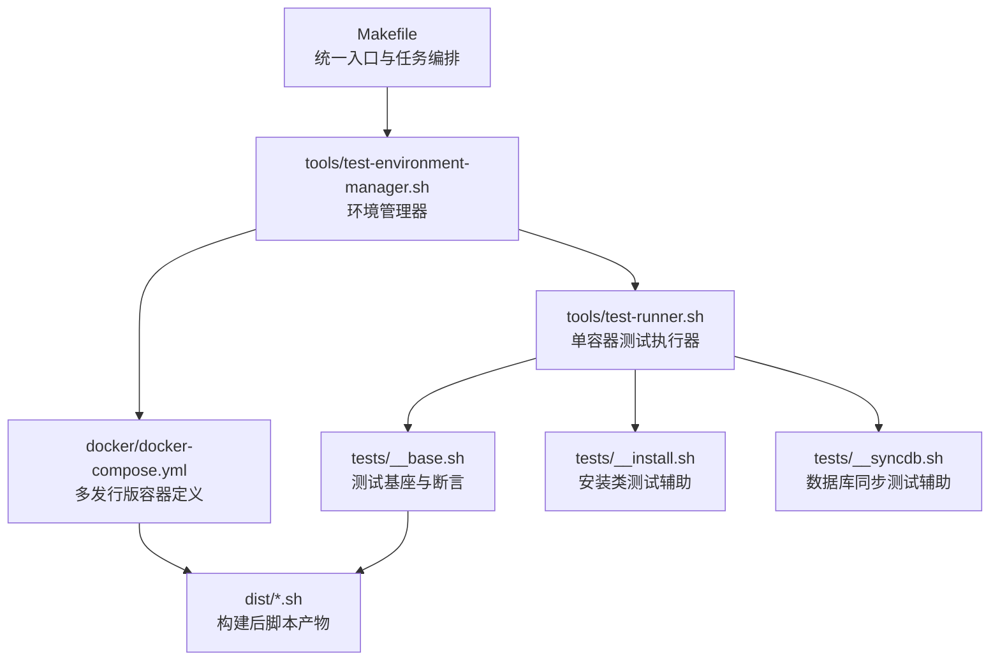
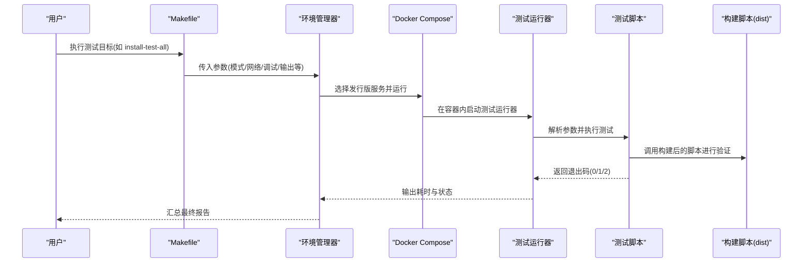
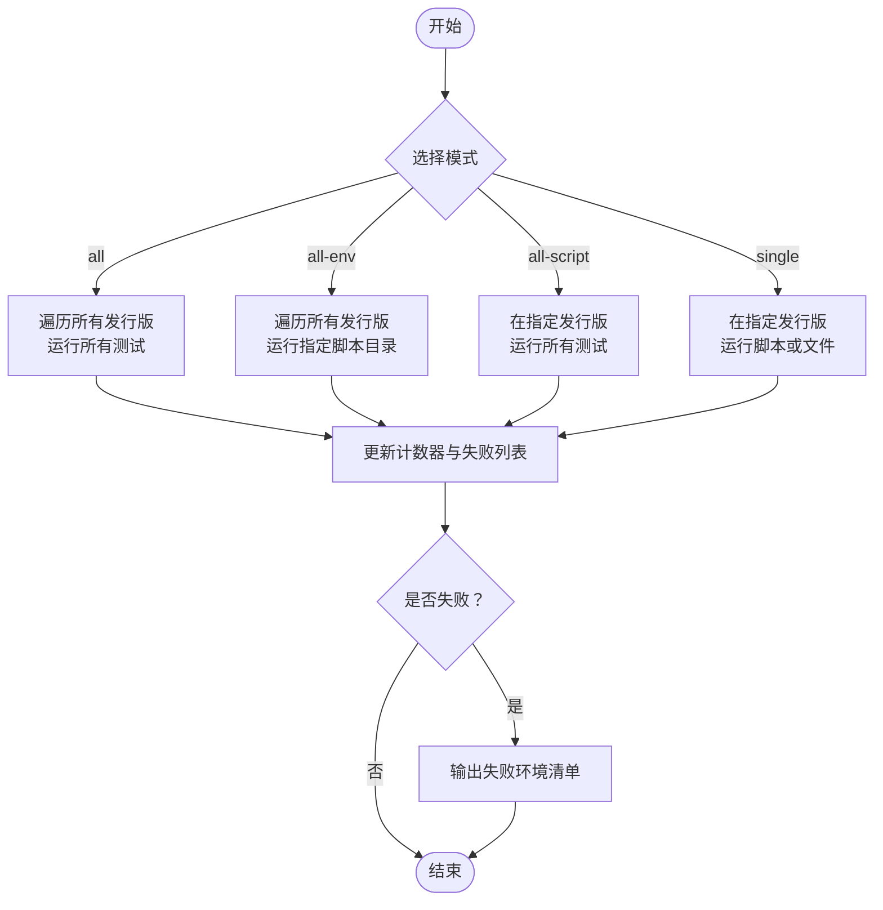
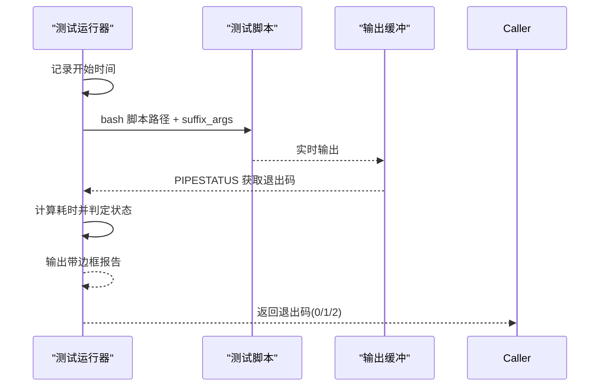
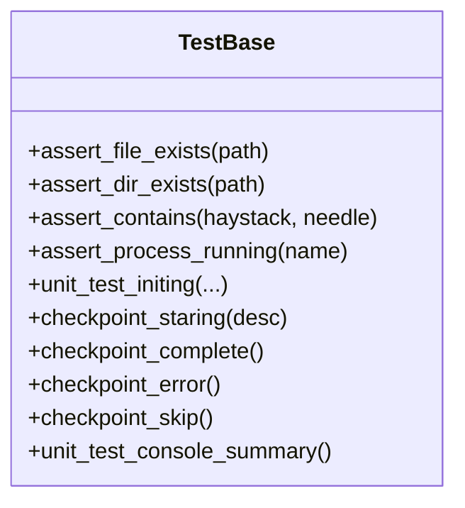
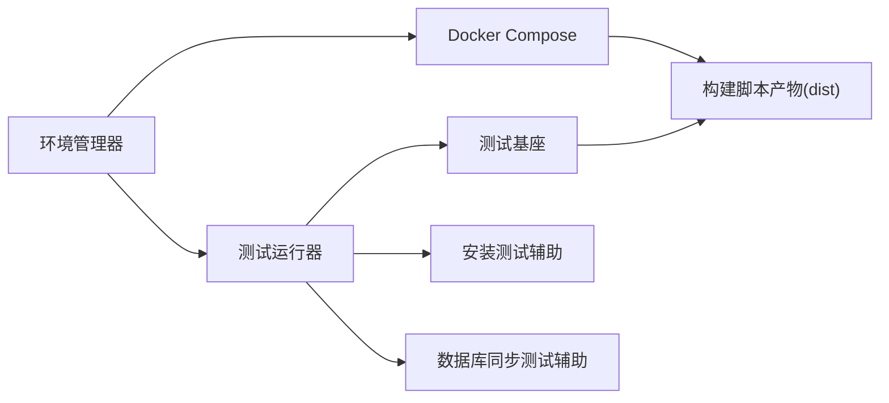

# 测试执行流程

<cite>
**本文档引用的文件**
- [README.md](file://README.md)
- [Makefile](file://Makefile)
- [tools/test-environment-manager.sh](file://tools/test-environment-manager.sh)
- [tools/test-runner.sh](file://tools/test-runner.sh)
- [scripts/__base.sh](file://scripts/__base.sh)
- [tests/__base.sh](file://tests/__base.sh)
- [tests/__install.sh](file://tests/__install.sh)
- [tests/__syncdb.sh](file://tests/__syncdb.sh)
- [docker/docker-compose.yml](file://docker/docker-compose.yml)
- [tests/install-git/01-ok.sh](file://tests/install-git/01-ok.sh)
- [tests/syncdb-mysql/01-ok.sh](file://tests/syncdb-mysql/01-ok.sh)
- [tests/syncdb-mysql/02-syncdb.sh](file://tests/syncdb-mysql/02-syncdb.sh)
- [dist/install-git.sh](file://dist/install-git.sh)
- [dist/syncdb-mysql.sh](file://dist/syncdb-mysql.sh)
</cite>

## 目录
1. [简介](#简介)
2. [项目结构](#项目结构)
3. [核心组件](#核心组件)
4. [架构总览](#架构总览)
5. [详细组件分析](#详细组件分析)
6. [依赖关系分析](#依赖关系分析)
7. [性能考虑](#性能考虑)
8. [故障排除指南](#故障排除指南)
9. [结论](#结论)
10. [附录](#附录)

## 简介
本文件系统性梳理 HZ 9 Env Scripts 的测试执行流程，覆盖从测试环境搭建、容器化执行、命令行参数解析、测试脚本执行与结果收集、到测试报告输出的完整生命周期。重点说明：
- 测试运行器如何解析参数、执行单个测试并统计耗时与状态
- 测试环境管理器如何在多发行版容器中批量执行测试
- 多发行版支持（Ubuntu、Debian、Fedora、RedHat）的适配机制
- 网络配置与调试选项的使用
- 执行时间统计与性能监控
- 失败时的错误处理与故障排除
- 测试报告生成与输出格式化

## 项目结构
项目采用分层组织：顶层通过 Makefile 提供统一入口；tools 存放测试框架脚本；scripts 提供通用基础能力；tests 下按功能域组织测试套件；dist 存放构建后的脚本产物；docker 提供容器化测试环境。

**图表来源**
- [Makefile:1-563](file://Makefile#L1-L563)
- [tools/test-environment-manager.sh:1-334](file://tools/test-environment-manager.sh#L1-334)
- [docker/docker-compose.yml:1-297](file://docker/docker-compose.yml#L1-297)
- [tools/test-runner.sh:1-156](file://tools/test-runner.sh#L1-156)
- [tests/__base.sh:1-464](file://tests/__base.sh#L1-464)
- [tests/__install.sh:1-66](file://tests/__install.sh#L1-66)
- [tests/__syncdb.sh:1-47](file://tests/__syncdb.sh#L1-47)

**章节来源**
- [README.md:1-6](file://README.md#L1-L6)
- [Makefile:1-563](file://Makefile#L1-L563)

## 核心组件
- 测试环境管理器：负责在多发行版容器中批量执行测试，汇总统计并通过控制台输出最终报告。
- 测试运行器：在单个容器内执行具体测试脚本，负责参数解析、实时输出、耗时统计与状态返回。
- 测试基座与断言：提供统一的断言方法、临时目录管理、帮助信息输出与计时统计。
- 构建后脚本产物：由 Makefile 触发构建，供测试脚本验证其行为与兼容性。
- Docker Compose：定义各发行版镜像与服务，挂载源码与产物目录，注入必要环境变量。

**章节来源**
- [tools/test-environment-manager.sh:1-334](file://tools/test-environment-manager.sh#L1-334)
- [tools/test-runner.sh:1-156](file://tools/test-runner.sh#L1-156)
- [tests/__base.sh:1-464](file://tests/__base.sh#L1-464)
- [docker/docker-compose.yml:1-297](file://docker/docker-compose.yml#L1-297)
- [Makefile:1-563](file://Makefile#L1-L563)

## 架构总览
下图展示从用户发起到测试完成的端到端流程，涵盖参数传递、容器调度、测试执行与结果汇总。

**图表来源**
- [Makefile:84-297](file://Makefile#L84-L297)
- [tools/test-environment-manager.sh:222-334](file://tools/test-environment-manager.sh#L222-L334)
- [docker/docker-compose.yml:1-297](file://docker/docker-compose.yml#L1-L297)
- [tools/test-runner.sh:86-156](file://tools/test-runner.sh#L86-L156)
- [tests/__base.sh:212-275](file://tests/__base.sh#L212-L275)

## 详细组件分析

### 测试环境管理器（多发行版协调）
- 支持模式：
  - all：在所有发行版上运行所有测试
  - all-env：在所有发行版上运行指定脚本目录下的测试
  - all-script：在指定发行版上运行所有测试
  - single：在指定发行版上运行指定脚本或文件
- 关键逻辑：
  - 维护计数器（总数/通过/失败/跳过）与失败环境列表
  - 将 suffix_args 注入 docker-compose 命令，传递给测试运行器
  - 对 syncdb 类测试自动追加 -docker 后缀以启用容器内数据库服务
- 报告输出：
  - 控制台打印最终汇总表，包含总次数、通过、失败、跳过与总耗时
  - 若存在失败，逐条列出失败环境及其参数

**图表来源**
- [tools/test-environment-manager.sh:140-326](file://tools/test-environment-manager.sh#L140-L326)

**章节来源**
- [tools/test-environment-manager.sh:14-334](file://tools/test-environment-manager.sh#L14-L334)
- [docker/docker-compose.yml:1-297](file://docker/docker-compose.yml#L1-L297)

### 测试运行器（单容器执行）
- 参数解析：
  - 支持 --help、--test-dir、--test-file、--script、--network、--debug 等
  - 将解析出的参数拼装为 suffix_args 并传递给被测脚本
- 执行流程：
  - 记录起始时间，实时输出测试过程
  - 使用管道捕获退出码与输出，判断通过/失败/跳过
  - 统计耗时并输出带边框的控制台报告
- 退出码语义：
  - 0：通过
  - 1：失败
  - 2：跳过（用于测试脚本主动跳过）

**图表来源**
- [tools/test-runner.sh:8-64](file://tools/test-runner.sh#L8-L64)

**章节来源**
- [tools/test-runner.sh:66-156](file://tools/test-runner.sh#L66-L156)

### 测试基座与断言（统一测试基础设施）
- 断言方法：
  - 文件/目录存在性断言
  - 字符串包含断言
  - 进程运行状态断言
- 测试初始化：
  - 解析用户参数、识别操作系统、设置临时目录并注册清理钩子
  - 清理不同发行版的 Docker 缓存配置以提升镜像拉取稳定性
- 计时与报告：
  - 提供检查点计时与“成功/失败/跳过”输出格式
  - 统一的单元测试汇总输出

**图表来源**
- [tests/__base.sh:14-137](file://tests/__base.sh#L14-L137)

**章节来源**
- [tests/__base.sh:1-464](file://tests/__base.sh#L1-L464)

### 安装类测试辅助
- 通用安装流程封装：
  - 运行被测脚本并根据退出码判定“成功/失败/跳过”
  - 可选择输出重定向或静默执行
- 版本校验：
  - 通过命令可用性与版本字符串存在性进行验证

**章节来源**
- [tests/__install.sh:1-66](file://tests/__install.sh#L1-66)

### 数据库同步测试辅助
- Docker 镜像策略：
  - 支持快速检测本地镜像是否存在且平台匹配，否则从 Docker Hub 拉取
- 容器生命周期：
  - 提供容器删除、初始化、等待就绪、数据初始化与校验等检查点

**章节来源**
- [tests/__syncdb.sh:1-47](file://tests/__syncdb.sh#L1-47)

### 多发行版支持机制
- 发行版矩阵：
  - Ubuntu 20.04/22.04/24.04、Debian 11.9/12.2、Fedora 41、RedHat 8.10/9.6
- 容器编排：
  - docker-compose.yml 中为每个发行版定义独立服务，挂载源码与产物目录，注入非交互式环境变量
  - syncdb 类测试额外提供 -docker 后缀服务，内置 Docker 引擎与 Compose
- 脚本兼容性：
  - 构建后的脚本在各自 SUPPORT_OS_LIST 中声明支持的系统与架构，测试前会先做“当前系统是否受支持”的检查

**章节来源**
- [tools/test-environment-manager.sh:14-24](file://tools/test-environment-manager.sh#L14-L24)
- [docker/docker-compose.yml:1-297](file://docker/docker-compose.yml#L1-L297)
- [dist/install-git.sh:21-33](file://dist/install-git.sh#L21-L33)
- [dist/syncdb-mysql.sh:35-47](file://dist/syncdb-mysql.sh#L35-L47)

### 网络配置与调试选项
- 网络配置：
  - 通过 --network 参数传递给被测脚本，典型值为 default 或 in-china
  - 不同发行版在基础模块中提供镜像源切换逻辑（如 apt 源替换），以改善国内网络体验
- 调试选项：
  - --debug 仅影响被测脚本的调试输出，不改变测试框架行为
  - 测试运行器与环境管理器均支持将调试开关透传至被测脚本

**章节来源**
- [tools/test-runner.sh:112-118](file://tools/test-runner.sh#L112-L118)
- [tools/test-environment-manager.sh:253-259](file://tools/test-environment-manager.sh#L253-L259)
- [scripts/__base.sh:757-800](file://scripts/__base.sh#L757-L800)

### 执行时间统计与性能监控
- 时间戳采集：
  - 使用统一的 console_time_s 获取秒级时间戳
- 统计维度：
  - 单次测试耗时（从开始到结束）
  - 环境管理器整体耗时（从开始到最终报告）
- 输出格式：
  - 控制台以边框表格形式呈现，清晰显示“总次数/通过/失败/跳过/耗时”

**章节来源**
- [scripts/__base.sh:276-281](file://scripts/__base.sh#L276-L281)
- [tools/test-runner.sh:17-51](file://tools/test-runner.sh#L17-L51)
- [tools/test-environment-manager.sh:184-199](file://tools/test-environment-manager.sh#L184-L199)

### 错误处理与故障排除
- 退出码语义：
  - 0：通过；1：失败；2：跳过（测试脚本主动跳过）
- 常见问题定位：
  - 网络相关失败：确认 --network 参数与镜像源配置
  - 镜像拉取失败：检查本地缓存与平台匹配，必要时移除 --docker-image-quick-check
  - 权限不足：确保宿主机 Docker Socket 已正确挂载
  - 资源占用：检查容器名称冲突与端口占用
- 日志与结果：
  - Makefile 自动记录日志文件，可通过 logs 目录查看历史结果

**章节来源**
- [tools/test-runner.sh:54-63](file://tools/test-runner.sh#L54-L63)
- [tools/test-environment-manager.sh:76-90](file://tools/test-environment-manager.sh#L76-L90)
- [Makefile:88-119](file://Makefile#L88-L119)

### 测试报告生成与输出格式化
- 控制台报告：
  - 测试运行器输出单次测试的起止与耗时
  - 环境管理器输出最终汇总与失败清单
- 结构化输出：
  - 测试基座提供统一的“检查点”输出格式，便于阅读与自动化解析
- 日志归档：
  - Makefile 将每次测试的输出写入 logs 目录，文件名包含时间戳

**章节来源**
- [tools/test-runner.sh:19-51](file://tools/test-runner.sh#L19-L51)
- [tools/test-environment-manager.sh:184-220](file://tools/test-environment-manager.sh#L184-L220)
- [Makefile:88-119](file://Makefile#L88-L119)

## 依赖关系分析
- 组件耦合：
  - 环境管理器依赖 Docker Compose 服务定义与测试运行器
  - 测试运行器依赖测试基座与被测脚本产物
  - 测试脚本依赖断言与辅助函数
- 外部依赖：
  - Docker 引擎与 Compose
  - 各发行版包管理器（apt/dnf）
  - 构建产物 dist 目录中的脚本

**图表来源**
- [tools/test-environment-manager.sh:1-334](file://tools/test-environment-manager.sh#L1-L334)
- [docker/docker-compose.yml:1-297](file://docker/docker-compose.yml#L1-L297)
- [tools/test-runner.sh:1-156](file://tools/test-runner.sh#L1-156)
- [tests/__base.sh:1-464](file://tests/__base.sh#L1-464)
- [tests/__install.sh:1-66](file://tests/__install.sh#L1-66)
- [tests/__syncdb.sh:1-47](file://tests/__syncdb.sh#L1-47)

**章节来源**
- [Makefile:1-563](file://Makefile#L1-L563)

## 性能考虑
- 镜像拉取优化：
  - 数据库同步测试支持本地镜像快速检测，避免重复拉取
- 包管理器缓存：
  - 针对不同发行版调整缓存策略，减少网络开销
- 输出重定向：
  - 在不需要实时输出时可关闭输出以降低 I/O 开销

[本节为通用建议，无需特定文件引用]

## 故障排除指南
- 症状：测试运行器提示缺少必要参数
  - 排查：确认 --env 必填项是否传入
- 症状：容器内无法访问网络
  - 排查：使用 --network=in-china 并检查镜像源配置
- 症状：Docker 镜像拉取失败
  - 排查：移除 --docker-image-quick-check 或清理本地镜像
- 症状：测试报告未生成
  - 排查：检查 logs 目录权限与磁盘空间

**章节来源**
- [tools/test-runner.sh:103-108](file://tools/test-runner.sh#L103-L108)
- [tools/test-environment-manager.sh:240-246](file://tools/test-environment-manager.sh#L240-L246)
- [Makefile:88-119](file://Makefile#L88-L119)

## 结论
该测试体系通过 Makefile 统一入口、环境管理器多发行版调度、测试运行器单容器执行与测试基座断言，形成完整的跨平台测试闭环。配合网络配置、调试选项与日志归档，能够稳定地验证脚本在 Ubuntu、Debian、Fedora、RedHat 等系统上的行为一致性，并提供清晰的执行时间统计与最终报告。

## 附录
- 示例测试脚本：
  - 安装类：tests/install-git/01-ok.sh
  - 数据库同步类：tests/syncdb-mysql/01-ok.sh、tests/syncdb-mysql/02-syncdb.sh
- 构建产物：
  - 安装类：dist/install-git.sh
  - 数据库同步类：dist/syncdb-mysql.sh

**章节来源**
- [tests/install-git/01-ok.sh:1-25](file://tests/install-git/01-ok.sh#L1-25)
- [tests/syncdb-mysql/01-ok.sh:1-25](file://tests/syncdb-mysql/01-ok.sh#L1-25)
- [tests/syncdb-mysql/02-syncdb.sh:1-102](file://tests/syncdb-mysql/02-syncdb.sh#L1-102)
- [dist/install-git.sh:1-200](file://dist/install-git.sh#L1-200)
- [dist/syncdb-mysql.sh:1-200](file://dist/syncdb-mysql.sh#L1-200)