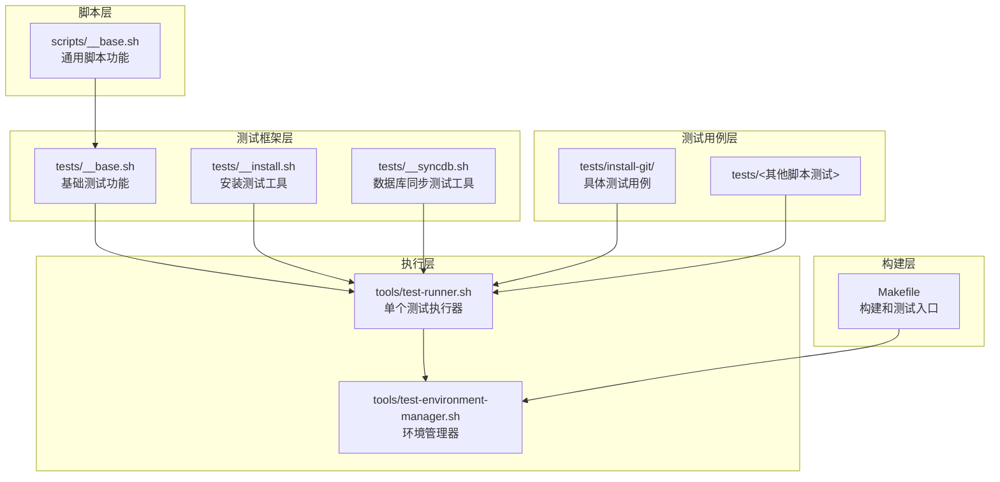
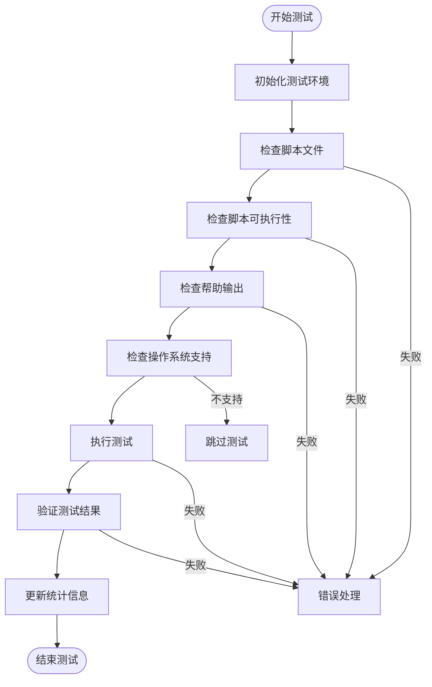
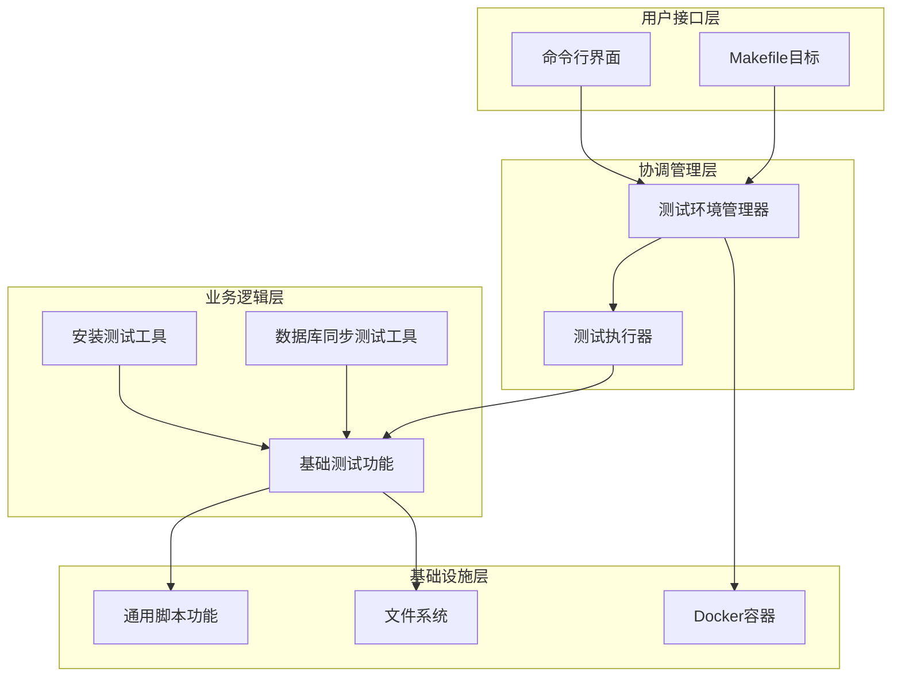
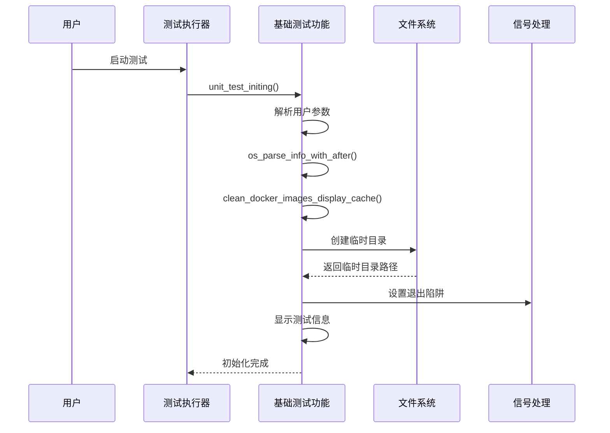
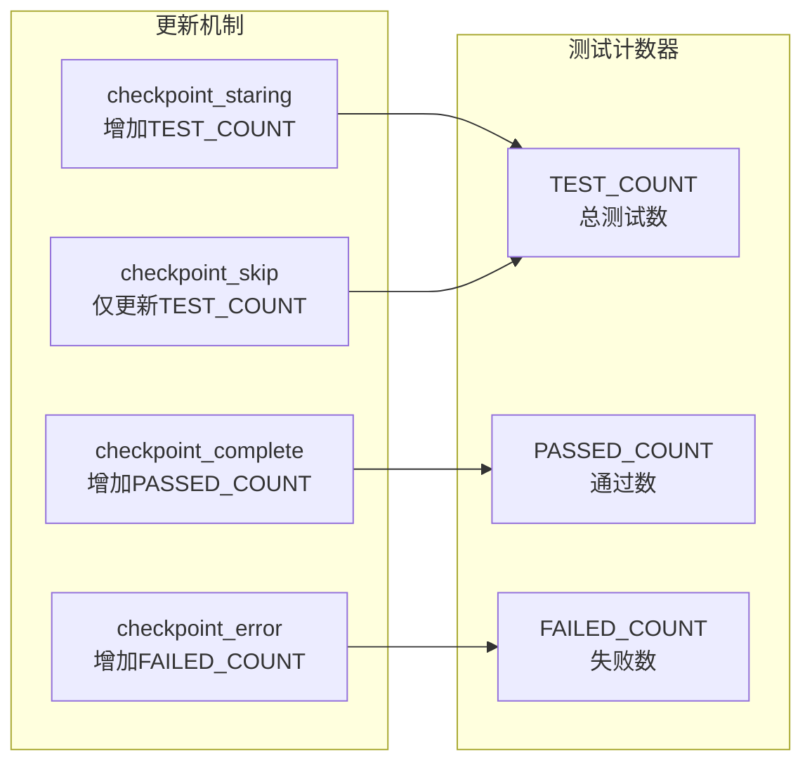
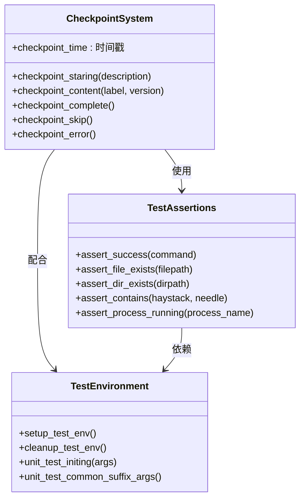
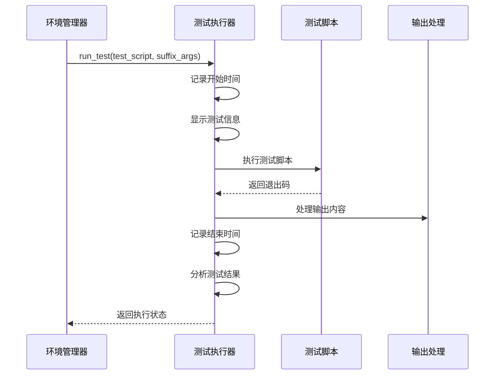
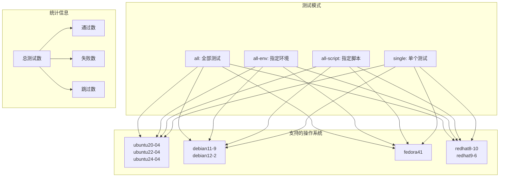
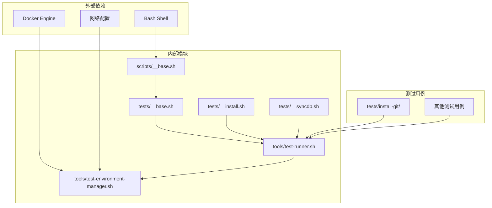

# 测试架构设计

<cite>
**本文档引用的文件**
- [tests/__base.sh](file://tests/__base.sh)
- [tools/test-runner.sh](file://tools/test-runner.sh)
- [tools/test-environment-manager.sh](file://tools/test-environment-manager.sh)
- [tests/__install.sh](file://tests/__install.sh)
- [tests/__syncdb.sh](file://tests/__syncdb.sh)
- [tests/install-git/01-ok.sh](file://tests/install-git/01-ok.sh)
- [tests/install-git/02-install.sh](file://tests/install-git/02-install.sh)
- [scripts/__base.sh](file://scripts/__base.sh)
- [Makefile](file://Makefile)
</cite>

## 目录
1. [简介](#简介)
2. [项目结构](#项目结构)
3. [核心组件](#核心组件)
4. [架构概览](#架构概览)
5. [详细组件分析](#详细组件分析)
6. [依赖关系分析](#依赖关系分析)
7. [性能考虑](#性能考虑)
8. [故障排除指南](#故障排除指南)
9. [结论](#结论)

## 简介

HZ 9 Env Scripts 测试架构是一个基于 Bash 的跨平台测试框架，专为测试各种环境脚本而设计。该架构采用分层设计模式，包含单元测试框架、集成测试系统和跨环境测试管理器，支持多种操作系统和网络配置。

测试架构的核心设计理念是：
- **模块化设计**：通过独立的功能模块实现高内聚低耦合
- **跨平台兼容**：支持 Ubuntu、Debian、Fedora、RedHat 等多种 Linux 发行版
- **可扩展性**：易于添加新的测试类型和断言函数
- **可视化报告**：提供详细的测试进度和结果报告

## 项目结构

测试架构采用清晰的分层组织结构：



**图表来源**
- [tests/__base.sh:1-464](file://tests/__base.sh#L1-L464)
- [tools/test-runner.sh:1-156](file://tools/test-runner.sh#L1-L156)
- [tools/test-environment-manager.sh:1-334](file://tools/test-environment-manager.sh#L1-L334)
- [scripts/__base.sh:1-800](file://scripts/__base.sh#L1-L800)

**章节来源**
- [Makefile:1-563](file://Makefile#L1-L563)
- [tests/__base.sh:1-464](file://tests/__base.sh#L1-L464)

## 核心组件

### 测试断言系统

测试断言系统提供了丰富的验证功能，确保测试的准确性和可靠性：

| 断言函数 | 功能描述 | 使用场景 |
|---------|----------|----------|
| `assert_success` | 验证命令执行成功 | 基本命令验证 |
| `assert_file_exists` | 验证文件存在 | 脚本文件检查 |
| `assert_dir_exists` | 验证目录存在 | 目录结构验证 |
| `assert_contains` | 验证字符串包含关系 | 输出内容检查 |
| `assert_process_running` | 验证进程运行状态 | 进程监控 |

### 检查点系统

检查点系统提供测试过程的可视化跟踪：



**图表来源**
- [tests/__base.sh:339-463](file://tests/__base.sh#L339-L463)

**章节来源**
- [tests/__base.sh:14-136](file://tests/__base.sh#L14-L136)

## 架构概览

测试架构采用三层设计模式：



**图表来源**
- [tools/test-environment-manager.sh:1-334](file://tools/test-environment-manager.sh#L1-L334)
- [tools/test-runner.sh:1-156](file://tools/test-runner.sh#L1-L156)
- [scripts/__base.sh:1-800](file://scripts/__base.sh#L1-L800)

## 详细组件分析

### 测试环境初始化流程

测试环境初始化是整个测试架构的基础，负责设置测试所需的环境变量和清理机制：



**图表来源**
- [tests/__base.sh:212-275](file://tests/__base.sh#L212-L275)

测试初始化的关键特性：
- **临时目录管理**：使用 `mktemp -d` 创建安全的临时目录
- **自动清理机制**：通过 `trap cleanup_test_env EXIT` 确保资源清理
- **参数解析**：支持 `--name`、`--env`、`--network` 等参数
- **信号处理**：优雅处理中断和异常情况

**章节来源**
- [tests/__base.sh:204-275](file://tests/__base.sh#L204-L275)

### 测试计数器系统

测试计数器系统负责跟踪测试执行状态：

| 计数器变量 | 类型 | 初始值 | 更新规则 |
|-----------|------|--------|----------|
| `TEST_COUNT` | 总计数器 | 0 | 每个检查点递增 |
| `PASSED_COUNT` | 通过计数器 | 0 | 成功检查点递增 |
| `FAILED_COUNT` | 失败计数器 | 0 | 失败检查点递增 |



**图表来源**
- [tests/__base.sh:6-10](file://tests/__base.sh#L6-L10)
- [tests/__base.sh:339-396](file://tests/__base.sh#L339-L396)

**章节来源**
- [tests/__base.sh:6-10](file://tests/__base.sh#L6-L10)
- [tests/__base.sh:339-396](file://tests/__base.sh#L339-L396)

### 检查点系统详解

检查点系统提供测试过程的可视化跟踪和状态管理：



**图表来源**
- [tests/__base.sh:13-136](file://tests/__base.sh#L13-L136)
- [tests/__base.sh:339-463](file://tests/__base.sh#L339-L463)

**章节来源**
- [tests/__base.sh:13-136](file://tests/__base.sh#L13-L136)
- [tests/__base.sh:339-463](file://tests/__base.sh#L339-L463)

### 测试断言系统实现

测试断言系统提供了多种验证机制：

#### 命令执行断言
```bash
# 基本命令执行验证
assert_success() {
    local command="$1"
    if eval "$command" >/dev/null 2>&1; then
        return 0
    else
        return 1
    fi
}
```

#### 文件系统断言
```bash
# 文件存在性验证
assert_file_exists() {
    local filepath="$1"
    if [ -f "$filepath" ]; then
        return 0
    else
        return 1
    fi
}

# 目录存在性验证
assert_dir_exists() {
    local dirpath="$1"
    if [ -d "$dirpath" ]; then
        return 0
    else
        return 1
    fi
}
```

#### 字符串断言
```bash
# 字符串包含关系验证
assert_contains() {
    local haystack="$1"
    local needle="$2"
    if [[ "$haystack" == *"$needle"* ]]; then
        return 0
    else
        return 1
    fi
}
```

**章节来源**
- [tests/__base.sh:14-136](file://tests/__base.sh#L14-L136)

### 测试执行器设计

测试执行器负责单个测试脚本的执行和结果收集：



**图表来源**
- [tools/test-runner.sh:9-64](file://tools/test-runner.sh#L9-L64)

**章节来源**
- [tools/test-runner.sh:9-64](file://tools/test-runner.sh#L9-L64)

### 环境管理器架构

环境管理器负责跨平台测试协调：



**图表来源**
- [tools/test-environment-manager.sh:14-45](file://tools/test-environment-manager.sh#L14-L45)
- [tools/test-environment-manager.sh:222-334](file://tools/test-environment-manager.sh#L222-L334)

**章节来源**
- [tools/test-environment-manager.sh:14-45](file://tools/test-environment-manager.sh#L14-L45)
- [tools/test-environment-manager.sh:222-334](file://tools/test-environment-manager.sh#L222-L334)

## 依赖关系分析

测试架构的依赖关系呈现清晰的层次结构：



**图表来源**
- [scripts/__base.sh:1-800](file://scripts/__base.sh#L1-L800)
- [tests/__base.sh:1-464](file://tests/__base.sh#L1-L464)
- [tools/test-environment-manager.sh:1-334](file://tools/test-environment-manager.sh#L1-L334)

**章节来源**
- [scripts/__base.sh:1-800](file://scripts/__base.sh#L1-L800)
- [tests/__base.sh:1-464](file://tests/__base.sh#L1-L464)
- [tools/test-environment-manager.sh:1-334](file://tools/test-environment-manager.sh#L1-L334)

## 性能考虑

测试架构在设计时充分考虑了性能优化：

### 并行执行策略
- **容器化隔离**：每个测试在独立的 Docker 容器中执行，避免相互影响
- **资源隔离**：通过 Docker 网络和卷管理确保测试环境隔离
- **缓存优化**：支持 Docker 镜像快速检查，减少重复下载

### 内存和存储优化
- **临时文件管理**：使用 `mktemp` 创建安全的临时目录
- **自动清理机制**：通过信号处理确保资源及时释放
- **输出重定向**：在非调试模式下重定向标准输出以减少 I/O

### 网络性能优化
- **镜像源配置**：支持中国网络环境的镜像源配置
- **快速检查**：Docker 镜像快速检查功能避免不必要的下载
- **连接池管理**：合理管理网络连接，避免资源泄漏

## 故障排除指南

### 常见问题及解决方案

#### 测试环境初始化失败
**症状**：测试启动时报错，无法创建临时目录
**原因**：权限不足或磁盘空间不足
**解决方法**：
1. 检查 `/tmp` 目录权限
2. 确认有足够的磁盘空间
3. 验证 `mktemp` 命令可用性

#### Docker 镜像拉取失败
**症状**：测试过程中 Docker 镜像拉取超时
**原因**：网络连接问题或镜像源不可用
**解决方法**：
1. 检查网络连接状态
2. 配置合适的镜像源
3. 使用 `--docker-image-quick-check` 参数

#### 断言失败
**症状**：特定断言返回失败
**原因**：脚本执行结果与预期不符
**解决方法**：
1. 启用调试模式查看详细输出
2. 检查相关环境变量设置
3. 验证脚本依赖项完整性

**章节来源**
- [tests/__base.sh:204-275](file://tests/__base.sh#L204-L275)
- [tools/test-environment-manager.sh:222-334](file://tools/test-environment-manager.sh#L222-L334)

## 结论

HZ 9 Env Scripts 测试架构是一个设计精良的跨平台测试框架，具有以下显著特点：

### 设计优势
- **模块化架构**：清晰的分层设计便于维护和扩展
- **跨平台兼容**：支持多种 Linux 发行版和网络配置
- **可视化反馈**：详细的测试进度和结果报告
- **自动化程度高**：从环境准备到结果汇总的完整自动化流程

### 技术特色
- **灵活的断言系统**：支持多种类型的验证需求
- **智能的检查点管理**：提供测试过程的可视化跟踪
- **高效的资源管理**：通过容器化实现资源隔离和复用
- **完善的错误处理**：全面的异常捕获和恢复机制

### 应用价值
该测试架构不仅适用于当前的环境脚本测试，还可以作为其他 Bash 脚本测试的参考模板，其设计理念和实现方式具有广泛的适用性和推广价值。

通过持续的优化和完善，该测试架构将继续为 HZ 9 项目的稳定性和可靠性提供有力保障。