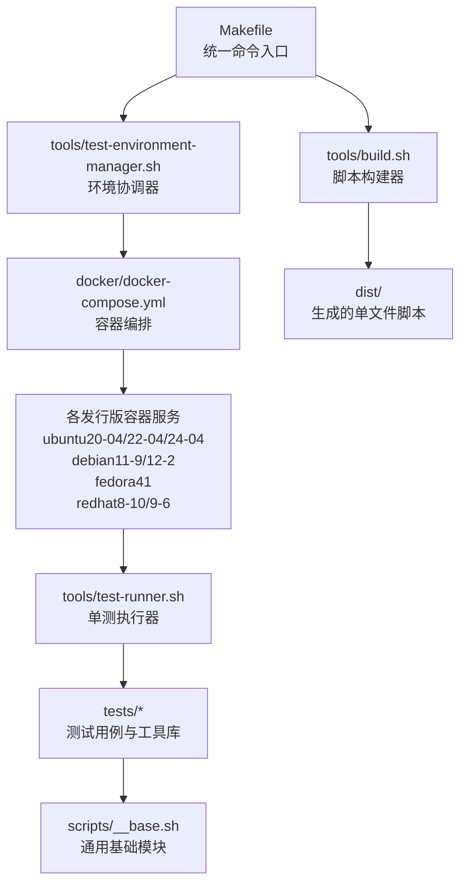
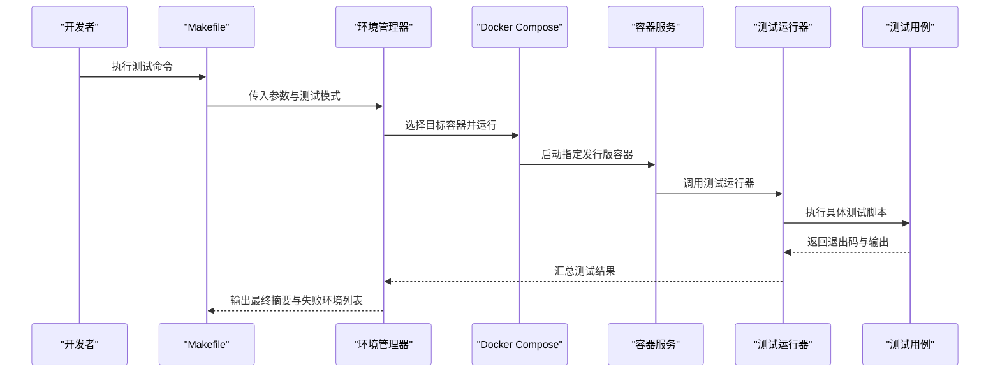
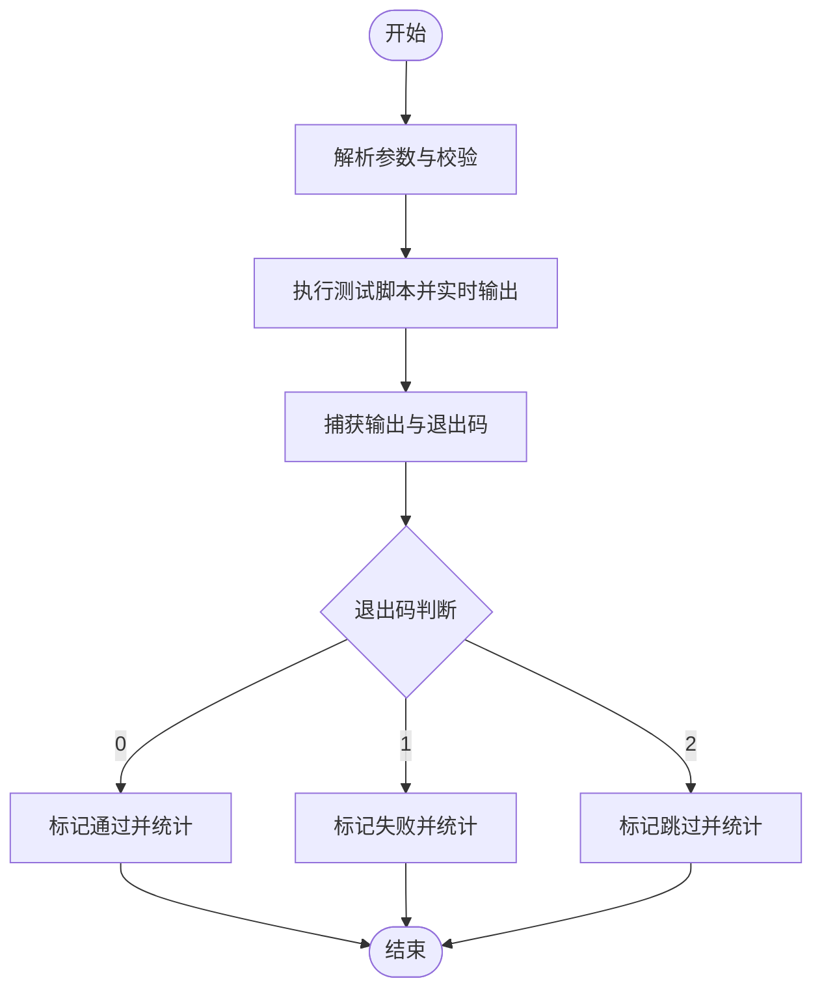
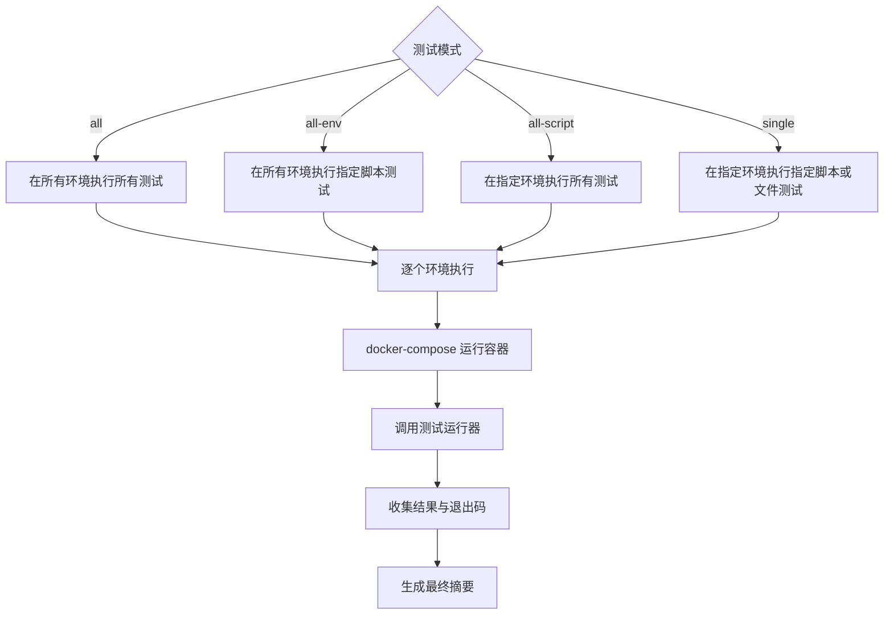
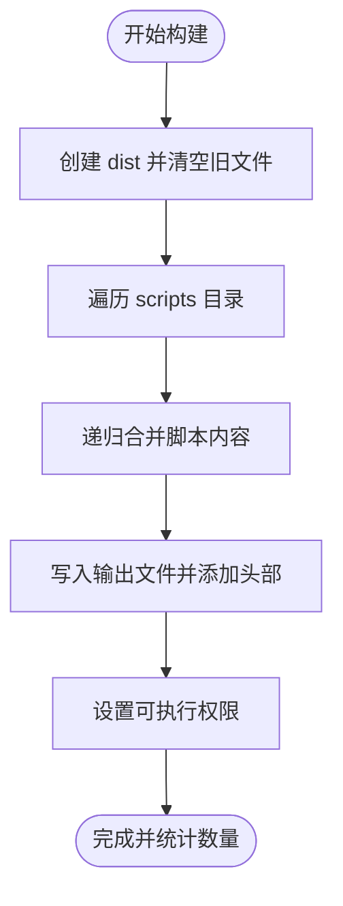
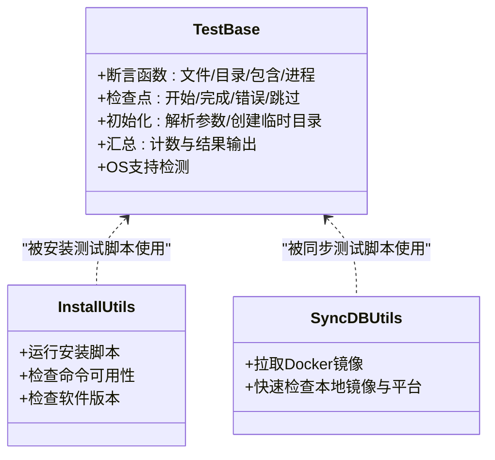
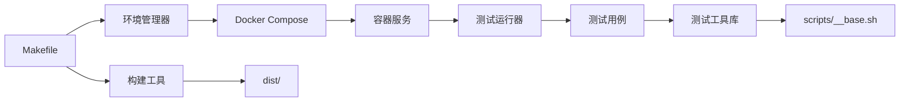

# 测试框架系统

<cite>
**本文档引用的文件**
- [README.md](file://README.md)
- [Makefile](file://Makefile)
- [docs/overview/testing.md](file://docs/overview/testing.md)
- [docs/overview/testing.zh-CN.md](file://docs/overview/testing.zh-CN.md)
- [tools/test-runner.sh](file://tools/test-runner.sh)
- [tools/test-environment-manager.sh](file://tools/test-environment-manager.sh)
- [tools/build.sh](file://tools/build.sh)
- [docker/docker-compose.yml](file://docker/docker-compose.yml)
- [scripts/__base.sh](file://scripts/__base.sh)
- [tests/__base.sh](file://tests/__base.sh)
- [tests/__install.sh](file://tests/__install.sh)
- [tests/__syncdb.sh](file://tests/__syncdb.sh)
- [tests/install-git/01-ok.sh](file://tests/install-git/01-ok.sh)
- [tests/install-git/02-install.sh](file://tests/install-git/02-install.sh)
- [tests/syncdb-postgresql/01-ok.sh](file://tests/syncdb-postgresql/01-ok.sh)
</cite>

## 目录
1. [简介](#简介)
2. [项目结构](#项目结构)
3. [核心组件](#核心组件)
4. [架构总览](#架构总览)
5. [详细组件分析](#详细组件分析)
6. [依赖关系分析](#依赖关系分析)
7. [性能考虑](#性能考虑)
8. [故障排除指南](#故障排除指南)
9. [结论](#结论)
10. [附录](#附录)

## 简介
HZ 9 Env Scripts 测试框架是一个基于 Docker 的跨平台测试系统，用于验证开发环境脚本在多种 Linux 发行版上的安装与功能正确性。该框架通过 Makefile 提供统一的命令入口，结合 Docker 容器化测试环境，确保测试结果的一致性与可复现性。测试覆盖两类脚本：安装类脚本与数据库同步脚本，每类脚本均包含基础验证测试与安装/同步功能测试。

## 项目结构
项目采用模块化组织方式，核心目录与职责如下：
- docs：测试指南与使用说明（中英文）
- docker：Docker 镜像构建文件与编排配置
- scripts：原始脚本源文件与通用基础模块
- tests：测试用例与测试工具库
- tools：测试运行器、环境管理器与构建工具
- dist：构建后生成的单文件脚本产物
- logs：测试日志输出目录

**图表来源**
- [Makefile:1-563](file://Makefile#L1-L563)
- [docker/docker-compose.yml:1-297](file://docker/docker-compose.yml#L1-L297)
- [tools/test-environment-manager.sh:1-334](file://tools/test-environment-manager.sh#L1-L334)
- [tools/test-runner.sh:1-156](file://tools/test-runner.sh#L1-L156)
- [tools/build.sh:1-91](file://tools/build.sh#L1-L91)

**章节来源**
- [README.md:1-6](file://README.md#L1-L6)
- [Makefile:1-563](file://Makefile#L1-L563)
- [docs/overview/testing.md:1-173](file://docs/overview/testing.md#L1-L173)

## 核心组件
- 测试运行器（test-runner.sh）：负责单个测试脚本的执行、输出捕获、跳过/失败/成功状态判定与时间统计。
- 环境管理器（test-environment-manager.sh）：协调多环境测试，遍历支持的发行版容器，收集测试汇总结果。
- 构建工具（build.sh）：将 scripts 目录下的脚本按依赖合并生成 dist 目录中的独立可执行脚本。
- Docker 编排（docker-compose.yml）：定义各发行版测试环境镜像与挂载卷，提供交互式容器与 Docker 容器内测试能力。
- 测试工具库（tests/__base.sh、tests/__install.sh、tests/__syncdb.sh）：提供断言、检查点、环境清理等通用测试能力。
- Makefile：提供一键化的测试命令与参数传递机制。

**章节来源**
- [tools/test-runner.sh:1-156](file://tools/test-runner.sh#L1-L156)
- [tools/test-environment-manager.sh:1-334](file://tools/test-environment-manager.sh#L1-L334)
- [tools/build.sh:1-91](file://tools/build.sh#L1-L91)
- [docker/docker-compose.yml:1-297](file://docker/docker-compose.yml#L1-L297)
- [tests/__base.sh:1-464](file://tests/__base.sh#L1-L464)
- [tests/__install.sh:1-66](file://tests/__install.sh#L1-L66)
- [tests/__syncdb.sh:1-47](file://tests/__syncdb.sh#L1-L47)
- [Makefile:1-563](file://Makefile#L1-L563)

## 架构总览
测试架构采用“容器化隔离 + 统一命令入口”的设计，确保跨平台一致性与可扩展性。整体流程包括：构建脚本与镜像、选择测试模式、在目标容器中执行测试、收集结果并生成摘要报告。

**图表来源**
- [Makefile:86-119](file://Makefile#L86-L119)
- [tools/test-environment-manager.sh:49-91](file://tools/test-environment-manager.sh#L49-L91)
- [docker/docker-compose.yml:1-297](file://docker/docker-compose.yml#L1-L297)
- [tools/test-runner.sh:8-64](file://tools/test-runner.sh#L8-L64)

## 详细组件分析

### 测试运行器（test-runner.sh）
- 功能概述：解析参数、执行测试脚本、实时输出与临时输出捕获、根据退出码判断跳过/通过/失败、统计耗时。
- 关键特性：
  - 支持帮助信息、测试目录、测试文件、脚本名、网络配置、调试模式等参数。
  - 通过管道捕获输出并检测跳过状态（退出码为 2 表示跳过）。
  - 将测试开始/结束信息格式化输出，便于阅读。
- 退出码约定：0 成功、1 失败、2 跳过。

**图表来源**
- [tools/test-runner.sh:8-64](file://tools/test-runner.sh#L8-L64)

**章节来源**
- [tools/test-runner.sh:1-156](file://tools/test-runner.sh#L1-L156)

### 环境管理器（test-environment-manager.sh）
- 功能概述：根据测试模式（all/all-env/all-script/single）在多个发行版容器中执行测试，聚合结果并输出最终摘要。
- 关键特性：
  - 支持的环境数组：ubuntu20-04/22-04/24-04、debian11-9/12-2、fedora41、redhat8-10/9-6。
  - 对于 syncdb 类测试，自动附加 -docker 后缀以使用带 Docker 的容器。
  - 通过 docker-compose 在目标容器中调用测试运行器，传递参数。
  - 统计总测试数、通过数、失败数、跳过数及失败环境列表。
- 参数支持：模式、测试目录、测试文件、环境、脚本名、网络配置、调试开关等。

**图表来源**
- [tools/test-environment-manager.sh:140-159](file://tools/test-environment-manager.sh#L140-L159)
- [tools/test-environment-manager.sh:286-325](file://tools/test-environment-manager.sh#L286-L325)
- [docker/docker-compose.yml:1-297](file://docker/docker-compose.yml#L1-L297)

**章节来源**
- [tools/test-environment-manager.sh:1-334](file://tools/test-environment-manager.sh#L1-L334)

### 构建工具（build.sh）
- 功能概述：递归解析 scripts 目录中的脚本依赖，合并生成 dist 目录下的独立可执行脚本。
- 关键特性：
  - 自动处理 source 指令，按顺序写入依赖注释与内容。
  - 为每个输出脚本添加头部注释与可执行权限。
  - 跳过以下划线开头的工具函数文件。

**图表来源**
- [tools/build.sh:19-81](file://tools/build.sh#L19-L81)

**章节来源**
- [tools/build.sh:1-91](file://tools/build.sh#L1-L91)

### Docker 编排（docker-compose.yml）
- 功能概述：定义各发行版测试环境镜像与容器服务，提供交互式容器与 Docker 容器内测试能力。
- 关键特性：
  - 每个发行版对应一个服务，挂载 dist/scripts/tests/tools 到容器内。
  - 部分服务启用特权模式以支持容器内 Docker 测试（-docker 后缀服务）。
  - 通过 volumes 挂载包管理器缓存目录以提升构建效率。
  - 命令默认执行测试运行器并传入 --all 参数。

**章节来源**
- [docker/docker-compose.yml:1-297](file://docker/docker-compose.yml#L1-L297)

### 测试工具库（tests/__base.sh、tests/__install.sh、tests/__syncdb.sh）
- tests/__base.sh：提供断言函数（文件存在、目录存在、字符串包含、进程运行）、检查点（开始/完成/错误/跳过）、测试初始化与汇总、OS 支持检测等。
- tests/__install.sh：封装安装类测试的常用检查点，如运行安装脚本、检查命令可用性、版本信息验证。
- tests/__syncdb.sh：封装数据库同步测试的常用检查点，如拉取 Docker 镜像（含快速检查逻辑）。

**图表来源**
- [tests/__base.sh:12-137](file://tests/__base.sh#L12-L137)
- [tests/__install.sh:6-24](file://tests/__install.sh#L6-L24)
- [tests/__syncdb.sh:8-46](file://tests/__syncdb.sh#L8-L46)

**章节来源**
- [tests/__base.sh:1-464](file://tests/__base.sh#L1-L464)
- [tests/__install.sh:1-66](file://tests/__install.sh#L1-L66)
- [tests/__syncdb.sh:1-47](file://tests/__syncdb.sh#L1-L47)

### 测试用例示例
- 安装脚本测试（install-git）：
  - 01-ok.sh：基础验证测试，检查脚本文件、可执行权限、语法、帮助信息与 OS 兼容性。
  - 02-install.sh：安装测试，运行安装脚本后检查命令可用性与版本信息。
- 数据库同步脚本测试（syncdb-postgresql）：
  - 01-ok.sh：基础验证测试，检查脚本文件、可执行权限、语法、帮助信息与 OS 兼容性。

**章节来源**
- [tests/install-git/01-ok.sh:1-25](file://tests/install-git/01-ok.sh#L1-L25)
- [tests/install-git/02-install.sh:1-35](file://tests/install-git/02-install.sh#L1-L35)
- [tests/syncdb-postgresql/01-ok.sh:1-25](file://tests/syncdb-postgresql/01-ok.sh#L1-L25)

## 依赖关系分析
- Makefile 作为统一入口，将测试命令映射到环境管理器与构建工具。
- 环境管理器依赖 Docker Compose 与容器服务定义。
- 测试运行器依赖测试工具库与具体测试脚本。
- 构建工具依赖 scripts 目录中的脚本与依赖关系。
- 测试工具库依赖 scripts/__base.sh 提供的通用能力。

**图表来源**
- [Makefile:1-563](file://Makefile#L1-L563)
- [tools/test-environment-manager.sh:1-334](file://tools/test-environment-manager.sh#L1-L334)
- [docker/docker-compose.yml:1-297](file://docker/docker-compose.yml#L1-L297)
- [tools/test-runner.sh:1-156](file://tools/test-runner.sh#L1-L156)
- [tools/build.sh:1-91](file://tools/build.sh#L1-L91)
- [scripts/__base.sh:1-800](file://scripts/__base.sh#L1-L800)

**章节来源**
- [Makefile:1-563](file://Makefile#L1-L563)
- [docker/docker-compose.yml:1-297](file://docker/docker-compose.yml#L1-L297)

## 性能考虑
- 包管理器缓存优化：通过挂载发行版包管理器缓存目录减少重复下载，提升构建速度。
- 本地镜像快速检查：数据库同步测试支持快速检查本地镜像与平台匹配，避免不必要的远程拉取。
- 输出控制：在未启用输出模式时重定向标准输出与错误输出，减少 I/O 压力。
- 并发策略：当前实现按顺序遍历环境执行，若需提升吞吐可在保证稳定性的前提下引入并行执行策略。

## 故障排除指南
- 网络问题（中国网络环境）：使用 NETWORK=in-china 参数切换国内镜像源，确保包管理器与 Docker 拉取顺畅。
- 权限问题：部分容器需要特权模式（-docker 服务），确保宿主机 Docker Socket 可用且具备相应权限。
- 调试模式：使用 DEBUG=true 获取更详细的输出信息，定位问题根因。
- 日志查看：使用 make logs 查看容器日志；使用 make results 查看历史测试日志汇总。
- 清理资源：使用 make clean 清理镜像、容器与卷，释放磁盘空间并恢复干净环境。

**章节来源**
- [docs/overview/testing.md:135-141](file://docs/overview/testing.md#L135-L141)
- [docs/overview/testing.zh-CN.md:135-141](file://docs/overview/testing.zh-CN.md#L135-L141)
- [Makefile:546-562](file://Makefile#L546-L562)

## 结论
HZ 9 Env Scripts 测试框架通过容器化与统一命令入口，实现了跨平台、可扩展、可维护的测试体系。其模块化设计使得新增测试脚本与环境变得简单高效，同时提供了完善的日志与汇总能力，便于持续改进与质量保障。

## 附录

### 测试运行器使用方法与配置选项
- 常用命令：
  - make install-test-all：在所有环境执行所有安装脚本测试
  - make install-test-all-env SCRIPT=git：在所有环境执行特定安装脚本测试
  - make install-test-all-script ENV=ubuntu22-04：在指定环境执行所有安装脚本测试
  - make install-test-single ENV=ubuntu22-04 SCRIPT=git：在指定环境执行特定安装脚本测试
  - make install-test-file ENV=ubuntu22-04 FILE=tests/install-git/01-ok.sh：在指定环境执行特定测试文件
  - make syncdb-test-all：在所有环境执行所有数据库同步脚本测试
  - make interactive：启动交互式测试环境
  - make shell：在 Ubuntu 容器中启动 Shell
  - make clean：清理 Docker 镜像与容器
  - make logs：查看 Docker 日志
  - make results：显示测试结果
- 通用参数：
  - NETWORK=in-china：使用中国网络配置
  - DEBUG=true：启用调试模式
  - OUTPUT=path：指定输出路径或文件（影响测试脚本的标准输出重定向）

**章节来源**
- [docs/overview/testing.md:3-133](file://docs/overview/testing.md#L3-L133)
- [docs/overview/testing.zh-CN.md:3-133](file://docs/overview/testing.zh-CN.md#L3-L133)
- [Makefile:34-41](file://Makefile#L34-L41)

### 测试用例编写规范与最佳实践
- 目录结构：在 tests/ 下为每个脚本创建子目录，至少包含 01-ok.sh 与 02-install.sh。
- 断言与检查点：优先使用测试工具库提供的断言与检查点函数，保持测试一致性。
- OS 兼容性：在基础验证测试中加入 OS 支持检测，不支持时应跳过后续测试。
- 版本验证：安装测试中应验证命令可用性与版本信息，确保安装成功。
- 输出控制：在未启用输出模式时避免干扰标准输出，必要时使用重定向。

**章节来源**
- [docs/overview/testing.md:165-173](file://docs/overview/testing.md#L165-L173)
- [docs/overview/testing.zh-CN.md:165-173](file://docs/overview/testing.zh-CN.md#L165-L173)
- [tests/__base.sh:12-137](file://tests/__base.sh#L12-L137)
- [tests/__install.sh:6-24](file://tests/__install.sh#L6-L24)

### 测试环境管理工具使用指南
- 交互式环境：make interactive 启动交互式容器，适合手动调试与探索。
- Shell 连接：make shell 在 Ubuntu 容器中启动 Shell，便于快速验证。
- 清理与日志：make clean 清理资源；make logs 查看容器日志；make results 查看历史结果。
- 参数传递：通过 Makefile 将 NETWORK、DEBUG、OUTPUT 等参数传递给环境管理器与测试运行器。

**章节来源**
- [Makefile:536-562](file://Makefile#L536-L562)
- [docker/docker-compose.yml:281-297](file://docker/docker-compose.yml#L281-L297)

### 测试报告生成与分析方法
- 终端摘要：环境管理器在每次测试后输出详细摘要，包含总测试数、通过数、失败数、跳过数与总耗时。
- 失败环境列表：记录失败的环境与参数，便于定位问题。
- 日志文件：每次测试会生成带时间戳的日志文件，保存在 logs/ 目录中，便于离线分析。

**章节来源**
- [tools/test-environment-manager.sh:184-220](file://tools/test-environment-manager.sh#L184-L220)
- [Makefile:88-119](file://Makefile#L88-L119)

### 持续集成配置与自动化测试流程
- 建议流程：
  1) 构建脚本：make build-scripts
  2) 构建镜像：make build-images
  3) 执行测试：make install-test-all 或 make syncdb-test-all
  4) 收集日志：make logs 与 make results
  5) 清理资源：make clean
- 参数注入：在 CI 环境中通过环境变量注入 NETWORK、DEBUG、OUTPUT 等参数，实现灵活配置。

**章节来源**
- [docs/overview/testing.md:1-23](file://docs/overview/testing.md#L1-L23)
- [docs/overview/testing.zh-CN.md:1-23](file://docs/overview/testing.zh-CN.md#L1-L23)
- [Makefile:86-119](file://Makefile#L86-L119)

### 测试调试技巧与故障排除
- 启用调试：DEBUG=true 输出详细信息，便于定位问题。
- 切换网络：NETWORK=in-china 使用国内镜像源，解决网络受限问题。
- 查看日志：make logs 查看容器日志；make results 查看历史日志。
- 清理缓存：构建工具会清理包管理器缓存相关配置，避免缓存导致的问题。
- 平台匹配：数据库同步测试支持快速检查本地镜像与平台匹配，避免架构不一致导致的失败。

**章节来源**
- [docs/overview/testing.md:135-141](file://docs/overview/testing.md#L135-L141)
- [docs/overview/testing.zh-CN.md:135-141](file://docs/overview/testing.zh-CN.md#L135-L141)
- [tests/__base.sh:178-201](file://tests/__base.sh#L178-L201)
- [tests/__syncdb.sh:20-46](file://tests/__syncdb.sh#L20-L46)

### 测试覆盖率分析与质量评估方法
- 当前框架未内置覆盖率工具，建议在 CI 中结合外部工具进行覆盖率统计与质量门禁。
- 质量评估维度：通过率、失败率、跳过率、平均耗时、失败环境分布等指标可用于评估稳定性与回归风险。

[本节为通用指导，无需特定文件引用]