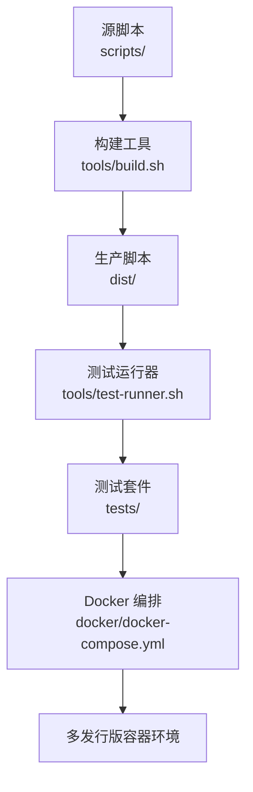
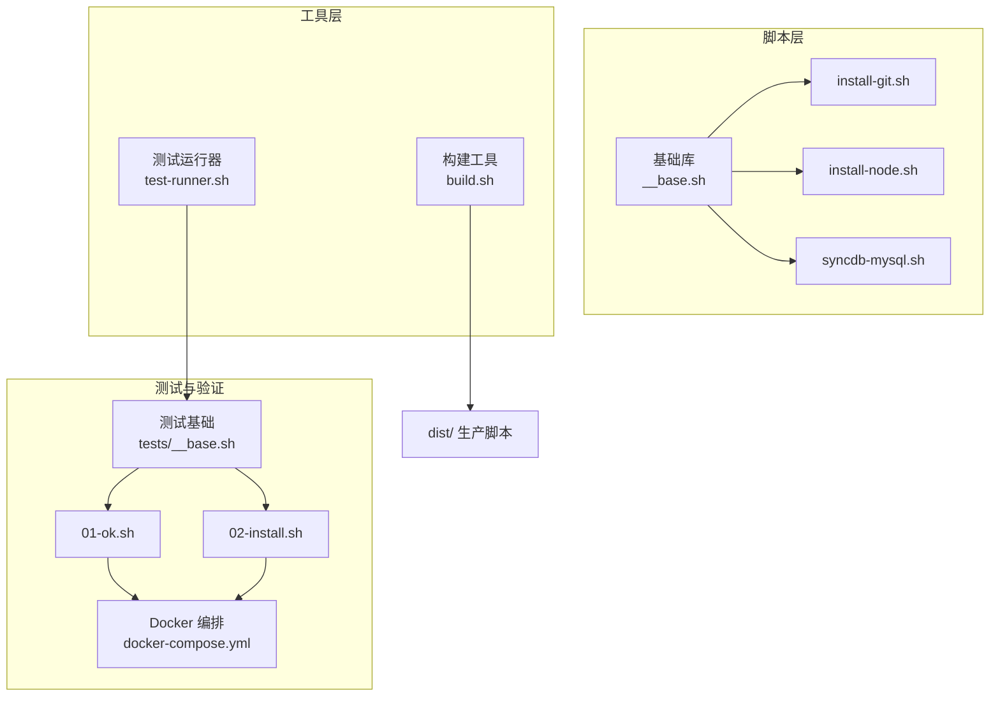
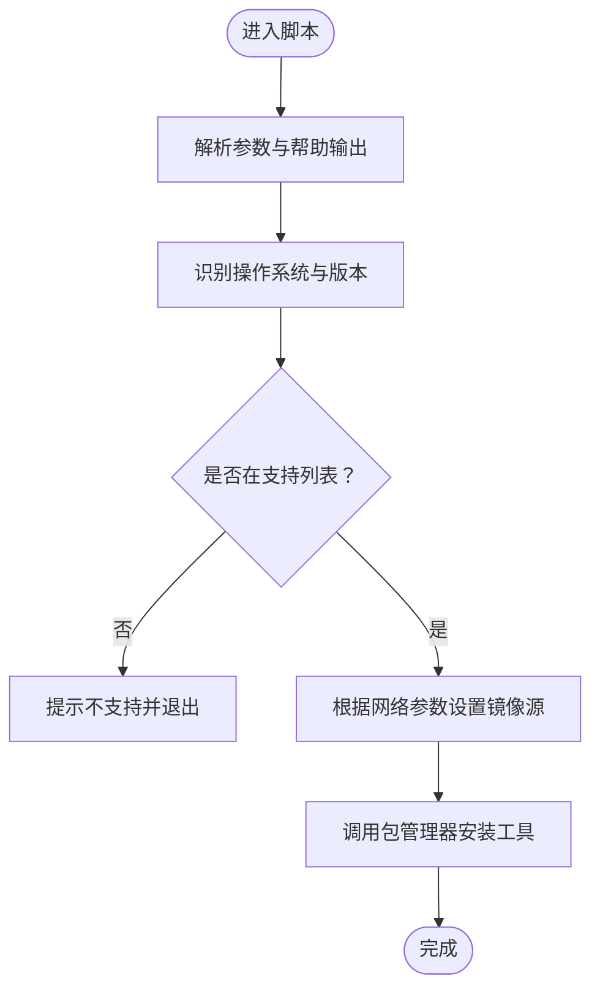
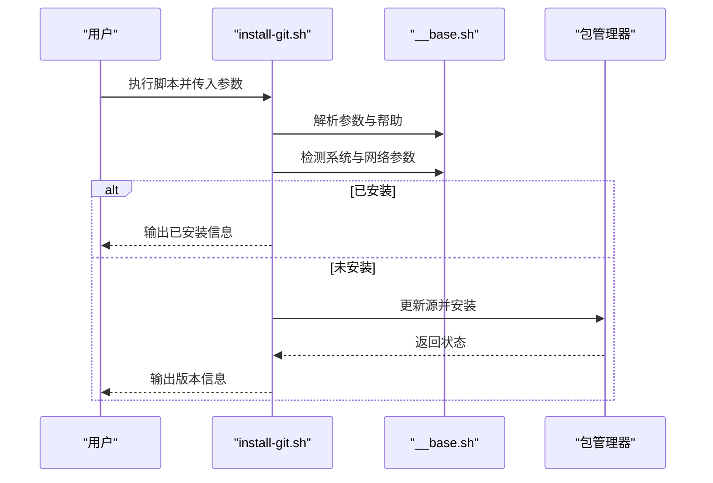
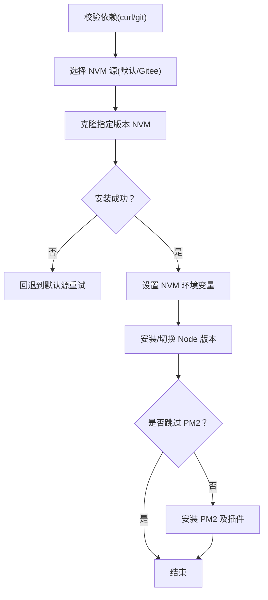
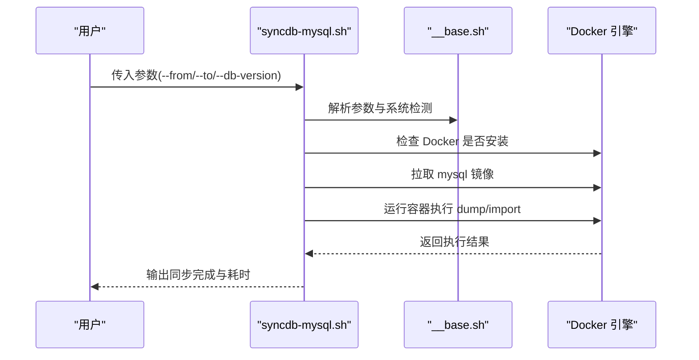
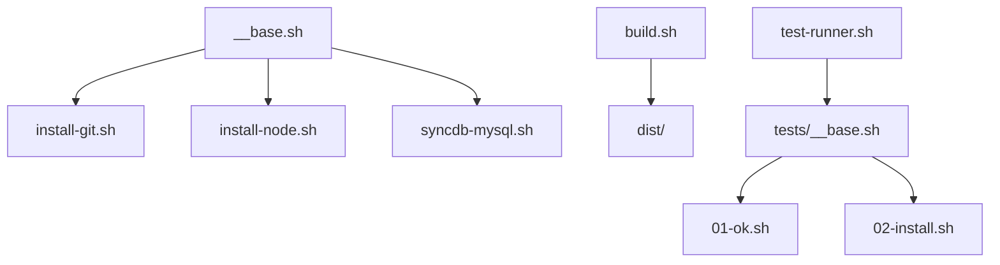

# 项目概述

<cite>
**本文引用的文件**
- [README.md](file://README.md)
- [docs/README.zh-CN.md](file://docs/README.zh-CN.md)
- [docs/overview/scripts.md](file://docs/overview/scripts.md)
- [scripts/__base.sh](file://scripts/__base.sh)
- [scripts/install-git.sh](file://scripts/install-git.sh)
- [scripts/install-node.sh](file://scripts/install-node.sh)
- [scripts/syncdb-mysql.sh](file://scripts/syncdb-mysql.sh)
- [tools/build.sh](file://tools/build.sh)
- [tools/test-runner.sh](file://tools/test-runner.sh)
- [tests/__base.sh](file://tests/__base.sh)
- [tests/install-git/01-ok.sh](file://tests/install-git/01-ok.sh)
- [tests/install-git/02-install.sh](file://tests/install-git/02-install.sh)
- [docker/docker-compose.yml](file://docker/docker-compose.yml)
- [Makefile](file://Makefile)
</cite>

## 目录
1. [引言](#引言)
2. [项目结构](#项目结构)
3. [核心组件](#核心组件)
4. [架构总览](#架构总览)
5. [详细组件分析](#详细组件分析)
6. [依赖关系分析](#依赖关系分析)
7. [性能考量](#性能考量)
8. [故障排查指南](#故障排查指南)
9. [结论](#结论)
10. [附录](#附录)

## 引言
HZ 9 Env Scripts 是一个面向多 Linux 发行版与常见开发工具的“开箱即用”环境搭建脚本集合。项目定位为“快速搭建开发环境”的工具集，提供统一的参数体系、跨平台适配与可复用的模板化脚本，帮助从入门到资深开发者快速完成本地或容器内的一致化开发环境准备。

- 核心价值
  - 一键安装：通过单行命令或本地脚本即可完成常用开发工具安装。
  - 多发行版支持：覆盖 Ubuntu、Debian、Fedora、Red Hat 等主流发行版及其典型版本。
  - 中国网络优化：内置镜像源切换能力，显著提升国内下载稳定性与速度。
  - 可测试、可维护：完整的构建与测试流水线，确保脚本质量与一致性。

- 目标用户
  - 初学者：通过简单命令快速获得所需工具。
  - 团队与 CI：以稳定可重复的方式在多环境中部署。
  - 运维与平台工程师：基于统一模板扩展更多工具链。

- 项目愿景
  - 以最小成本、最高一致性地支撑各类开发与测试环境。
  - 通过模块化与模板化设计，降低新增工具的接入成本。

**章节来源**
- [README.md:1-6](file://README.md#L1-L6)
- [docs/README.zh-CN.md:1-128](file://docs/README.zh-CN.md#L1-L128)

## 项目结构
项目采用“源脚本 → 构建 → 生产脚本 → 测试 → 容器化验证”的完整闭环，核心目录职责如下：

- dist/：最终可直接使用的生产脚本集合（由构建流程生成）
- scripts/：源脚本与基础库，包含通用模块与各工具安装脚本
- tools/：构建与测试辅助工具（构建脚本、测试运行器等）
- tests/：针对每个脚本的单元测试与集成测试
- docker/：多发行版 Dockerfile 与 docker-compose，用于跨环境测试
- docs/：中英文文档与概览说明
- Makefile：统一的任务编排入口，封装构建、测试、清理等操作

**图示来源**
- [tools/build.sh:1-91](file://tools/build.sh#L1-L91)
- [Makefile:48-83](file://Makefile#L48-L83)
- [docker/docker-compose.yml:1-297](file://docker/docker-compose.yml#L1-L297)

**章节来源**
- [docs/README.zh-CN.md:9-18](file://docs/README.zh-CN.md#L9-L18)
- [Makefile:10-47](file://Makefile#L10-L47)

## 核心组件
- 基础库 scripts/__base.sh
  - 统一参数解析与帮助输出
  - 操作系统识别与支持性检测
  - 控制台输出与调试开关
  - 包管理器适配（apt/dnf）
  - 网络镜像源配置（中国区优化）

- 工具安装脚本
  - install-git.sh：Git 安装与版本控制
  - install-node.sh：Node/NPM/Pm2 安装与配置
  - install-docker.sh：Docker 安装（另有 docker-compose 版本）
  - install-nginx.sh：Web 服务安装
  - 其他工具：curl、wget、htop、tmux、7zip、xz、tree、jq、zip/p7zip 等

- 数据库同步脚本
  - syncdb-mysql.sh：基于 Docker 的 MySQL 数据库同步与备份恢复
  - syncdb-postgresql.sh：PostgreSQL 同步
  - syncdb-mongo.sh：MongoDB 同步

- 构建与测试
  - tools/build.sh：将 scripts/ 合并为 dist/ 的单一可执行脚本
  - tools/test-runner.sh：测试执行器，负责参数解析、执行与结果统计
  - tests/：按工具分组的测试用例，覆盖“可用性 + 功能性 + 版本校验”
  - docker/docker-compose.yml：多发行版容器矩阵，支持带 Docker 的环境变体

**章节来源**
- [scripts/__base.sh:1-1252](file://scripts/__base.sh#L1-L1252)
- [scripts/install-git.sh:1-85](file://scripts/install-git.sh#L1-L85)
- [scripts/install-node.sh:1-202](file://scripts/install-node.sh#L1-L202)
- [scripts/syncdb-mysql.sh:1-138](file://scripts/syncdb-mysql.sh#L1-L138)
- [tools/build.sh:1-91](file://tools/build.sh#L1-L91)
- [tools/test-runner.sh:1-156](file://tools/test-runner.sh#L1-L156)
- [tests/__base.sh:1-464](file://tests/__base.sh#L1-L464)
- [docker/docker-compose.yml:1-297](file://docker/docker-compose.yml#L1-L297)

## 架构总览
整体架构围绕“模板化脚本 + 抽象层 + 测试矩阵 + 容器化验证”展开，形成高内聚、低耦合的模块化体系。

**图示来源**
- [scripts/__base.sh:1-1252](file://scripts/__base.sh#L1-L1252)
- [scripts/install-git.sh:1-85](file://scripts/install-git.sh#L1-L85)
- [scripts/install-node.sh:1-202](file://scripts/install-node.sh#L1-L202)
- [scripts/syncdb-mysql.sh:1-138](file://scripts/syncdb-mysql.sh#L1-L138)
- [tools/build.sh:1-91](file://tools/build.sh#L1-L91)
- [tools/test-runner.sh:1-156](file://tools/test-runner.sh#L1-L156)
- [tests/__base.sh:1-464](file://tests/__base.sh#L1-L464)
- [docker/docker-compose.yml:1-297](file://docker/docker-compose.yml#L1-L297)

## 详细组件分析

### 基础库与参数系统（__base.sh）
- 参数解析与帮助
  - 统一的参数格式与别名支持，自动打印默认值与帮助信息
  - 支持 --help 输出与系统支持性检查
- 操作系统识别
  - 自动识别 Ubuntu/Debian/Fedora/RedHat/AlibabaCloudLinux/MacOS/WindowsServer
  - 版本与架构判定，支持白名单式支持列表
- 控制台与日志
  - 彩色输出、时间戳、模块化标题、错误/警告/调试分级
- 包管理器适配
  - 自动选择 apt/dnf 并提供更新与安装函数
- 网络镜像
  - 针对 Ubuntu/Debian 的镜像源替换逻辑，支持中国区优化

**图示来源**
- [scripts/__base.sh:708-742](file://scripts/__base.sh#L708-L742)
- [scripts/__base.sh:95-262](file://scripts/__base.sh#L95-L262)

**章节来源**
- [scripts/__base.sh:478-742](file://scripts/__base.sh#L478-L742)

### Git 安装脚本（install-git.sh）
- 支持参数：--help、--debug、--network、--git-version
- 支持系统：Ubuntu 20.04/22.04/24.04、Debian 11.9/12.2、Fedora 41、Red Hat 8.10/9.6
- 流程要点：先检查已安装，再按包管理器路径执行安装；最后打印版本

**图示来源**
- [scripts/install-git.sh:1-85](file://scripts/install-git.sh#L1-L85)
- [scripts/__base.sh:708-742](file://scripts/__base.sh#L708-L742)

**章节来源**
- [scripts/install-git.sh:16-28](file://scripts/install-git.sh#L16-L28)
- [scripts/install-git.sh:34-77](file://scripts/install-git.sh#L34-L77)

### Node.js 安装脚本（install-node.sh）
- 支持参数：--network、--nvm-version、--node-version、--skip-pm2、--pm2-version
- 流程要点：前置校验 curl/git；安装 NVM（支持中国镜像），安装/切换 Node 版本；可选安装 PM2 及其插件；设置 npm 镜像

**图示来源**
- [scripts/install-node.sh:49-60](file://scripts/install-node.sh#L49-L60)
- [scripts/install-node.sh:70-94](file://scripts/install-node.sh#L70-L94)
- [scripts/install-node.sh:122-139](file://scripts/install-node.sh#L122-L139)
- [scripts/install-node.sh:153-185](file://scripts/install-node.sh#L153-L185)

**章节来源**
- [scripts/install-node.sh:7-17](file://scripts/install-node.sh#L7-L17)
- [scripts/install-node.sh:19-31](file://scripts/install-node.sh#L19-L31)
- [scripts/install-node.sh:62-68](file://scripts/install-node.sh#L62-L68)
- [scripts/install-node.sh:141-147](file://scripts/install-node.sh#L141-L147)

### MySQL 数据库同步脚本（syncdb-mysql.sh）
- 支持参数：--network、--db-version、--from/to 主机/端口/用户名/密码/数据库、--temp
- 流程要点：校验 Docker；拉取指定版本镜像；在容器内执行 mysqldump/mysql 完成数据导出/导入；支持临时目录与日志输出

**图示来源**
- [scripts/syncdb-mysql.sh:46-63](file://scripts/syncdb-mysql.sh#L46-L63)
- [scripts/syncdb-mysql.sh:100-131](file://scripts/syncdb-mysql.sh#L100-L131)

**章节来源**
- [scripts/syncdb-mysql.sh:7-28](file://scripts/syncdb-mysql.sh#L7-L28)
- [scripts/syncdb-mysql.sh:30-42](file://scripts/syncdb-mysql.sh#L30-L42)
- [scripts/syncdb-mysql.sh:112-129](file://scripts/syncdb-mysql.sh#L112-L129)

### 构建与测试流水线
- 构建工具（tools/build.sh）
  - 将 scripts/ 下的脚本按“source 指令”递归合并，生成 dist/ 单文件脚本，并赋予可执行权限
- 测试运行器（tools/test-runner.sh）
  - 解析测试参数，执行测试文件，输出实时与汇总报告，支持跳过/失败/成功的状态码
- 测试基础（tests/__base.sh）
  - 提供断言、计时、清理、环境初始化、OS 支持性检查等通用能力
- Makefile
  - 统一封装构建、测试、清理、交互式环境等常用任务，便于团队协作与 CI 集成

**图示来源**
- [tools/build.sh:19-81](file://tools/build.sh#L19-L81)
- [tools/test-runner.sh:8-64](file://tools/test-runner.sh#L8-L64)
- [tests/__base.sh:212-275](file://tests/__base.sh#L212-L275)
- [Makefile:86-297](file://Makefile#L86-L297)

**章节来源**
- [tools/build.sh:19-81](file://tools/build.sh#L19-L81)
- [tools/test-runner.sh:86-156](file://tools/test-runner.sh#L86-L156)
- [tests/__base.sh:299-337](file://tests/__base.sh#L299-L337)
- [Makefile:10-47](file://Makefile#L10-L47)

## 依赖关系分析
- 模块内聚与解耦
  - 所有工具脚本均依赖 __base.sh，形成统一的“抽象层”，避免重复逻辑
  - 构建与测试工具独立于业务脚本，便于演进与维护
- 外部依赖
  - 包管理器：apt（Debian/Ubuntu）、dnf（Fedora/RedHat）
  - Docker：用于数据库同步脚本的容器化执行
  - 网络镜像：华为云镜像源（中国区优化）
- 潜在循环依赖
  - 无直接循环；构建工具仅读取 scripts/，测试工具仅读取 dist/ 与 tests/

**图示来源**
- [scripts/__base.sh:1-1252](file://scripts/__base.sh#L1-L1252)
- [tools/build.sh:1-91](file://tools/build.sh#L1-L91)
- [tools/test-runner.sh:1-156](file://tools/test-runner.sh#L1-L156)
- [tests/__base.sh:1-464](file://tests/__base.sh#L1-L464)

**章节来源**
- [scripts/__base.sh:95-262](file://scripts/__base.sh#L95-L262)
- [docker/docker-compose.yml:1-297](file://docker/docker-compose.yml#L1-L297)

## 性能考量
- 构建阶段
  - 单文件 dist/ 脚本减少 I/O 与加载开销，适合在线直连执行
  - 构建工具按需递归合并，避免冗余内容
- 测试阶段
  - Docker 缓存与镜像预热可显著缩短测试时间
  - 中国区镜像源可减少网络抖动带来的不稳定
- 运行阶段
  - 包管理器更新与安装步骤尽量合并，减少多次握手
  - 日志与调试开关可按需开启，平衡可观测性与性能

[本节为通用指导，无需特定文件引用]

## 故障排查指南
- 常见问题与处理
  - 系统不受支持：确认 SUPPORT_OS_LIST 与当前系统匹配；必要时在脚本中补充支持项
  - 网络下载失败：切换 --network=in-china；检查镜像源配置
  - 权限不足：确保具备 sudo 权限；Docker 需要加入当前用户组
  - 包管理器缓存问题：参考测试基础中的缓存清理策略
- 调试建议
  - 使用 --debug 查看详细输出
  - 使用 --help 查看参数与默认值
  - 在容器中复现问题，利用 docker-compose 提供的交互式环境

**章节来源**
- [scripts/__base.sh:319-330](file://scripts/__base.sh#L319-L330)
- [tests/__base.sh:178-201](file://tests/__base.sh#L178-L201)
- [Makefile:255-297](file://Makefile#L255-L297)

## 结论
HZ 9 Env Scripts 通过“模板化脚本 + 抽象层 + 测试矩阵 + 容器化验证”的架构，实现了对多发行版与多工具链的高效覆盖。其模块化设计降低了维护成本，统一的参数与输出规范提升了可读性与可测试性，适合个人开发者、团队与 CI 场景使用。未来可在以下方向持续演进：
- 新增更多工具与发行版的支持
- 引入更细粒度的版本约束与兼容性矩阵
- 增强测试覆盖率与自动化回归

[本节为总结，无需特定文件引用]

## 附录

### 支持的系统与工具清单
- 支持系统
  - Ubuntu 20.04/22.04/24.04、Debian 11.9/12.2、Fedora 41、Red Hat 8.10/9.6（均为 AMD64）
- 工具清单（部分）
  - 基础工具：curl、wget、git
  - 开发工具：node、docker、nginx、gdal
  - 系统工具：htop、tmux、7zip、xz、tree
  - 数据处理：jq、zip/p7zip
  - 数据库同步：mysql/postgresql/mongo

**章节来源**
- [docs/README.zh-CN.md:47-54](file://docs/README.zh-CN.md#L47-L54)
- [docs/overview/scripts.md:343-352](file://docs/overview/scripts.md#L343-L352)

### 使用场景与最佳实践
- 快速上手
  - 直接使用 curl/wget 一行命令安装工具
  - 本地克隆后直接运行 dist/ 下的脚本
- 团队与 CI
  - 使用 Makefile 统一构建与测试
  - 在 docker-compose 环境中批量验证
- 中国区优化
  - 通过 --network=in-china 使用华为云镜像源

**章节来源**
- [docs/README.zh-CN.md:20-46](file://docs/README.zh-CN.md#L20-L46)
- [docs/README.zh-CN.md:109-116](file://docs/README.zh-CN.md#L109-L116)
- [Makefile:86-120](file://Makefile#L86-L120)